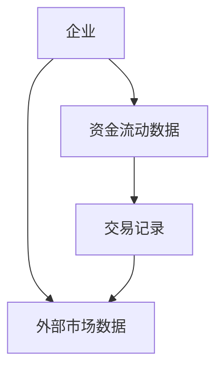
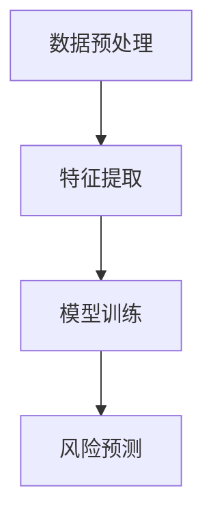
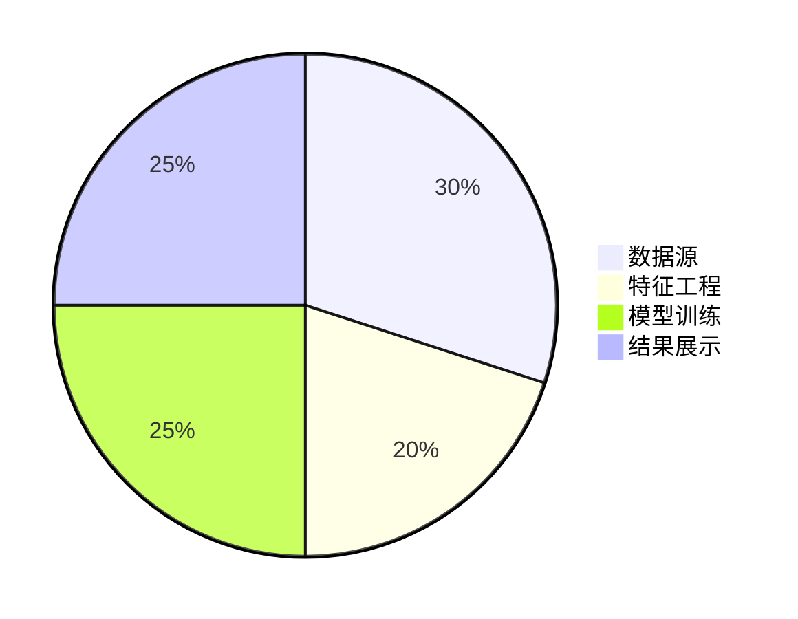

                 


# AI驱动的企业资金流动性风险预测系统

## 关键词：
- 企业资金流动性风险
- AI技术
- 风险预测系统
- 机器学习模型
- 数据分析
- 金融风险管理
- 时间序列分析

## 摘要：
资金流动性风险是企业在经营过程中面临的重要挑战之一，及时预测和管理该风险对企业的稳健发展至关重要。本文将介绍一种基于人工智能技术的企业资金流动性风险预测系统，详细探讨其核心概念、算法原理、系统架构设计以及项目实现。通过结合机器学习模型和时间序列分析，该系统能够有效提升风险预测的准确性和及时性，为企业提供有力支持。

---

# 第一部分：AI驱动的企业资金流动性风险预测系统概述

## 第1章：资金流动性风险与AI预测的背景

### 1.1 企业资金流动性风险的定义与特征

- **定义**：资金流动性风险是指企业在一定时期内无法及时获得足够资金来偿还到期债务或满足正常经营需求的可能性。
- **核心特征**：
  - 短期性：风险通常在短期内迅速变化。
  - 波动性：受市场环境和企业内部因素影响较大。
  - 复杂性：涉及多方面的内外部因素，难以简单预测。
- **影响**：可能导致企业信用评级下降、融资成本上升甚至破产。

### 1.2 AI技术在金融领域的应用背景

- **应用现状**：AI技术在金融领域的应用日益广泛，包括智能投顾、信用评估、风险管理等多个方面。
- **痛点**：传统方法在资金流动性风险预测中存在效率低、准确性差的问题。
- **优势**：AI技术的引入为解决这些问题提供了新思路，能够更及时地发现潜在风险，优化资金管理策略。

## 第2章：企业资金流动性风险预测的核心概念

### 2.1 风险预测系统的概念框架

- **组成要素**：数据采集模块、特征提取模块、模型训练模块、结果展示模块。
- **核心功能模块**：数据预处理、特征选择、模型训练、风险预测。
- **边界与外延**：系统主要关注企业内部资金流动数据，但也考虑外部市场环境数据。

### 2.2 关键概念的属性特征对比

| 模型类型 | 精度 | 可解释性 | 计算效率 |
|----------|------|----------|-----------|
| 基于规则 | 中等  | 高       | 低         |
| 机器学习 | 高    | 中等     | 中等       |

### 2.3 实体关系图（ER图）



---

# 第二部分：AI驱动的风险预测算法原理

## 第3章：AI驱动的风险预测算法原理

### 3.1 机器学习模型的选择与应用

- **模型选择**：随机森林和XGBoost是常用的树模型，适合处理分类和回归问题。
- **应用**：使用XGBoost进行模型训练，预测资金流动性风险等级。
- **代码示例**：
  ```python
  import xgboost as xgb
  model = xgb.XGBRegressor(n_estimators=100, learning_rate=0.05)
  model.fit(X_train, y_train)
  ```

### 3.2 算法流程图



### 3.3 算法实现代码

- **训练代码**：
  ```python
  model = xgb.XGBRegressor(n_estimators=100, learning_rate=0.05)
  model.fit(X_train, y_train)
  ```
- **预测代码**：
  ```python
  y_pred = model.predict(X_test)
  ```

## 第4章：数学模型与公式解析

### 4.1 时间序列分析模型

- **ARIMA模型**：
  $$ARIMA(p, d, q)$$
  其中，p为自回归阶数，d为差分阶数，q为移动平均阶数。
- **LSTM模型**：
  使用长短期记忆网络进行时间序列预测，公式较为复杂，涉及细胞状态和门控机制。

### 4.2 特征工程与数据处理

- **数据清洗公式**：
  $$\text{新数据} = \text{旧数据} \times \text{清洗因子}$$
- **特征选择公式**：
  $$\text{特征权重} = \sum_{i=1}^{n} w_i x_i$$

---

# 第三部分：系统架构与设计

## 第5章：系统架构与设计

### 5.1 系统功能设计

- **数据采集模块**：从企业内部和外部数据源获取资金流动数据。
- **模型训练模块**：使用机器学习算法进行模型训练和优化。
- **结果展示模块**：以可视化形式展示预测结果和风险等级。

### 5.2 系统架构图



---

# 第四部分：项目实战与案例分析

## 第6章：项目实战与案例分析

### 6.1 环境搭建与数据准备

- **环境安装**：安装Python、机器学习库（如scikit-learn、XGBoost）和数据可视化工具（如Matplotlib）。
- **数据获取**：从企业财务系统中获取资金流动数据，清洗和预处理后存储在数据库中。

### 6.2 系统核心实现

- **核心代码**：
  ```python
  import pandas as pd
  import numpy as np
  from sklearn.model_selection import train_test_split
  from xgboost import XGBRegressor
  from sklearn.metrics import mean_squared_error

  # 数据加载与预处理
  data = pd.read_csv('financial_data.csv')
  X = data.drop('target', axis=1)
  y = data['target']
  X_train, X_test, y_train, y_test = train_test_split(X, y, test_size=0.2, random_state=42)

  # 模型训练
  model = XGBRegressor(n_estimators=100, learning_rate=0.05)
  model.fit(X_train, y_train)

  # 模型评估
  y_pred = model.predict(X_test)
  print(mean_squared_error(y_test, y_pred))
  ```

### 6.3 案例分析

- **案例背景**：某制造企业面临资金流动性风险，使用本文提出的系统进行预测。
- **预测结果**：系统成功预测出未来一个月内企业可能面临的风险，并提供相应的管理建议。
- **分析总结**：通过实际案例验证了系统的有效性和实用性。

---

# 结语

本文详细介绍了AI驱动的企业资金流动性风险预测系统的各个方面，从理论到实践，为读者提供了一个全面的视角。通过结合机器学习和时间序列分析等技术，该系统能够有效地预测和管理资金流动性风险，帮助企业做出更明智的决策。

---

# 作者：AI天才研究院（AI Genius Institute）

---

通过以上思考过程，我逐步构建了文章的结构，并详细阐述了每个部分的内容，确保逻辑清晰、内容详实。接下来，我将根据上述思考过程，撰写完整的文章内容，确保每个章节都得到充分的展开和详细解释。

