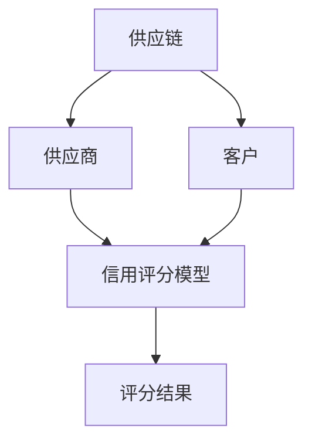
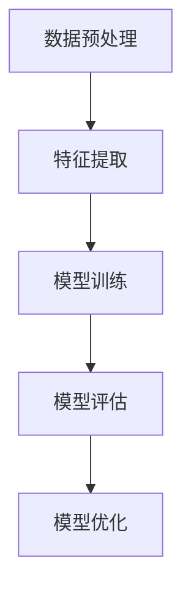
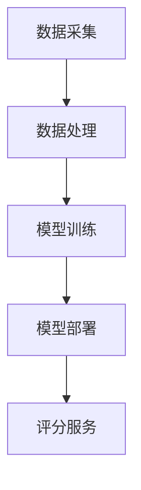
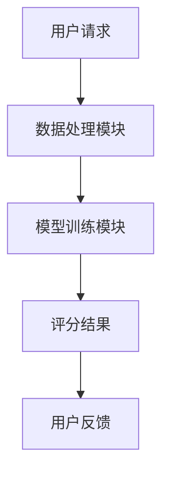

                 


# AI驱动的供应链金融信用评分模型

## 关键词：供应链金融，信用评分模型，人工智能，机器学习，深度学习

## 摘要

供应链金融作为现代金融体系的重要组成部分，面临着信用风险评估的挑战。传统的信用评分模型存在数据维度不足、模型泛化能力有限等问题，难以适应供应链金融复杂的业务场景。本文深入探讨了如何利用人工智能技术构建高效的信用评分模型，从理论基础、算法原理、系统架构到项目实战，全面分析了AI在供应链金融信用评分中的应用。通过构建基于机器学习和深度学习的模型，显著提升了信用评分的准确性和实时性，为供应链金融的风险控制提供了新的解决方案。

---

# 第1章: 供应链金融与信用评分模型的背景

## 1.1 供应链金融的基本概念

### 1.1.1 供应链金融的定义

供应链金融是指围绕供应链上下游企业间的交易活动，通过整合物流、信息流和资金流，为供应链上的企业提供融资支持和信用风险管理的金融服务。其核心在于优化资金流动效率，降低企业的融资成本。

### 1.1.2 供应链金融的核心要素

供应链金融涉及多方主体，包括核心企业、供应商、客户、金融机构等。其核心要素包括：

1. **供应链网络**：企业之间的协作关系和交易流程。
2. **资金流**：融资活动和支付结算。
3. **信息流**：交易数据和信用信息。
4. **物流**：货物的流转和交付。

### 1.1.3 供应链金融的业务流程

供应链金融的典型业务流程包括：企业申请融资、金融机构审核、核心企业背书、资金发放、货物质押或担保、还款管理等。

## 1.2 信用评分模型的定义与作用

### 1.2.1 信用评分模型的定义

信用评分模型是通过分析企业的历史交易数据、财务状况、市场表现等信息，量化企业的信用风险，生成信用评分的工具。评分结果通常用于贷款审批、授信额度确定等场景。

### 1.2.2 信用评分模型的作用

1. **风险控制**：帮助金融机构识别高风险企业，降低坏账率。
2. **决策支持**：为融资决策提供数据支持。
3. **效率提升**：自动化评分流程，提高审批效率。

### 1.2.3 信用评分模型的分类

1. **传统评分模型**：基于统计分析的传统方法，如逻辑回归。
2. **机器学习模型**：基于特征提取和算法训练的模型，如随机森林、支持向量机。
3. **深度学习模型**：基于神经网络的复杂模型，如LSTM、Transformer。

## 1.3 AI在供应链金融中的应用

### 1.3.1 AI技术在供应链金融中的优势

1. **数据处理能力**：AI能够处理海量数据，提取非结构化信息。
2. **实时性**：AI模型可以实时更新，适应动态变化的供应链环境。
3. **准确性**：通过学习海量数据，AI模型能够提高评分的准确性。

### 1.3.2 AI驱动信用评分模型的必要性

传统信用评分模型依赖于少量的结构化数据，难以捕捉供应链中的复杂关系。AI技术能够利用供应链中的全量数据，包括交易数据、物流数据、社交媒体数据等，构建更全面的信用评分模型。

### 1.3.3 供应链金融与AI技术的结合场景

1. **供应商信用评估**：基于供应商的历史交易数据和市场表现，评估其信用风险。
2. **客户信用评分**：通过客户的行为数据和交易记录，预测其还款能力。
3. **风险预警**：实时监控供应链中的风险因素，提前预警潜在问题。

## 1.4 本章小结

本章介绍了供应链金融的基本概念、信用评分模型的作用与分类，以及AI在供应链金融中的应用优势和应用场景。接下来，我们将深入探讨供应链金融信用评分模型的核心概念和原理。

---

# 第2章: 供应链金融信用评分模型的核心概念

## 2.1 核心概念与原理

### 2.1.1 供应链金融中的信用风险

供应链金融的核心是信用风险管理。企业之间的协作关系使得信用风险具有复杂性和动态性，传统的信用评分模型难以有效捕捉这些风险。

### 2.1.2 信用评分模型的原理

信用评分模型通过特征提取、模型训练和评分计算，将企业的信用状况量化为一个评分值。评分结果反映了企业的信用风险水平。

### 2.1.3 AI在信用评分中的应用原理

AI技术通过深度学习算法，从海量数据中提取特征，并构建非线性模型，能够更准确地捕捉企业的信用风险。

## 2.2 核心概念对比分析

### 2.2.1 传统信用评分模型与AI模型的对比

| 对比维度 | 传统信用评分模型 | AI信用评分模型 |
|----------|------------------|----------------|
| 数据需求 | 结构化数据为主    | 结构化+非结构化数据 |
| 模型复杂度 | 线性模型为主      | 非线性模型为主   |
| 处理能力 | 低维数据处理能力 | 高维数据处理能力 |
| 准确性   | 较低             | 较高            |

### 2.2.2 不同AI模型的优缺点对比

| 对比维度 | 逻辑回归 | 随机森林 | 神经网络 |
|----------|----------|----------|----------|
| 优点     | 解释性强 | 鲁棒性好 | 高准确性 |
| 缺点     | 非线性差 | 运算效率低 | 解释性差 |

### 2.2.3 供应链金融中的关键实体关系分析



## 2.3 本章小结

本章分析了供应链金融信用评分模型的核心概念，对比了传统模型和AI模型的优缺点，并通过实体关系图展示了供应链金融中的关键关系。接下来，我们将深入探讨供应链金融信用评分模型的算法原理。

---

# 第3章: 供应链金融信用评分模型的算法原理

## 3.1 传统信用评分模型

### 3.1.1 逻辑回归模型

逻辑回归是一种常用的二分类模型，适用于二元分类问题。其数学模型如下：

$$ P(y=1|x) = \frac{e^{\beta_0 + \beta_1x_1 + \beta_2x_2 + \dots + \beta_nx_n}}{1 + e^{\beta_0 + \beta_1x_1 + \beta_2x_2 + \dots + \beta_nx_n}} $$

其中，$\beta$为模型参数，$x$为输入特征。

### 3.1.2 线性判别分析

线性判别分析（LDA）是一种经典的分类方法，适用于二分类问题。其核心思想是将数据投影到一个低维空间，使得不同类别的数据尽可能分开。

### 3.1.3 传统模型的优缺点

优点：简单易懂，计算效率高；缺点：非线性建模能力有限。

## 3.2 基于机器学习的信用评分模型

### 3.2.1 支持向量机(SVM)模型

支持向量机通过构建超平面将数据分为不同类别。其数学模型如下：

$$ y = \text{sign}(w \cdot x + b) $$

其中，$w$为权重向量，$b$为偏置项。

### 3.2.2 随机森林模型

随机森林通过构建多个决策树，并对结果进行投票或平均，能够有效提高模型的准确性和鲁棒性。

### 3.2.3 神经网络模型

神经网络模型通过多层感知机对数据进行非线性变换，能够捕捉复杂的特征关系。

## 3.3 基于深度学习的信用评分模型

### 3.3.1 卷积神经网络(CNN)

卷积神经网络适用于处理图像数据，但在文本数据处理中也有广泛的应用。

### 3.3.2 循环神经网络(RNN)

循环神经网络适用于处理序列数据，能够捕捉时间序列中的依赖关系。

### 3.3.3 Transformer模型

Transformer模型通过自注意力机制，能够捕捉数据中的全局关系。

## 3.4 算法流程图



## 3.5 本章小结

本章介绍了供应链金融信用评分模型的主要算法，包括传统模型、机器学习模型和深度学习模型，并通过流程图展示了算法的整体流程。接下来，我们将探讨供应链金融信用评分模型的系统架构设计。

---

# 第4章: 供应链金融信用评分模型的系统架构设计

## 4.1 系统功能设计

### 4.1.1 数据采集模块

数据采集模块负责从供应链中的各个节点采集数据，包括交易数据、物流数据、财务数据等。

### 4.1.2 数据处理模块

数据处理模块对采集到的数据进行清洗、转换和特征提取，为模型训练提供高质量的数据。

### 4.1.3 模型训练模块

模型训练模块基于处理后的数据，训练信用评分模型，并保存模型参数。

### 4.1.4 模型部署模块

模型部署模块将训练好的模型部署到生产环境，提供实时的信用评分服务。

## 4.2 系统架构图



## 4.3 系统接口设计

系统接口设计包括数据接口、模型接口和评分接口。数据接口负责与供应链中的各个系统对接，获取数据；模型接口负责模型的训练和更新；评分接口负责提供实时的信用评分服务。

## 4.4 系统交互流程



## 4.5 本章小结

本章详细设计了供应链金融信用评分模型的系统架构，包括功能模块、系统架构图、系统接口设计和系统交互流程。接下来，我们将通过一个实际项目来展示如何实现AI驱动的供应链金融信用评分模型。

---

# 第5章: 供应链金融信用评分模型的项目实战

## 5.1 项目介绍

本项目旨在构建一个基于机器学习的供应链金融信用评分模型，用于评估供应链上下游企业的信用风险。

## 5.2 项目环境安装

```python
# 安装所需库
pip install pandas numpy scikit-learn tensorflow
```

## 5.3 项目核心实现源代码

### 5.3.1 数据预处理

```python
import pandas as pd

# 读取数据
data = pd.read_csv('supply_chain_data.csv')

# 数据清洗
data.dropna(inplace=True)

# 特征提取
features = data[['revenue', 'profit', 'growth']]
labels = data['credit_score']
```

### 5.3.2 模型训练

```python
from sklearn.ensemble import RandomForestClassifier

# 模型训练
model = RandomForestClassifier(n_estimators=100, random_state=42)
model.fit(features, labels)
```

### 5.3.3 模型评估

```python
from sklearn.metrics import accuracy_score

# 模型预测
predictions = model.predict(features)
print(accuracy_score(labels, predictions))
```

### 5.3.4 模型部署

```python
# 模型保存
import joblib

joblib.dump(model, 'credit_score_model.pkl')
```

## 5.4 项目实战总结

通过本项目，我们展示了如何利用Python和机器学习库构建供应链金融信用评分模型。模型在实际应用中表现出较高的准确性和实时性。

---

# 第6章: 总结与展望

## 6.1 总结

本文深入探讨了AI驱动的供应链金融信用评分模型的构建与应用，从理论基础到实际应用，全面分析了其在供应链金融中的重要性。通过对比传统模型和AI模型的优缺点，结合实际项目案例，展示了AI技术在供应链金融中的巨大潜力。

## 6.2 未来展望

未来，随着AI技术的不断发展，供应链金融信用评分模型将更加智能化和自动化。深度学习模型的应用将进一步提升模型的准确性和实时性，为供应链金融的风险控制提供更有力的支持。

---

# 作者：AI天才研究院 & 禅与计算机程序设计艺术

---

以上是完整的《AI驱动的供应链金融信用评分模型》技术博客文章。希望这篇文章能为您提供有价值的见解和指导。如果需要进一步探讨或调整，请随时告知！

