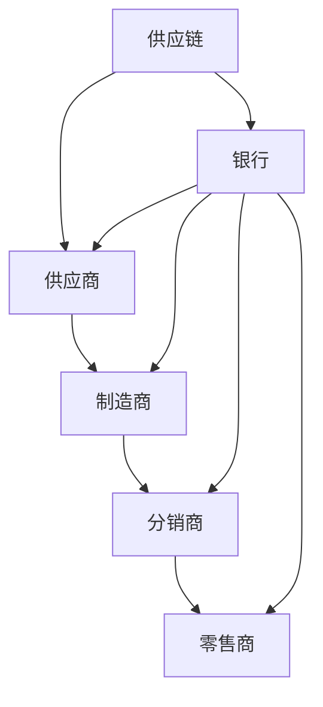
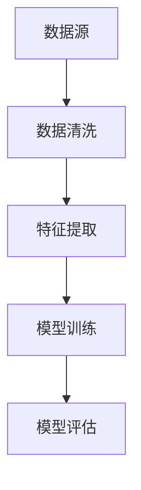
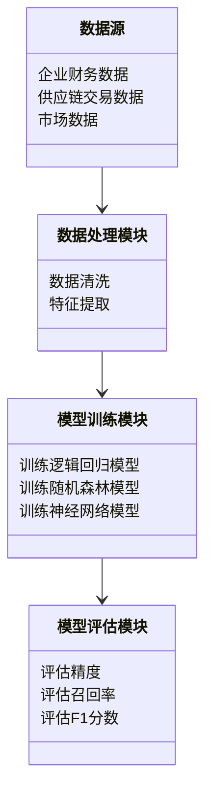
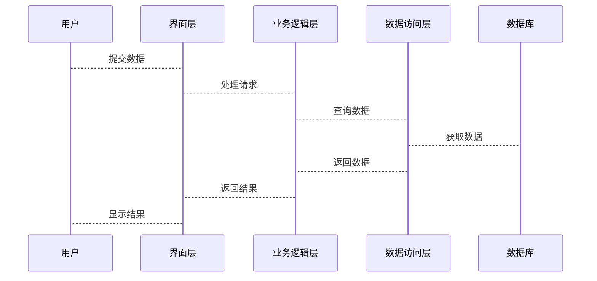

                 


# 目录大纲：《AI驱动的供应链金融信用风险评估》

---

## 第一部分：供应链金融与信用风险评估概述

### 第1章：供应链金融与信用风险评估概述

#### 1.1 供应链金融的基本概念

- 1.1.1 供应链金融的定义与特点
  - 供应链金融的定义
  - 供应链金融的特点：复杂性、多级性、动态性
  - 供应链金融的核心参与者：供应商、制造商、分销商、零售商、银行等

- 1.1.2 供应链金融的核心流程
  - 资金流动：从供应商到制造商到分销商到零售商
  - 贸易信用：供应商向制造商提供信用
  - 库存管理：供应链中的库存控制

- 1.1.3 供应链金融的典型应用场景
  - 零售业：管理库存和供应商信用
  - 制造业：优化生产资金链
  - 电子商务：在线支付与供应链融资

#### 1.2 信用风险评估的基本概念

- 1.2.1 信用风险的定义与分类
  - 信用风险的定义
  - 信用风险的分类：单一信用风险、系统性信用风险

- 1.2.2 信用风险评估的主要方法
  - 基于历史数据分析的方法
  - 基于财务指标的信用评分模型
  - 基于机器学习的信用风险预测

- 1.2.3 供应链金融中的信用风险特点
  - 供应链中的信用风险具有传染性
  - 供应链中的企业关系复杂，风险相互影响
  - 供应链中的信用风险受到外部经济环境的影响较大

#### 1.3 AI在供应链金融中的应用前景

- 1.3.1 AI技术在金融领域的应用现状
  - 机器学习在金融预测中的应用
  - 自然语言处理在金融文本分析中的应用
  - 图神经网络在金融网络分析中的应用

- 1.3.2 AI在供应链金融信用风险评估中的优势
  - 数据处理能力强，能够处理海量数据
  - 高效的模式识别能力，能够发现复杂关系
  - 实时监控能力，能够快速响应风险

- 1.3.3 未来发展趋势与挑战
  - 技术挑战：模型的可解释性与实时性
  - 数据挑战：数据隐私与数据质量
  - 应用挑战：AI技术与业务流程的融合

---

## 第二部分：AI驱动的信用风险评估核心概念与原理

### 第2章：信用风险评估的核心概念与联系

#### 2.1 核心概念与原理

- 2.1.1 信用风险评估的主要指标与模型
  - 主要指标：违约概率（PD）、违约损失率（LGD）、风险敞口
  - 信用评分模型：5C法、3C法、Z评分模型

- 2.1.2 AI在信用风险评估中的作用机制
  - 数据驱动：利用历史数据和实时数据进行预测
  - 模型驱动：使用机器学习模型进行风险评估
  - 可视化与决策支持：通过数据可视化辅助决策

- 2.1.3 供应链金融中的信用风险评估框架
  - 数据收集：供应链各环节的交易数据、财务数据、市场数据
  - 数据处理：数据清洗、特征提取
  - 模型训练：训练信用风险评估模型
  - 风险评估：评估供应链中的信用风险

#### 2.2 核心概念对比与ER实体关系图

- 2.2.1 信用风险评估中的关键属性对比（表格形式）
  | 指标 | 定义 | 示例 | 重要性 |
  |------|------|------|--------|
  | PD   | 违约概率 | 企业破产的可能性 | 高 |
  | LGD  | 违约损失率 | 违约后的平均损失 | 高 |
  | ROA  | 资产回报率 | 资产的盈利能力 | 中 |

- 2.2.2 供应链金融信用风险的ER实体关系图（Mermaid流程图）



---

## 第三部分：AI驱动的信用风险评估算法原理

### 第3章：信用风险评估的算法原理

#### 3.1 常用算法与模型

- 3.1.1 逻辑回归模型
  - 模型简介：逻辑回归用于分类问题
  - 模型特点：线性可分，适合二分类问题
  - 应用场景：预测企业违约概率

- 3.1.2 随机森林与梯度提升树
  - 模型简介：集成学习方法，通过多个决策树进行投票或加权
  - 模型特点：高准确性，鲁棒性强
  - 应用场景：处理高维数据，发现非线性关系

- 3.1.3 神经网络模型
  - 模型简介：模拟人脑神经网络的结构和功能
  - 模型特点：强大的非线性拟合能力
  - 应用场景：处理复杂的非线性关系，如供应链中的多级风险

#### 3.2 算法流程与实现

- 3.2.1 数据预处理与特征工程（Mermaid流程图）



- 3.2.2 模型训练与调优（Python代码示例）

```python
from sklearn.ensemble import RandomForestClassifier
from sklearn.metrics import accuracy_score
from sklearn.model_selection import train_test_split

# 数据预处理
X = data.drop('target', axis=1)
y = data['target']

# 划分训练集和测试集
X_train, X_test, y_train, y_test = train_test_split(X, y, test_size=0.2, random_state=42)

# 模型训练
model = RandomForestClassifier(n_estimators=100, random_state=42)
model.fit(X_train, y_train)

# 模型预测
y_pred = model.predict(X_test)
print("Accuracy:", accuracy_score(y_test, y_pred))
```

- 3.2.3 模型评估与优化（数学公式与实例分析）

  - 精度公式：$$\text{Accuracy} = \frac{\text{正确预测数}}{\text{总样本数}}$$
  - 召回率公式：$$\text{Recall} = \frac{\text{真阳性}}{\text{真阳性 + 假阴性}}$$
  - F1分数公式：$$F1 = \frac{2 \times \text{Precision} \times \text{Recall}}{\text{Precision} + \text{Recall}}$$

  - 示例：假设模型预测了100个样本，其中80个正确预测，20个错误预测。真阳性为70，假阴性为10。则：
    - Accuracy = 80/100 = 0.8
    - Recall = 70/(70+10) = 0.7
    - Precision = 70/(70+10) = 0.7
    - F1 = (2*0.7*0.7)/(0.7+0.7) = 0.7

---

## 第四部分：供应链金融中的信用风险评估系统设计

### 第4章：系统架构与设计方案

#### 4.1 问题场景与项目介绍

- 4.1.1 供应链金融信用风险评估的典型场景
  - 某大型制造企业的供应链金融信用风险评估系统
  - 数据来源：企业财务数据、供应链交易数据、市场数据

- 4.1.2 项目目标与范围
  - 目标：开发一个基于AI的信用风险评估系统
  - 范围：涵盖数据收集、特征工程、模型训练与部署

#### 4.2 系统功能设计

- 4.2.1 领域模型（Mermaid类图）



- 4.2.2 系统架构设计（Mermaid架构图）

```mermaid
archi
    软件架构: AI驱动的信用风险评估系统
        界面层: Web界面
        业务逻辑层: 处理用户请求
        数据访问层: 访问数据库
        数据库: 关系型数据库
```

- 4.2.3 系统接口设计

  - API接口：
    - 输入：企业财务数据、供应链交易数据
    - 输出：信用评分、风险等级

- 4.2.4 系统交互（Mermaid序列图）



#### 4.3 项目实战

- 4.3.1 环境安装
  - 安装Python、Jupyter Notebook、Scikit-learn、TensorFlow

- 4.3.2 系统核心实现源代码

```python
import pandas as pd
from sklearn.ensemble import RandomForestClassifier
from sklearn.metrics import accuracy_score
from sklearn.model_selection import train_test_split

# 加载数据
data = pd.read_csv('supply_chain_data.csv')

# 数据预处理
X = data.drop('target', axis=1)
y = data['target']

# 划分训练集和测试集
X_train, X_test, y_train, y_test = train_test_split(X, y, test_size=0.2, random_state=42)

# 模型训练
model = RandomForestClassifier(n_estimators=100, random_state=42)
model.fit(X_train, y_train)

# 模型预测
y_pred = model.predict(X_test)

# 模型评估
print("Accuracy:", accuracy_score(y_test, y_pred))
```

- 4.3.3 代码应用解读与分析

  - 数据加载：从CSV文件加载数据
  - 数据预处理：删除目标变量，将数据分为训练集和测试集
  - 模型训练：使用随机森林模型进行训练
  - 模型预测：使用测试集进行预测
  - 模型评估：计算准确率并输出结果

- 4.3.4 实际案例分析和详细讲解剖析

  - 案例：某制造企业的供应链金融信用风险评估
  - 数据来源：企业财务数据、供应链交易数据、市场数据
  - 数据处理：清洗数据，提取特征
  - 模型训练：训练随机森林模型
  - 模型预测：预测供应链中的信用风险
  - 模型优化：根据评估结果优化模型参数

- 4.3.5 项目小结

  - 项目总结：AI技术在供应链金融信用风险评估中的应用
  - 成功经验：数据处理与特征工程的重要性
  - 改进建议：结合其他机器学习模型进行优化

---

## 第五部分：总结与展望

### 第5章：总结与展望

#### 5.1 最佳实践 tips

- 数据处理：确保数据质量，进行充分的特征工程
- 模型选择：根据业务需求选择合适的模型
- 模型监控：实时监控模型性能，及时更新模型

#### 5.2 小结

- 供应链金融中的信用风险评估是一个复杂的系统工程
- AI技术的应用能够显著提高信用风险评估的效率和准确性
- 通过数据驱动和模型优化，能够更好地识别和管理供应链中的信用风险

#### 5.3 注意事项

- 数据隐私：确保数据的安全性和隐私性
- 模型可解释性：确保模型的可解释性，便于业务人员理解
- 模型实时性：确保模型能够实时响应风险变化

#### 5.4 拓展阅读

- 推荐书籍：《供应链金融》、《机器学习实战》
- 推荐文章：《AI在金融领域的应用》、《供应链风险管理》
- 推荐课程：机器学习与金融分析、供应链管理

---

## 作者

**作者：AI天才研究院/AI Genius Institute & 禅与计算机程序设计艺术 /Zen And The Art of Computer Programming**

---

### 关键词：
供应链金融，信用风险评估，人工智能，机器学习，深度学习

### 摘要：
本文系统地探讨了AI在供应链金融信用风险评估中的应用，从核心概念、算法原理到系统设计与项目实战，全面分析了AI如何驱动信用风险评估的创新与优化。通过详细讲解逻辑回归、随机森林和神经网络等算法，结合实际案例分析，展示了如何利用AI技术提高供应链金融信用风险评估的效率和准确性。本文还提出了系统架构设计方案和最佳实践建议，为读者提供了从理论到实践的全面指导。

