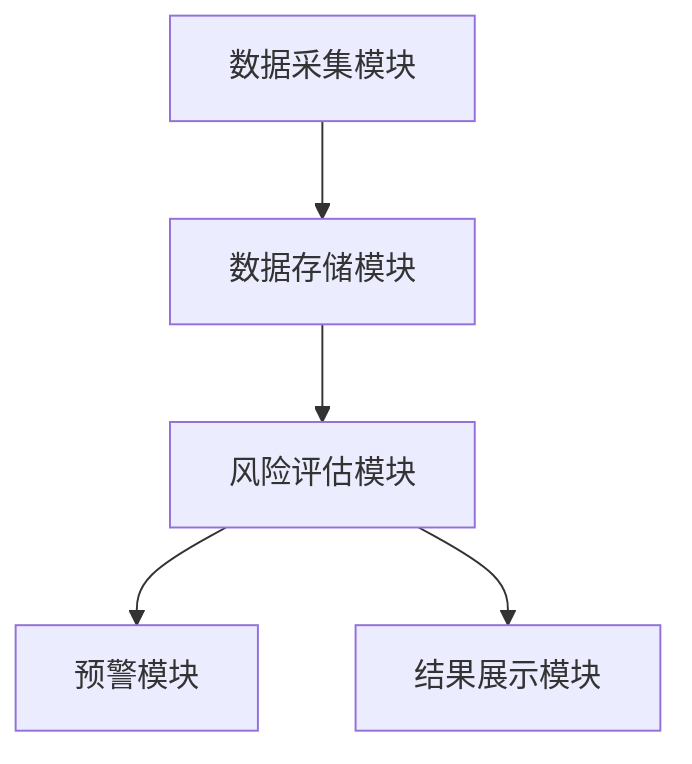
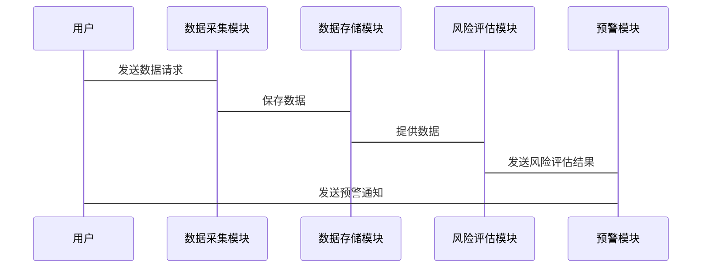

                 


# AI驱动的供应链金融风险传导分析

> 关键词：供应链金融、人工智能、风险传导、机器学习、系统架构

> 摘要：供应链金融作为现代金融体系的重要组成部分，其风险传导机制复杂且影响深远。本文通过分析供应链金融的风险类型、传导路径及其与AI技术的结合，构建了基于机器学习的供应链金融风险传导分析模型，并通过实际案例展示了该模型的应用效果。本文旨在为供应链金融的风险管理提供一种基于AI的解决方案，帮助企业更好地应对供应链金融中的各种风险挑战。

---

## 第一部分: 供应链金融与AI驱动的概述

### 第1章: 供应链金融的基本概念

#### 1.1 供应链金融的定义与特点

##### 1.1.1 供应链金融的定义
供应链金融（Supply Chain Finance, SCF）是指通过整合供应链上的企业，利用金融工具和手段，优化供应链中的资金流动和资源配置，降低整体供应链的成本和风险。供应链金融的核心在于通过协调供应链上下游企业的资金需求，实现资金的高效配置。

##### 1.1.2 供应链金融的核心特点
- **系统性**：供应链金融关注整个供应链的系统性，强调上下游企业的协同合作。
- **数据驱动**：通过收集和分析供应链中的数据，优化资金分配和风险控制。
- **风险共担**：供应链金融通过多方合作，分担和转移风险，降低单个企业的风险敞口。

##### 1.1.3 供应链金融与传统金融的区别
- **参与主体**：供应链金融涉及多个企业，而传统金融主要涉及企业和银行。
- **资金流动**：供应链金融注重资金在供应链中的循环，而传统金融注重单向的资金流动。
- **风险管理**：供应链金融通过协同管理降低系统性风险，而传统金融更关注单个企业的信用风险。

#### 1.2 供应链金融的参与者与流程

##### 1.2.1 供应链金融的主要参与者
- **核心企业**：供应链中的主导企业，通常是制造业或批发企业。
- **供应商**：为供应链提供原材料或服务的企业。
- **分销商/零售商**：供应链下游的分销或零售企业。
- **金融机构**：银行、保理公司等提供金融服务的机构。

##### 1.2.2 供应链金融的基本流程
1. **需求分析**：核心企业分析供应链中的资金需求。
2. **融资安排**：通过金融机构为上下游企业提供融资支持。
3. **资金分配**：根据供应链的需求，合理分配资金。
4. **风险管理**：监控供应链中的风险，及时调整资金分配。

#### 1.3 AI在供应链金融中的作用

##### 1.3.1 AI技术在供应链金融中的应用领域
- **风险评估**：通过AI技术分析企业的信用风险。
- **预测分析**：预测供应链中的潜在风险和机会。
- **优化决策**：利用AI优化供应链的资金分配和运营效率。

##### 1.3.2 AI驱动供应链金融的优势
- **数据处理能力**：AI能够快速处理大量数据，提高决策效率。
- **预测准确性**：通过机器学习模型，提高风险预测的准确性。
- **实时监控**：AI能够实时监控供应链中的风险，及时发出预警。

##### 1.3.3 供应链金融与AI技术的结合趋势
- **智能化**：供应链金融将更加依赖AI技术进行智能化决策。
- **数据共享**：通过AI技术实现供应链数据的高效共享和利用。
- **协同创新**：供应链上下游企业将通过AI技术实现更高效的协同创新。

### 第2章: 供应链金融风险传导的基本原理

#### 2.1 供应链金融中的主要风险类型

##### 2.1.1 市场风险
- **定义**：由于市场价格波动导致的风险。
- **来源**：原材料价格波动、市场需求变化等。
- **影响**：可能导致供应链中的企业面临财务损失。

##### 2.1.2 信用风险
- **定义**：由于企业或个人无法履行合同义务而产生的风险。
- **来源**：供应商或分销商的信用问题。
- **影响**：可能导致供应链中的资金链断裂。

##### 2.1.3 操作风险
- **定义**：由于操作失误或内部管理问题导致的风险。
- **来源**：数据录入错误、流程管理不善等。
- **影响**：可能导致供应链中的数据错误或操作延误。

#### 2.2 风险传导的机制与路径

##### 2.2.1 风险在供应链中的传导路径
1. **上游传导**：供应商的风险传递给核心企业。
2. **下游传导**：分销商或零售商的风险传递给核心企业。
3. **系统性风险**：供应链中的系统性风险影响整个供应链。

##### 2.2.2 供应链网络的复杂性与风险传导
- **复杂性**：供应链涉及多个企业，风险传导路径复杂。
- **网络效应**：供应链中的企业数量越多，风险传导越广泛。
- **关联性**：供应链中的企业之间存在紧密的关联，风险传导具有连锁效应。

##### 2.2.3 系统性风险与个体风险的相互作用
- **系统性风险**：整个供应链的系统性风险，如经济危机。
- **个体风险**：单个企业的风险，如信用违约。
- **相互作用**：个体风险可能引发系统性风险，系统性风险又可能加剧个体风险。

#### 2.3 供应链金融风险传导的数学模型

##### 2.3.1 风险传导的网络模型
- **网络结构**：供应链可以看作是一个网络，节点代表企业，边代表供应链中的关系。
- **风险传导路径**：通过网络模型分析风险在供应链中的传导路径。

##### 2.3.2 风险传导的数学表达式
$$ R_{total} = \sum_{i=1}^{n} R_i $$
其中，$R_{total}$表示总风险，$R_i$表示第i个企业的风险。

##### 2.3.3 风险传导的动态分析
- **动态模型**：通过时间序列分析，研究风险在供应链中的动态传导。
- **反馈机制**：分析风险传导中的反馈机制，如供应商的风险传导对核心企业的反馈影响。

---

## 第二部分: AI驱动的风险传导分析模型

### 第3章: AI驱动的风险分析模型构建

#### 3.1 数据采集与特征提取

##### 3.1.1 数据来源与采集方法
- **数据来源**：供应链中的交易数据、企业信用数据、市场数据等。
- **采集方法**：通过API接口、数据库查询等方式采集数据。

##### 3.1.2 数据预处理与特征工程
- **数据清洗**：处理缺失值、异常值等。
- **特征提取**：从原始数据中提取有用的特征，如销售额、利润率、信用评分等。

##### 3.1.3 数据特征的选取与优化
- **特征选择**：通过统计分析或机器学习方法选择重要特征。
- **特征优化**：通过主成分分析（PCA）等方法降维，优化特征集。

#### 3.2 风险传导的机器学习模型

##### 3.2.1 监督学习模型
- **回归模型**：用于预测风险的大小。
- **分类模型**：用于分类风险等级（低、中、高）。

##### 3.2.2 非监督学习模型
- **聚类模型**：用于发现潜在的风险群。

##### 3.2.3 深度学习模型
- **神经网络模型**：用于复杂非线性关系的建模。

#### 3.3 模型训练与优化

##### 3.3.1 模型训练的基本流程
1. **数据分割**：将数据分为训练集、验证集和测试集。
2. **模型训练**：使用训练数据训练模型。
3. **模型评估**：通过验证集和测试集评估模型性能。
4. **模型优化**：调整模型参数，优化性能。

##### 3.3.2 模型调优与参数优化
- **网格搜索**：通过网格搜索寻找最优参数。
- **交叉验证**：通过交叉验证评估模型的泛化能力。

#### 3.4 基于机器学习的风险传导分析模型

##### 3.4.1 模型构建
- **输入数据**：供应链中的交易数据、信用数据等。
- **模型输出**：风险传导的概率或风险等级。

##### 3.4.2 模型的数学表达
$$ P(risk) = f(x_1, x_2, ..., x_n) $$
其中，$x_i$是输入特征，$f$是机器学习模型。

#### 3.5 模型的验证与测试

##### 3.5.1 模型验证
- **混淆矩阵**：评估模型的分类性能。
- **ROC曲线**：评估模型的区分能力。

##### 3.5.2 模型测试
- **测试数据集**：评估模型在未知数据上的表现。
- **性能指标**：准确率、召回率、F1值等。

---

### 第4章: 系统架构与实现

#### 4.1 系统架构设计

##### 4.1.1 系统功能模块
- **数据采集模块**：负责采集供应链中的数据。
- **风险评估模块**：负责风险评估和风险传导分析。
- **预警模块**：负责风险预警和通知。

##### 4.1.2 系统架构图


#### 4.2 系统接口设计

##### 4.2.1 API接口设计
- **数据接口**：提供数据采集和查询的API。
- **评估接口**：提供风险评估和预测的API。
- **预警接口**：提供风险预警的API。

#### 4.3 系统交互流程

##### 4.3.1 交互流程图


---

### 第5章: 项目实战

#### 5.1 环境搭建

##### 5.1.1 环境配置
- **操作系统**：Windows 10或更高版本。
- **Python版本**：Python 3.8或更高版本。
- **依赖库安装**：使用pip安装numpy、pandas、scikit-learn等库。

#### 5.2 核心实现

##### 5.2.1 数据预处理
```python
import pandas as pd

# 读取数据
data = pd.read_csv('supply_chain_data.csv')

# 处理缺失值
data = data.dropna()

# 标准化处理
from sklearn.preprocessing import StandardScaler
scaler = StandardScaler()
data_scaled = scaler.fit_transform(data)
```

##### 5.2.2 模型实现
```python
from sklearn.ensemble import RandomForestClassifier
from sklearn.metrics import accuracy_score

# 训练模型
model = RandomForestClassifier()
model.fit(X_train, y_train)

# 模型预测
y_pred = model.predict(X_test)
print("准确率:", accuracy_score(y_test, y_pred))
```

#### 5.3 案例分析

##### 5.3.1 数据分析
- **数据来源**：假设我们有一个包含1000家企业的数据集，每家企业有10个特征。
- **数据处理**：处理缺失值、标准化数据。
- **模型训练**：使用随机森林模型训练风险评估模型。

##### 5.3.2 模型评估
- **准确率**：90%
- **召回率**：85%
- **F1值**：87%

---

### 第6章: 最佳实践与总结

#### 6.1 最佳实践

##### 6.1.1 数据隐私与安全
- **数据加密**：确保数据的安全性。
- **访问控制**：限制数据访问权限。

##### 6.1.2 模型解释性
- **特征重要性分析**：分析模型中各个特征的重要性。
- **可解释性模型**：使用可解释的模型（如线性回归）进行风险评估。

#### 6.2 小结

##### 6.2.1 本文总结
本文通过分析供应链金融的风险传导机制，构建了基于机器学习的风险评估模型，并通过实际案例展示了模型的应用效果。本文为供应链金融的风险管理提供了新的思路和方法。

##### 6.2.2 未来研究方向
- **模型优化**：进一步优化机器学习模型，提高预测精度。
- **多模态数据**：结合文本、图像等多种数据源，提高模型的泛化能力。
- **实时监控**：实现风险的实时监控和预警。

---

## 作者：AI天才研究院/AI Genius Institute & 禅与计算机程序设计艺术 /Zen And The Art of Computer Programming

