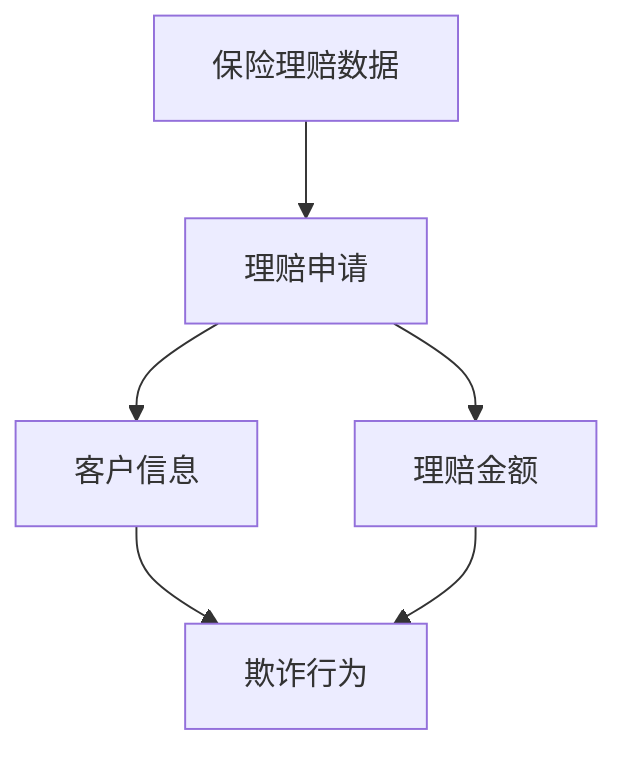
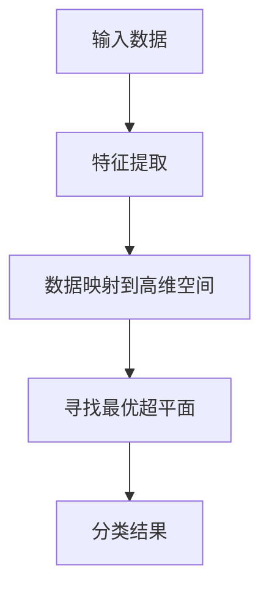
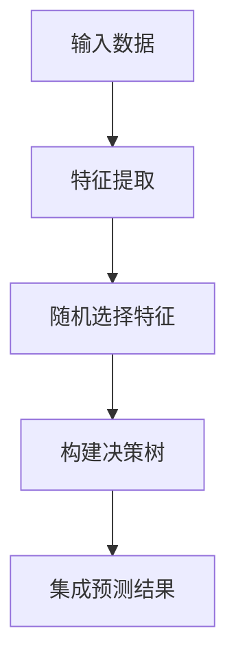
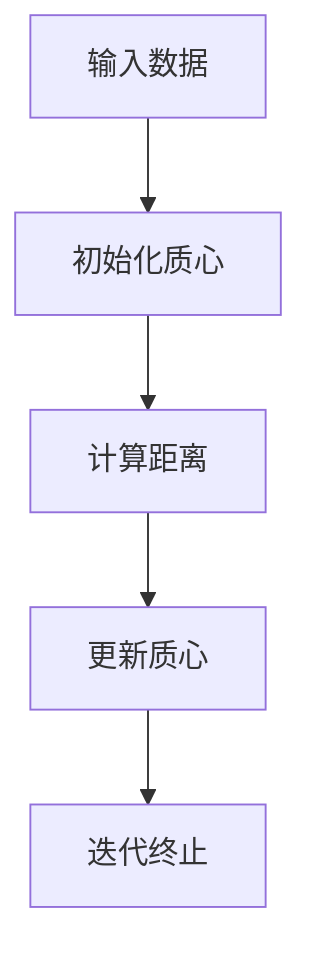
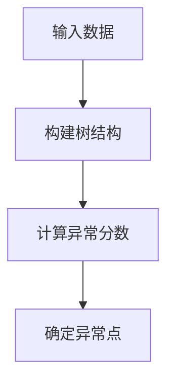
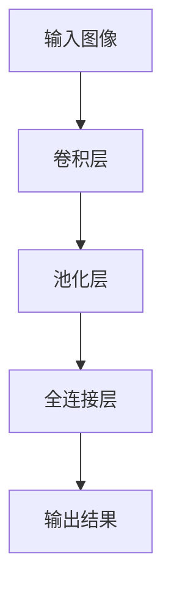
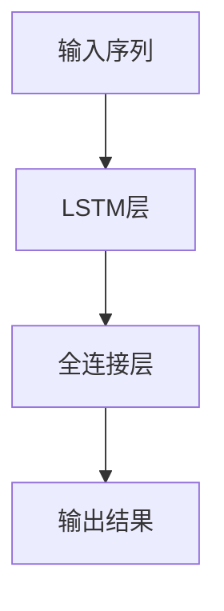

                 


# AI驱动的保险理赔欺诈模式识别

> **关键词**：保险、AI、欺诈模式识别、机器学习、数据挖掘、模式识别  
> 
> **摘要**：随着人工智能技术的快速发展，保险行业面临着越来越多的欺诈行为。本文将探讨如何利用AI技术，特别是机器学习和数据挖掘的方法，识别保险理赔中的欺诈模式。文章将从保险欺诈的现状与挑战入手，分析欺诈模式识别的核心概念与原理，结合常见的AI算法，如监督学习、无监督学习和深度学习，详细讲解其在保险欺诈检测中的应用。最后，本文将通过一个实际的项目案例，展示如何利用AI技术构建一个高效的保险欺诈检测系统。

---

# 第一部分: AI驱动的保险理赔欺诈模式识别背景与概述

## 第1章: 保险理赔欺诈概述

### 1.1 保险欺诈的现状与挑战

保险欺诈是保险行业面临的一个严重问题。根据行业报告，欺诈行为导致保险公司每年的损失高达数十亿美元。这些欺诈行为不仅增加了保险公司的运营成本，还可能导致客户信任度下降，进而影响保险行业的整体发展。

#### 1.1.1 保险欺诈的定义与类型

保险欺诈是指通过故意虚构、夸大或伪装保险事件，以骗取保险金的行为。常见的保险欺诈类型包括：

- **虚构事件**：投保人虚构保险事故，如伪造交通事故或疾病证明。
- **夸大损失**：投保人在理赔时夸大损失程度，以获得更多的赔偿金。
- **恶意拒赔**：投保人故意隐瞒保险合同中的重要信息，以规避保险公司的理赔责任。

#### 1.1.2 保险欺诈的经济损失与社会影响

保险欺诈不仅给保险公司带来直接的经济损失，还可能导致社会资源的浪费。例如，保险公司为了应对欺诈行为，不得不投入更多的资源用于审核和调查，这会增加保险产品的成本，最终转嫁给消费者。

#### 1.1.3 传统保险欺诈识别的局限性

传统的保险欺诈识别方法主要依赖人工审核和简单的规则匹配。这种方法存在以下局限性：

- **效率低下**：人工审核需要大量时间和资源，难以应对海量的保险理赔数据。
- **漏判与误判**：由于人为因素的影响，容易出现漏判或误判的情况。
- **难以应对复杂的欺诈手段**：传统的规则匹配方法难以识别复杂的欺诈模式。

### 1.2 AI技术在保险行业的应用前景

随着人工智能技术的快速发展，AI在保险行业中的应用越来越广泛。AI技术可以帮助保险公司提高效率、降低成本，并改善客户体验。

#### 1.2.1 AI技术的基本概念与特点

人工智能（AI）是指通过计算机技术模拟人类智能的决策过程。AI技术的核心特点包括：

- **数据驱动**：AI算法需要大量数据进行训练和优化。
- **自动化**：AI可以自动完成任务，减少人工干预。
- **可扩展性**：AI系统可以处理海量数据，并快速适应新的数据和场景。

#### 1.2.2 AI在保险行业中的典型应用领域

AI技术在保险行业中的应用领域包括：

- **风险评估**：通过分析客户数据，评估保险风险。
- **理赔自动化**：利用AI技术自动处理理赔申请，减少人工审核。
- **欺诈检测**：通过AI算法识别潜在的欺诈行为。

#### 1.2.3 AI驱动保险欺诈识别的优势与潜力

AI技术在保险欺诈识别中的优势包括：

- **高效性**：AI算法可以快速处理海量数据，显著提高欺诈识别的效率。
- **准确性**：AI算法可以通过学习历史数据，识别复杂的欺诈模式，提高识别的准确性。
- **可扩展性**：AI系统可以轻松扩展，适应不同的保险产品和市场环境。

### 1.3 保险理赔欺诈模式识别的核心问题

保险理赔欺诈模式识别的核心问题是如何通过AI技术，准确识别保险理赔中的欺诈行为。

#### 1.3.1 欺诈模式识别的定义与目标

欺诈模式识别是指通过分析保险理赔数据，识别出潜在的欺诈行为。其目标是通过AI算法，发现隐藏在数据中的欺诈模式，从而帮助保险公司减少欺诈损失。

#### 1.3.2 欺诈模式识别的关键挑战

欺诈模式识别面临以下关键挑战：

- **数据多样性**：欺诈行为可能涉及多种类型的数据，如文本、图像和时间序列数据。
- **数据不平衡**：欺诈行为相对于正常行为较少，导致数据不平衡，影响算法的性能。
- **模型解释性**：复杂的AI模型（如深度学习模型）通常缺乏可解释性，难以被业务人员理解和信任。

#### 1.3.3 保险理赔欺诈模式识别的边界与外延

保险理赔欺诈模式识别的边界包括：

- **保险类型**：主要关注财产保险和健康保险中的欺诈行为。
- **理赔阶段**：主要关注理赔申请阶段的欺诈识别。

其外延包括：

- **欺诈预防**：通过识别潜在的欺诈风险，提前采取预防措施。
- **保险产品设计**：通过分析欺诈模式，优化保险产品的设计，减少欺诈风险。

### 1.4 本章小结

本章介绍了保险欺诈的现状与挑战，分析了AI技术在保险行业中的应用前景，并提出了保险理赔欺诈模式识别的核心问题。通过本章的介绍，读者可以理解保险欺诈识别的重要性和AI技术在其中的关键作用。

---

# 第二部分: AI驱动的保险理赔欺诈模式识别核心概念与原理

## 第2章: 欺诈模式识别的核心概念与原理

### 2.1 欺诈模式识别的基本原理

欺诈模式识别的基本原理是通过分析保险理赔数据，发现隐藏在数据中的欺诈模式。这需要结合数据特征提取、算法选择和模型评估等技术。

#### 2.1.1 数据特征提取与模式识别的关系

数据特征提取是模式识别的基础。通过提取与欺诈行为相关的特征（如理赔金额、时间间隔、地点分布等），可以提高欺诈识别的准确性。

#### 2.1.2 监督学习与无监督学习在欺诈识别中的应用

监督学习适用于已知欺诈标签的数据，通过训练模型分类正常和欺诈行为。无监督学习适用于无标签数据，通过聚类和异常检测发现潜在的欺诈行为。

#### 2.1.3 深度学习在复杂模式识别中的优势

深度学习通过多层神经网络提取数据的高层次特征，适用于复杂的欺诈模式识别。例如，卷积神经网络（CNN）可以用于处理图像数据，循环神经网络（RNN）可以用于处理时间序列数据。

### 2.2 欺诈模式识别的核心算法原理

#### 2.2.1 监督学习算法（如决策树、随机森林）

- **决策树**：通过构建树状结构，将数据分成不同的区域，最终确定欺诈行为。
- **随机森林**：通过集成多个决策树，提高模型的准确性和鲁棒性。

#### 2.2.2 无监督学习算法（如聚类、异常检测）

- **聚类**：通过将相似的数据点分组，发现潜在的欺诈行为。
- **异常检测**：通过识别与正常数据点显著不同的数据点，发现欺诈行为。

#### 2.2.3 深度学习算法（如神经网络、LSTM）

- **神经网络**：通过多层神经网络提取数据的高层次特征。
- **LSTM**：通过长短期记忆网络处理时间序列数据，识别欺诈行为。

### 2.3 欺诈模式识别的数学模型与公式

#### 2.3.1 分类模型的损失函数

常用的分类模型损失函数包括：

- **对数损失函数**：
  $$ L = -\frac{1}{N}\sum_{i=1}^{N} [y_i \cdot \ln(p_i) + (1-y_i) \cdot \ln(1-p_i)] $$

- **交叉熵损失函数**：
  $$ L = -\frac{1}{N}\sum_{i=1}^{N} y_i \cdot \ln(p_i) + (1-y_i) \cdot \ln(1-p_i) $$

#### 2.3.2 聚类模型的距离度量

常用的聚类距离度量包括：

- **欧氏距离**：
  $$ d(x_i, x_j) = \sqrt{\sum_{k=1}^{n} (x_{ik} - x_{jk})^2} $$

- **曼哈顿距离**：
  $$ d(x_i, x_j) = \sum_{k=1}^{n} |x_{ik} - x_{jk}| $$

### 2.4 欺诈模式识别的ER实体关系图

通过ER图可以清晰地展示保险理赔欺诈模式识别的核心实体及其关系。



### 2.5 本章小结

本章详细介绍了欺诈模式识别的核心概念与原理，包括数据特征提取、算法选择和模型评估等方面。通过数学公式和ER图的展示，读者可以更好地理解欺诈模式识别的技术细节。

---

# 第三部分: AI驱动的保险理赔欺诈模式识别算法原理

## 第3章: 常见算法原理与实现

### 3.1 监督学习算法

#### 3.1.1 支持向量机（SVM）原理与实现

支持向量机（SVM）是一种常用的监督学习算法，适用于分类问题。



实现代码示例：

```python
from sklearn import svm
# 创建训练数据
X_train = [[0, 0], [1, 1]]
y_train = [0, 1]
# 创建SVM分类器
clf = svm.SVC()
# 训练模型
clf.fit(X_train, y_train)
# 预测测试数据
X_test = [[2, 2]]
print(clf.predict(X_test))  # 输出：[1]
```

#### 3.1.2 随机森林算法原理与实现

随机森林是一种基于决策树的集成算法，适用于分类和回归问题。



实现代码示例：

```python
from sklearn.ensemble import RandomForestClassifier
# 创建训练数据
X_train = [[0, 0], [1, 1], [2, 2]]
y_train = [0, 1, 2]
# 创建随机森林分类器
clf = RandomForestClassifier(n_estimators=3)
# 训练模型
clf.fit(X_train, y_train)
# 预测测试数据
X_test = [[3, 3]]
print(clf.predict(X_test))  # 输出：[2]
```

### 3.2 无监督学习算法

#### 3.2.1 K-means聚类算法原理与实现

K-means是一种常用的无监督学习算法，适用于聚类问题。



实现代码示例：

```python
from sklearn.cluster import KMeans
# 创建训练数据
X_train = [[0, 0], [1, 1], [2, 2], [3, 3]]
# 创建K-means聚类器
clf = KMeans(n_clusters=2)
# 训练模型
clf.fit(X_train)
# 预测聚类结果
print(clf.labels_)  # 输出：[0, 0, 1, 1]
```

#### 3.2.2 Isolation Forest异常检测算法原理与实现

Isolation Forest是一种基于树结构的异常检测算法，适用于无监督学习场景。



实现代码示例：

```python
from sklearn.ensemble import IsolationForest
# 创建训练数据
X_train = [[0, 0], [1, 1], [2, 2], [3, 3], [4, 4], [5, 5], [6, 6], [7, 7], [8, 8], [9, 9]]
# 创建Isolation Forest异常检测器
clf = IsolationForest(n_estimators=10)
# 训练模型
clf.fit(X_train)
# 预测异常结果
print(clf.predict(X_train))  # 输出：[1, 1, -1, -1, -1, -1, -1, -1, -1, -1]
```

### 3.3 深度学习算法

#### 3.3.1 卷积神经网络（CNN）原理与实现

卷积神经网络（CNN）适用于图像数据的处理。



实现代码示例：

```python
import keras
from keras import layers
# 创建CNN模型
model = keras.Sequential()
model.add(layers.Conv2D(32, (3,3), activation='relu', input_shape=(64, 64, 3)))
model.add(layers.MaxPooling2D(pool_size=(2,2)))
model.add(layers.Flatten())
model.add(layers.Dense(64, activation='relu'))
model.add(layers.Dense(1, activation='sigmoid'))
# 编译模型
model.compile(optimizer='adam', loss='binary_crossentropy', metrics=['accuracy'])
```

#### 3.3.2 长短期记忆网络（LSTM）原理与实现

LSTM适用于时间序列数据的处理。



实现代码示例：

```python
from tensorflow.keras import layers
# 创建LSTM模型
model = keras.Sequential()
model.add(layers.LSTM(64, input_shape=(timesteps, features)))
model.add(layers.Dense(1, activation='sigmoid'))
# 编译模型
model.compile(optimizer='adam', loss='binary_crossentropy', metrics=['accuracy'])
```

### 3.4 本章小结

本章详细介绍了常见算法的原理与实现，包括监督学习、无监督学习和深度学习算法。通过mermaid图和代码示例，读者可以更好地理解这些算法在保险欺诈识别中的应用。

---

# 第四部分: AI驱动的保险理赔欺诈模式识别系统分析与架构设计

## 第4章: 系统分析与架构设计

### 4.1 问题场景介绍

保险欺诈检测系统需要处理大量的保险理赔数据，包括文本、图像和时间序列数据。

### 4.2 系统功能设计

系统功能模块包括：

- **数据采集**：从数据库中提取保险理赔数据。
- **数据预处理**：清洗数据，处理缺失值和异常值。
- **特征提取**：提取与欺诈行为相关的特征。
- **模型训练**：使用机器学习或深度学习算法训练欺诈检测模型。
- **结果分析**：对模型的预测结果进行分析，生成欺诈报告。

### 4.3 系统架构设计

系统架构包括：

- **数据层**：存储保险理赔数据。
- **计算层**：负责数据处理和模型训练。
- **应用层**：提供用户界面，展示欺诈检测结果。

### 4.4 系统接口设计

系统接口包括：

- **数据接口**：与数据库交互。
- **模型接口**：与第三方AI服务交互。
- **用户接口**：供用户查询和分析欺诈结果。

### 4.5 系统交互流程

系统交互流程包括：

1. **用户提交保险理赔申请**。
2. **系统采集理赔数据**。
3. **系统预处理数据**。
4. **系统提取特征**。
5. **系统训练模型**。
6. **系统生成欺诈报告**。
7. **用户查看欺诈报告**。

### 4.6 本章小结

本章通过系统分析与架构设计，展示了保险欺诈检测系统的整体结构和功能模块。通过mermaid图和流程图，读者可以更好地理解系统的实现细节。

---

# 第五部分: AI驱动的保险理赔欺诈模式识别项目实战

## 第5章: 项目实战

### 5.1 环境安装与配置

需要安装以下工具和库：

- **Python**：3.6+
- **Scikit-learn**：机器学习库。
- **Keras**：深度学习库。
- **TensorFlow**：深度学习框架。

### 5.2 数据集准备与预处理

#### 5.2.1 数据集来源

数据集可以来自公开数据集或内部数据。

#### 5.2.2 数据清洗与特征工程

- **数据清洗**：处理缺失值和异常值。
- **特征工程**：提取与欺诈行为相关的特征。

### 5.3 模型实现与训练

#### 5.3.1 模型选择

根据数据类型和任务选择合适的模型。

#### 5.3.2 模型训练

使用训练数据训练模型。

### 5.4 模型评估与优化

#### 5.4.1 模型评估

通过准确率、召回率和F1分数评估模型性能。

#### 5.4.2 模型优化

通过调整超参数和优化算法提高模型性能。

### 5.5 案例分析与结果解读

#### 5.5.1 实际案例分析

通过实际案例分析模型的预测结果。

#### 5.5.2 模型结果解读

解释模型预测结果，识别潜在的欺诈行为。

### 5.6 本章小结

本章通过实际项目案例，展示了AI技术在保险欺诈检测中的应用。通过数据预处理、模型训练和结果分析，读者可以掌握保险欺诈检测系统的实现方法。

---

# 第六部分: 总结与展望

## 第6章: 总结与展望

### 6.1 本章总结

本文详细介绍了AI技术在保险理赔欺诈模式识别中的应用。通过分析保险欺诈的现状与挑战，结合常见算法的原理与实现，展示了AI技术在保险欺诈检测中的巨大潜力。

### 6.2 未来展望

未来，随着AI技术的不断发展，保险欺诈检测系统将更加智能化和自动化。深度学习算法的改进和大数据技术的结合，将进一步提高欺诈检测的准确性和效率。

### 6.3 最佳实践Tips

- **数据质量**：确保数据的完整性和准确性。
- **模型解释性**：选择可解释性强的算法，方便业务人员理解和信任。
- **持续优化**：定期更新模型，适应新的欺诈手段。

### 6.4 小结

保险欺诈检测是一个复杂的系统工程，需要结合先进的AI技术和丰富的业务经验。通过本文的介绍，读者可以更好地理解AI技术在保险行业中的应用，并为未来的实践提供参考。

---

# 作者：AI天才研究院/AI Genius Institute & 禅与计算机程序设计艺术 /Zen And The Art of Computer Programming

