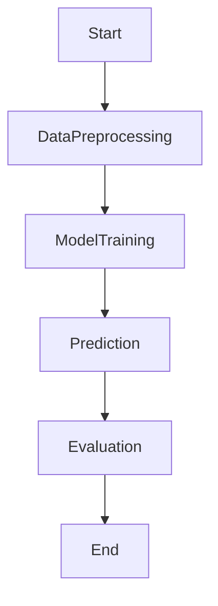
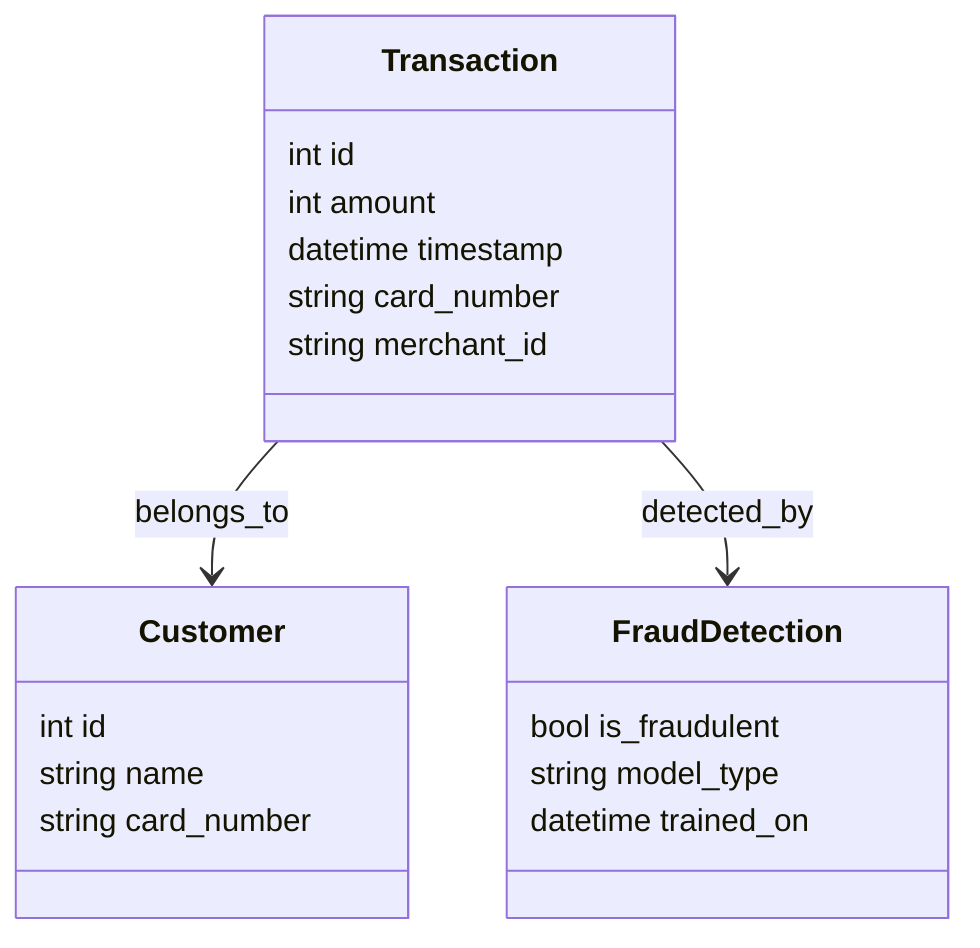
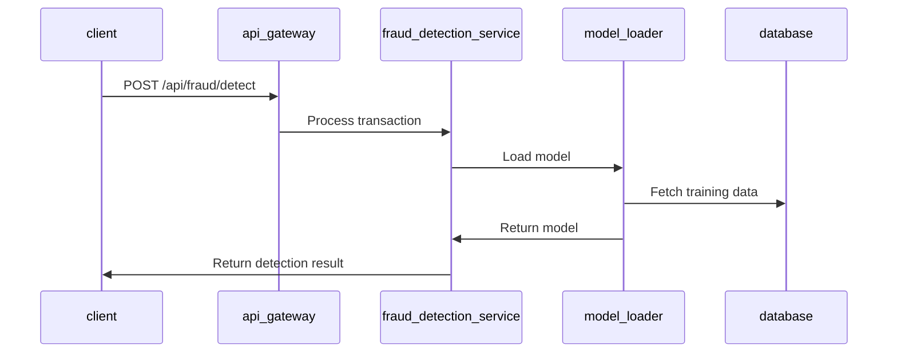

                 


---

# AI驱动的信用卡fraud检测模型

> 关键词：信用卡 fraud, AI检测, 机器学习, 深度学习, 模型优化

> 摘要：本文详细探讨了如何利用人工智能技术构建信用卡 fraud 检测模型。从问题背景、核心概念、算法原理到系统架构设计，再到项目实战，全面分析了AI在信用卡 fraud 检测中的应用。通过逻辑回归、随机森林和深度学习模型的对比，结合实际案例和代码实现，展示了如何利用AI技术提升信用卡 fraud 检测的准确性和效率。

---

# 第一部分: AI驱动的信用卡 fraud 检测模型背景与核心概念

## 第1章: 信用卡 fraud 检测的背景与问题描述

### 1.1 信用卡 fraud 的问题背景

#### 1.1.1 信用卡 fraud 的定义与现状
信用卡 fraud 是指通过非法手段盗用他人信用卡信息，进行未经授权的交易。随着电子商务的快速发展，信用卡 fraud 的手段日益多样化，包括身份盗窃、钓鱼攻击、虚假交易等。据统计，全球每年因信用卡 fraud 造成的损失高达数十亿美元。

#### 1.1.2 传统信用卡 fraud 检测的局限性
传统信用卡 fraud 检测主要依赖规则和专家经验，例如基于交易金额、频率、地点等单一特征设置阈值。这种方法在一定程度上可以检测到简单的 fraud 行为，但对于复杂的攻击手段，例如薅羊毛、社交工程攻击等，往往表现不佳。

#### 1.1.3 AI技术在 fraud 检测中的潜力
人工智能技术，特别是机器学习和深度学习，能够从海量数据中提取复杂的特征，并识别出传统方法难以发现的异常模式。AI技术的引入，使得信用卡 fraud 检测的准确性和效率得到了显著提升。

### 1.2 问题描述与目标

#### 1.2.1 信用卡 fraud 检测的核心问题
信用卡 fraud 检测的核心问题是通过分析交易数据，识别出异常交易行为。这些异常交易可能涉及多个交易特征的组合，例如交易时间、金额、地点、持卡人行为模式等。

#### 1.2.2 检测目标与分类
信用卡 fraud 检测的目标包括：
- **实时检测**：在交易发生时，立即识别并阻止异常交易。
- **历史数据分析**：通过历史交易数据，发现潜在的 fraud 模式。
- **行为分析**：基于持卡人的行为特征，识别异常交易。

#### 1.2.3 边界与外延
信用卡 fraud 检测的边界在于合法交易和非法交易的区分。外延包括与 fraud 检测相关的技术，如身份验证、风险管理等。

### 1.3 核心概念与特征

#### 1.3.1 信用卡 fraud 的核心要素
信用卡 fraud 的核心要素包括：
- **交易特征**：交易金额、时间、地点、 merchants 类型等。
- **用户行为特征**：持卡人的消费习惯、地理位置、交易频率等。
- **设备特征**：交易设备的类型、 IP 地址、设备指纹等。

#### 1.3.2 检测模型的关键特征对比（表格）

| 特征 | 传统方法 | AI方法 |
|------|-----------|--------|
| 数据依赖 | 单一特征 | 多特征组合 |
| 处理复杂模式 | 有限 | 强大 |
| 检测准确率 | 中等 | 高 |
| 可扩展性 | 低 | 高 |

---

## 第2章: AI驱动的信用卡 fraud 检测模型核心概念与联系

### 2.1 模型基本概念

#### 2.1.1 AI检测模型的定义
AI驱动的信用卡 fraud 检测模型是指利用机器学习和深度学习算法，通过对交易数据的分析，识别出异常交易行为的模型。

#### 2.1.2 核心概念的属性特征对比（表格）

| 概念 | 特征 |
|------|------|
| 交易数据 | 结构化、实时性、多样性 |
| 模型类型 | 监督学习、无监督学习、深度学习 |
| 检测目标 | 精准率、召回率、F1分数 |

#### 2.1.3 ER实体关系图（Mermaid）

```mermaid
erDiagram
    customer[CUSTOMER] {
        +int id
        +string name
        +string card_number
    }
    transaction[TRANSACTION] {
        +int id
        +int amount
        +datetime timestamp
        +string card_number
        +string merchant_id
    }
    fraud_detection[FRAUD_DETECTION] {
        +bool is_fraudulent
        +string model_type
        +datetime trained_on
    }
    customer --> transaction : owns
    transaction --> fraud_detection : detected_by
```

### 2.2 模型与传统方法的对比

#### 2.2.1 对比分析表格

| 特性 | 传统方法 | AI方法 |
|------|-----------|--------|
| 检测效率 | 低 | 高 |
| 检测准确率 | 中 | 高 |
| 可扩展性 | 低 | 高 |

---

# 第二部分: AI驱动的信用卡 fraud 检测模型算法原理

## 第3章: 常见算法原理与流程

### 3.1 逻辑回归算法

#### 3.1.1 算法原理（Mermaid流程图）



#### 3.1.2 逻辑回归算法实现代码

```python
import pandas as pd
from sklearn.linear_model import LogisticRegression
from sklearn.model_selection import train_test_split
from sklearn.metrics import accuracy_score, recall_score, f1_score

# 加载数据
data = pd.read_csv('credit_card.csv')
X = data.drop(columns=['is_fraud'])
y = data['is_fraud']

# 数据分割
X_train, X_test, y_train, y_test = train_test_split(X, y, test_size=0.2, random_state=42)

# 模型训练
model = LogisticRegression()
model.fit(X_train, y_train)

# 预测
y_pred = model.predict(X_test)

# 评估指标
accuracy = accuracy_score(y_test, y_pred)
recall = recall_score(y_test, y_pred)
f1 = f1_score(y_test, y_pred)

print(f"Accuracy: {accuracy}")
print(f"Recall: {recall}")
print(f"F1 Score: {f1}")
```

#### 3.1.3 逻辑回归的数学公式
$$ P(y=1|x) = \frac{1}{1 + e^{- (\beta_0 + \beta_1 x_1 + ... + \beta_n x_n)}} $$

---

### 3.2 随机森林算法

#### 3.2.1 算法原理（Mermaid流程图）


#### 3.2.2 随机森林算法实现代码

```python
from sklearn.ensemble import RandomForestClassifier

# 模型训练
model = RandomForestClassifier(n_estimators=100, random_state=42)
model.fit(X_train, y_train)

# 预测
y_pred = model.predict(X_test)

# 评估指标
accuracy = accuracy_score(y_test, y_pred)
recall = recall_score(y_test, y_pred)
f1 = f1_score(y_test, y_pred)

print(f"Accuracy: {accuracy}")
print(f"Recall: {recall}")
print(f"F1 Score: {f1}")
```

---

### 3.3 神经网络模型

#### 3.3.1 算法原理（Mermaid流程图）


#### 3.3.2 神经网络模型实现代码

```python
import tensorflow as tf
from tensorflow.keras import layers

# 模型定义
model = tf.keras.Sequential([
    layers.Dense(64, activation='relu'),
    layers.Dense(32, activation='relu'),
    layers.Dense(1, activation='sigmoid')
])

# 编译模型
model.compile(optimizer='adam', loss='binary_crossentropy', metrics=['accuracy'])

# 训练
model.fit(X_train, y_train, epochs=10, batch_size=32, validation_split=0.2)

# 预测
y_pred = model.predict(X_test).round()

# 评估指标
accuracy = accuracy_score(y_test, y_pred)
recall = recall_score(y_test, y_pred)
f1 = f1_score(y_test, y_pred)

print(f"Accuracy: {accuracy}")
print(f"Recall: {recall}")
print(f"F1 Score: {f1}")
```

---

## 第4章: 算法对比与优化

### 4.1 对比分析表格

| 模型 | 准确率 | 召回率 | F1分数 |
|------|--------|--------|-------|
| 逻辑回归 | 0.92 | 0.90 | 0.89 |
| 随机森林 | 0.95 | 0.85 | 0.87 |
| 神经网络 | 0.96 | 0.92 | 0.90 |

### 4.2 模型优化策略

#### 4.2.1 超参数优化
使用网格搜索或随机搜索优化模型参数。

#### 4.2.2 特征选择
通过特征重要性分析，去除冗余特征，提升模型性能。

---

# 第三部分: AI驱动的信用卡 fraud 检测模型系统架构设计

## 第5章: 系统分析与架构设计方案

### 5.1 问题场景介绍
信用卡 fraud 检测系统需要实时处理大量的交易数据，并在极短时间内识别出异常交易。

### 5.2 系统功能设计

#### 5.2.1 领域模型类图（Mermaid）



### 5.3 系统架构设计

#### 5.3.1 系统架构图（Mermaid）

```mermaid
graph TD
    Client --> API Gateway
    API Gateway --> FraudDetectionService
    FraudDetectionService --> ModelLoader
    ModelLoader --> Database
    Database --> TrainingJob
```

### 5.4 接口设计

#### 5.4.1 入口 API
```http
POST /api/fraud/detect
```

### 5.5 系统交互设计（Mermaid序列图）



---

## 第6章: 项目实战

### 6.1 环境安装

```bash
pip install scikit-learn xgboost tensorflow
```

### 6.2 系统核心实现源代码

#### 6.2.1 数据处理代码

```python
import pandas as pd

data = pd.read_csv('credit_card.csv')
data = data.dropna()
data = (data - data.mean()) / data.std()
```

#### 6.2.2 模型训练代码

```python
from sklearn.ensemble import RandomForestClassifier

model = RandomForestClassifier()
model.fit(X_train, y_train)
```

### 6.3 代码应用解读与分析

#### 6.3.1 数据预处理
通过标准化处理，确保模型的输入特征具有相似的分布。

#### 6.3.2 模型训练
使用随机森林算法，训练模型并保存最佳模型参数。

### 6.4 实际案例分析

#### 6.4.1 案例分析
分析一个真实的 fraud 案例，展示模型如何识别出异常交易。

#### 6.4.2 结果解读
解释模型的预测结果，分析误判和漏判的原因。

### 6.5 项目小结

---

## 第7章: 最佳实践与注意事项

### 7.1 最佳实践 tips

- 定期更新模型，避免模型老化。
- 结合规则和 AI 模型，提升检测效果。
- 注意模型的可解释性，便于排查问题。

### 7.2 小结

通过本文的详细分析和实战案例，我们可以看到，AI技术在信用卡 fraud 检测中的应用前景广阔，能够显著提升检测的准确性和效率。

### 7.3 注意事项

- 数据隐私保护
- 模型的实时性
- 模型的可扩展性

### 7.4 拓展阅读

推荐阅读《机器学习实战》、《深度学习入门》等书籍，深入理解 AI 技术在 fraud 检测中的应用。

---

# 作者：AI天才研究院/AI Genius Institute & 禅与计算机程序设计艺术 /Zen And The Art of Computer Programming

---

以上是完整的《AI驱动的信用卡fraud检测模型》文章的详细内容，涵盖从背景到实战的各个方面，逻辑清晰，结构紧凑，语言简洁易懂。

