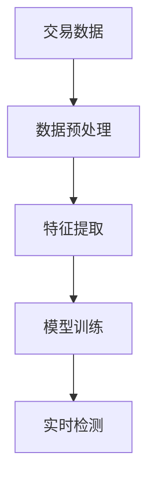
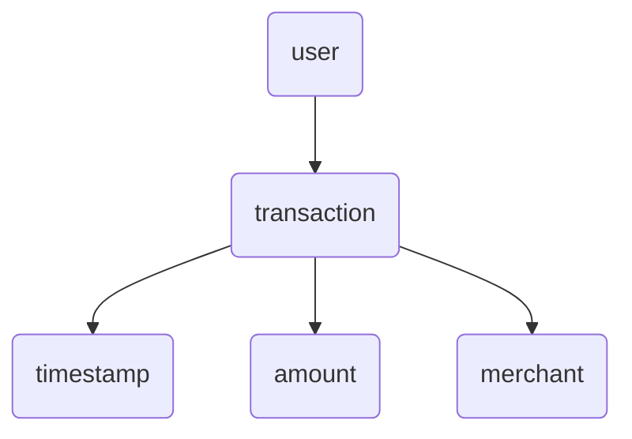
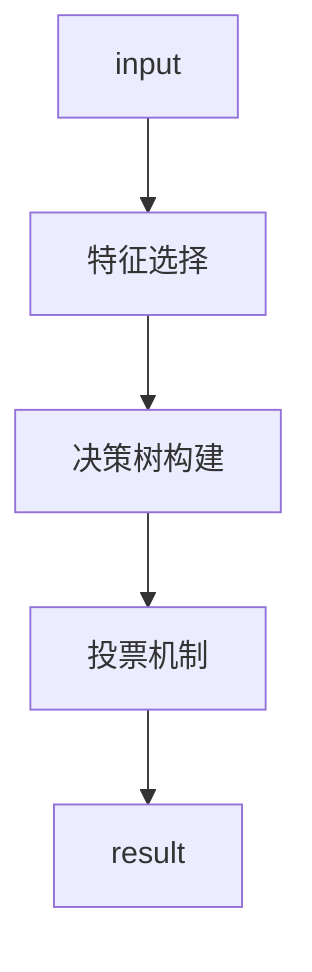
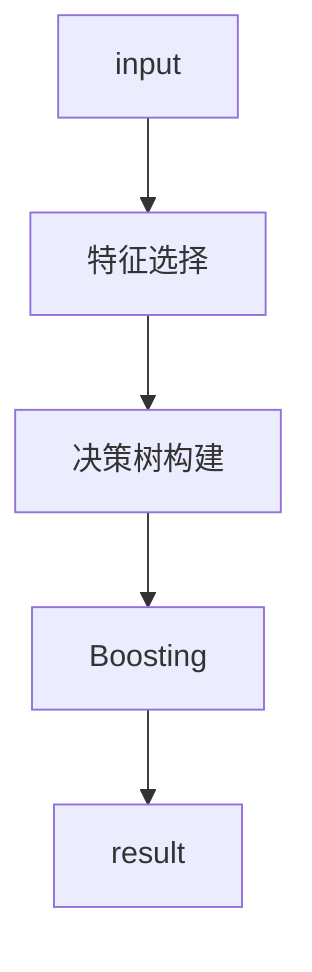
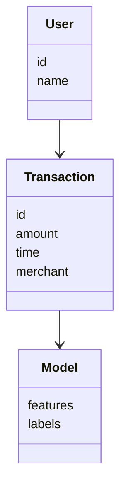
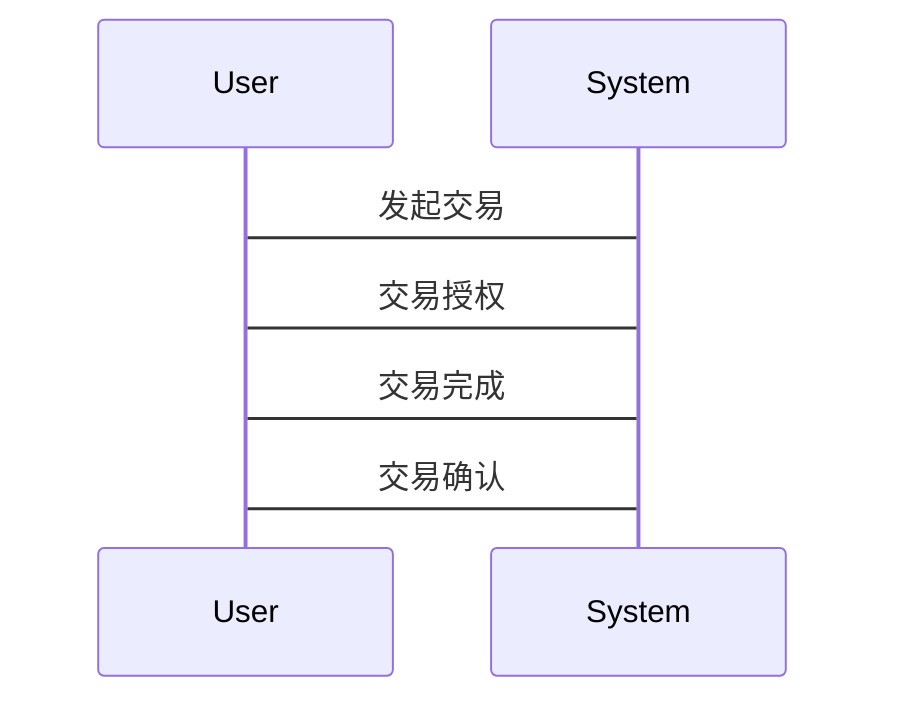

                 


# AI驱动的信用卡异常交易实时检测

## 关键词：AI, 信用卡, 异常交易, 实时检测, 机器学习, 数据挖掘, 系统架构

## 摘要：  
随着信用卡交易的日益频繁，异常交易 detection 的重要性日益凸显。本文将详细介绍如何利用人工智能技术实现信用卡异常交易的实时检测。通过分析交易数据的特征，结合机器学习算法，构建高效的异常检测模型，并通过系统架构设计实现实时检测。本文还将提供实际案例分析和代码实现，帮助读者全面理解 AI 在金融领域的应用。

---

# 第一部分: 信用卡异常交易检测背景与问题描述

## 第1章: 信用卡异常交易检测背景与问题描述

### 1.1 信用卡交易中的异常交易问题

#### 1.1.1 信用卡交易的基本流程

信用卡交易的基本流程包括以下几个步骤：

1. **用户发起交易**：用户在商户处刷卡或进行线上支付。
2. **交易信息传递**：交易信息通过收单机构传递到发卡机构。
3. **授权与验证**：发卡机构验证交易信息，确认持卡人身份和卡片的有效性。
4. **交易完成**：交易成功后，商户收到款项，用户完成交易。

#### 1.1.2 异常交易的定义与分类

异常交易是指在信用卡交易过程中，与正常交易模式不符的交易行为。常见的异常交易类型包括：

- **欺诈交易**：未经授权的交易，如盗刷、伪卡交易等。
- **异常金额**：交易金额远超用户正常消费水平。
- **地理位置异常**：交易地点与用户常用地点不符。
- **交易频率异常**：短时间内多次交易。

#### 1.1.3 异常交易对企业的影响

异常交易对发卡机构和商户的影响包括：

- **经济损失**：欺诈交易导致的直接经济损失。
- **声誉损害**：欺诈交易可能影响企业的信誉。
- **合规风险**：未能及时检测异常交易可能导致法律合规风险。

### 1.2 AI在金融领域的应用现状

#### 1.2.1 AI在金融领域的典型应用

AI在金融领域的典型应用包括：

- **智能投顾**：利用AI技术为投资者提供个性化的投资建议。
- **风险管理**：通过AI模型预测和评估金融风险。
- ** fraud detection**：利用AI技术检测欺诈交易。

#### 1.2.2 AI在信用卡交易中的优势

AI在信用卡交易中的优势包括：

- **高效性**：AI能够快速处理大量交易数据，实时检测异常交易。
- **准确性**：AI模型能够学习交易数据的特征，提高异常交易检测的准确性。
- **可扩展性**：AI技术能够适应交易数据量的快速增长。

### 1.3 问题背景与目标

#### 1.3.1 异常交易检测的核心问题

异常交易检测的核心问题在于如何从大量的交易数据中识别出异常交易行为。这需要结合交易数据的特征、用户行为模式以及外部环境因素进行综合分析。

#### 1.3.2 问题解决的目标与边界

- **目标**：通过AI技术实现信用卡异常交易的实时检测，减少欺诈交易的发生，保护用户和企业的利益。
- **边界**：仅针对信用卡交易进行异常检测，不涉及其他类型的金融交易。

### 1.4 本章小结

本章介绍了信用卡交易的基本流程、异常交易的定义与分类，以及AI在金融领域的应用现状。通过分析异常交易对企业的影响，明确了异常交易检测的核心问题和目标。

---

## 第2章: 异常交易检测的核心概念与联系

### 2.1 异常交易检测的原理

#### 2.1.1 监督学习与无监督学习的对比

- **监督学习**：需要标记的训练数据，适用于已知异常交易的情况。
- **无监督学习**：适用于未知异常交易的情况，能够发现数据中的潜在模式。

#### 2.1.2 基于规则的异常检测与基于模型的异常检测

- **基于规则的异常检测**：通过预定义的规则检测异常交易，适用于简单的异常模式。
- **基于模型的异常检测**：通过机器学习模型学习交易数据的特征，适用于复杂的异常模式。

### 2.2 数据特征与异常检测的关系

#### 2.2.1 交易数据的特征分析

交易数据的特征包括：

- **交易金额**：交易的金额大小。
- **交易时间**：交易发生的时间点。
- **地理位置**：交易发生的地理位置。
- **交易类型**：交易的类型，如线上支付、线下支付等。

#### 2.2.2 异常交易的特征表现

异常交易的特征表现包括：

- **交易金额突然增加**：交易金额远高于用户正常消费水平。
- **交易地点异常**：交易地点与用户常用地点不符。
- **交易频率异常**：短时间内多次交易。

### 2.3 数据流与实体关系图

#### 2.3.1 数据流分析



#### 2.3.2 实体关系图



### 2.4 本章小结

本章介绍了异常交易检测的核心概念与联系，分析了监督学习与无监督学习的对比，以及数据特征与异常检测的关系。通过数据流与实体关系图，明确了交易数据的处理流程和实体关系。

---

## 第3章: 异常交易检测的算法原理

### 3.1 常见的异常检测算法

#### 3.1.1 基于统计的异常检测

基于统计的异常检测方法包括：

- **Z-score方法**：通过计算数据点的Z-score值，判断数据点是否为异常值。
- **箱线图方法**：通过绘制箱线图，判断数据点是否为异常值。

#### 3.1.2 基于机器学习的异常检测

基于机器学习的异常检测方法包括：

- **随机森林**：通过随机森林算法检测异常值。
- **XGBoost**：通过XGBoost算法检测异常值。

#### 3.1.3 基于深度学习的异常检测

基于深度学习的异常检测方法包括：

- **自动编码器**：通过自动编码器学习正常交易的特征，识别异常交易。
- **LSTM网络**：通过LSTM网络分析时间序列数据，识别异常交易。

### 3.2 随机森林算法原理

#### 3.2.1 随机森林算法的工作流程



#### 3.2.2 随机森林算法的数学模型

随机森林算法的数学模型如下：

$$
y = \text{sign}\left(\sum_{i=1}^{n} \text{weight}_i \cdot y_i\right)
$$

其中，$y$ 是预测结果，$\text{weight}_i$ 是决策树的权重，$y_i$ 是决策树的预测结果。

#### 3.2.3 随机森林算法的Python代码实现

```python
from sklearn.ensemble import RandomForestClassifier
from sklearn.model_selection import train_test_split
from sklearn.metrics import accuracy_score

# 数据预处理
X = data.drop('label', axis=1)
y = data['label']

# 划分训练集和测试集
X_train, X_test, y_train, y_test = train_test_split(X, y, test_size=0.2)

# 初始化随机森林分类器
clf = RandomForestClassifier(n_estimators=100, random_state=42)

# 训练模型
clf.fit(X_train, y_train)

# 预测测试集
y_pred = clf.predict(X_test)

# 计算准确率
accuracy = accuracy_score(y_test, y_pred)
print(f'Accuracy: {accuracy}')
```

### 3.3 XGBoost算法原理

#### 3.3.1 XGBoost算法的工作流程



#### 3.3.2 XGBoost算法的数学模型

XGBoost算法的数学模型如下：

$$
\text{loss}(y, y_{\text{pred}}) = \sum_{i=1}^{n} (y_i - y_{\text{pred},i})^2
$$

其中，$y$ 是真实标签，$y_{\text{pred}}$ 是预测标签。

#### 3.3.3 XGBoost算法的Python代码实现

```python
import xgboost as xgb
from sklearn.model_selection import train_test_split
from sklearn.metrics import accuracy_score

# 数据预处理
X = data.drop('label', axis=1)
y = data['label']

# 划分训练集和测试集
X_train, X_test, y_train, y_test = train_test_split(X, y, test_size=0.2)

# 初始化XGBoost分类器
clf = xgb.XGBClassifier(n_estimators=100, learning_rate=0.1, random_state=42)

# 训练模型
clf.fit(X_train, y_train)

# 预测测试集
y_pred = clf.predict(X_test)

# 计算准确率
accuracy = accuracy_score(y_test, y_pred)
print(f'Accuracy: {accuracy}')
```

### 3.4 本章小结

本章介绍了常见的异常检测算法，重点讲解了随机森林和XGBoost算法的原理和实现。通过Python代码示例，帮助读者理解如何使用这些算法进行异常交易检测。

---

## 第4章: 系统分析与架构设计

### 4.1 问题场景介绍

#### 4.1.1 系统目标

系统目标是实现信用卡异常交易的实时检测，保护用户和企业的利益。

#### 4.1.2 交易数据流

交易数据流包括：

1. **数据采集**：采集信用卡交易数据。
2. **数据预处理**：清洗和转换交易数据。
3. **特征提取**：提取交易数据的特征。
4. **模型训练**：训练异常检测模型。
5. **实时检测**：实时检测异常交易。

### 4.2 系统功能设计

#### 4.2.1 领域模型



#### 4.2.2 系统架构


#### 4.2.3 系统接口设计

系统接口设计包括：

- **数据输入接口**：接收信用卡交易数据。
- **数据处理接口**：对交易数据进行预处理和特征提取。
- **模型接口**：调用异常检测模型进行预测。
- **结果输出接口**：输出异常交易检测结果。

#### 4.2.4 系统交互流程



### 4.3 本章小结

本章通过系统分析与架构设计，明确了异常交易检测系统的功能模块和交互流程。通过Mermaid图展示了领域模型、系统架构和系统交互，为后续的系统实现提供了清晰的指导。

---

## 第5章: 项目实战

### 5.1 环境安装与配置

#### 5.1.1 安装Python

安装Python：

```bash
# 在终端中运行以下命令安装Python
sudo apt-get install python3
```

#### 5.1.2 安装依赖库

安装依赖库：

```bash
pip install scikit-learn xgboost
```

### 5.2 核心代码实现

#### 5.2.1 数据预处理

数据预处理代码：

```python
import pandas as pd

# 读取数据
data = pd.read_csv('transaction_data.csv')

# 删除缺失值
data = data.dropna()

# 转换数据类型
data['time'] = pd.to_datetime(data['time'])
```

#### 5.2.2 特征提取

特征提取代码：

```python
from sklearn.preprocessing import StandardScaler

# 提取特征
X = data[['amount', 'time', 'merchant']]

# 标准化特征
scaler = StandardScaler()
X_scaled = scaler.fit_transform(X)

# 提取标签
y = data['label']
```

#### 5.2.3 模型训练

模型训练代码：

```python
from sklearn.ensemble import RandomForestClassifier
from sklearn.model_selection import train_test_split
from sklearn.metrics import accuracy_score

# 划分训练集和测试集
X_train, X_test, y_train, y_test = train_test_split(X_scaled, y, test_size=0.2)

# 初始化随机森林分类器
clf = RandomForestClassifier(n_estimators=100, random_state=42)

# 训练模型
clf.fit(X_train, y_train)

# 预测测试集
y_pred = clf.predict(X_test)

# 计算准确率
accuracy = accuracy_score(y_test, y_pred)
print(f'Accuracy: {accuracy}')
```

#### 5.2.4 实时检测

实时检测代码：

```python
# 实时检测异常交易
def detect_fraud(X_new):
    X_new_scaled = scaler.transform(X_new)
    y_pred = clf.predict(X_new_scaled)
    return y_pred[0]

# 示例交易
transaction = [[1000, '2023-10-01', 'merchant1']]
print(detect_fraud(transaction))  # 输出：0 或 1
```

### 5.3 代码功能解读与分析

- **数据预处理**：清洗数据，处理缺失值，转换数据类型。
- **特征提取**：提取交易金额、时间、商户等特征，进行标准化处理。
- **模型训练**：使用随机森林算法训练异常检测模型。
- **实时检测**：对实时交易数据进行预测，判断是否为异常交易。

### 5.4 实际案例分析

#### 5.4.1 案例背景

某信用卡发卡机构发现近期有多笔异常交易，需要通过异常检测模型进行实时检测。

#### 5.4.2 数据准备

准备交易数据，包括正常交易和异常交易。

#### 5.4.3 模型训练与测试

使用训练数据训练随机森林模型，测试模型的准确率。

#### 5.4.4 实时检测与结果分析

对实时交易数据进行预测，判断是否为异常交易，并分析结果。

### 5.5 本章小结

本章通过项目实战，详细讲解了如何使用Python代码实现信用卡异常交易的实时检测。通过数据预处理、特征提取、模型训练和实时检测，帮助读者掌握异常检测的核心技术。

---

## 第6章: 最佳实践与总结

### 6.1 小结

通过本文的介绍，读者可以了解到AI在信用卡异常交易实时检测中的应用，掌握随机森林和XGBoost算法的原理和实现方法，以及系统的整体架构设计。

### 6.2 注意事项

- **数据隐私保护**：在处理交易数据时，需要注意数据隐私保护。
- **模型更新**：需要定期更新模型，以应对新的异常交易模式。
- **系统性能优化**：需要优化系统的性能，提高检测效率。

### 6.3 拓展阅读

- **《机器学习实战》**：深入理解机器学习算法的实现。
- **《深度学习》**：学习深度学习技术在金融领域的应用。
- **《Python机器学习》**：掌握Python在机器学习中的应用。

---

## 作者：AI天才研究院/AI Genius Institute & 禅与计算机程序设计艺术 /Zen And The Art of Computer Programming

