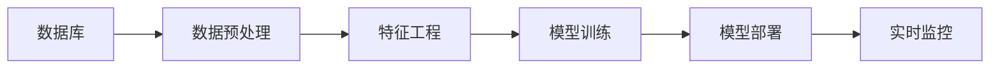
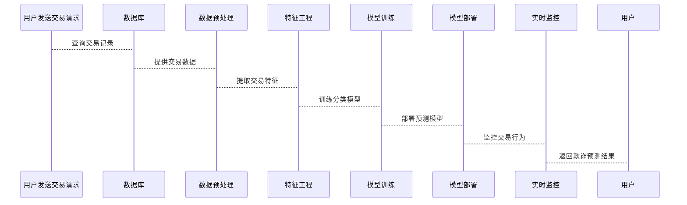

                 


# AI驱动的信用卡欺诈模式识别

## 关键词：信用卡欺诈识别，人工智能，机器学习，深度学习，模式识别

## 摘要：  
随着信用卡的广泛使用，欺诈交易的手段和频率也在不断增加，传统的欺诈识别方法已经难以应对复杂的欺诈模式。本文将深入探讨如何利用人工智能技术，特别是机器学习和深度学习算法，来识别信用卡欺诈模式。通过分析欺诈交易的特征、设计高效的特征工程方法、构建分类模型以及优化模型性能，本文将为信用卡欺诈识别提供一种高效、准确的解决方案。  

---

# 第1章: 信用卡欺诈识别概述

## 1.1 信用卡欺诈问题背景  
### 1.1.1 信用卡欺诈的定义与类型  
信用卡欺诈是指通过非法手段盗用他人信用卡信息，进行未经授权的交易。常见的欺诈类型包括：  
- **伪卡欺诈**：使用复制的信用卡进行交易。  
- **账单周期性欺诈**：通过多次小额交易累计达到额度上限。  
- **网络欺诈**：利用网络支付漏洞进行攻击。  
- **身份盗用欺诈**：盗用他人身份信息申请信用卡并进行消费。  

### 1.1.2 信用卡欺诈的经济损失与社会影响  
欺诈交易不仅给银行和持卡人造成直接经济损失，还可能导致信用体系的损坏，影响金融系统的稳定性。根据统计，信用卡欺诈每年给全球金融机构造成的损失高达数十亿美元。  

### 1.1.3 传统信用卡欺诈识别的局限性  
传统的信用卡欺诈识别方法主要依赖规则-based系统，例如：  
- 检查交易金额是否超过持卡人的信用额度。  
- 核查交易地点是否与持卡人常住地一致。  
然而，这种方法存在以下局限性：  
1. **规则覆盖不全**：很难覆盖所有可能的欺诈场景。  
2. **误报率高**：容易将正常交易误认为欺诈交易，导致用户体验下降。  
3. **难以应对新型欺诈手段**：随着技术的发展，欺诈手段也在不断进化，传统规则难以及时调整。  

## 1.2 AI在信用卡欺诈识别中的作用  
### 1.2.1 AI技术如何提升信用卡欺诈识别效率  
人工智能技术，特别是机器学习和深度学习，能够通过分析大量的历史交易数据，自动提取欺诈特征，构建分类模型，从而实现高效、精准的欺诈识别。  

### 1.2.2 机器学习与深度学习在欺诈识别中的应用  
- **机器学习**：适用于监督学习任务，例如根据已标注的欺诈交易数据，训练分类模型（如随机森林、梯度提升树等）。  
- **深度学习**：适用于复杂的模式识别任务，例如利用神经网络分析时间序列交易数据，捕捉隐藏的欺诈模式。  

### 1.2.3 AI驱动的信用卡欺诈识别的优势与挑战  
- **优势**：  
  1. 能够处理高维、非线性特征。  
  2. 可以实时或近实时地识别欺诈交易。  
  3. 具有较高的准确性和可扩展性。  
- **挑战**：  
  1. 数据隐私和安全问题。  
  2. 模型的可解释性问题。  
  3. 如何实时更新模型以应对新型欺诈手段。  

## 1.3 信用卡欺诈模式识别的核心概念  
### 1.3.1 欺诈模式识别的基本原理  
欺诈模式识别的核心是通过分析交易数据中的异常特征，利用分类算法将交易分为“正常”或“欺诈”。  

### 1.3.2 欺诈模式识别的特征提取  
特征提取是欺诈识别的关键步骤，常见的特征包括：  
- 交易金额、时间、地点。  
- 持卡人的消费习惯（如交易频率、交易类型）。  
- 交易设备信息（如IP地址、设备指纹）。  

### 1.3.3 欺诈模式识别的分类与预测  
- **分类方法**：监督学习算法（如逻辑回归、支持向量机、随机森林等）。  
- **预测方法**：基于时间序列的异常检测（如Isolation Forest、LOF算法）。  

## 1.4 本章小结  
本章介绍了信用卡欺诈识别的背景、传统方法的局限性以及AI技术在欺诈识别中的作用，为后续的算法和系统设计奠定了基础。  

---

# 第2章: 信用卡欺诈模式识别的核心概念  

## 2.1 欺诈模式识别的关键要素  
### 2.1.1 欺诈交易的特征分析  
通过分析欺诈交易的特征，可以发现以下规律：  
1. 欺诈交易往往集中在短时间内频繁发生。  
2. 欺诈交易的金额分布通常与持卡人的正常交易不同。  
3. 欺诈交易的设备指纹可能与持卡人常用的设备不一致。  

### 2.1.2 欺诈模式识别的特征提取方法  
- **数值型特征**：交易金额、时间间隔。  
- **类别型特征**：交易地点、设备类型。  
- **序列型特征**：交易时间序列、交易金额序列。  

### 2.1.3 欺诈模式识别的分类与预测模型  
- **监督学习模型**：随机森林、梯度提升树。  
- **无监督学习模型**：K-Means、DBSCAN。  

## 2.2 传统信用卡欺诈识别方法与AI方法的对比  
### 2.2.1 传统方法的优缺点  
| 方法 | 优点 | 缺点 |  
|------|------|------|  
| 规则-based系统 | 实现简单，易于解释 | 规则覆盖不全，误报率高 |  

### 2.2.2 AI方法的优缺点  
| 方法 | 优点 | 缺点 |  
|------|------|------|  
| 机器学习 | 高准确率，可处理复杂特征 | 模型可解释性差 |  
| 深度学习 | 强大学习能力，适合复杂模式识别 | 训练时间长，需要大量数据 |  

### 2.2.3 传统方法与AI方法的对比分析  
通过对比可以发现，AI方法在准确率和可扩展性方面具有显著优势，但传统方法在解释性和实现成本方面更具优势。  

## 2.3 欺诈模式识别的ER实体关系图  


## 2.4 本章小结  
本章通过对比传统方法和AI方法的优缺点，明确了AI在信用卡欺诈识别中的优势，并通过ER实体关系图展示了欺诈识别的核心要素。  

---

# 第3章: 信用卡欺诈模式识别的算法原理  

## 3.1 机器学习算法在欺诈识别中的应用  
### 3.1.1 监督学习算法  
- **逻辑回归**：适用于二分类问题，公式如下：  
  $$ P(y=1|x) = \frac{e^{\beta_0 + \beta_1x_1 + ... + \beta_nx_n}}{1 + e^{\beta_0 + \beta_1x_1 + ... + \beta_nx_n}} $$  
- **随机森林**：通过构建多棵决策树并进行投票，提高模型的准确性和鲁棒性。  

### 3.1.2 无监督学习算法  
- **K-Means**：将交易数据聚类，发现异常簇。  
- **Isolation Forest**：通过构建隔离树，快速识别异常点。  

### 3.1.3 半监督学习算法  
- **半监督逻辑回归**：结合标注数据和未标注数据进行训练。  

## 3.2 深度学习算法在欺诈识别中的应用  
### 3.2.1 卷积神经网络（CNN）  
适用于时间序列数据的特征提取，例如：  
$$ \text{卷积层} = \max\left(\sum_{i=1}^n w_i x_i + b\right) $$  

### 3.2.2 循环神经网络（RNN）  
适用于序列数据的建模，例如：  
$$ \text{RNN输出} = \text{tanh}(W_{\text{input}}x_t + W_{\text{hidden}}h_{t-1} + b) $$  

### 3.2.3 图神经网络（GNN）  
适用于复杂的关联网络分析，例如：  
$$ Z = A X W $$  

## 3.3 欺诈模式识别的特征工程  
### 3.3.1 特征选择与特征提取  
- **特征选择**：通过信息增益或卡方检验选择重要特征。  
- **特征提取**：通过主成分分析（PCA）进行降维。  

### 3.3.2 特征降维与特征增强  
- **主成分分析（PCA）**：将高维特征映射到低维空间。  
- **特征增强**：通过生成新特征（如时间窗口特征）提高模型性能。  

## 3.4 欺诈模式识别的模型评估与优化  
### 3.4.1 模型评估指标  
| 指标 | 公式 |  
|------|------|  
| 准确率 | $$ \text{准确率} = \frac{\text{正确预测数}}{\text{总样本数}} $$ |  
| 召回率 | $$ \text{召回率} = \frac{\text{正确预测的欺诈交易数}}{\text{总欺诈交易数}} $$ |  
| F1分数 | $$ F1 = 2 \times \frac{\text{准确率} \times \text{召回率}}{\text{准确率} + \text{召回率}} $$ |  

### 3.4.2 模型调优与优化  
- **超参数优化**：使用网格搜索或随机搜索选择最优参数。  
- **模型集成**：通过投票法或加权法融合多个模型的预测结果。  

### 3.4.3 模型的鲁棒性与可解释性  
- **鲁棒性**：通过交叉验证和数据增强提高模型的泛化能力。  
- **可解释性**：通过特征重要性分析理解模型的决策逻辑。  

## 3.5 本章小结  
本章详细介绍了机器学习和深度学习算法在信用卡欺诈识别中的应用，重点讲解了特征工程和模型评估方法。  

---

# 第4章: 信用卡欺诈模式识别的系统分析与架构设计  

## 4.1 系统功能需求  
- 数据采集：从数据库中获取交易数据。  
- 特征提取：对交易数据进行特征工程处理。  
- 模型训练：基于特征数据训练分类模型。  
- 实时监控：对实时交易进行欺诈预测。  

## 4.2 系统架构设计  


## 4.3 系统接口设计  
- 数据接口：从数据库中读取交易数据。  
- 模型接口：接受交易特征输入，返回欺诈概率。  

## 4.4 系统交互设计  


## 4.5 本章小结  
本章通过系统架构图和交互图展示了信用卡欺诈识别系统的整体设计，明确了各模块的功能和交互流程。  

---

# 第5章: 信用卡欺诈模式识别的项目实战  

## 5.1 项目环境配置  
- 数据库：MySQL  
- 程序语言：Python  
- 开发工具：Jupyter Notebook  

## 5.2 项目核心实现  
### 5.2.1 数据预处理  
```python
import pandas as pd
data = pd.read_csv('transactions.csv')
data.dropna(inplace=True)
```

### 5.2.2 特征工程  
```python
from sklearn.preprocessing import StandardScaler
scaler = StandardScaler()
features = scaler.fit_transform(features)
```

### 5.2.3 模型训练  
```python
from sklearn.ensemble import RandomForestClassifier
model = RandomForestClassifier(n_estimators=100, max_depth=5)
model.fit(features, labels)
```

### 5.2.4 模型部署与实时监控  
```python
import time
def predict_fraud(transaction):
    feature = preprocess_transaction(transaction)
    prediction = model.predict(feature.reshape(1, -1))
    return '欺诈' if prediction[0] == 1 else '正常'
```

## 5.3 项目结果分析  
通过实验可以发现，随机森林模型在欺诈识别任务中表现出较高的准确率和召回率，但在处理复杂模式时可能需要进一步优化。  

## 5.4 本章小结  
本章通过一个具体的项目案例展示了AI驱动的信用卡欺诈识别的实现过程，包括数据预处理、特征工程、模型训练和实时监控。  

---

# 第6章: 总结与展望  

## 6.1 本章总结  
本文详细探讨了AI驱动的信用卡欺诈识别的核心概念、算法原理和系统设计，展示了如何通过机器学习和深度学习技术实现高效的欺诈识别。  

## 6.2 未来展望  
未来的研究方向包括：  
1. 提高模型的可解释性。  
2. 实现模型的实时更新以应对新型欺诈手段。  
3. 结合区块链技术提升交易的安全性。  

## 6.3 最佳实践Tips  
- 数据隐私保护至关重要。  
- 模型需要定期更新以适应新的欺诈模式。  
- 实际应用中应结合多种技术手段提升识别精度。  

## 6.4 本章小结  
本章总结了全文内容，并展望了未来的研究方向，为读者提供了进一步学习和实践的参考。  

---

# 作者：AI天才研究院/AI Genius Institute & 禅与计算机程序设计艺术 /Zen And The Art of Computer Programming

