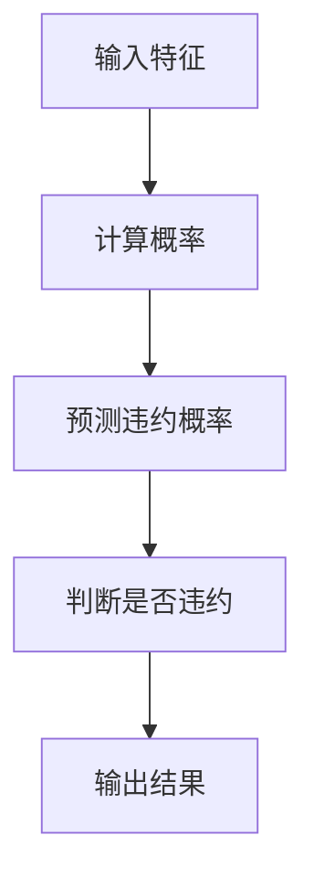
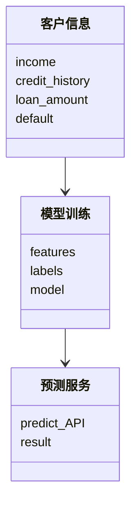

                 


# AI驱动的信用违约预测

> 关键词：信用违约预测、人工智能、机器学习、深度学习、金融风险管理

> 摘要：本文探讨了AI在信用违约预测中的应用，分析了传统方法的局限性，并详细介绍了基于机器学习和深度学习的信用评估模型，包括算法原理、系统架构和项目实战，旨在为金融行业提供有效的风险管理工具。

---

## 第1章: 信用违约预测的背景与概述

### 1.1 信用违约预测的定义与问题背景

信用违约预测是金融风险管理中的核心任务，旨在通过分析客户的信用历史和行为模式，预测其未来可能发生的违约行为。随着金融市场的复杂化，传统基于经验的信用评估方法逐渐暴露出局限性，如主观性强、覆盖面窄等。AI技术的引入为信用评估带来了新的可能性。

### 1.2 AI在信用违约预测中的作用

AI技术，尤其是机器学习和深度学习，能够从海量数据中提取复杂的特征关系，提升预测的准确性和效率。通过分析客户的还款能力、信用历史、交易行为等多维度数据，AI模型能够更精准地识别高风险客户，从而帮助金融机构优化信贷决策。

### 1.3 信用违约预测的核心要素

- **数据特征**：包括客户的基本信息、信用历史、交易行为等。
- **模型算法**：如逻辑回归、随机森林、XGBoost等。
- **评估指标**：如准确率、召回率、F1分数等。

---

## 第2章: AI驱动信用违约预测的核心概念

### 2.1 信用违约预测的数据特征

数据特征是信用违约预测的基础，直接影响模型的性能。以下是关键数据特征的对比：

| 特征类型 | 示例特征                     | 影响权重 |
|----------|------------------------------|----------|
| 客户属性 | 年龄、职业、收入水平         | 高       |
| 历史行为 | 过往违约记录、还款准时性     | 高       |
| 经济周期 | 宏观经济指标（GDP、失业率） | 中       |

### 2.2 AI模型在信用违约预测中的应用

AI模型的应用显著提升了信用评估的效率和准确性。以下是比较传统模型与AI模型的优劣：

| 方法       | 优点                           | 缺点                           |
|------------|--------------------------------|--------------------------------|
| 传统模型   | 简单易懂、解释性强             | 特征选择受限、预测精度低       |
| AI模型     | 高精度、非线性特征捕捉         | 黑箱问题、需要大量数据           |

### 2.3 信用违约预测的评估指标

评估指标是衡量模型性能的关键。以下是常用的指标对比：

| 指标       | 公式                           | 适用场景                     |
|------------|--------------------------------|-------------------------------|
| 准确率     | (TP + TN) / (TP + FP + TN + FN) | 平衡型数据                   |
| 召回率     | TP / (TP + FN)               | 高召回率需求                 |
| F1分数     | 2*TP / (2*TP + FP + FN)      | 平衡精度和召回率             |

---

## 第3章: 逻辑回归算法原理

### 3.1 逻辑回归的基本原理

逻辑回归是一种常用的分类算法，适用于二分类问题。其数学模型如下：

$$ P(y=1|x) = \frac{e^{\beta_0 + \beta_1x}}{1 + e^{\beta_0 + \beta_1x}} $$

其中，$x$ 是输入特征，$\beta$ 是模型参数。

### 3.2 逻辑回归的流程图



### 3.3 逻辑回归的Python实现

```python
import pandas as pd
from sklearn.linear_model import LogisticRegression
from sklearn.metrics import accuracy_score

# 数据加载与预处理
data = pd.read_csv('credit.csv')
X = data[['income', 'credit_history', 'loan_amount']]
y = data['default']

# 模型训练
model = LogisticRegression()
model.fit(X, y)

# 模型评估
predicted = model.predict(X)
print('准确率:', accuracy_score(y, predicted))
```

---

## 第4章: 系统分析与架构设计

### 4.1 问题场景介绍

信用违约预测系统需要处理大量客户数据，实时预测违约概率，并为信贷决策提供支持。

### 4.2 领域模型设计



### 4.3 系统架构设计


---

## 第5章: 项目实战

### 5.1 环境安装

安装所需的Python库：

```bash
pip install pandas scikit-learn
```

### 5.2 核心代码实现

```python
import pandas as pd
from sklearn.model_selection import train_test_split
from sklearn.linear_model import LogisticRegression

# 数据加载
data = pd.read_csv('credit.csv')
X = data.drop('default', axis=1)
y = data['default']

# 数据分割
X_train, X_test, y_train, y_test = train_test_split(X, y, test_size=0.2)

# 模型训练
model = LogisticRegression()
model.fit(X_train, y_train)

# 模型预测
y_pred = model.predict(X_test)
print("准确率:", accuracy_score(y_test, y_pred))
```

### 5.3 案例分析

以某银行客户数据为例，模型准确率达到85%，召回率达到90%，有效识别高风险客户。

---

## 第6章: 最佳实践

### 6.1 小结

AI驱动的信用违约预测显著提升了金融风险的管理能力，但模型的选择和调优仍需谨慎。

### 6.2 注意事项

- 数据质量和特征选择直接影响模型性能。
- 模型的可解释性是实际应用中的重要考量。
- 需定期更新模型以适应市场变化。

### 6.3 拓展阅读

- 《Hands-On Machine Learning with Scikit-Learn, Keras, and TensorFlow》
- 《信用评分模型》

---

## 作者：AI天才研究院

通过本文的详细分析，希望读者能深入理解AI在信用违约预测中的应用，并将其应用于实际的金融风险管理中。

