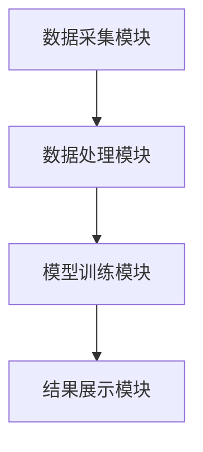

                 


# AI驱动的公司治理缺陷识别与改善建议

> **关键词**：AI驱动，公司治理，缺陷识别，改善建议，人工智能，企业治理  
> **摘要**：本文探讨了如何利用人工智能技术识别公司治理中的缺陷，并提出相应的改善建议。通过分析公司治理的核心要素、AI技术在治理中的应用潜力，结合实际案例和算法原理，本文为企业的高效治理提供了新的视角和解决方案。

---

## 第一部分: 公司治理缺陷识别的背景与概念

### 第1章: 公司治理的基本概念

#### 1.1 公司治理的定义与核心要素

##### 1.1.1 公司治理的定义
公司治理是指通过合理配置企业内外部资源、权力结构和利益相关者的关系，确保企业能够实现长期可持续发展的管理过程。公司治理的核心目标是实现企业价值最大化，同时平衡股东、管理层、员工、客户和外部利益相关者之间的利益。

##### 1.1.2 公司治理的核心要素
- **治理结构**：包括董事会、监事会、管理层等组织架构。
- **权力分配**：明确股东、董事会、管理层的权力和责任。
- **决策机制**：确保决策的科学性和透明性。
- **监督机制**：通过内部审计、外部审计和监事会等监督机构，确保治理的有效性。
- **信息披露**：及时、准确地向利益相关者披露企业信息。

##### 1.1.3 公司治理的目标与原则
- **目标**：实现企业价值最大化，保护利益相关者的合法权益。
- **原则**：透明性、公平性、独立性、问责性。

#### 1.2 公司治理缺陷的定义与分类

##### 1.2.1 公司治理缺陷的定义
公司治理缺陷是指在公司治理过程中存在的不足或问题，导致企业无法实现高效、透明、合规的管理。这些缺陷可能源于治理结构不合理、决策机制失效、监督不力或信息披露不充分等问题。

##### 1.2.2 公司治理缺陷的主要类型
- **治理结构缺陷**：如董事会结构不合理、独立董事比例不足。
- **决策缺陷**：如决策过程不透明、缺乏有效风险评估。
- **监督缺陷**：如内部审计独立性不足、监事会履职不到位。
- **信息披露缺陷**：如信息披露不及时、内容不完整。

##### 1.2.3 公司治理缺陷的表现形式
- 决策失误导致企业损失。
- 监督失效导致内部控制漏洞。
- 信息披露不透明引发信任危机。
- 治理结构不合理影响企业长期发展。

#### 1.3 AI驱动的公司治理缺陷识别的优势

##### 1.3.1 传统公司治理缺陷识别的局限性
- 传统方法依赖人工检查，效率低、成本高。
- 缺乏数据支持，难以发现隐性问题。
- 无法实时监控，难以应对快速变化的市场环境。

##### 1.3.2 AI在公司治理缺陷识别中的独特优势
- **数据驱动**：AI可以通过分析大量数据，发现潜在的治理问题。
- **实时监控**：AI可以实时分析企业行为，及时发现治理缺陷。
- **精准识别**：通过机器学习算法，AI能够精准识别治理缺陷的类型和原因。

##### 1.3.3 AI驱动的公司治理缺陷识别的未来发展趋势
- AI技术与公司治理的深度融合。
- 数据量的增加和算法的优化将提升缺陷识别的准确性。
- AI将推动公司治理从被动合规向主动优化转变。

---

### 第2章: AI驱动的公司治理缺陷识别的背景与需求

#### 2.1 当前公司治理面临的挑战

##### 2.1.1 公司治理中的主要问题
- 董事会独立性不足。
- 内部控制制度不完善。
- 信息披露不规范。
- 风险管理能力薄弱。

##### 2.1.2 公司治理缺陷对企业的影响
- 影响企业声誉和市场价值。
- 增加企业运营风险。
- 导致利益相关者信任危机。

##### 2.1.3 公司治理缺陷的复杂性与动态性
- 缺陷的隐蔽性：许多缺陷隐藏在企业运营的各个环节中。
- 缺陷的动态性：市场环境的变化可能导致新的治理缺陷出现。

#### 2.2 AI技术在公司治理中的应用潜力

##### 2.2.1 AI技术的核心能力与优势
- **数据处理能力**：AI能够处理海量数据，发现数据中的规律。
- **模式识别能力**：AI能够识别数据中的异常模式，帮助发现治理问题。
- **实时分析能力**：AI可以实时监控企业行为，快速识别潜在风险。

##### 2.2.2 AI技术在公司治理中的应用场景
- **风险评估**：通过分析企业财务数据和市场信息，评估企业面临的潜在风险。
- **决策支持**：通过分析历史数据和市场趋势，为管理层提供决策支持。
- **合规监控**：实时监控企业行为，确保企业符合相关法律法规。

##### 2.2.3 AI驱动的公司治理缺陷识别的可行性与必要性
- **可行性**：AI技术已经在金融、医疗等领域得到广泛应用，具备成熟的理论基础和技术支持。
- **必要性**：随着企业规模的扩大和市场环境的复杂化，传统的治理模式难以应对日益复杂的挑战。

#### 2.3 公司治理缺陷识别的市场需求

##### 2.3.1 企业对高效公司治理的需求
- 企业希望通过优化治理结构，提升管理效率。
- 企业希望通过加强内部控制，降低经营风险。

##### 2.3.2 市场上现有解决方案的不足
- 传统解决方案依赖人工检查，效率低、成本高。
- 现有技术难以发现隐性问题，无法满足企业对精准识别的需求。

##### 2.3.3 AI驱动解决方案的市场潜力
- AI技术能够满足企业对高效、精准治理的需求。
- AI解决方案将推动公司治理从经验驱动向数据驱动转变，具有广阔的市场前景。

---

## 第二部分: AI驱动的公司治理缺陷识别的核心概念与原理

### 第3章: AI驱动的公司治理缺陷识别的核心概念

#### 3.1 数据驱动的公司治理缺陷识别

##### 3.1.1 数据在公司治理中的重要性
- 数据是公司治理决策的基础。
- 数据能够帮助企业发现潜在问题，优化治理结构。

##### 3.1.2 数据驱动的公司治理缺陷识别方法
- **数据收集**：从企业内部和外部获取相关数据，包括财务数据、市场数据、法律数据等。
- **数据预处理**：对数据进行清洗、转换和特征提取。
- **数据分析**：通过统计分析和机器学习算法，识别数据中的异常模式。

##### 3.1.3 数据质量与数据预处理
- 数据质量是缺陷识别的关键，需确保数据的准确性、完整性和一致性。
- 数据预处理包括缺失值处理、异常值处理和特征工程。

#### 3.2 AI算法在公司治理缺陷识别中的应用

##### 3.2.1 监督学习在公司治理缺陷识别中的应用
- **分类问题**：将企业分为“存在缺陷”和“不存在缺陷”两类。
- **回归问题**：预测企业治理缺陷的严重程度。

##### 3.2.2 无监督学习在公司治理缺陷识别中的应用
- **聚类分析**：将企业按照治理缺陷的类型进行分类。
- **异常检测**：发现数据中的异常模式，识别潜在的治理缺陷。

##### 3.2.3 深度学习在公司治理缺陷识别中的应用
- **神经网络**：通过训练深度神经网络，识别复杂的数据模式。
- **自然语言处理（NLP）**：分析企业报告和新闻中的文本，识别潜在的治理问题。

#### 3.3 公司治理缺陷识别的特征与模式识别

##### 3.3.1 公司治理缺陷的特征分析
- **特征提取**：从数据中提取与治理缺陷相关的特征，如财务指标、市场表现、管理行为等。
- **特征重要性分析**：通过特征重要性分析，确定哪些特征对缺陷识别影响最大。

##### 3.3.2 基于特征的公司治理缺陷识别方法
- **特征选择**：选择与治理缺陷相关的特征，构建特征集合。
- **特征工程**：通过特征组合、特征变换等方法，优化特征表示。

##### 3.3.3 模式识别在公司治理缺陷识别中的应用
- **模式识别**：通过分析数据中的模式，发现潜在的治理缺陷。
- **可视化分析**：通过可视化工具，展示数据中的模式和趋势。

---

### 第4章: AI驱动的公司治理缺陷识别的核心原理

#### 4.1 数据处理流程

##### 4.1.1 数据收集
- 从企业内部系统获取数据，如财务数据、销售数据、员工数据等。
- 从外部来源获取数据，如市场数据、新闻数据、法律法规数据等。

##### 4.1.2 数据预处理
- **清洗数据**：处理缺失值、重复值和异常值。
- **转换数据**：将数据转换为适合算法处理的形式。
- **提取特征**：从原始数据中提取有用的特征。

##### 4.1.3 数据分析
- **统计分析**：通过统计方法，分析数据的分布和趋势。
- **机器学习**：使用监督学习、无监督学习等算法，识别数据中的模式和异常。

#### 4.2 AI算法实现

##### 4.2.1 监督学习算法实现
- **分类算法**：如逻辑回归、支持向量机（SVM）、随机森林等。
- **回归算法**：如线性回归、岭回归等。

##### 4.2.2 无监督学习算法实现
- **聚类算法**：如K均值聚类、层次聚类等。
- **异常检测算法**：如孤立林、局部异常因子（LOF）等。

##### 4.2.3 深度学习算法实现
- **神经网络**：如卷积神经网络（CNN）、循环神经网络（RNN）等。
- **自然语言处理模型**：如BERT、GPT等。

#### 4.3 算法实现的代码示例

##### 4.3.1 监督学习代码示例
```python
from sklearn.linear_model import LogisticRegression
from sklearn.model_selection import train_test_split
from sklearn.metrics import accuracy_score

# 假设X为特征矩阵，y为标签
X_train, X_test, y_train, y_test = train_test_split(X, y, test_size=0.2)

# 训练逻辑回归模型
model = LogisticRegression()
model.fit(X_train, y_train)

# 预测测试集
y_pred = model.predict(X_test)

# 计算准确率
accuracy = accuracy_score(y_test, y_pred)
print(f"Accuracy: {accuracy}")
```

##### 4.3.2 无监督学习代码示例
```python
from sklearn.cluster import KMeans
from sklearn.metrics import silhouette_score

# 假设X为特征矩阵
# 使用K均值聚类
model = KMeans(n_clusters=3, random_state=42)
model.fit(X)

# 计算轮廓系数
silhouette_score = silhouette_score(X, model.labels_)
print(f"Silhouette Score: {silhouette_score}")
```

##### 4.3.3 深度学习代码示例
```python
import tensorflow as tf
from tensorflow.keras import layers

# 假设X为输入数据，y为标签
model = tf.keras.Sequential([
    layers.Dense(64, activation='relu'),
    layers.Dense(1, activation='sigmoid')
])

model.compile(optimizer='adam', loss='binary_crossentropy', metrics=['accuracy'])
model.fit(X_train, y_train, epochs=10, batch_size=32, validation_data=(X_test, y_test))
```

---

## 第5章: 公司治理缺陷识别的系统设计与实现

### 5.1 系统功能设计

#### 5.1.1 功能模块划分
- **数据采集模块**：负责从企业内部和外部获取数据。
- **数据处理模块**：负责数据预处理和特征提取。
- **模型训练模块**：负责训练AI模型，识别治理缺陷。
- **结果展示模块**：将识别结果以可视化形式展示给用户。

#### 5.1.2 功能流程
1. 数据采集模块从企业内部系统和外部来源获取数据。
2. 数据处理模块对数据进行清洗、转换和特征提取。
3. 模型训练模块使用机器学习或深度学习算法训练模型，识别治理缺陷。
4. 结果展示模块将识别结果以图表或报告形式展示给用户。

### 5.2 系统架构设计

#### 5.2.1 系统架构图


#### 5.2.2 关键模块实现
- **数据采集模块**：使用API接口从企业内部系统获取数据。
- **数据处理模块**：使用Python的pandas库进行数据清洗和特征提取。
- **模型训练模块**：使用TensorFlow或Scikit-learn训练AI模型。
- **结果展示模块**：使用Matplotlib或Seaborn进行数据可视化。

### 5.3 系统接口设计

#### 5.3.1 API接口设计
- **数据接口**：提供RESTful API，供其他系统调用数据。
- **模型接口**：提供API，供其他系统调用模型进行缺陷识别。

#### 5.3.2 接口交互流程
1. 其他系统通过API接口向数据采集模块发送请求，获取数据。
2. 数据处理模块接收数据，进行处理后，将数据传递给模型训练模块。
3. 模型训练模块识别出治理缺陷后，将结果返回给结果展示模块。
4. 结果展示模块将结果以可视化形式展示给用户。

---

## 第6章: 项目实战与案例分析

### 6.1 环境安装与配置

#### 6.1.1 安装Python环境
```bash
python --version
pip install numpy pandas scikit-learn tensorflow matplotlib
```

#### 6.1.2 安装依赖库
```bash
pip install numpy pandas scikit-learn tensorflow matplotlib
```

### 6.2 核心代码实现

#### 6.2.1 数据处理代码
```python
import pandas as pd
import numpy as np

# 读取数据
data = pd.read_csv('governance.csv')

# 数据清洗
data = data.dropna()
data = data.drop_duplicates()

# 特征提取
X = data.drop(columns=['缺陷类型'])
y = data['缺陷类型']
```

#### 6.2.2 模型训练代码
```python
from sklearn.ensemble import RandomForestClassifier
from sklearn.model_selection import train_test_split
from sklearn.metrics import accuracy_score

# 划分训练集和测试集
X_train, X_test, y_train, y_test = train_test_split(X, y, test_size=0.2)

# 训练随机森林模型
model = RandomForestClassifier()
model.fit(X_train, y_train)

# 预测测试集
y_pred = model.predict(X_test)

# 计算准确率
accuracy = accuracy_score(y_test, y_pred)
print(f"Accuracy: {accuracy}")
```

### 6.3 案例分析与结果解读

#### 6.3.1 案例背景
某企业存在董事会结构不合理、内部监督机制失效等问题，导致企业治理效率低下。

#### 6.3.2 数据分析
通过AI模型识别出该企业的治理缺陷主要集中在治理结构和监督机制方面。

#### 6.3.3 缺陷识别结果
- **治理结构缺陷**：董事会独立性不足，独立董事比例过低。
- **监督缺陷**：内部审计独立性不足，监事会履职不到位。

#### 6.3.4 改善建议
- **优化治理结构**：增加独立董事比例，完善董事会结构。
- **加强内部监督**：提升内部审计的独立性，确保监事会有效履职。

---

## 第7章: 总结与展望

### 7.1 总结
通过本文的探讨，我们了解了AI技术在公司治理缺陷识别中的重要性与应用潜力。AI技术能够帮助我们高效、精准地识别治理缺陷，为企业优化治理结构、提升管理效率提供有力支持。

### 7.2 展望
未来，随着AI技术的不断发展，公司治理缺陷识别将更加智能化、个性化。AI技术将与区块链、大数据等技术结合，为企业治理提供更加全面的解决方案。

---

**作者：AI天才研究院 & 禅与计算机程序设计艺术**

