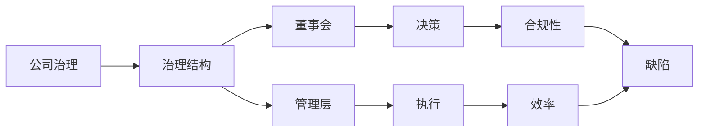
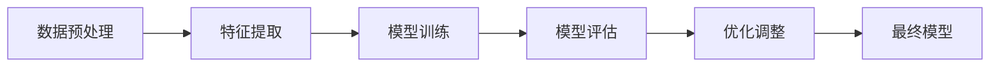

                 


# AI驱动的公司治理缺陷识别模型

---

## 关键词：
- AI技术
- 公司治理
- 缺陷识别
- 模型构建
- 系统架构

---

## 摘要：
本文详细探讨了AI技术在公司治理缺陷识别中的应用，从问题背景、核心概念、算法原理到系统架构，全面分析了基于AI的公司治理缺陷识别模型的构建与实现。通过实际案例分析，本文展示了如何利用深度学习等技术手段，从海量数据中提取关键特征，识别潜在治理缺陷，并提出相应的优化建议。文章还结合了系统的功能设计、架构设计和接口设计，为读者提供了一个完整的解决方案，并通过项目实战部分详细讲解了模型的实现过程和应用效果。

---

# 第一部分: 公司治理缺陷识别的背景与挑战

## 第1章: 公司治理缺陷识别的背景与问题描述

### 1.1 问题背景
#### 1.1.1 公司治理的基本概念
公司治理是指通过合理分配权力、责任和利益，确保公司能够高效、透明和合规地运行。良好的公司治理是企业长期发展的基础，而治理缺陷则可能导致企业面临法律风险、声誉损失和经营失败。

#### 1.1.2 公司治理中的常见缺陷
- 董事会结构不合理
- 内部控制失效
- 信息披露不及时
- 关联交易不透明
- 高管行为不当

#### 1.1.3 传统公司治理缺陷识别的局限性
- 依赖人工审查，效率低下
- 缺乏数据支持，难以量化
- 易受主观因素影响，结果不准确

### 1.2 问题描述
#### 1.2.1 公司治理缺陷的分类
- 结构性缺陷：治理架构不合理
- 运行性缺陷：治理过程中的问题
- 信息性缺陷：信息披露不完整

#### 1.2.2 缺陷识别的难点与挑战
- 数据分散，难以整合
- 缺乏统一的识别标准
- 需要实时监控和动态分析

#### 1.2.3 为什么需要引入AI技术
- 提高识别效率
- 增强分析深度
- 实现数据驱动的决策

### 1.3 问题解决的思路
#### 1.3.1 AI技术在公司治理中的应用潜力
- 自然语言处理（NLP）分析文本数据
- 深度学习识别模式
- 数据挖掘提取关键特征

#### 1.3.2 基于AI的缺陷识别模型的核心思路
- 数据收集与预处理
- 特征提取与模型训练
- 缺陷识别与结果优化

#### 1.3.3 模型的目标与预期效果
- 准确识别治理缺陷
- 提供优化建议
- 实现企业治理的智能化

### 1.4 边界与外延
#### 1.4.1 模型适用的场景
- 上市公司治理
- 中小企业治理
- 行业监管

#### 1.4.2 模型的局限性与边界
- 数据质量问题
- 模型可解释性不足
- 仅提供识别建议，不解决实际问题

#### 1.4.3 与其他治理工具的对比
- 传统审计工具：依赖人工，效率低
- AI驱动模型：自动化、高效、精准

### 1.5 概念结构与核心要素
#### 1.5.1 模型的核心要素分析
- 数据源：企业公开数据、内部数据
- 特征：公司治理结构、高管行为、财务数据
- 缺陷类型：结构缺陷、运行缺陷、信息缺陷

#### 1.5.2 要素之间的关系
- 数据源支持特征提取
- 特征影响缺陷识别
- 缺陷识别结果指导优化

#### 1.5.3 核心概念的特征对比
| 特征 | 传统方法 | AI方法 |
|------|-----------|--------|
| 效率 | 低        | 高     |
| 准确性 | 中        | 高     |
| 可扩展性 | 低        | 高     |

### 1.6 本章小结
本章通过分析公司治理的背景和缺陷识别的难点，提出了引入AI技术的必要性，并明确了模型的核心要素和构建思路。

---

## 第2章: 模型的核心概念与原理

### 2.1 核心概念原理
#### 2.1.1 缺陷识别的特征提取
- 文本数据：公司公告、财务报告
- 结构化数据：财务指标、管理行为
- 图像数据：组织架构图

#### 2.1.2 基于AI的模式识别
- 利用深度学习识别异常模式
- 通过NLP分析文本中的负面情绪
- 通过聚类分析发现潜在问题

#### 2.1.3 模型的训练与优化
- 数据清洗与特征工程
- 模型选择与调优
- 模型评估与验证

### 2.2 核心概念的属性特征对比
| 特性 | 深度学习 | NLP | 数据挖掘 |
|------|----------|-----|----------|
| 数据需求 | 高      | 高 | 中       |
| 计算资源 | 高      | 中 | 低       |
| 可解释性 | 低      | 中 | 高       |

### 2.3 实体关系图架构


### 2.4 本章小结
本章详细阐述了模型的核心概念和原理，分析了不同技术的特点及其在缺陷识别中的应用。

---

## 第3章: 算法原理与实现

### 3.1 算法原理概述
#### 3.1.1 基于深度学习的缺陷识别
- 使用LSTM处理时间序列数据
- 使用BERT分析文本数据
- 使用CNN处理结构化数据

#### 3.1.2 模型的输入与输出
- 输入：多模态数据（文本、结构化数据）
- 输出：缺陷类型、置信度

#### 3.1.3 算法的训练与优化
- 损失函数：交叉熵损失
- 优化目标：最小化损失函数
- 评估指标：准确率、召回率、F1值

### 3.2 算法实现细节
#### 3.2.1 损失函数
$$ L = -\sum_{i=1}^{n} y_i \log p_i + (1-y_i) \log (1-p_i) $$

#### 3.2.2 优化目标
$$ \text{优化目标} = \min_{\theta} \frac{1}{n}\sum_{i=1}^{n} L_i $$

#### 3.2.3 算法流程


### 3.3 算法实现代码示例
```python
import tensorflow as tf
from tensorflow.keras import layers

def build_model():
    inputs = layers.Input(shape=(max_length,))
    embedding = layers.Embedding(vocab_size, embedding_dim)(inputs)
    x = layers.Bidirectional(layers.LSTM(64, return_sequences=True))(embedding)
    x = layers.GlobalMaxPooling

