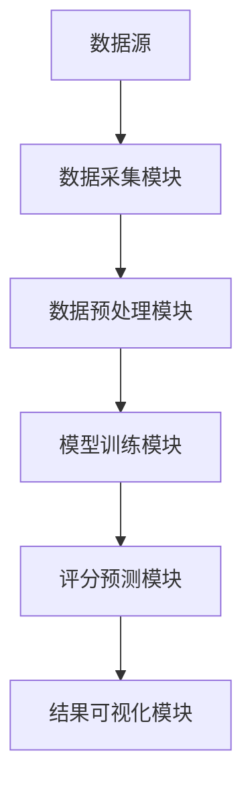

                 


# AI驱动的公司治理评分预测

## 关键词：公司治理，AI驱动，评分预测，机器学习，深度学习，系统架构

## 摘要：  
随着企业治理的重要性日益增加，公司治理评分预测成为衡量企业健康状况的关键指标。本文通过AI技术，探讨如何构建高效、准确的公司治理评分预测模型，涵盖背景、概念、算法、系统架构、项目实战和总结，为读者提供全面的指导。

---

## 第1章: 公司治理评分预测的背景与意义

### 1.1 公司治理的基本概念  
公司治理是确保企业有效运作和股东利益最大化的关键机制，涉及董事会结构、股权分配、高管薪酬等多个方面。

### 1.2 AI驱动评分预测的背景  
数据驱动决策的兴起推动了AI在企业治理中的应用，AI能够通过大量数据和复杂算法，提升评分预测的效率和准确性。

### 1.3 公司治理评分预测的重要性  
准确的评分预测帮助企业识别潜在风险，优化治理结构，提升企业价值。

---

## 第2章: 公司治理评分预测的核心概念

### 2.1 评分预测的定义  
AI驱动的评分预测利用机器学习算法，根据企业数据生成评分，评估治理状况。

### 2.2 关键要素对比表  
| **要素**       | **传统方法**             | **AI驱动方法**            |
|-----------------|--------------------------|---------------------------|
| 数据来源       | 财务数据、治理结构       | 包括非结构化数据          |
| 模型复杂度     | 简单，基于规则          | 复杂，基于算法            |
| 准确性         | 较低                    | 较高                     |

### 2.3 数据结构ER图  
```mermaid
erDiagram
    company {
        id
        name
        governance_score
    }
    feature {
        id
        name
        value
    }
    company_feature {
        company_id
        feature_id
    }
```

---

## 第3章: 公司治理评分预测的理论基础

### 3.1 传统方法的局限性  
传统方法基于财务指标和治理结构，难以捕捉动态变化。

### 3.2 AI驱动的理论基础  
机器学习和深度学习通过大量数据训练模型，捕捉复杂关系。

---

## 第4章: 公司治理评分预测的算法原理

### 4.1 线性回归  
公式：$$y = a + bx + ε$$  
适用于线性关系，代码示例：  
```python
import numpy as np
from sklearn.linear_model import LinearRegression
model = LinearRegression()
model.fit(X_train, y_train)
```

### 4.2 随机森林  
基于决策树的集成方法，代码示例：  
```python
from sklearn.ensemble import RandomForestRegressor
model = RandomForestRegressor(n_estimators=100)
model.fit(X_train, y_train)
```

### 4.3 神经网络  
多层感知机，代码示例：  
```python
from tensorflow.keras import layers
model = Sequential()
model.add(Dense(64, activation='relu', input_shape=(n_features,)))
model.add(Dense(1))
model.compile(optimizer='adam', loss='mse')
model.fit(X_train, y_train, epochs=100)
```

---

## 第5章: 公司治理评分预测的系统架构

### 5.1 功能模块设计  
- 数据采集模块：获取企业数据。
- 数据预处理模块：清洗和转换数据。
- 模型训练模块：训练评分预测模型。
- 评分预测模块：生成评分。
- 结果可视化模块：展示结果。

### 5.2 系统架构图  


---

## 第6章: 项目实战

### 6.1 环境安装  
安装Python、scikit-learn、TensorFlow等库。

### 6.2 核心代码实现  
数据预处理：  
```python
import pandas as pd
data = pd.read_csv('governance_data.csv')
```

模型训练：  
```python
from sklearn.model_selection import train_test_split
X_train, X_test, y_train, y_test = train_test_split(data.drop('score', axis=1), data['score'])
```

预测与评估：  
```python
from sklearn.metrics import mean_squared_error
y_pred = model.predict(X_test)
print(mean_squared_error(y_test, y_pred))
```

### 6.3 案例分析  
以某公司为例，分析模型预测的准确性，调整参数优化结果。

---

## 第7章: 最佳实践与总结

### 7.1 总结  
AI驱动的评分预测提高了企业治理的透明度和效率，帮助企业优化治理结构。

### 7.2 注意事项  
- 数据隐私保护  
- 模型解释性  
- 持续优化  

### 7.3 未来方向  
探索更复杂模型和实时预测技术。

---

## 作者：AI天才研究院 & 禅与计算机程序设计艺术  
通过结合AI技术和公司治理，本文提供了构建评分预测系统的全面指南，助力企业提升治理水平。

