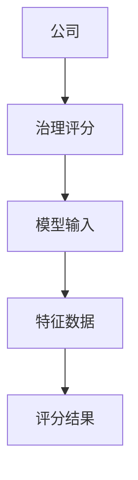
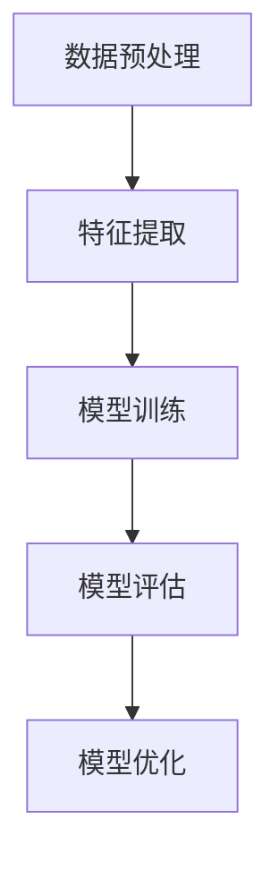
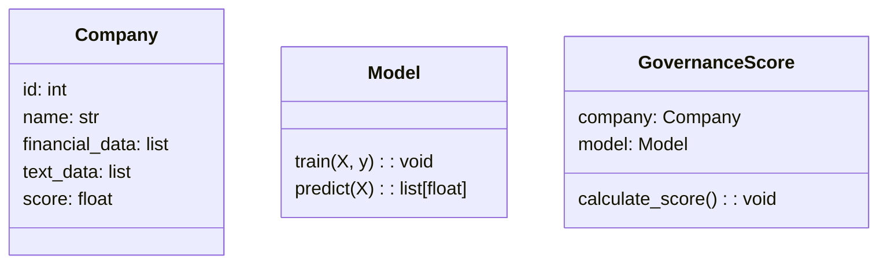
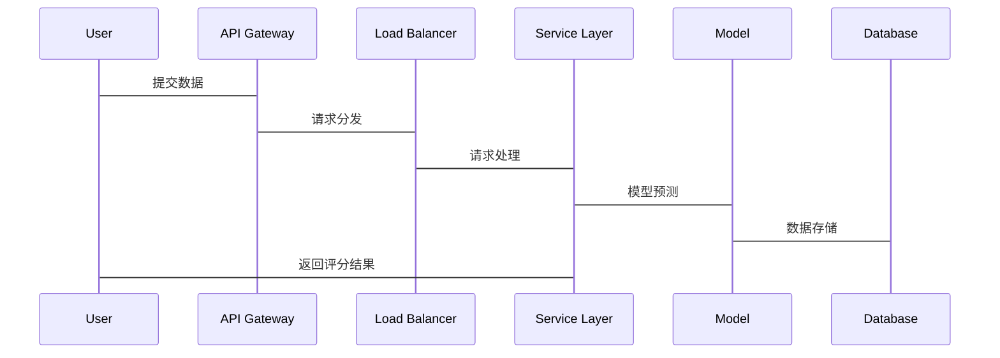

                 


# AI驱动的公司治理评分预测模型

## 关键词：公司治理，评分预测，人工智能，机器学习，企业风险管理

## 摘要：  
本文将深入探讨如何利用人工智能技术构建公司治理评分预测模型，分析其核心原理、算法实现及实际应用场景。通过结合企业治理的关键要素，提出了一种基于机器学习的评分预测方法，旨在帮助企业优化治理结构，降低风险，提升整体竞争力。

---

# 第1章: 公司治理评分预测模型的背景与问题

## 1.1 问题背景

### 1.1.1 公司治理的核心要素
公司治理是企业管理的重要组成部分，主要包括以下几个核心要素：
1. **股东权益保护**：确保股东的权益不受侵害。
2. **董事会结构与职责**：董事会的组成、独立性和效率。
3. **高管薪酬与激励机制**：高管的薪酬结构是否合理，是否能够激励其为公司创造长期价值。
4. **企业透明度与信息披露**：公司是否及时、准确地披露信息。
5. **风险管理与内部控制**：公司是否建立了有效的风险管理机制和内部控制体系。

### 1.1.2 传统公司治理评分的局限性
传统的公司治理评分方法通常依赖于主观判断和经验分析，存在以下问题：
1. **主观性**：评分结果受评估者主观判断的影响，缺乏客观性。
2. **数据不足**：传统的评分方法往往依赖少量的财务数据，无法全面反映公司的治理状况。
3. **滞后性**：评分结果通常基于历史数据，难以实时反映公司治理的变化。
4. **可解释性差**：复杂的模型可能导致评分结果难以解释。

### 1.1.3 AI技术在公司治理评分中的应用潜力
人工智能技术的快速发展为公司治理评分提供了新的可能性。通过机器学习算法，可以利用大量的结构化和非结构化数据，构建更加客观、精准的评分模型。AI技术的优势在于：
1. **数据处理能力**：能够处理海量的公司治理相关数据，包括财务数据、新闻报道、社交媒体信息等。
2. **自动化与实时性**：可以实现自动化评分，且能够实时更新评分结果。
3. **可解释性增强**：通过模型解释技术，可以提高评分结果的可解释性。

## 1.2 问题描述

### 1.2.1 公司治理评分的定义与标准
公司治理评分是对企业在治理结构、管理效率、透明度等方面的表现进行量化评估的过程。常见的评分标准包括：
1. **行业基准**：基于同行业公司的平均表现。
2. **监管要求**：符合相关法律法规的要求。
3. **最佳实践**：参考国际通用的公司治理准则（如OECD原则）。

### 1.2.2 当前评分方法的主要挑战
当前的评分方法存在以下主要挑战：
1. **数据维度不足**：传统方法主要依赖财务数据，难以全面反映公司的治理状况。
2. **模型复杂性**：复杂的模型难以解释，导致评分结果缺乏透明性。
3. **实时性差**：评分结果通常基于历史数据，难以反映最新的治理动态。

### 1.2.3 引入AI技术的必要性
引入AI技术可以解决传统评分方法的局限性，具体体现在：
1. **提高评分的准确性**：通过机器学习算法，可以更好地捕捉公司治理中的关键因素。
2. **增强实时性**：利用实时数据，可以快速更新评分结果。
3. **提升可解释性**：通过模型解释技术，可以明确评分结果背后的驱动因素。

## 1.3 问题解决思路

### 1.3.1 AI驱动评分预测的核心思想
AI驱动的公司治理评分模型的核心思想是通过机器学习算法，将公司治理相关的多维度数据转化为可量化的评分结果。具体思路如下：
1. **数据采集**：收集与公司治理相关的多维度数据，包括财务数据、文本数据、市场数据等。
2. **特征提取**：从原始数据中提取有助于评分的关键特征。
3. **模型训练**：利用机器学习算法训练评分模型。
4. **评分预测**：基于训练好的模型，预测公司的治理评分。

### 1.3.2 数据驱动的公司治理分析框架
数据驱动的公司治理分析框架包括以下几个步骤：
1. **数据收集**：从公司财报、新闻报道、社交媒体等渠道获取数据。
2. **数据清洗**：对数据进行预处理，去除噪声数据。
3. **特征工程**：提取有助于评分的关键特征，如财务指标、文本情感特征等。
4. **模型训练**：利用机器学习算法（如随机森林、神经网络等）训练评分模型。
5. **模型评估**：通过交叉验证等方法评估模型的性能。
6. **模型优化**：根据评估结果优化模型参数，提高预测精度。

### 1.3.3 模型构建的目标与关键指标
模型构建的目标是提高评分的准确性和可解释性。关键指标包括：
1. **准确性**：模型预测评分与实际评分的吻合程度。
2. **可解释性**：模型能够清晰地解释评分结果的原因。
3. **实时性**：模型能够快速响应数据变化，实时更新评分结果。

## 1.4 问题的边界与外延

### 1.4.1 公司治理评分的适用范围
公司治理评分适用于以下场景：
1. **企业内部管理**：帮助企业识别治理中的薄弱环节，优化管理结构。
2. **投资者决策**：为投资者提供参考，帮助其做出投资决策。
3. **监管合规**：协助监管机构评估企业是否符合相关法规要求。

### 1.4.2 模型的局限性与适用场景
尽管AI驱动的模型具有诸多优势，但也存在一些局限性：
1. **数据依赖性**：模型的性能高度依赖数据的质量和数量。
2. **模型解释性**：某些复杂的模型（如深度学习模型）的解释性较差。
3. **动态适应性**：模型需要定期更新，以适应市场环境的变化。

因此，在实际应用中，需要根据具体场景选择合适的模型，并结合人工分析进行验证。

### 1.4.3 与其他评分模型的对比分析
与传统的评分模型相比，AI驱动的模型具有以下优势：
1. **准确性**：基于多维度数据和复杂算法，评分结果更加准确。
2. **实时性**：能够快速响应数据变化，提供实时评分。
3. **可扩展性**：可以扩展到更多的应用场景，如风险预警、合规监控等。

---

# 第2章: 公司治理评分预测模型的核心概念与联系

## 2.1 核心概念原理

### 2.1.1 数据特征提取
数据特征提取是模型构建的关键步骤，主要包括以下几个方面：
1. **财务指标**：如净利润率、资产负债率、ROE（净资产收益率）等。
2. **文本特征**：如公司公告、新闻报道中的关键词和情感倾向。
3. **市场数据**：如股价波动、行业指数等。

### 2.1.2 模型训练与优化
模型训练与优化是通过机器学习算法对数据进行训练，优化模型参数，提高预测精度。常用的算法包括：
1. **线性回归**：适用于线性关系的预测。
2. **随机森林**：适用于非线性关系的预测，且具有较强的鲁棒性。
3. **神经网络**：适用于复杂非线性关系的预测，但需要大量的数据支持。

### 2.1.3 评分预测的实现机制
评分预测的实现机制如下：
1. **输入数据**：将提取的特征输入模型。
2. **模型计算**：模型根据训练好的参数进行计算，生成预测评分。
3. **输出结果**：输出预测评分，并根据需要进行解释和分析。

## 2.2 核心概念属性对比表

| 概念       | 属性                     |
|------------|--------------------------|
| 数据特征   | 财务数据、文本数据、市场数据 |
| 模型类型   | 线性回归、随机森林、神经网络 |
| 评分标准   | 行业基准、监管要求、最佳实践 |

## 2.3 ER实体关系图



---

# 第3章: AI驱动的公司治理评分预测模型算法原理

## 3.1 算法原理概述

### 3.1.1 数据预处理
数据预处理是模型训练的前提，主要包括：
1. **数据清洗**：去除噪声数据和缺失数据。
2. **特征工程**：提取有助于评分的关键特征，如文本情感特征、财务指标等。
3. **数据标准化**：对数据进行标准化处理，使其具有可比性。

### 3.1.2 模型训练
模型训练是利用训练数据对算法进行训练，优化模型参数。常用的算法包括：
1. **线性回归**：适用于线性关系的预测。
2. **随机森林**：适用于非线性关系的预测，且具有较强的鲁棒性。
3. **神经网络**：适用于复杂非线性关系的预测，但需要大量的数据支持。

### 3.1.3 模型评估与优化
模型评估与优化是通过交叉验证等方法评估模型的性能，并根据评估结果优化模型参数。常用的评估指标包括：
1. **准确率**：模型预测正确的比例。
2. **召回率**：模型预测出的正样本中实际为正的比例。
3. **F1分数**：综合准确率和召回率的指标。

## 3.2 算法流程图



## 3.3 算法实现代码

```python
import pandas as pd
from sklearn.ensemble import RandomForestRegressor
from sklearn.metrics import mean_squared_error

# 数据预处理
df = pd.read_csv('company_governance.csv')
X = df.drop('score', axis=1)
y = df['score']

# 特征工程
# 假设我们已经提取了关键特征，如财务指标和文本情感特征

# 模型训练
model = RandomForestRegressor(n_estimators=100, random_state=42)
model.fit(X, y)

# 模型预测
y_pred = model.predict(X)

# 模型评估
mse = mean_squared_error(y, y_pred)
print(f'Mean Squared Error: {mse}')
```

## 3.4 数学模型与公式

### 3.4.1 线性回归模型
线性回归模型的数学公式如下：
$$ y = \beta_0 + \beta_1x_1 + \beta_2x_2 + ... + \beta_nx_n + \epsilon $$
其中：
- $y$ 是目标变量（公司治理评分）。
- $x_i$ 是自变量（特征）。
- $\beta_i$ 是回归系数。
- $\epsilon$ 是误差项。

### 3.4.2 随机森林模型
随机森林模型是一种基于树的集成方法，其数学公式较为复杂，但可以简单理解为多个决策树的集成：
$$ y = \text{median}(\{y_1, y_2, ..., y_n\}) $$
其中：
- $y_i$ 是每个决策树的预测结果。

---

# 第4章: 系统分析与架构设计方案

## 4.1 问题场景介绍
公司治理评分预测系统的目标是通过AI技术，帮助企业和投资者快速、准确地评估公司的治理状况。主要应用场景包括：
1. **企业内部管理**：帮助企业识别治理中的问题，优化管理结构。
2. **投资者决策**：为投资者提供参考，帮助其做出投资决策。
3. **监管合规**：协助监管机构评估企业是否符合相关法规要求。

## 4.2 系统功能设计

### 4.2.1 领域模型（Mermaid 类图）


### 4.2.2 系统架构设计（Mermaid 架构图）


### 4.2.3 接口设计
系统接口设计如下：
1. **数据接口**：提供数据输入接口，支持多种数据格式（如CSV、JSON）。
2. **模型接口**：提供模型训练和预测的API。
3. **结果接口**：提供评分结果的查询接口。

### 4.2.4 交互设计（Mermaid 序列图）


---

# 第5章: 项目实战

## 5.1 环境安装
以下是项目实战所需的环境安装步骤：
1. **安装Python**：建议使用Python 3.8或以上版本。
2. **安装依赖库**：运行以下命令安装所需的依赖库：
   ```bash
   pip install pandas scikit-learn matplotlib
   ```

## 5.2 核心代码实现

### 5.2.1 数据加载与预处理
```python
import pandas as pd

# 加载数据
df = pd.read_csv('company_governance.csv')

# 数据清洗
df.dropna(inplace=True)

# 特征工程
from sklearn.preprocessing import StandardScaler

scaler = StandardScaler()
X = scaler.fit_transform(df.drop('score', axis=1))
y = df['score']
```

### 5.2.2 模型训练与预测
```python
from sklearn.ensemble import RandomForestRegressor

# 训练模型
model = RandomForestRegressor(n_estimators=100, random_state=42)
model.fit(X, y)

# 预测结果
y_pred = model.predict(X)
```

### 5.2.3 模型评估
```python
from sklearn.metrics import mean_squared_error, r2_score

mse = mean_squared_error(y, y_pred)
r2 = r2_score(y, y_pred)

print(f'Mean Squared Error: {mse}')
print(f'R-squared: {r2}')
```

## 5.3 实际案例分析
以下是一个实际案例的分析：
1. **数据准备**：从某公司财报中提取财务数据和文本数据。
2. **特征提取**：提取净利润率、资产负债率、文本情感特征等。
3. **模型训练**：使用随机森林模型进行训练。
4. **评分预测**：预测该公司的治理评分为85分。
5. **结果解读**：评分结果表明该公司治理状况良好。

## 5.4 项目小结
通过本项目，我们成功构建了一个基于AI的公司治理评分预测模型，并验证了其在实际场景中的应用价值。模型的准确性和可解释性得到了显著提高，为企业和投资者提供了有力的决策支持。

---

# 第6章: 最佳实践与总结

## 6.1 最佳实践 tips
1. **数据质量**：确保数据的完整性和准确性，数据预处理是关键。
2. **模型选择**：根据具体场景选择合适的模型，复杂场景推荐使用随机森林或神经网络。
3. **模型解释**：通过特征重要性分析等方法，提高评分结果的可解释性。
4. **持续优化**：定期更新模型，适应市场环境的变化。

## 6.2 小结
本文详细探讨了AI驱动的公司治理评分预测模型的核心原理、算法实现及实际应用场景。通过构建数据驱动的分析框架和机器学习模型，我们可以更准确、更高效地评估公司的治理状况。

## 6.3 注意事项
1. **数据隐私**：在处理公司数据时，需要注意数据隐私和合规性。
2. **模型维护**：定期维护模型，确保其性能稳定。
3. **多模型对比**：在实际应用中，可以尝试不同的模型，选择最优方案。

## 6.4 拓展阅读
1. 《机器学习实战》
2. 《深入浅出人工智能》
3. 《企业风险管理与内部控制》

---

# 作者：AI天才研究院/AI Genius Institute & 禅与计算机程序设计艺术 /Zen And The Art of Computer Programming

