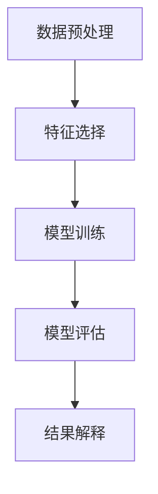
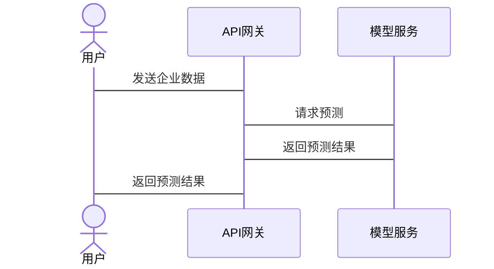

                 


# AI驱动的公司破产概率预测

> 关键词：公司、破产、概率、预测、AI、机器学习、金融

> 摘要：本文系统地探讨了如何利用人工智能技术进行公司破产概率预测。通过分析破产预测的核心问题、AI技术的应用潜力，结合实际案例，详细讲解了基于机器学习的破产预测算法原理、系统架构设计以及项目实现过程。文章内容涵盖从理论到实践的完整链条，旨在为读者提供一个清晰的AI驱动的公司破产预测解决方案。

---

## 第一部分: 公司破产概率预测的背景与意义

### 第1章: 公司破产概率预测的背景与意义

#### 1.1 问题背景介绍

##### 1.1.1 企业破产的定义与特征

企业破产是指企业在无法偿还债务的情况下，依法申请破产保护的过程。破产的核心特征包括：

- **财务危机**：企业无法偿还到期债务。
- **经营失败**：企业长期亏损，无法维持正常运营。
- **资产不足以清偿债务**：企业资产不足以覆盖负债。

破产不仅影响企业自身，还可能导致债权人损失、员工失业、供应链断裂等连锁反应。

##### 1.1.2 破产预测的经济意义

破产预测在经济学和金融学中具有重要意义：

- **风险管理**：帮助企业和投资者识别潜在风险，提前采取应对措施。
- **资源配置优化**：通过预测避免资源浪费，优化资金分配。
- **金融监管**：帮助监管机构识别风险企业，维护金融市场稳定。

##### 1.1.3 AI技术在破产预测中的应用潜力

随着人工智能技术的快速发展，AI在破产预测中的应用潜力巨大：

- **数据驱动的预测方法**：利用企业财务数据、市场数据和运营数据，构建预测模型。
- **机器学习算法**：通过训练模型识别破产的早期信号。
- **实时监控**：基于实时数据，进行动态预测和风险预警。

#### 1.2 问题描述与目标

##### 1.2.1 破产概率预测的核心问题

- **数据特征选择**：如何从海量数据中提取有效特征。
- **模型选择与优化**：如何选择合适的算法并优化模型性能。
- **结果解释与应用**：如何将预测结果应用于实际业务决策。

##### 1.2.2 预测目标与应用场景

- **预测目标**：准确预测企业破产概率。
- **应用场景**：银行信贷审批、投资决策、企业风险管理等。

##### 1.2.3 预测模型的性能指标

- **准确率**：模型预测正确的比例。
- **召回率**：模型识别破产企业的能力。
- **F1分数**：综合准确率和召回率的指标。

#### 1.3 问题解决思路

##### 1.3.1 数据驱动的预测方法

- **数据收集**：收集企业的财务数据、市场数据、运营数据等。
- **数据清洗**：处理缺失值、异常值和重复数据。
- **特征工程**：提取关键特征，如财务比率、市场指标等。

##### 1.3.2 AI技术在预测中的应用

- **机器学习算法**：逻辑回归、随机森林、支持向量机等。
- **深度学习模型**：神经网络、LSTM等。
- **模型融合**：通过集成学习提升预测精度。

##### 1.3.3 多模型融合与优化策略

- **模型融合**：将多个模型的预测结果进行加权融合。
- **超参数优化**：通过网格搜索或随机搜索优化模型参数。
- **特征选择优化**：使用特征重要性分析选择关键特征。

#### 1.4 破产预测的边界与外延

##### 1.4.1 预测范围的界定

- **预测范围**：企业破产概率预测的范围和限制。
- **预测精度**：模型预测的准确性和可信度。

##### 1.4.2 预测结果的解释

- **解释性分析**：模型结果的可解释性。
- **业务规则的应用**：将预测结果应用于实际业务决策。

##### 1.4.3 相关领域的关联与区别

- **相关领域**：风险管理、信用评估、金融分析。
- **区别**：破产预测与信用评估的区别与联系。

#### 1.5 核心概念结构与要素

##### 1.5.1 数据特征与模型输入

- **数据特征**：财务数据、市场数据、运营数据等。
- **模型输入**：经过特征工程处理后的数据。

##### 1.5.2 模型输出与解释

- **模型输出**：企业破产概率。
- **结果解释**：将概率转化为业务决策依据。

##### 1.5.3 业务规则与决策逻辑

- **业务规则**：根据预测结果制定风险控制策略。
- **决策逻辑**：如何将预测结果应用于实际业务。

---

## 第二部分: AI驱动的破产预测核心概念与联系

### 第2章: AI驱动的破产预测核心概念与联系

#### 2.1 核心概念原理

##### 2.1.1 数据特征提取

- **数据特征**：财务比率（如资产负债率、流动比率）、市场指标（如行业趋势）、运营指标（如利润率）。
- **特征工程**：将原始数据转化为适合模型输入的特征。

##### 2.1.2 模型训练与优化

- **模型训练**：使用训练数据训练模型。
- **模型优化**：通过调整参数和特征选择优化模型性能。

##### 2.1.3 结果解释与应用

- **结果解释**：将模型输出的破产概率转化为业务决策依据。
- **应用案例**：银行信贷审批中如何利用破产概率预测。

#### 2.2 核心概念属性对比表

| 概念 | 属性 | 描述 |
|------|------|------|
| 数据特征 | 类型 | 财务、市场、运营等 |
| 模型类型 | 类型 | 逻辑回归、随机森林、神经网络等 |
| 预测结果 | 类型 | 破产概率、风险等级等 |

#### 2.3 ER实体关系图

```mermaid
er
actor: 用户
model: 破产预测模型
data: 数据特征
result: 预测结果
actor --> data
data --> model
model --> result
```

---

## 第三部分: 破产预测的算法原理与实现

### 第3章: 破产预测的算法原理与实现

#### 3.1 算法原理概述

##### 3.1.1 逻辑回归原理

逻辑回归是一种常用的分类算法，适用于二分类问题。其核心思想是通过线性回归模型将输入特征映射到0和1之间的概率。

##### 3.1.2 支持向量机原理

支持向量机是一种基于统计学习的算法，适用于小样本、高维数据的分类问题。其核心思想是通过找到一个超平面将数据分成两类。

##### 3.1.3 随机森林原理

随机森林是一种基于决策树的集成学习算法，通过构建多棵决策树并取其预测结果的多数 votes 来提高模型的准确性和稳定性。

#### 3.2 算法实现流程



#### 3.3 逻辑回归算法实现

```python
import numpy as np
from sklearn.linear_model import LogisticRegression

# 数据准备
X = np.array([[feature1, feature2, ...], ...])
y = np.array([0, 1, ...])

# 模型训练
model = LogisticRegression()
model.fit(X, y)

# 预测概率
prob = model.predict_proba(X)[:, 1]
```

#### 3.4 数学公式

逻辑回归的损失函数：

$$
\text{损失函数} = -\frac{1}{m} \sum_{i=1}^{m} [y_i \ln(h(x_i)) + (1 - y_i) \ln(1 - h(x_i))]
$$

其中，$$h(x_i) = \frac{1}{1 + e^{-\beta x_i}}$$ 是逻辑回归的预测概率。

---

## 第四部分: 系统分析与架构设计方案

### 第4章: 系统分析与架构设计方案

#### 4.1 问题场景介绍

- **问题场景**：企业破产概率预测。
- **目标用户**：企业、银行、投资者等。
- **核心需求**：实时预测企业破产概率，提供风险预警。

#### 4.2 系统功能设计

##### 4.2.1 领域模型设计


##### 4.2.2 系统架构设计


#### 4.3 系统接口设计

##### 4.3.1 API接口

- **输入接口**：企业数据接口。
- **输出接口**：预测结果接口。

##### 4.3.2 交互流程



---

## 第五部分: 项目实战

### 第5章: 项目实战

#### 5.1 环境安装

- **Python环境**：安装Python 3.x。
- **依赖库**：安装numpy、pandas、scikit-learn等。

#### 5.2 核心实现

##### 5.2.1 代码实现

```python
import numpy as np
from sklearn.linear_model import LogisticRegression

# 数据准备
X = np.array([[feature1, feature2, ...], ...])
y = np.array([0, 1, ...])

# 模型训练
model = LogisticRegression()
model.fit(X, y)

# 预测概率
prob = model.predict_proba(X)[:, 1]
```

##### 5.2.2 代码解读

- **数据准备**：加载和处理数据。
- **模型训练**：训练逻辑回归模型。
- **预测概率**：输出企业破产概率。

#### 5.3 实际案例分析

##### 5.3.1 数据分析

- **特征分析**：分析特征对破产概率的影响。
- **结果分析**：验证模型的准确性和召回率。

##### 5.3.2 案例分析

- **案例1**：某制造企业破产概率预测。
- **案例2**：某科技企业破产概率预测。

#### 5.4 项目小结

- **项目总结**：项目目标的实现情况。
- **经验教训**：项目实施过程中的经验和教训。
- **未来优化方向**：进一步优化模型性能和扩展应用场景。

---

## 第六部分: 最佳实践

### 第6章: 最佳实践

#### 6.1 小结

- **核心内容回顾**：总结文章的核心内容。
- **关键点总结**：总结破产预测的关键点和AI技术的应用。

#### 6.2 注意事项

- **数据质量**：确保数据的准确性和完整性。
- **模型解释性**：模型结果的可解释性。
- **实时性**：模型的实时预测能力。

#### 6.3 未来趋势

- **深度学习的应用**：深度学习在破产预测中的应用潜力。
- **实时预测**：基于实时数据的动态预测。
- **多模态数据融合**：结合文本、图像等多种数据源进行预测。

#### 6.4 拓展阅读

- **推荐书籍**：《机器学习实战》、《Python机器学习》。
- **推荐论文**：相关领域的学术论文。
- **在线资源**：推荐的在线学习资源。

---

## 作者：AI天才研究院 & 禅与计算机程序设计艺术

本文由AI天才研究院（AI Genius Institute）与“禅与计算机程序设计艺术”联合撰写，旨在为读者提供深入浅出的AI技术解读与实践指南。

