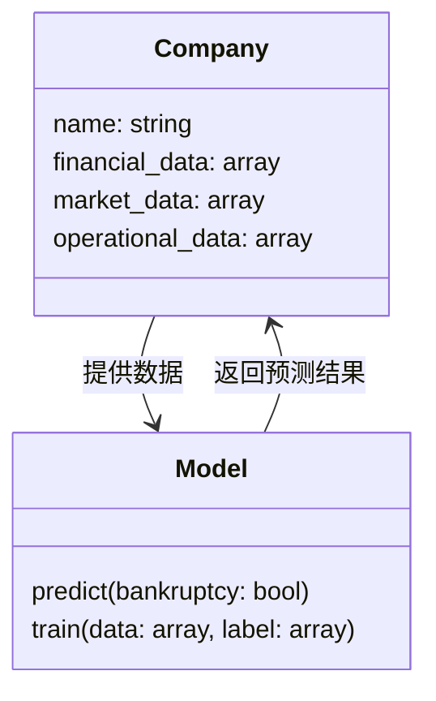

                 


# AI驱动的公司破产预测模型

> 关键词：AI, 公司破产, 预测模型, 机器学习, 深度学习, 财务数据分析

> 摘要：本文深入探讨了利用人工智能技术构建公司破产预测模型的方法与实践。通过分析公司财务数据、市场信息和运营指标，结合机器学习和深度学习算法，提出了一种高效的AI驱动破产预测模型。文章从模型构建的背景、核心概念、算法原理、系统架构到实际应用案例进行了详细阐述，并给出了最佳实践建议。

---

## 第一部分: AI驱动的公司破产预测模型背景与核心概念

### 第1章: 公司破产预测的背景与问题描述

#### 1.1 公司破产预测的背景
##### 1.1.1 经济危机与公司破产的现状
公司在经营过程中，由于多种因素的影响，如经济波动、管理不善、市场竞争等，可能会面临破产的风险。据统计，全球经济危机中，企业破产率显著上升，尤其是在2008年全球金融危机和COVID-19疫情中，企业破产数量激增。及时预测和识别潜在的破产企业，对于保护债权人利益、优化资源配置具有重要意义。

##### 1.1.2 破产预测对企业与金融市场的意义
- **企业层面**：企业可以通过破产预测模型提前发现经营中的问题，采取措施改善财务状况，避免破产风险。
- **金融市场层面**：投资者、债权人和金融机构可以通过破产预测模型评估企业的信用风险，优化投资决策，降低金融系统的整体风险。

##### 1.1.3 AI技术在金融预测中的应用潜力
人工智能技术在金融领域的应用越来越广泛，尤其是在风险评估和预测方面。AI技术可以通过分析大量的非结构化数据（如新闻、社交媒体）和结构化数据（如财务报表），构建更精准的预测模型。

#### 1.2 破产预测的核心问题
##### 1.2.1 破产预测的基本概念
破产预测是指通过分析企业的财务、市场和运营数据，预测企业在未来一定时间内是否会进入破产状态。破产预测的核心在于识别影响企业破产的关键因素，并构建数学模型进行预测。

##### 1.2.2 破产预测的关键指标与特征
- 财务指标：如资产负债率、流动比率、息税前利润（EBIT）、净利润率等。
- 市场指标：如股价波动、市场占有率、行业竞争状况等。
- 运营指标：如供应链稳定性、库存周转率、员工流失率等。

##### 1.2.3 破产预测的边界与外延
- **边界**：破产预测模型仅适用于具有足够财务数据的企业，对于新兴企业或数据不足的企业可能不适用。
- **外延**：破产预测可以扩展到企业信用评级、投资决策等领域。

#### 1.3 传统破产预测方法的局限性
##### 1.3.1 传统财务指标分析法
传统财务指标分析法依赖于单一的财务指标，如Z-score模型，存在以下问题：
- **单一性**：仅依赖财务指标，忽视了非财务因素。
- **静态性**：无法捕捉企业经营中的动态变化。
- **主观性**：模型参数和权重的设定存在主观性，影响预测的准确性。

##### 1.3.2 传统统计模型的局限性
传统统计模型（如线性回归）在处理复杂非线性关系时表现不佳，且难以处理高维数据。

##### 1.3.3 传统方法在实际应用中的不足
- 数据维度有限：传统方法通常仅依赖财务数据，忽视了非结构化数据的价值。
- 预测精度低：传统方法在面对复杂问题时，预测精度难以满足实际需求。

#### 1.4 AI驱动破产预测的创新与优势
##### 1.4.1 AI技术在破产预测中的应用优势
- **数据处理能力**：AI能够处理海量的结构化和非结构化数据，提取更多有用的特征。
- **非线性关系捕捉**：AI算法（如随机森林、神经网络）能够捕捉复杂的非线性关系，提高预测精度。
- **实时性**：AI模型可以实时更新，适应数据的变化。

##### 1.4.2 数据驱动的预测方法
AI驱动的破产预测模型通过整合企业的财务、市场、供应链等多源数据，构建全面的预测模型。

##### 1.4.3 竞争优势与市场价值
- **竞争优势**：AI驱动的破产预测模型可以显著提高预测精度，为企业和投资者提供更可靠的决策支持。
- **市场价值**：通过降低金融系统的风险，AI驱动的破产预测模型可以为金融市场稳定做出贡献。

#### 1.5 本章小结
本章介绍了公司破产预测的背景、核心问题和传统方法的局限性，强调了AI技术在破产预测中的创新与优势。AI驱动的破产预测模型能够更好地捕捉企业的综合风险，为企业和投资者提供更可靠的决策支持。

---

### 第2章: AI驱动的公司破产预测模型核心概念

#### 2.1 破产预测模型的构成要素
##### 2.1.1 数据源与特征选择
- 数据源：包括企业的财务数据（如资产负债表、利润表）、市场数据（如股价、行业趋势）、供应链数据（如供应商稳定性）等。
- 特征选择：通过特征工程提取关键特征，如财务比率、市场指标、运营指标等。

##### 2.1.2 模型算法与训练方法
- 算法选择：如逻辑回归、随机森林、支持向量机（SVM）、长短期记忆网络（LSTM）等。
- 训练方法：采用监督学习，使用历史破产数据进行模型训练。

##### 2.1.3 模型评估与优化
- 评估指标：如准确率、召回率、F1分数等。
- 模型优化：通过网格搜索、交叉验证等方法优化模型参数。

#### 2.2 AI模型的核心原理
##### 2.2.1 机器学习在破产预测中的应用
- **监督学习**：通过历史数据训练模型，预测企业是否破产。
- **特征工程**：提取和选择关键特征，提高模型的预测能力。

##### 2.2.2 深度学习在破产预测中的优势
- **非线性关系捕捉**：深度学习模型（如LSTM、CNN）能够捕捉复杂的非线性关系，提高预测精度。
- **数据特征提取**：深度学习模型可以自动提取特征，减少特征工程的工作量。

##### 2.2.3 AI模型的核心要素
- 数据：高质量的数据是模型准确性的基础。
- 算法：选择合适的算法是模型成功的关键。
- 训练：通过大量数据训练模型，提高预测能力。

---

## 第二部分: AI驱动的公司破产预测模型算法原理

### 第3章: 常见算法的原理与实现

#### 3.1 逻辑回归算法
##### 3.1.1 算法原理
逻辑回归是一种常用的分类算法，适用于二分类问题。其核心思想是通过sigmoid函数将线性回归的结果映射到0-1区间，表示概率。

##### 3.1.2 算法流程
1. 数据预处理：标准化、特征选择。
2. 模型训练：使用梯度下降优化损失函数。
3. 模型评估：计算准确率、召回率等指标。

##### 3.1.3 代码实现
```python
import numpy as np
from sklearn.linear_model import LogisticRegression

# 数据预处理
X = ... # 特征矩阵
y = ... # 标签向量

# 模型训练
model = LogisticRegression()
model.fit(X, y)

# 模型预测
y_pred = model.predict(X)
```

##### 3.1.4 优缺点分析
- 优点：简单易用，解释性强。
- 缺点：仅适用于线性可分问题。

#### 3.2 随机森林算法
##### 3.2.1 算法原理
随机森林是一种集成学习算法，通过构建多个决策树并集成结果，提高模型的准确性和稳定性。

##### 3.2.2 算法流程
1. 数据采样：使用袋装法（Bagging）生成多个数据集。
2. 模型训练：在每个数据集上训练一棵决策树。
3. 结果集成：通过投票或加权平均得到最终结果。

##### 3.2.3 代码实现
```python
from sklearn.ensemble import RandomForestClassifier

# 数据预处理
X = ... # 特征矩阵
y = ... # 标签向量

# 模型训练
model = RandomForestClassifier(n_estimators=100)
model.fit(X, y)

# 模型预测
y_pred = model.predict(X)
```

##### 3.2.4 优缺点分析
- 优点：抗过拟合能力强，适合高维数据。
- 缺点：计算复杂度高。

#### 3.3 支持向量机（SVM）
##### 3.3.1 算法原理
SVM是一种支持向量机算法，通过构建超平面将数据分成两类，适用于线性与非线性分类问题。

##### 3.3.2 算法流程
1. 数据预处理：标准化、特征选择。
2. 模型训练：使用最大-margin优化目标函数。
3. 模型评估：计算准确率、召回率等指标。

##### 3.3.3 代码实现
```python
from sklearn import svm

# 数据预处理
X = ... # 特征矩阵
y = ... # 标签向量

# 模型训练
model = svm.SVC()
model.fit(X, y)

# 模型预测
y_pred = model.predict(X)
```

##### 3.3.4 优缺点分析
- 优点：适合小规模数据，分类能力强。
- 缺点：不适合大规模数据，计算复杂度高。

#### 3.4 长短期记忆网络（LSTM）
##### 3.4.1 算法原理
LSTM是一种时间序列模型，适用于处理序列数据，能够捕捉时间依赖性。

##### 3.4.2 算法流程
1. 数据预处理：归一化、特征选择。
2. 模型训练：使用反向传播算法优化权重。
3. 模型评估：计算准确率、召回率等指标。

##### 3.4.3 代码实现
```python
import keras
from keras.layers import LSTM, Dense

# 数据预处理
X = ... # 特征矩阵
y = ... # 标签向量

# 模型构建
model = keras.Sequential()
model.add(LSTM(64, input_shape=(None, X.shape[2])))
model.add(Dense(1, activation='sigmoid'))

# 模型训练
model.compile(loss='binary_crossentropy', optimizer='adam', metrics=['accuracy'])
model.fit(X, y, epochs=10, batch_size=32)
```

##### 3.4.4 优缺点分析
- 优点：适合时间序列数据，能够捕捉长距离依赖。
- 缺点：计算复杂度高，训练时间较长。

---

## 第三部分: AI驱动的公司破产预测模型系统架构与实现

### 第4章: 系统分析与架构设计

#### 4.1 系统功能设计
##### 4.1.1 领域模型


##### 4.1.2 系统架构设计
```mermaid
containerDiagram
    container Web Service {
        Web Server
        Database
        Model Service
    }
    container Client {
        Web Browser
    }
    Web Service --> Model Service: 调用模型接口
    Client --> Web Service: 发送请求
```

#### 4.2 接口设计与交互流程
##### 4.2.1 接口设计
- **输入接口**：接收企业的财务、市场和运营数据。
- **输出接口**：返回破产预测结果和概率值。

##### 4.2.2 交互流程
1. **用户请求**：用户通过Web界面提交企业数据。
2. **数据处理**：系统对数据进行预处理和特征提取。
3. **模型调用**：系统调用AI模型进行预测。
4. **结果返回**：系统返回预测结果和概率值。

#### 4.3 系统实现
##### 4.3.1 环境安装
```bash
pip install numpy scikit-learn keras tensorflow
```

##### 4.3.2 核心实现
```python
# 数据预处理
def preprocess(data):
    # 数据清洗、归一化等处理
    return processed_data

# 模型训练
def train_model(X, y):
    model = ... # 选择模型
    model.fit(X, y)
    return model

# 模型预测
def predict_model(model, X):
    return model.predict(X)
```

##### 4.3.3 应用案例
```python
# 示例数据
data = ... # 包含财务、市场、运营数据
labels = ... # 破产标签（0或1）

# 数据预处理
X = preprocess(data)

# 模型训练
model = train_model(X, labels)

# 模型预测
y_pred = predict_model(model, X)
```

---

## 第四部分: AI驱动的公司破产预测模型项目实战

### 第5章: 项目实战与案例分析

#### 5.1 环境安装
```bash
pip install numpy pandas scikit-learn keras tensorflow
```

#### 5.2 核心代码实现
##### 5.2.1 数据预处理
```python
import pandas as pd
from sklearn.preprocessing import StandardScaler

# 加载数据
data = pd.read_csv('company_data.csv')

# 特征选择
features = ['revenue', 'profit', 'debt', 'market_share']
X = data[features]
y = data['bankruptcy']

# 数据标准化
scaler = StandardScaler()
X_scaled = scaler.fit_transform(X)
```

##### 5.2.2 模型训练
```python
from sklearn.ensemble import RandomForestClassifier

# 模型训练
model = RandomForestClassifier(n_estimators=100)
model.fit(X_scaled, y)
```

##### 5.2.3 模型预测与评估
```python
from sklearn.metrics import accuracy_score, recall_score, f1_score

# 模型预测
y_pred = model.predict(X_scaled)

# 模型评估
print(f'Accuracy: {accuracy_score(y, y_pred)}')
print(f'Recall: {recall_score(y, y_pred)}')
print(f'F1 Score: {f1_score(y, y_pred)}')
```

#### 5.3 案例分析
##### 5.3.1 数据来源
- 数据来源：企业财务报表、行业报告、新闻媒体等。

##### 5.3.2 案例分析步骤
1. **数据收集**：收集企业的财务、市场和运营数据。
2. **数据预处理**：清洗、标准化数据。
3. **模型训练**：选择合适的算法训练模型。
4. **模型评估**：通过验证集评估模型性能。
5. **实际应用**：将模型应用于实际数据，预测企业破产风险。

#### 5.4 项目小结
本章通过实际案例展示了AI驱动的公司破产预测模型的实现过程，包括数据预处理、模型训练和评估等步骤。通过案例分析，读者可以更好地理解模型的应用场景和实际效果。

---

## 第五部分: AI驱动的公司破产预测模型优化与拓展

### 第6章: 模型优化与拓展应用

#### 6.1 模型优化策略
##### 6.1.1 参数调优
- 使用网格搜索（Grid Search）和随机搜索（Random Search）优化模型参数。
- 示例：
```python
from sklearn.model_selection import GridSearchCV

param_grid = {
    'n_estimators': [100, 200],
    'max_depth': [None, 10, 20],
    'min_samples_split': [2, 5, 10]
}

grid_search = GridSearchCV(RandomForestClassifier(), param_grid, cv=5)
grid_search.fit(X_scaled, y)
best_model = grid_search.best_estimator_
```

##### 6.1.2 特征重要性分析
- 使用特征重要性系数分析模型的关键特征。
- 示例：
```python
importances = best_model.feature_importances_
feature_names = X.columns
for i in range(len(feature_names)):
    print(f'{feature_names[i]}: {importances[i]:.3f}')
```

##### 6.1.3 模型集成
- 通过集成学习（如投票法、加权平均）提高模型的预测精度。
- 示例：
```python
from sklearn.ensemble import VotingClassifier

model1 = RandomForestClassifier(n_estimators=100)
model2 = LogisticRegression()
model3 = SVC()

voting_model = VotingClassifier(estimators=[
    ('rf', model1),
    ('lr', model2),
    ('svm', model3)
])

voting_model.fit(X_scaled, y)
```

#### 6.2 拓展应用
##### 6.2.1 企业信用评级
- 破产预测模型可以扩展到企业信用评级，帮助企业更好地管理信用风险。

##### 6.2.2 投资决策支持
- 投资者可以通过破产预测模型评估企业的信用风险，优化投资组合。

##### 6.2.3 供应链风险管理
- 破产预测模型可以帮助企业优化供应链管理，降低供应商破产带来的风险。

---

## 第六部分: AI驱动的公司破产预测模型总结与展望

### 第7章: 总结与展望

#### 7.1 最佳实践
##### 7.1.1 数据质量
- 确保数据的完整性和准确性，避免数据偏差。
##### 7.1.2 模型解释性
- 在金融领域，模型的解释性非常重要，建议选择具有较高解释能力的模型（如随机森林、逻辑回归）。
##### 7.1.3 模型更新
- 定期更新模型，确保模型的预测能力适应市场变化。

#### 7.2 未来展望
##### 7.2.1 新算法研究
- 探索更高效的算法，如图神经网络（Graph Neural Network）。
##### 7.2.2 多模态数据融合
- 结合文本、图像等多模态数据，构建更全面的预测模型。
##### 7.2.3 实时预测
- 研究实时预测技术，提高模型的响应速度和预测精度。

---

## 作者：AI天才研究院/AI Genius Institute & 禅与计算机程序设计艺术/Zen And The Art of Computer Programming

---

### 本文小结
本文详细介绍了AI驱动的公司破产预测模型的构建方法与实际应用。通过分析企业的财务、市场和运营数据，结合机器学习和深度学习算法，构建了高效的破产预测模型。文章还提供了实际的代码实现和案例分析，帮助读者更好地理解和应用相关技术。未来，随着AI技术的不断发展，破产预测模型将更加智能化和精准化，为企业和投资者提供更有力的决策支持。

