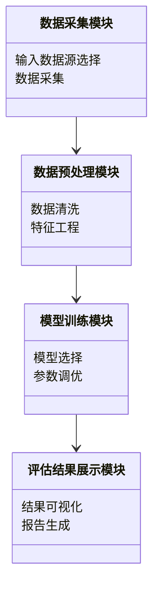
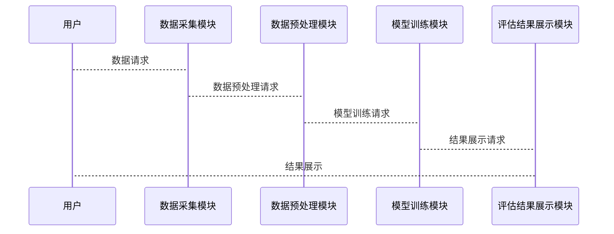

                 


# AI驱动的公司财务健康评估

> 关键词：AI驱动，公司财务健康评估，机器学习，深度学习，财务数据分析

> 摘要：随着人工智能技术的迅速发展，AI在财务健康评估中的应用越来越广泛。本文将深入探讨AI驱动的公司财务健康评估的背景、核心概念、算法原理、系统设计、项目实战以及最佳实践。通过详细的分析和实际案例，本文旨在为读者提供一个全面了解AI在财务健康评估中的应用的视角。

---

# 第1章: AI驱动的公司财务健康评估背景与意义

## 1.1 传统公司财务健康评估的局限性

### 1.1.1 传统财务评估方法的局限性
传统的财务健康评估方法主要依赖于财务报表分析，包括资产负债表、利润表和现金流量表等。这种方法虽然有一定的科学性，但存在以下问题：
- 数据范围有限：仅依赖财务数据，无法充分利用其他非财务数据（如市场数据、供应链数据等）。
- 主观性较强：评估结果很大程度上依赖于分析师的经验和判断，容易受到主观因素的影响。
- 静态分析：传统方法通常基于历史数据进行静态分析，难以捕捉动态变化的市场环境和企业经营状况。

### 1.1.2 人工评估的效率与准确性问题
人工评估效率低下，尤其是在面对海量数据时，容易出现遗漏或错误。此外，人工评估的主观性较强，可能导致评估结果不准确。

### 1.1.3 传统方法难以应对复杂数据与场景
随着企业规模的扩大和业务的复杂化，传统的财务评估方法难以应对复杂的业务场景和数据类型，例如多维度数据、实时数据等。

## 1.2 AI技术在财务领域的应用现状

### 1.2.1 AI在财务领域的典型应用
AI技术在财务领域的应用主要包括智能记账、智能报账、财务预测、风险评估等。例如，智能记账可以通过OCR技术自动识别和分类财务单据，显著提高效率。

### 1.2.2 大数据分析在财务评估中的作用
大数据分析能够整合企业内外部数据，提供更全面的评估视角。例如，结合市场数据和行业趋势，可以更准确地预测企业的财务健康状况。

### 1.2.3 当前AI驱动财务评估的主要挑战
当前AI驱动财务评估的主要挑战包括数据质量、模型泛化能力、模型解释性等问题。例如，数据缺失或噪声可能影响模型的准确性。

## 1.3 本章小结
本章介绍了传统财务评估方法的局限性，以及AI技术在财务领域的应用现状。通过对比分析，可以发现AI技术在提高财务评估效率和准确性方面具有显著优势。

---

# 第2章: AI驱动的公司财务健康评估核心概念与原理

## 2.1 数据来源与特征

### 2.1.1 财务数据的来源与分类
财务数据主要来源于企业的财务报表，包括资产负债表、利润表和现金流量表等。此外，还包括内部管理系统中的数据，如销售数据、采购数据等。

### 2.1.2 非财务数据的整合与应用
非财务数据（如市场数据、行业趋势、供应链数据等）的整合可以提供更全面的评估视角。例如，整合市场数据可以帮助预测企业的未来盈利能力。

### 2.1.3 关键特征的提取与选择
关键特征的提取与选择是提高模型准确性的关键步骤。例如，可以从财务数据中提取流动比率、速动比率等指标，从市场数据中提取行业平均利润率等指标。

## 2.2 AI模型与算法

### 2.2.1 常见AI模型在财务评估中的应用
在财务健康评估中，常见的AI模型包括逻辑回归、随机森林、支持向量机（SVM）、神经网络等。例如，随机森林模型常用于分类问题，而神经网络模型适用于复杂非线性关系的建模。

### 2.2.2 机器学习与深度学习的区别与适用场景
- 机器学习：基于特征的统计学习，适用于数据量较小、关系相对简单的场景。
- 深度学习：基于神经网络的特征学习，适用于数据量较大、关系复杂的场景。

### 2.2.3 模型选择与优化的关键点
模型选择与优化的关键点包括数据预处理、特征工程、模型调参等。例如，可以通过交叉验证来选择最优模型参数。

## 2.3 财务健康评估的指标体系

### 2.3.1 常见财务健康评估指标
常见的财务健康评估指标包括流动比率、速动比率、资产负债率、净利润率等。

### 2.3.2 指标权重的确定方法
指标权重的确定方法包括主成分分析（PCA）、层次分析法（AHP）等。例如，层次分析法可以通过专家打分来确定各个指标的权重。

### 2.3.3 多维度评估模型的设计
多维度评估模型的设计需要综合考虑财务、市场、供应链等多个维度的数据。例如，可以通过加权平均的方法将各个指标的评估结果综合起来，得到最终的财务健康评估结果。

## 2.4 本章小结
本章介绍了AI驱动的公司财务健康评估的核心概念与原理，包括数据来源与特征、AI模型与算法、财务健康评估的指标体系等内容。

---

# 第3章: AI驱动的公司财务健康评估算法原理与实现

## 3.1 数据预处理与特征工程

### 3.1.1 数据清洗与标准化
数据清洗是去除无效数据和异常值，数据标准化是将数据归一化到统一的范围内。例如，可以使用Z-score标准化方法。

### 3.1.2 特征选择与降维方法
特征选择方法包括基于统计的方法（如卡方检验）和基于模型的方法（如Lasso回归）。降维方法包括主成分分析（PCA）等。

### 3.1.3 数据增强与扩展
数据增强可以通过生成合成数据、引入外部数据源等方式来提高数据量和多样性。

## 3.2 模型训练与优化

### 3.2.1 常见机器学习算法的选择与实现
- 逻辑回归：适用于二分类问题，例如评估企业是否处于财务困境。
- 随机森林：适用于多分类问题，可以提供特征重要性的排序。
- 支持向量机（SVM）：适用于小样本数据的分类问题。

### 3.2.2 模型调参与优化策略
模型调参可以通过网格搜索（Grid Search）或随机搜索（Random Search）来选择最优参数。例如，可以调优随机森林的n_estimators和max_depth参数。

### 3.2.3 模型评估与验证方法
模型评估方法包括准确率、召回率、F1分数等。验证方法包括交叉验证和留出法。

## 3.3 基于深度学习的财务健康评估

### 3.3.1 深度学习模型在财务数据中的应用
深度学习模型在处理非结构化数据（如文本数据）方面具有优势，可以用于情感分析、新闻事件对企业财务影响的预测等。

### 3.3.2 神经网络结构设计与优化
神经网络结构设计包括输入层、隐藏层和输出层的设计。优化方法包括批量归一化（Batch Normalization）、学习率衰减等。

### 3.3.3 深度学习模型的优势与挑战
深度学习模型的优势在于能够处理复杂非线性关系，挑战在于需要大量数据和计算资源。

## 3.4 本章小结
本章详细介绍了AI驱动的公司财务健康评估的算法原理与实现，包括数据预处理与特征工程、模型训练与优化、基于深度学习的财务健康评估等内容。

---

# 第4章: AI驱动的公司财务健康评估系统设计与实现

## 4.1 问题场景介绍

### 4.1.1 问题背景
假设某企业需要评估其财务健康状况，希望通过AI技术实现自动化评估，提高评估效率和准确性。

### 4.1.2 问题描述
企业财务数据复杂，包括财务报表、销售数据、供应链数据等。需要设计一个AI系统，整合多源数据，进行财务健康评估。

## 4.2 系统功能设计

### 4.2.1 系统功能模块
系统功能模块包括数据采集模块、数据预处理模块、模型训练模块、评估结果展示模块等。

### 4.2.2 领域模型设计
领域模型设计使用Mermaid类图展示系统的各个模块及其关系。



## 4.3 系统架构设计

### 4.3.1 系统架构设计
系统架构设计使用Mermaid架构图展示系统的各个组件及其关系。


### 4.3.2 系统接口设计
系统接口设计使用Mermaid序列图展示系统各组件之间的交互过程。



## 4.4 本章小结
本章详细介绍了AI驱动的公司财务健康评估系统的设计与实现，包括问题场景介绍、系统功能设计、系统架构设计等内容。

---

# 第5章: AI驱动的公司财务健康评估项目实战

## 5.1 环境安装与配置

### 5.1.1 环境搭建
需要安装Python、Jupyter Notebook、Scikit-learn、XGBoost、TensorFlow等工具。

### 5.1.2 数据集准备
需要获取企业的财务数据和相关非财务数据，数据格式可以是CSV或Excel。

## 5.2 系统核心实现源代码

### 5.2.1 数据预处理代码
```python
import pandas as pd
from sklearn.preprocessing import StandardScaler

# 读取数据
data = pd.read_csv('financial_data.csv')

# 数据清洗
data.dropna(inplace=True)
data = data[~data.duplicated()]

# 特征工程
scaler = StandardScaler()
scaled_data = scaler.fit_transform(data[['revenue', 'profit', 'expenses']])
```

### 5.2.2 模型训练代码
```python
from sklearn.ensemble import RandomForestClassifier
from sklearn.model_selection import GridSearchCV

# 模型选择与调参
param_grid = {'n_estimators': [100, 200], 'max_depth': [None, 10, 20]}
grid_search = GridSearchCV(RandomForestClassifier(), param_grid, cv=5)
grid_search.fit(scaled_data, labels)
best_model = grid_search.best_estimator_
```

### 5.2.3 模型评估代码
```python
from sklearn.metrics import classification_report

# 模型评估
y_pred = best_model.predict(scaled_data)
print(classification_report(labels, y_pred))
```

## 5.3 项目小结
本章通过一个具体的项目实战，详细介绍了AI驱动的公司财务健康评估的实现过程，包括环境搭建、数据预处理、模型训练和评估等内容。

---

# 第6章: 总结与展望

## 6.1 总结
AI技术在公司财务健康评估中的应用显著提高了评估的效率和准确性。通过机器学习和深度学习算法，可以更好地捕捉复杂的财务关系和市场趋势。

## 6.2 未来展望
未来，随着AI技术的不断发展，公司财务健康评估将更加智能化和自动化。例如，可以通过引入实时数据流处理技术，实现动态财务评估；也可以通过模型解释性技术，提高模型的透明度和可信度。

## 6.3 最佳实践 tips
- 数据质量是模型性能的基础，需要重视数据清洗和特征工程。
- 模型选择与优化需要结合实际业务场景和数据特点。
- 模型解释性和可解释性是提升用户信任的重要因素。

## 6.4 本章小结
本章总结了AI驱动的公司财务健康评估的核心内容，并展望了未来的发展方向，同时给出了一些实用的建议。

---

# 作者：AI天才研究院 & 禅与计算机程序设计艺术

