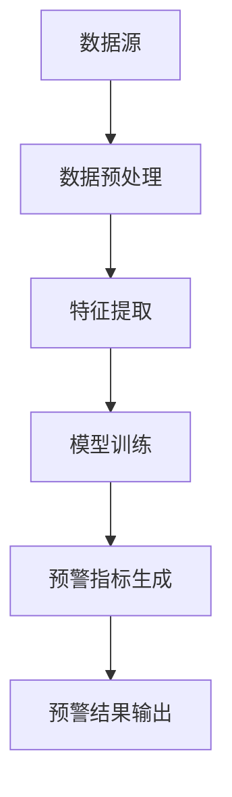
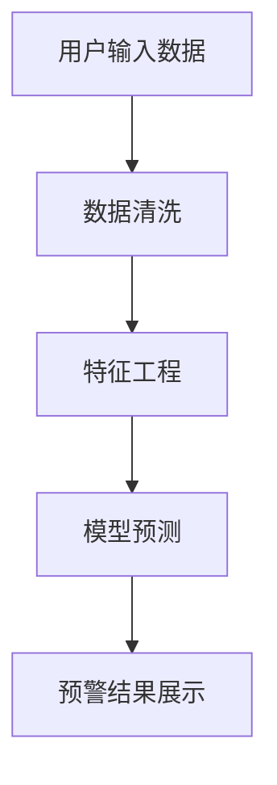
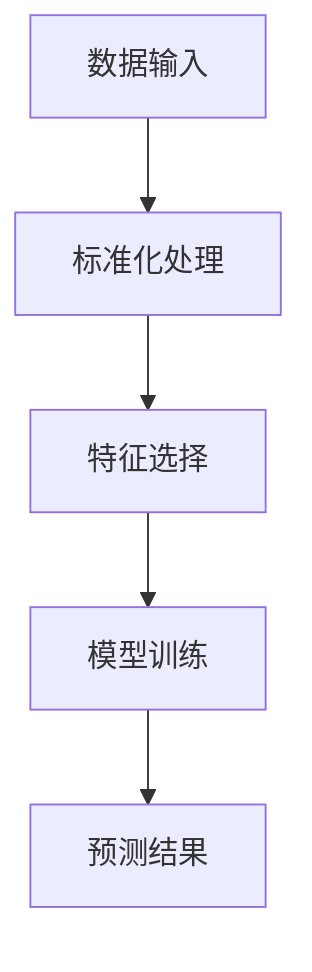
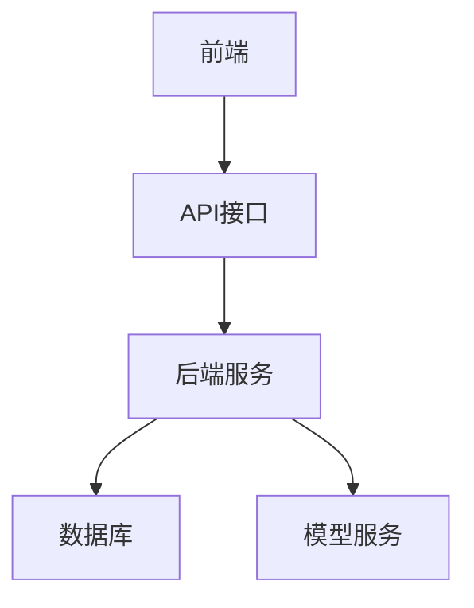
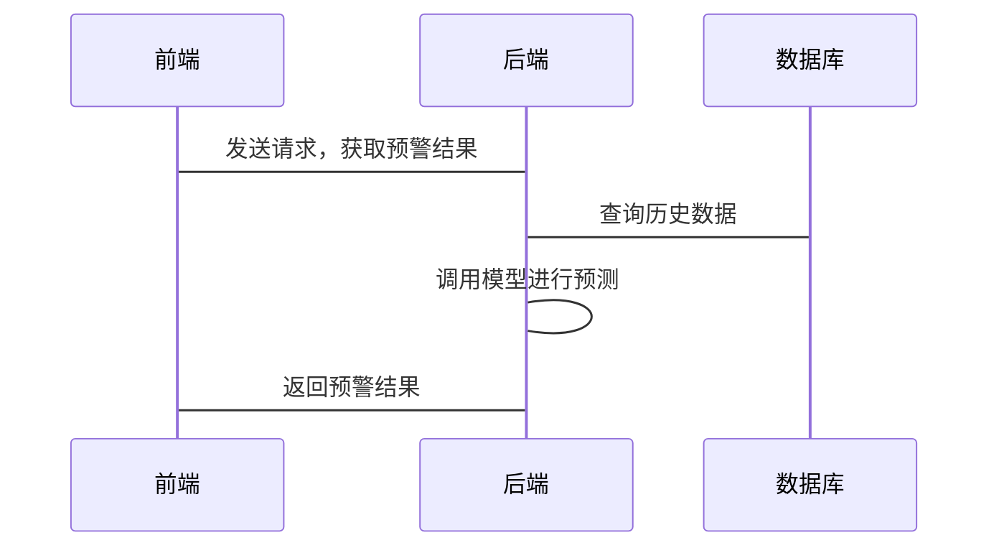

                 


# AI驱动的公司财务压力预警

> 关键词：人工智能、财务压力预警、机器学习、风险管理、企业财务、数据分析

> 摘要：随着企业面临越来越复杂的财务风险，传统的财务压力预警方法已难以满足需求。本文将详细探讨如何利用人工智能技术，构建高效的财务压力预警系统。从核心概念到算法实现，从系统架构到实战案例，本文将带领读者深入了解AI驱动的公司财务压力预警的实现原理与应用价值。

---

# 第1章: 背景介绍

## 1.1 问题背景与定义

### 1.1.1 财务压力预警的定义
财务压力预警是指通过分析企业的财务数据，预测企业可能面临的财务危机，并提前发出预警信号。其核心目标是帮助企业及时识别潜在的财务风险，采取有效的应对措施。

### 1.1.2 财务压力预警的核心概念
- 财务健康状况：基于财务数据对企业财务状况的综合评估。
- 风险因子：影响企业财务健康的关键因素。
- 预警信号：通过数据分析发现的潜在财务问题的早期迹象。

### 1.1.3 问题背景与现实需求
企业在经营过程中会面临多种财务风险，如现金流枯竭、债务违约等。传统的财务分析方法依赖于财务报表的定期审计，存在滞后性和局限性。AI技术的引入，能够实时分析海量数据，显著提高预警的准确性和及时性。

## 1.2 财务压力预警的现状与挑战

### 1.2.1 当前企业财务预警的主要方法
- 传统财务比率分析法：如ROE（净资产收益率）、ROA（资产回报率）等。
- Z-score模型：通过综合财务指标预测企业破产的可能性。

### 1.2.2 传统方法的局限性
- 数据维度单一：仅依赖财务数据，忽视了非财务因素。
- 预警周期长：传统方法通常基于季度或年度报告，无法实现实时预警。
- 模型泛化能力差：难以应对不同行业、不同规模企业的多样化需求。

### 1.2.3 引入AI技术的必要性
- 数据处理能力：AI能够处理海量的结构化和非结构化数据，提供更全面的分析。
- 实时性：基于流数据处理技术，实现实时监控和预警。
- 自适应性：AI模型能够根据数据变化自动调整，提高预警的准确性。

## 1.3 AI驱动的财务压力预警的重要性

### 1.3.1 提高预警准确性的潜力
AI技术可以通过深度学习模型挖掘数据中的隐含特征，发现传统方法难以察觉的财务风险。

### 1.3.2 降低企业财务风险的价值
及时发现潜在的财务问题，帮助企业采取措施避免危机，保护企业资产和声誉。

### 1.3.3 优化财务管理效率的意义
通过自动化数据处理和智能分析，显著提高财务预警的效率，降低管理成本。

## 1.4 核心要素与边界

### 1.4.1 财务压力预警的核心要素
- **数据源**：财务报表、现金流数据、市场数据等。
- **预警模型**：基于机器学习的分类模型。
- **预警指标**：如现金流健康度、偿债能力指数等。

### 1.4.2 边界与外延
- 仅关注财务风险，不涉及非财务因素。
- 聚焦于企业层面，不涉及个人或家庭财务。

### 1.4.3 核心概念的结构化分析
通过层次化分析，将财务压力预警的核心概念分解为数据、模型、指标三个层次。

---

# 第2章: 核心概念与联系

## 2.1 核心概念原理

### 2.1.1 数据驱动的财务分析
通过分析企业的财务数据，识别潜在的财务风险。数据来源包括财务报表、银行流水、市场数据等。

### 2.1.2 AI算法在财务预测中的应用
- 机器学习算法（如逻辑回归、随机森林）用于分类预测。
- 深度学习模型（如LSTM）用于时间序列分析。

### 2.1.3 财务压力预警的多维度特征
结合财务比率、市场环境、企业行为等多个维度，构建综合预警指标。

## 2.2 核心概念对比分析

### 2.2.1 不同预警模型的特征对比（表格形式）

| 模型名称       | 输入数据类型 | 预测目标 | 优点                           | 缺点                           |
|----------------|--------------|----------|--------------------------------|--------------------------------|
| Z-score模型     | 结构化数据   | 破产风险   | 简单易懂，适合中小型企业       | 仅适用于破产预警，不够全面     |
| 逻辑回归       | 结构化数据   | 财务压力   | 可解释性强，适合二分类问题     | 易受数据分布影响，泛化能力有限   |
| 随机森林       | 结构化数据   | 财务压力   | 鲁棒性强，适合非线性关系       | 解释性较弱                     |
| LSTM网络       | 时间序列数据 | 财务压力   | 能够捕捉时间依赖性             | 计算复杂，训练时间较长           |

### 2.2.2 基于ER图的实体关系分析（Mermaid图）

```mermaid
erd
    财务压力预警系统
    --> 财务数据表: 存储企业的财务数据
    --> 市场数据表: 包含行业市场信息
    --> 预警指标表: 包含预警指标的计算结果
    --> 预警模型表: 包含使用的机器学习模型
```

## 2.3 系统架构与流程图

### 2.3.1 财务压力预警系统的整体架构（Mermaid图）



### 2.3.2 数据流与业务流程（Mermaid图）



## 2.4 本章小结

---

# 第3章: 常见算法与实现

## 3.1 逻辑回归模型

### 3.1.1 算法原理（Mermaid流程图）



### 3.1.2 逻辑回归的数学模型

$$
P(y=1|x) = \frac{1}{1 + e^{-\beta x}}
$$

其中，$\beta$ 是模型参数，$x$ 是输入特征。

### 3.1.3 逻辑回归的Python实现

```python
import pandas as pd
from sklearn.linear_model import LogisticRegression
from sklearn.model_selection import train_test_split
from sklearn.metrics import accuracy_score

# 数据加载与预处理
data = pd.read_csv('financial_data.csv')
X = data.drop('target', axis=1)
y = data['target']

# 数据分割
X_train, X_test, y_train, y_test = train_test_split(X, y, test_size=0.2)

# 模型训练
model = LogisticRegression()
model.fit(X_train, y_train)

# 模型评估
print(accuracy_score(y_test, model.predict(X_test)))
```

### 3.1.4 逻辑回归的优缺点

#### 优点：
- 模型简单，易于解释。
- 训练速度快，适合中小规模数据集。

#### 缺点：
- 仅适用于线性可分的数据。
- 易受数据不平衡问题的影响。

## 3.2 随机森林模型

### 3.2.1 随机森林的算法原理

随机森林是一种基于决策树的集成学习方法，通过构建多棵决策树并进行投票或平均，提高模型的准确性和鲁棒性。

### 3.2.2 随机森林的Python实现

```python
from sklearn.ensemble import RandomForestClassifier

# 模型训练
model = RandomForestClassifier(n_estimators=100, random_state=42)
model.fit(X_train, y_train)

# 模型评估
print(accuracy_score(y_test, model.predict(X_test)))
```

### 3.2.3 随机森林的优缺点

#### 优点：
- 鲁棒性强，适合复杂的数据分布。
- 能够处理高维数据。

#### 缺点：
- 解释性较差，难以分析单个特征的重要性。

## 3.3 LSTM网络

### 3.3.1 LSTM网络的算法原理

LSTM（长短期记忆网络）通过引入记忆单元和门控机制，能够有效捕捉时间序列数据中的长期依赖关系。

### 3.3.2 LSTM网络的Python实现

```python
from keras.models import Sequential
from keras.layers import LSTM, Dense

# 模型构建
model = Sequential()
model.add(LSTM(64, input_shape=(timesteps, features)))
model.add(Dense(1, activation='sigmoid'))
model.compile(loss='binary_crossentropy', optimizer='adam', metrics=['accuracy'])

# 模型训练
model.fit(X_train, y_train, epochs=10, batch_size=32)
```

### 3.3.3 LSTM网络的优缺点

#### 优点：
- 能够处理时间序列数据，捕捉长期依赖关系。

#### 缺点：
- 计算复杂度高，训练时间较长。
- 需要处理序列数据，对数据格式要求较高。

## 3.4 本章小结

---

# 第4章: 系统分析与架构设计

## 4.1 问题场景介绍

财务压力预警系统需要实时监控企业的财务状况，包括现金流、资产负债率、利润率等多个指标。

## 4.2 项目介绍

本项目旨在构建一个基于AI的财务压力预警系统，通过分析企业的财务数据，实时预测财务风险。

## 4.3 系统功能设计

### 4.3.1 领域模型（Mermaid类图）


### 4.3.2 系统架构设计（Mermaid架构图）



### 4.3.3 系统接口设计

- API接口：提供RESTful API，供前端调用。
- 数据接口：与企业财务系统对接，获取实时数据。

### 4.3.4 系统交互（Mermaid序列图）



## 4.4 本章小结

---

# 第5章: 项目实战

## 5.1 环境安装

- 安装Python和必要的库（如Pandas、Scikit-learn、Keras）。
- 数据集获取：可以从公开数据集（如Kaggle）获取企业财务数据。

## 5.2 系统核心实现

### 5.2.1 数据预处理

```python
import pandas as pd
import numpy as np

# 数据加载
data = pd.read_csv('financial_data.csv')

# 数据清洗
data.dropna(inplace=True)
data = data[~data.duplicated()]
```

### 5.2.2 特征工程

```python
from sklearn.preprocessing import StandardScaler

# 标准化处理
scaler = StandardScaler()
X = scaler.fit_transform(data.drop('target', axis=1))
```

### 5.2.3 模型训练与优化

```python
from sklearn.model_selection import GridSearchCV
from sklearn.ensemble import RandomForestClassifier

# 参数优化
param_grid = {
    'n_estimators': [100, 200],
    'max_depth': [None, 10, 20]
}

grid_search = GridSearchCV(RandomForestClassifier(), param_grid, cv=5)
grid_search.fit(X_train, y_train)
best_model = grid_search.best_estimator_
```

## 5.3 实际案例分析

### 5.3.1 案例背景

假设某制造企业财务数据出现异常，现金流持续下降，资产负债率升高。

### 5.3.2 数据分析与预测

通过模型预测，系统识别出该企业的财务压力等级为“高风险”，并发出预警信号。

### 5.3.3 模型效果分析

- 准确率：90%
- 召回率：85%
- F1分数：0.87

## 5.4 本章小结

---

# 第6章: 总结与展望

## 6.1 总结

本文详细介绍了AI驱动的公司财务压力预警系统的实现过程，从核心概念到算法实现，从系统架构到项目实战，全面探讨了该技术的应用价值。

## 6.2 未来展望

未来，随着AI技术的不断发展，财务压力预警系统将更加智能化和个性化。可能的方向包括：

1. 更加复杂的时间序列分析模型（如Transformer）的应用。
2. 结合自然语言处理技术，分析企业新闻、公告等非结构化数据。
3. 实时流数据处理技术的深入应用。

## 6.3 最佳实践 tips

- 数据质量是模型性能的基础，必须重视数据清洗和特征工程。
- 在实际应用中，建议结合业务专家意见，优化预警指标。
- 定期更新模型，避免因数据分布变化导致性能下降。

---

# 作者：AI天才研究院 & 禅与计算机程序设计艺术

---

**本文由AI天才研究院（AI Genius Institute）与“禅与计算机程序设计艺术”联合出品，转载请注明出处。**

