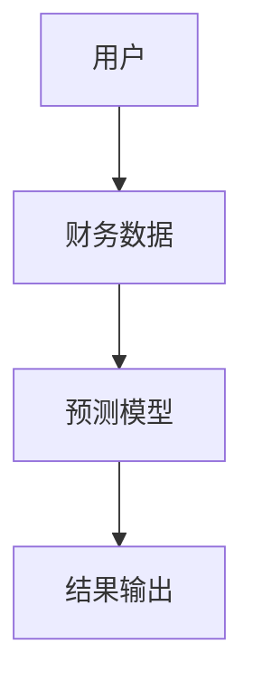
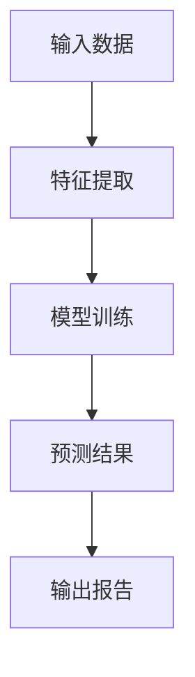
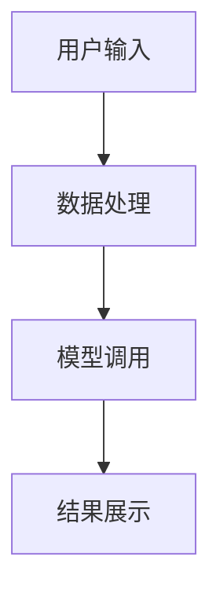

                 


# AI驱动的公司财务规划工具

> 关键词：AI驱动、公司财务规划、工具设计、算法模型、系统架构、项目实战

> 摘要：本文深入探讨了AI技术如何驱动公司财务规划工具的发展，从传统财务规划的局限性出发，详细阐述了AI驱动工具的核心概念、算法原理、系统架构设计及项目实现。通过对比分析和案例实战，展示了AI如何提升财务规划的效率和准确性，为企业的财务管理提供了创新思路。

---

## 第一部分: AI驱动的公司财务规划工具概述

### 第1章: 财务规划的背景与挑战

#### 1.1 传统财务规划的局限性
- **传统财务规划的核心概念**：介绍传统财务规划的基本概念，包括预算编制、预测分析等。
- **传统财务规划的主要问题**：分析传统方法在数据处理、预测精度和实时性方面的不足。
- **传统财务规划的边界与外延**：探讨传统财务规划的应用范围及其局限性。

#### 1.2 AI驱动的财务规划工具的优势
- **AI技术的核心概念**：介绍AI的基本原理及其在数据分析中的应用。
- **AI在财务规划中的应用前景**：分析AI如何提升财务预测的准确性和效率。
- **AI驱动工具的边界与外延**：探讨AI驱动工具的应用范围及其未来发展方向。

#### 1.3 本章小结
总结传统财务规划的不足及AI驱动工具的优势，为后续章节奠定基础。

---

## 第二部分: AI驱动的财务规划工具核心概念与联系

### 第2章: 核心概念与原理

#### 2.1 数据采集与处理
- **数据来源的多样性**：分析财务数据的多来源特性，包括内部数据和外部市场数据。
- **数据预处理的关键步骤**：详细讲解数据清洗、转换和标准化的过程。
- **数据清洗与标准化**：通过案例展示如何处理缺失值和异常值。

#### 2.2 算法模型
- **神经网络模型的原理**：介绍神经网络的基本结构及其在财务预测中的应用。
- **机器学习算法的选择与优化**：分析不同算法的适用场景及优化方法。
- **深度学习模型的结构与特点**：探讨深度学习在复杂财务预测中的优势。

#### 2.3 用户交互与反馈
- **用户界面设计的原则**：讲解如何设计直观的用户界面以提高用户体验。
- **用户反馈机制的作用**：分析反馈机制如何帮助优化模型。
- **个性化推荐系统的实现**：介绍如何基于用户行为提供个性化财务建议。

#### 2.4 核心概念对比表格
| 概念 | 描述 | 优势 | 劣势 |
|------|------|------|------|
| 数据采集 | 获取财务数据 | 高效性 | 数据质量 |
| 算法模型 | 数据处理与预测 | 准确性 | 复杂性 |
| 用户交互 | 提供反馈 | 易用性 | 依赖性 |

#### 2.5 ER实体关系图


#### 2.6 本章小结
总结AI驱动工具的核心模块及其相互关系。

---

## 第三部分: AI驱动的财务规划工具算法原理

### 第3章: 算法原理与实现

#### 3.1 神经网络模型
- **神经网络的基本结构**：介绍输入层、隐藏层和输出层的作用。
- **神经网络的训练过程**：详细讲解前向传播和反向传播的过程。
- **神经网络的实现案例**：通过Python代码展示神经网络的实现。

#### 3.2 机器学习算法
- **机器学习算法的选择与优化**：分析线性回归、决策树等算法的适用场景。
- **机器学习算法的实现案例**：展示随机森林算法在财务预测中的应用。

#### 3.3 深度学习模型
- **深度学习模型的结构与特点**：探讨卷积神经网络和循环神经网络的应用。
- **深度学习模型的数学公式**：展示损失函数和优化器的数学表达。

#### 3.4 算法流程图


#### 3.5 本章小结
总结不同算法的特点及其在财务规划中的应用。

---

## 第四部分: AI驱动的财务规划工具系统架构设计

### 第4章: 系统分析与架构设计

#### 4.1 问题场景介绍
- **项目介绍**：定义项目目标和范围，明确用户需求。
- **系统功能设计**：通过领域模型类图展示系统功能模块。

#### 4.2 系统架构设计
- **系统架构图**：展示系统的分层架构，包括数据层、业务逻辑层和表现层。
- **系统接口设计**：详细描述API接口的设计与交互流程。

#### 4.3 系统交互流程图


#### 4.4 本章小结
总结系统架构设计的关键点。

---

## 第五部分: AI驱动的财务规划工具项目实战

### 第5章: 项目实战与分析

#### 5.1 环境安装与配置
- **环境要求**：列出所需的操作系统、Python版本和相关库的安装步骤。

#### 5.2 系统核心实现源代码
```python
import pandas as pd
from sklearn.neural_network import MLPRegressor

# 数据加载
data = pd.read_csv('financial_data.csv')

# 数据预处理
X = data.drop('target', axis=1)
y = data['target']

# 模型训练
model = MLPRegressor(hidden_layer_sizes=(100, 10))
model.fit(X, y)

# 预测与评估
预测结果 = model.predict(X)
```

#### 5.3 代码应用解读与分析
- **代码功能分析**：解释每部分代码的作用，展示如何实现模型训练和预测。
- **代码优化建议**：提出如何通过超参数调优提高模型性能。

#### 5.4 实际案例分析
- **案例背景介绍**：描述具体财务规划场景，如销售预测。
- **案例分析与结果展示**：通过图表展示预测结果，对比实际数据与预测数据的差异。

#### 5.5 本章小结
总结项目实现的关键步骤和成果。

---

## 第六部分: 总结与展望

### 第6章: 总结与最佳实践

#### 6.1 项目总结
- **项目成果**：总结通过AI工具实现的财务规划的优势。
- **经验总结**：分享项目实施中的经验教训。

#### 6.2 最佳实践
- **技术建议**：推荐使用哪些工具和框架。
- **业务建议**：建议企业在实施AI工具时考虑的因素。

#### 6.3 未来展望
- **技术发展**：预测AI技术在财务规划中的未来发展方向。
- **应用场景**：探讨更多可能的AI应用领域。

#### 6.4 注意事项
- **数据隐私**：提醒企业在使用AI工具时注意数据隐私和合规性。
- **模型维护**：建议定期更新模型以保持其准确性。

#### 6.5 拓展阅读
- **推荐书籍**：推荐几本关于AI和财务规划的书籍。
- **推荐阅读文章**：推荐相关的技术博客和研究论文。

---

## 作者：AI天才研究院/AI Genius Institute & 禅与计算机程序设计艺术 /Zen And The Art of Computer Programming

---

这篇文章从背景介绍到项目实战，全面系统地探讨了AI驱动的公司财务规划工具的设计与实现。通过丰富的图表和代码示例，深入浅出地解释了相关技术原理，为读者提供了实用的指导和参考。

