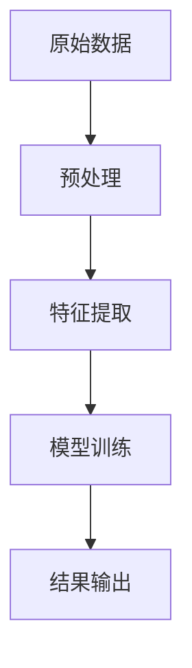
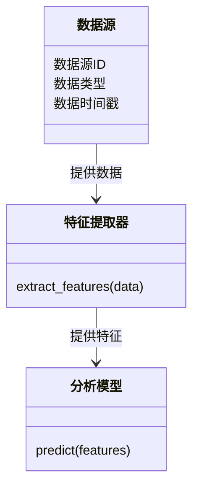
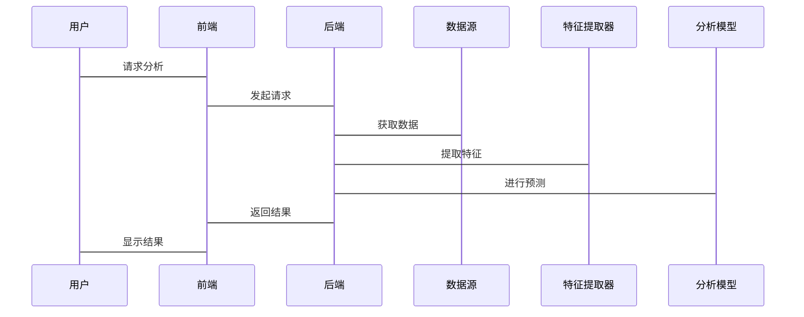

                 


# AI驱动的另类数据信号提取

## 关键词：AI，数据信号提取，另类数据，深度学习，系统架构设计

## 摘要：  
随着人工智能技术的飞速发展，另类数据（Alternative Data）在各个领域的应用越来越广泛。本文将深入探讨AI驱动的另类数据信号提取的关键技术，包括数据背景介绍、核心算法原理、系统架构设计以及实际项目案例分析。通过理论与实践相结合的方式，详细解析如何利用AI技术高效提取和分析数据信号，为读者提供全面的技术指导和实践参考。

---

# 第一部分: AI驱动的另类数据信号提取背景介绍

## 第1章: 另类数据信号提取的背景与问题描述

### 1.1 问题背景  
#### 1.1.1 传统数据与另类数据的定义  
传统数据通常指结构化数据（如表格数据）和非结构化数据（如文本、图像）。另类数据则是指非传统金融、经济或市场数据，例如卫星图像、社交媒体数据、物流数据、物联网设备数据等。  

#### 1.1.2 另类数据在AI驱动分析中的重要性  
另类数据能够提供传统数据无法获取的信息，例如通过卫星图像分析地表变化，或通过社交媒体情绪分析市场情绪。AI技术能够从这些复杂数据中提取有价值的信息，帮助做出更精准的决策。  

#### 1.1.3 数据信号提取的挑战与机遇  
另类数据的多样性和复杂性带来了提取信号的挑战，但同时也为AI技术的应用提供了机遇。例如，深度学习模型能够从大量非结构化数据中提取潜在模式。  

### 1.2 问题描述  
#### 1.2.1 另类数据的特征与属性  
- **多样性**：数据来源多样，格式多样。  
- **实时性**：部分数据需要实时处理。  
- **噪声多**：数据中可能包含大量干扰信息。  

#### 1.2.2 数据信号提取的目标与意义  
目标是通过AI技术从另类数据中提取有用的信号，例如从社交媒体数据中提取情绪指标。意义在于提高数据利用率，挖掘潜在价值。  

#### 1.2.3 问题解决的边界与外延  
边界包括数据来源的限制和模型的适用范围；外延则包括对数据质量的依赖和模型的可解释性。  

### 1.3 核心概念与联系  
#### 1.3.1 另类数据信号的结构与组成  
- 数据源：如社交媒体、卫星图像等。  
- 数据类型：结构化和非结构化数据。  
- 数据特征：时间戳、地理位置、内容等。  

#### 1.3.2 核心概念的属性特征对比表  

| 特征属性 | 传统数据 | 另类数据 |  
|----------|----------|----------|  
| 结构化程度 | 高       | 低       |  
| 数据来源 | 表格、数据库 | 社交媒体、卫星图像 |  
| 数据量   | 中等      | 大       |  

#### 1.3.3 ER实体关系图的Mermaid流程图  
```mermaid
er
    entity 另类数据信号 {
        <属性> ID
        <属性> 信号类型
        <属性> 信号强度
        <属性> 信号时间戳
    }
    entity 数据源 {
        <属性> 数据源ID
        <属性> 数据类型
        <属性> 数据时间戳
    }
    另类数据信号 --> 数据源: 来自
```

---

# 第二部分: 另类数据信号提取的核心算法原理

## 第2章: 数据信号提取的算法原理  

### 2.1 特征提取算法  
#### 2.1.1 基于AI的特征提取流程  
1. 数据预处理：清洗、归一化等。  
2. 特征提取：使用深度学习模型（如CNN、RNN）提取特征。  
3. 特征选择：去除冗余特征。  

#### 2.1.2 算法原理的Mermaid流程图  


#### 2.1.3 代码实现示例  
```python
def extract_features(data):
    # 数据预处理
    processed_data = preprocess(data)
    # 特征提取
    features = model.extract_features(processed_data)
    return features
```

### 2.2 模式识别与分类算法  
#### 2.2.1 基于深度学习的模式识别  
使用卷积神经网络（CNN）或循环神经网络（RNN）进行模式识别。  

#### 2.2.2 算法原理的数学模型和公式  
$$y = f(x; \theta)$$  
其中，$x$ 是输入数据，$\theta$ 是模型参数，$y$ 是输出结果。  

---

# 第三部分: 系统分析与架构设计  

## 第3章: 系统架构设计与实现  

### 3.1 问题场景介绍  
描述一个实际场景，例如从社交媒体数据中提取情绪信号。  

### 3.2 系统功能设计  
#### 3.2.1 领域模型Mermaid类图  


### 3.3 系统架构设计  
#### 3.3.1 Mermaid架构图  


### 3.4 系统接口设计  
#### 3.4.1 Mermaid序列图  


---

# 第四部分: 项目实战  

## 第4章: 项目实战与案例分析  

### 4.1 环境安装与配置  
安装Python、TensorFlow、Pandas等工具。  

### 4.2 核心代码实现  
#### 4.2.1 数据加载与预处理  
```python
import pandas as pd

def load_data():
    data = pd.read_csv('alternative_data.csv')
    return data

def preprocess(data):
    # 数据清洗和归一化
    processed_data = data.dropna()
    processed_data = (processed_data - processed_data.mean()) / processed_data.std()
    return processed_data
```

#### 4.2.2 模型训练与预测  
```python
import tensorflow as tf
from tensorflow.keras import layers

def build_model(input_shape):
    model = tf.keras.Sequential()
    model.add(layers.Conv2D(32, (3, 3), activation='relu', input_shape=input_shape))
    model.add(layers.MaxPooling2D((2, 2)))
    model.add(layers.Flatten())
    model.add(layers.Dense(64, activation='relu'))
    model.add(layers.Dense(1, activation='sigmoid'))
    model.compile(optimizer='adam', loss='binary_crossentropy', metrics=['accuracy'])
    return model
```

### 4.3 案例分析与结果展示  
以社交媒体情绪分析为例，展示提取的情绪信号及其对市场的影响。  

---

# 第五部分: 总结与展望  

## 第5章: 总结与最佳实践  

### 5.1 最佳实践Tips  
- 数据预处理是关键，需仔细清洗和归一化。  
- 模型选择需根据数据类型和任务目标。  
- 结果分析需结合业务背景。  

### 5.2 小结  
本文全面介绍了AI驱动的另类数据信号提取的背景、算法、系统架构和项目实战，为读者提供了理论与实践结合的指导。  

### 5.3 注意事项  
- 数据隐私需严格保护。  
- 模型需定期更新以保持泛化能力。  

### 5.4 拓展阅读与深入学习  
推荐阅读《深度学习》（Ian Goodfellow）和《Python机器学习》（Andreas Müller）等书籍，深入学习相关技术。

---

作者：AI天才研究院/AI Genius Institute & 禅与计算机程序设计艺术 /Zen And The Art of Computer Programming

