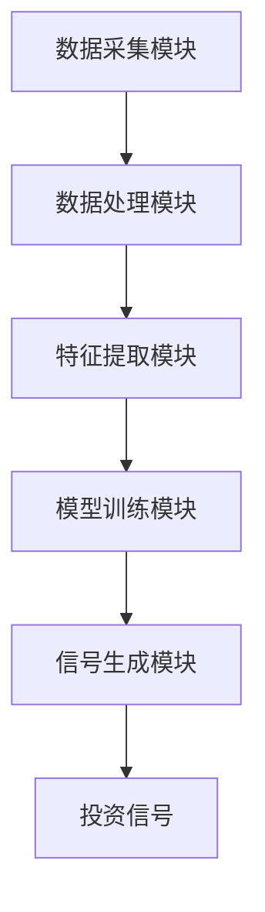

                 


# AI驱动的另类数据投资信号提取

> 关键词：AI, 另类数据, 投资信号提取, 机器学习, 数据分析

> 摘要：本文详细探讨了利用人工智能技术从另类数据中提取投资信号的方法，介绍了从数据处理到模型构建的完整流程，通过具体案例分析展示了AI在投资领域的应用潜力。

---

# 第一部分: AI驱动的另类数据投资信号提取背景介绍

## 第1章: AI驱动的另类数据投资信号提取概述

### 1.1 问题背景与定义
#### 1.1.1 投资信号提取的传统方法
传统投资信号提取主要依赖于历史价格数据和财务报表分析，这种方法在一定程度上能够帮助投资者做出决策，但其局限性日益明显。随着市场环境的复杂化，仅依赖传统数据难以捕捉市场波动的全貌。

#### 1.1.2 另类数据的定义与特点
另类数据指的是传统金融数据之外的非结构化数据，例如社交媒体帖子、新闻标题、卫星图像、专利申请等。这些数据能够提供更多维度的市场信息，帮助投资者更好地理解市场动态。

#### 1.1.3 AI驱动的信号提取的优势
人工智能技术，特别是自然语言处理和深度学习技术，能够从大量非结构化数据中提取有价值的信号，弥补传统方法的不足。

### 1.2 问题描述与解决思路
#### 1.2.1 另类数据在投资中的应用现状
当前，另类数据在投资领域的应用还处于起步阶段，但其潜力巨大。越来越多的机构开始尝试利用社交媒体情绪分析、新闻事件监测等技术辅助投资决策。

#### 1.2.2 传统方法的局限性
传统方法依赖于有限的数据来源，难以捕捉市场情绪、消费者行为等动态变化的信息。

#### 1.2.3 AI技术如何解决这些问题
AI技术能够从非结构化数据中提取情感、主题等信息，通过模式识别和预测模型，帮助投资者发现潜在的投资机会。

### 1.3 问题的边界与外延
#### 1.3.1 数据范围的界定
本文主要关注文本数据和图像数据，不涉及音频和视频数据。

#### 1.3.2 投资场景的限制
本文主要讨论股票和基金投资，不涉及外汇和衍生品市场。

#### 1.3.3 与其他投资方法的对比
AI驱动的信号提取方法与传统方法相比，能够提供更实时、更全面的市场信息。

### 1.4 核心概念与结构
#### 1.4.1 核心概念的组成要素
- 数据来源：社交媒体、新闻、专利申请等。
- 数据处理：清洗、特征提取、数据增强。
- 模型构建：自然语言处理、深度学习模型。
- 信号生成：投资信号提取、信号优化。

#### 1.4.2 概念之间的关系
数据来源通过数据处理生成特征，特征输入模型进行训练，最终生成投资信号。

#### 1.4.3 与现有投资理论的联系
AI驱动的信号提取方法是对传统投资理论的补充，旨在利用技术手段提升投资决策的效率和准确性。

---

# 第二部分: 核心概念与联系

## 第2章: 另类数据与AI驱动方法

### 2.1 另类数据的属性特征
#### 2.1.1 数据类型对比
| 数据类型 | 特点 | 示例 |
|----------|------|------|
| 文本数据 | 非结构化，包含情感和主题 | 社交媒体帖子、新闻标题 |
| 图像数据 | 需要计算机视觉处理 | 卫星图像、产品图片 |

#### 2.1.2 数据来源的多样性
- 社交媒体平台：推特、脸书、LinkedIn。
- 新闻网站：金融时报、彭博社。
- 公司网站：产品发布、财报披露。

#### 2.1.3 数据处理的复杂性
- 文本数据需要分词、情感分析等处理。
- 图像数据需要目标检测、图像分割等处理。

### 2.2 AI驱动的信号提取方法
#### 2.2.1 方法的原理
通过自然语言处理技术提取文本中的情感和主题信息，结合时间序列分析预测市场走势。

#### 2.2.2 方法的优缺点
- 优点：实时性高，能够捕捉市场情绪变化。
- 缺点：数据质量不稳定，可能出现噪声干扰。

#### 2.2.3 方法之间的对比
- 情感分析：基于文本的情感判断。
- 主题建模：基于文本的主题提取。

### 2.3 ER实体关系图
```mermaid
er
  投资者 -> 数据来源: 提供
  数据来源 -> 数据处理: 输入
  数据处理 -> 特征提取: 生成
  特征提取 -> 模型训练: 输入
  模型训练 -> 投资信号: 输出
  投资者 -> 投资信号: 使用
```

---

# 第三部分: 算法原理讲解

## 第3章: AI驱动的信号提取算法

### 3.1 特征提取
#### 3.1.1 文本特征提取
- 使用TF-IDF提取关键词。
- 使用词嵌入模型（如Word2Vec）生成词向量。

#### 3.1.2 图像特征提取
- 使用卷积神经网络（CNN）提取图像特征。

### 3.2 模型训练
#### 3.2.1 情感分析模型
- 使用循环神经网络（RNN）或变换器模型（如BERT）进行情感分类。

#### 3.2.2 时间序列预测模型
- 使用LSTM网络预测市场走势。

### 3.3 信号生成
#### 3.3.1 投资信号提取
- 根据模型预测结果生成买入、卖出信号。

#### 3.3.2 信号优化
- 使用ensembl
  e方法优化信号的准确性。

---

# 第四部分: 数学模型

## 第4章: 信号提取的数学模型

### 4.1 情感分析模型
$$
\text{情感极性} = f(\text{文本内容})
$$

### 4.2 时间序列预测模型
$$
\text{预测值} = \text{LSTM}(\text{输入序列})
$$

### 4.3 优化模型
$$
\text{优化目标} = \min \sum_{i=1}^{n} (y_i - \hat{y_i})^2
$$

---

# 第五部分: 系统分析与架构设计

## 第5章: 系统分析

### 5.1 问题场景介绍
- 数据采集模块：从社交媒体和新闻网站获取数据。
- 数据处理模块：清洗、特征提取。
- 模型训练模块：训练情感分析和时间序列预测模型。
- 信号生成模块：生成投资信号并优化。

### 5.2 系统架构设计


### 5.3 系统接口设计
- 数据采集模块接口：`get_data(source, start_date, end_date)`
- 模型训练模块接口：`train_model(data, labels)`
- 信号生成模块接口：`generate_signal(model, data)`

---

## 第6章: 项目实战

### 6.1 环境安装
- 安装Python和相关库（如TensorFlow、NLTK、Pillow）。

### 6.2 核心实现
```python
import tensorflow as tf
from tensorflow.keras import layers

# 数据处理
text_data = [...]  # 文本数据
image_data = [...]  # 图像数据

# 特征提取
text_features = extract_features(text_data)
image_features = extract_features(image_data)

# 模型构建
model = tf.keras.Sequential([
    layers.Dense(64, activation='relu'),
    layers.Dense(1, activation='sigmoid')
])

# 训练模型
model.compile(optimizer='adam', loss='binary_crossentropy', metrics=['accuracy'])
model.fit(features, labels, epochs=10, batch_size=32)

# 生成信号
predictions = model.predict(test_data)
signals = generate_signals(predictions)
```

### 6.3 实际案例分析
通过实际数据训练模型，并分析模型在不同市场环境下的表现。

---

# 第六部分: 总结

## 第7章: 总结与展望

### 7.1 最佳实践
- 数据预处理是关键，需要仔细清洗和特征提取。
- 模型调参和优化能够显著提升性能。
- 持续监控和优化模型性能是长期任务。

### 7.2 小结
本文详细介绍了AI驱动的另类数据投资信号提取方法，从数据处理到模型构建，再到信号生成，为读者提供了完整的解决方案。

### 7.3 注意事项
- 数据隐私和合规性问题需要高度重视。
- 模型的鲁棒性和可解释性需要进一步研究。

### 7.4 拓展阅读
- 《Deep Learning for NLP》
- 《时间序列分析与 forecasting》

---

# 作者：AI天才研究院 & 禅与计算机程序设计艺术

通过本文的详细讲解，读者能够系统地了解AI驱动的另类数据投资信号提取的核心方法和技术细节，为实际应用提供理论支持和实践指导。

