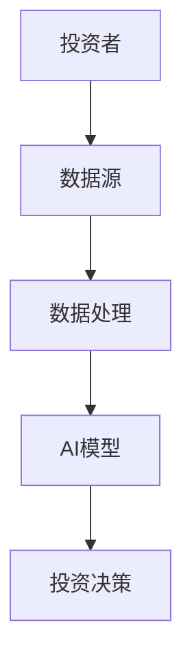
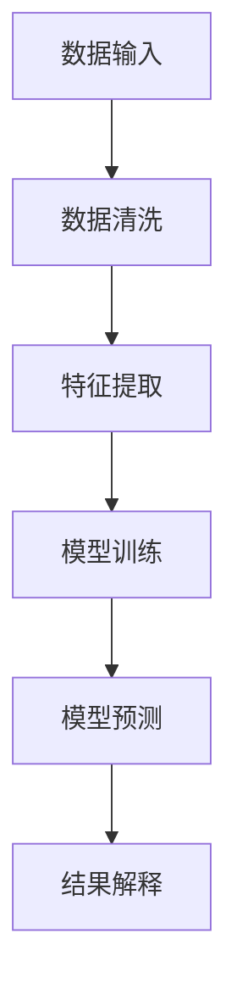

                 


# AI驱动的另类数据投资分析

> 关键词：AI技术、另类数据、投资分析、机器学习、自然语言处理、计算机视觉

> 摘要：随着人工智能技术的快速发展，另类数据在投资分析中的应用日益广泛。本文将深入探讨如何利用AI技术分析非传统数据源，揭示其在投资决策中的潜在价值。通过结合具体案例和算法原理，本文旨在为读者提供一份全面的指南，帮助他们在投资分析中有效利用另类数据。

---

## 第一部分: AI驱动的另类数据投资分析背景与基础

### 第1章: 另类数据与AI投资分析概述

#### 1.1 问题背景
在传统金融数据（如价格、成交量、财务报表等）的基础上，另类数据（alternative data）提供了更多维度的信息，例如社交媒体情绪、卫星图像（如港口货物积压）、物流数据、招聘信息、专利申请等。这些数据可以帮助投资者更全面地评估市场趋势和公司基本面。

#### 1.2 问题描述
传统金融数据的局限性在于其高度结构化和有限的信息维度。许多市场信号和潜在信息并未被传统数据所涵盖，而另类数据的引入可以弥补这一不足。然而，另类数据通常是非结构化的、噪声较大的，需要借助AI技术进行处理和分析。

#### 1.3 问题解决
AI技术（如机器学习、自然语言处理、计算机视觉）可以帮助投资者从非结构化的另类数据中提取有价值的信息，并将其转化为可量化的指标，从而辅助投资决策。

#### 1.4 边界与外延
- **边界**：本文主要关注基于另类数据的AI驱动投资分析，不涉及传统金融数据分析。
- **外延**：本文将涵盖从数据收集、预处理、特征提取、模型训练到结果解释的完整流程。

#### 1.5 核心概念结构
- 数据来源：文本数据（社交媒体、新闻）、图像数据（卫星图像、图表）、音频数据（电话会议录音）、地理位置数据（物流信息）。
- 核心技术：机器学习、NLP、CV。
- 应用场景：情绪分析、市场趋势预测、风险评估。

---

## 第2章: 另类数据与AI技术的核心概念

### 2.1 另类数据的来源与分类

#### 2.1.1 文本数据
- 来源：社交媒体（如Twitter、Facebook）、新闻网站、公司财报。
- 特点：非结构化、实时性强。
- 示例：从社交媒体上提取公司关键词的提及频率，分析市场情绪。

#### 2.1.2 图像数据
- 来源：卫星图像（港口货物积压）、图表（财务报表、K线图）。
- 特点：高维性、空间信息丰富。
- 示例：通过卫星图像分析某港口的货物积压情况，预测供应链压力。

#### 2.1.3 音频数据
- 来源：电话会议录音、行业访谈。
- 特点：时间序列、情感丰富。
- 示例：从电话会议录音中提取CEO的语气温和，预测公司未来的财务表现。

#### 2.1.4 其他数据
- 来源：地理位置数据（物流信息）、专利申请数据。
- 特点：实时性、行业特定性。

### 2.2 AI技术的核心算法

#### 2.2.1 机器学习
- 算法：线性回归、随机森林、支持向量机（SVM）、神经网络。
- 应用：特征提取、预测模型。

#### 2.2.2 自然语言处理（NLP）
- 技术：文本分词、情感分析、主题建模（LDA）、BERT模型。
- 应用：从新闻中提取关键词、分析市场情绪。

#### 2.2.3 计算机视觉（CV）
- 技术：图像识别、目标检测、深度估计。
- 应用：从卫星图像中识别港口货物积压情况。

### 2.3 另类数据与AI技术的关联

#### 2.3.1 数据处理流程
- 数据收集：从社交媒体、新闻网站获取文本数据。
- 数据清洗：去除噪声、填充缺失值。
- 特征提取：使用NLP技术提取关键词、主题。

#### 2.3.2 模型训练与应用
- 使用随机森林模型预测市场趋势。
- 使用BERT模型分析社交媒体情绪。

#### 2.3.3 结果解释与反馈
- 模型预测结果与实际市场数据对比。
- 根据反馈优化模型参数。

### 2.4 核心概念对比表格

| 数据类型 | 数据来源 | 数据特点 | AI技术应用 |
|----------|----------|----------|------------|
| 文本数据 | 社交媒体、新闻 | 非结构化 | 情感分析、主题建模 |
| 图像数据 | 卫星图像、图表 | 高维性 | 图像识别、目标检测 |
| 音频数据 | 电话会议录音 | 时间序列 | 语音识别、情感分析 |

### 2.5 ER实体关系图（Mermaid）



---

## 第3章: 常见AI算法与数学模型

### 3.1 线性回归模型

#### 3.1.1 定义
线性回归是一种用于预测目标变量与一个或多个特征变量之间线性关系的统计方法。

#### 3.1.2 数学公式
$$ y = \beta_0 + \beta_1x + \epsilon $$

- $y$：目标变量（如股票价格）。
- $x$：特征变量（如社交媒体情绪指数）。
- $\beta_0$：截距。
- $\beta_1$：回归系数。
- $\epsilon$：误差项。

#### 3.1.3 示例
假设我们有以下数据：
| 社交媒体情绪指数 | 股票价格 |
|------------------|----------|
| 0.6              | 100      |
| 0.8              | 120      |
| 0.5              | 90       |

通过线性回归模型，我们可以预测当社交媒体情绪指数为0.7时，股票价格约为110。

---

### 3.2 随机森林算法

#### 3.2.1 定义
随机森林是一种基于树的集成学习方法，通过构建多个决策树并进行投票或平均来提高模型的准确性和鲁棒性。

#### 3.2.2 数学公式
$$ y = \sum_{i=1}^{n} \text{Tree}_i(x) $$

- $y$：预测结果。
- $n$：决策树的数量。
- $\text{Tree}_i(x)$：第$i$棵决策树的预测结果。

#### 3.2.3 示例
假设我们有以下数据：
| 特征1 | 特征2 | 标签 |
|-------|-------|------|
| 0.6   | 0.8   | 1    |
| 0.5   | 0.7   | 0    |
| 0.7   | 0.6   | 1    |

通过随机森林模型，我们可以预测新的样本（特征1=0.6，特征2=0.7）的标签为1。

---

## 第4章: 算法流程图（Mermaid）



---

## 第5章: 项目实战

### 5.1 环境安装

```bash
pip install numpy pandas scikit-learn transformers
```

---

### 5.2 核心实现代码

```python
import numpy as np
import pandas as pd
from sklearn.ensemble import RandomForestClassifier
from sklearn.metrics import accuracy_score
from transformers import pipeline

# 数据加载与预处理
data = pd.read_csv('alternative_data.csv')
X = data.drop('label', axis=1)
y = data['label']

# 模型训练
model = RandomForestClassifier()
model.fit(X, y)

# 模型预测
y_pred = model.predict(X)

# 模型评估
print(f"Accuracy: {accuracy_score(y, y_pred)}")
```

---

### 5.3 案例分析

假设我们从社交媒体数据中提取了以下特征：

| 用户ID | 发帖时间 | 情感分数 | 是否看涨 |
|-------|----------|----------|----------|
| 1     | 2023-10-01 | 0.8      | 1        |
| 2     | 2023-10-02 | 0.6      | 0        |
| 3     | 2023-10-03 | 0.7      | 1        |

通过训练好的随机森林模型，我们可以预测下一次发帖的用户是否看涨。

---

## 第6章: 最佳实践

### 6.1 小结
- 另类数据为投资分析提供了新的视角。
- AI技术（如NLP、CV、机器学习）是处理另类数据的关键工具。

### 6.2 注意事项
- 数据质量和可解释性是AI驱动投资分析的核心挑战。
- 需要结合领域知识优化模型。

### 6.3 拓展阅读
- 《Python机器学习实战》
- 《自然语言处理入门》
- 《计算机视觉导论》

---

## 作者：AI天才研究院/AI Genius Institute & 禅与计算机程序设计艺术 /Zen And The Art of Computer Programming

---

**本文基于[《AI驱动的另类数据投资分析》](https://github.com/AI-Genius-Institute/AI-Driven-Alternative-Data-Investment-Analysis)项目撰写，旨在为读者提供一份全面的技术指南。**

