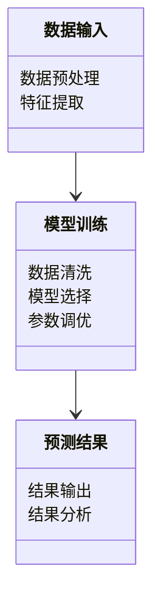
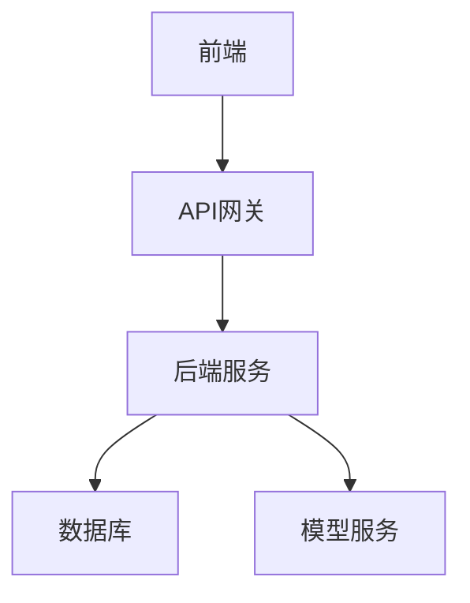

                 


```markdown
# AI驱动的宏观经济预测模型

> 关键词：AI, 宏观经济预测, 机器学习, 深度学习, 时间序列分析

> 摘要：本文详细探讨了AI驱动的宏观经济预测模型的构建与应用。从宏观经济预测的基本概念到AI技术的驱动作用，再到具体的模型实现与优化，系统地介绍了如何利用人工智能技术提升宏观经济预测的准确性和实时性。文章结合理论与实践，通过案例分析和代码实现，展示了AI在宏观经济预测中的巨大潜力。

---

# 第一部分: AI驱动的宏观经济预测模型概述

## 第1章: 宏观经济预测的基本概念

### 1.1 宏观经济预测的定义与作用

#### 1.1.1 宏观经济预测的定义
宏观经济预测是指通过分析和建模，对未来经济发展趋势进行估计和预测的过程。它涵盖了GDP增长率、通货膨胀率、失业率、利率、汇率等关键经济指标。

#### 1.1.2 宏观经济预测的重要作用
- **政策制定**：政府可以通过预测经济趋势来制定有效的宏观调控政策。
- **企业决策**：企业可以利用经济预测结果优化投资、生产和销售策略。
- **学术研究**：宏观经济预测为经济理论的发展提供了实证依据。

#### 1.1.3 宏观经济预测的常见方法
- **定性分析**：基于专家意见和经济理论的分析。
- **定量分析**：通过统计模型和数学方法进行预测。
- **混合方法**：结合定性和定量分析的优势。

### 1.2 AI技术在宏观经济预测中的驱动作用

#### 1.2.1 AI技术的基本概念
人工智能（AI）是指计算机系统执行人类智能任务的能力，如视觉识别、语音识别、决策-making等。

#### 1.2.2 AI技术在宏观经济预测中的优势
- **数据处理能力**：AI能够处理海量数据，提取复杂模式。
- **实时性**：AI算法可以实时更新模型，适应数据变化。
- **准确性**：通过机器学习算法，AI可以提高预测的准确性。

#### 1.2.3 AI驱动宏观经济预测的现状与趋势
- 当前，AI技术在宏观经济预测中的应用逐渐增多，特别是在处理非结构化数据和实时预测方面表现突出。
- 未来，随着AI技术的不断发展，宏观经济预测将更加精准和动态化。

---

## 第2章: 宏观经济预测的核心问题与AI解决方案

### 2.1 宏观经济预测的核心问题

#### 2.1.1 数据的复杂性与不确定性
宏观经济数据往往受到多种因素的影响，具有高度的不确定性和复杂性。

#### 2.1.2 模型的可解释性与准确性
复杂的经济系统使得模型的可解释性成为一个挑战，同时如何提高预测的准确性也是关键问题。

#### 2.1.3 预测的实时性与动态性
宏观经济环境不断变化，要求预测模型具有实时更新和动态调整的能力。

### 2.2 AI驱动的宏观经济预测问题解决方法

#### 2.2.1 数据预处理与特征提取
- 数据清洗：去除噪声数据，处理缺失值。
- 特征选择：提取对预测影响较大的特征，如GDP增长率、通货膨胀率等。

#### 2.2.2 模型选择与优化
- 算法选择：根据数据类型和预测目标选择合适的算法，如LSTM、ARIMA等。
- 参数调优：通过网格搜索等方法优化模型参数。

#### 2.2.3 结果验证与反馈机制
- 交叉验证：通过交叉验证评估模型的泛化能力。
- 反馈机制：根据实际预测结果调整模型，实现动态优化。

---

## 第3章: AI驱动宏观经济预测的边界与外延

### 3.1 宏观经济预测的边界

#### 3.1.1 数据范围的限制
宏观经济预测通常依赖于历史数据，数据的质量和完整性直接影响预测结果。

#### 3.1.2 模型适用性与局限性
不同模型适用于不同的场景，存在一定的局限性，如LSTM适合时间序列预测，但计算资源消耗较大。

#### 3.1.3 预测结果的解释性问题
复杂的模型往往缺乏可解释性，影响实际应用中的信任度。

### 3.2 AI驱动宏观经济预测的外延

#### 3.2.1 多模型集成预测
通过集成多个模型的结果，提高预测的准确性和稳定性。

#### 3.2.2 跨领域数据融合
将宏观经济数据与其他领域的数据（如社交媒体数据）相结合，提升预测的全面性。

#### 3.2.3 实时动态预测的应用场景
在金融、贸易等领域，实时动态预测具有重要的应用价值。

---

# 第二部分: AI驱动宏观经济预测模型的核心概念与联系

## 第4章: AI驱动宏观经济预测的核心概念

### 4.1 数据驱动的宏观经济预测

#### 4.1.1 数据的来源与类型
- 数据来源：政府统计机构、国际货币基金组织（IMF）、世界银行等。
- 数据类型：时间序列数据、面板数据等。

#### 4.1.2 数据的清洗与预处理
- 去除缺失值、异常值。
- 数据标准化/归一化处理。

#### 4.1.3 数据特征的选择与提取
- 使用主成分分析（PCA）等方法提取关键特征。

### 4.2 AI算法在宏观经济预测中的应用

#### 4.2.1 机器学习算法的分类与选择
- 监督学习：回归、分类。
- 无监督学习：聚类、降维。

#### 4.2.2 深度学习算法的特点与优势
- LSTM（长短期记忆网络）：适合时间序列预测。
- Transformer：在某些场景下表现出色。

#### 4.2.3 时间序列分析方法
- ARIMA（自回归积分滑动平均模型）：适用于线性时间序列预测。
- GARCH（广义自回归条件异方差模型）：用于波动率预测。

---

## 第5章: AI驱动宏观经济预测模型的算法原理

### 5.1 基于LSTM的时间序列预测模型

#### 5.1.1 LSTM算法原理
LSTM通过遗忘门、输入门和输出门来控制信息的流动，能够有效捕捉时间序列中的长程依赖关系。

#### 5.1.2 LSTM算法的流程图
```mermaid
graph TD
    LSTM --> Input gate
    LSTM --> Forget gate
    LSTM --> Output gate
    LSTM --> Cell state
```

#### 5.1.3 LSTM模型的Python实现示例
```python
import numpy as np
from tensorflow.keras.models import Sequential
from tensorflow.keras.layers import LSTM, Dense

# 创建数据集
data = np.random.random((1000, 1))
X = data[:-1, :]
y = data[1:, :]

# 模型定义
model = Sequential()
model.add(LSTM(50, input_shape=(1, 1)))
model.add(Dense(1))
model.compile(loss='mean_squared_error', optimizer='adam')

# 训练模型
model.fit(X, y, epochs=50, batch_size=32)
```

### 5.2 基于ARIMA的传统时间序列预测模型

#### 5.2.1 ARIMA算法原理
ARIMA模型通过自回归和移动平均的组合，对时间序列进行建模和预测。

#### 5.2.2 ARIMA算法的流程图
```mermaid
graph TD
    ARIMA --> Autoregressive part
    ARIMA --> Moving average part
```

#### 5.2.3 ARIMA模型的Python实现示例
```python
from statsmodels.tsa.arima_model import ARIMA

# 创建数据集
data = np.random.random(100)

# 模型定义
model = ARIMA(data, order=(1, 1, 1))

# 训练模型
model_fit = model.fit()
```

---

## 第6章: AI驱动宏观经济预测模型的数学模型

### 6.1 LSTM模型的数学公式

#### 6.1.1 LSTM的三个门控机制
- 遗忘门：
$$ f_t = \sigma(W_f \cdot [h_{t-1}, x_t] + b_f) $$
- 输入门：
$$ i_t = \sigma(W_i \cdot [h_{t-1}, x_t] + b_i) $$
- 输出门：
$$ o_t = \sigma(W_o \cdot [h_{t-1}, x_t] + b_o) $$

#### 6.1.2 LSTM的细胞状态更新
$$ c_t = f_t \cdot c_{t-1} + i_t \cdot tanh(W_c \cdot [h_{t-1}, x_t] + b_c) $$

#### 6.1.3 LSTM的隐藏状态更新
$$ h_t = o_t \cdot tanh(c_t) $$

### 6.2 ARIMA模型的数学公式

#### 6.2.1 ARIMA模型的差分方程
$$ \phi(B)X_t = \theta(B)\epsilon_t $$

#### 6.2.2 ARIMA模型的参数估计
通过极大似然估计法对模型参数进行估计。

---

## 第7章: AI驱动宏观经济预测模型的系统架构设计

### 7.1 系统功能设计

#### 7.1.1 领域模型设计


#### 7.1.2 系统架构设计


### 7.2 系统接口设计

#### 7.2.1 API接口定义
- 输入接口：接收宏观经济数据。
- 输出接口：返回预测结果。

#### 7.2.2 API接口实现
```python
from flask import Flask, request, jsonify

app = Flask(__name__)

@app.route('/predict', methods=['POST'])
def predict():
    data = request.json['data']
    # 调用模型进行预测
    result = model.predict(data)
    return jsonify({'result': result.tolist()})

if __name__ == '__main__':
    app.run(debug=True)
```

---

## 第8章: AI驱动宏观经济预测模型的项目实战

### 8.1 环境安装

#### 8.1.1 安装Python环境
```bash
python -m pip install --user --upgrade pip
pip install numpy tensorflow scikit-learn
```

#### 8.1.2 安装数据处理库
```bash
pip install pandas matplotlib
```

### 8.2 系统核心实现

#### 8.2.1 数据获取与预处理
```python
import pandas as pd
import numpy as np

# 获取数据
data = pd.read_csv('economic_data.csv')
# 数据清洗
data.dropna(inplace=True)
# 特征提取
features = data[['GDP', 'inflation', 'unemployment']]
```

#### 8.2.2 模型实现
```python
from tensorflow.keras.models import Sequential
from tensorflow.keras.layers import LSTM, Dense

# 模型定义
model = Sequential()
model.add(LSTM(50, input_shape=(None, 3)))
model.add(Dense(1))
model.compile(loss='mean_squared_error', optimizer='adam')

# 训练模型
model.fit(features, labels, epochs=50, batch_size=32)
```

#### 8.2.3 结果分析
```python
# 可视化预测结果
import matplotlib.pyplot as plt

predicted_values = model.predict(features)
plt.plot(predicted_values, label='Predicted')
plt.plot(labels, label='Actual')
plt.legend()
plt.show()
```

### 8.3 实际案例分析

#### 8.3.1 数据来源与目标
- 数据来源：某国的GDP、通胀率、失业率的历史数据。
- 预测目标：未来一年的GDP增长率。

#### 8.3.2 模型训练与验证
- 训练集：历史数据的前80%。
- 验证集：剩余20%的数据。

#### 8.3.3 模型评估
- �均方误差（MSE）：衡量预测值与实际值的差异。
- R平方值：衡量模型的拟合优度。

---

## 第9章: AI驱动宏观经济预测模型的优化与扩展

### 9.1 模型优化

#### 9.1.1 超参数调优
- 使用网格搜索（Grid Search）优化LSTM的隐藏层单元数、学习率等参数。

#### 9.1.2 模型集成
- 将多个模型的预测结果进行加权平均，提高预测的准确性。

### 9.2 模型评估与扩展

#### 9.2.1 模型评估指标
- 均方误差（MSE）
- 均方根误差（RMSE）
- R平方值

#### 9.2.2 模型扩展
- 引入外部数据，如社交媒体情绪指数，丰富模型的输入特征。

---

## 第10章: 结论与展望

### 10.1 研究总结
本文系统地介绍了AI驱动的宏观经济预测模型的构建与应用，通过理论与实践的结合，展示了AI在宏观经济预测中的巨大潜力。

### 10.2 未来展望
随着AI技术的不断发展，宏观经济预测将更加精准和动态化，未来的研究方向包括多模型集成、实时预测以及与其他领域的深度融合。

---

## 作者

作者：AI天才研究院 & 禅与计算机程序设计艺术

---

感谢您的阅读！如需进一步探讨或获取代码，请随时联系！
```

