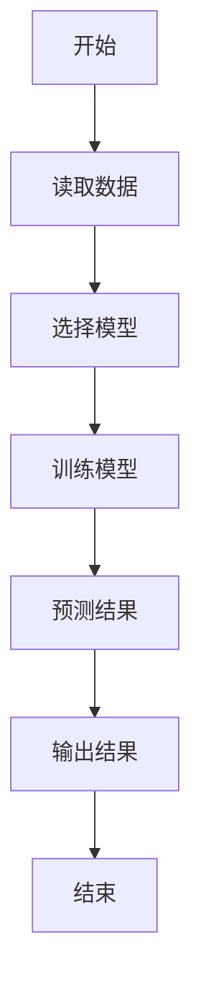
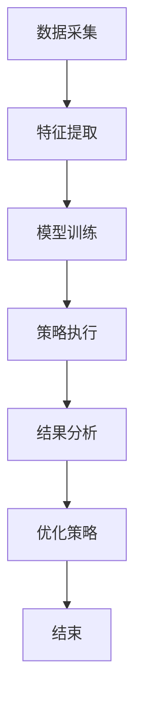

                 


# AI驱动的对冲基金策略分析

## 关键词：人工智能、对冲基金、策略分析、算法、量化交易、风险管理

## 摘要：本文深入探讨AI技术如何驱动对冲基金策略分析的创新与优化，从背景、核心概念、算法原理到系统架构和项目实战，全面解析AI在金融领域的应用，助力读者掌握利用AI技术提升投资决策能力的核心方法。

---

# 第一部分：AI驱动的对冲基金策略分析基础

## 第1章：AI与对冲基金的背景介绍

### 1.1 对冲基金的定义与特点

#### 1.1.1 对冲基金的定义
对冲基金是一种通过利用市场波动，采取多空策略进行投资的金融工具。其核心目标是通过杠杆操作和多样化投资组合来实现超额收益。

#### 1.1.2 对冲基金的核心特点
- **多空策略**：同时投资于股票和其衍生品，通过市场波动获利。
- **杠杆效应**：通过借入资金放大投资收益，但也增加了风险。
- **多样化投资**：通过投资多种资产和策略分散风险。
- **高流动性**：对冲基金通常具有较高的流动性，便于快速调整投资组合。

#### 1.1.3 对冲基金的类型与分类
对冲基金可以根据多种标准进行分类：
- **按策略分类**：包括股票多空策略、量化策略、套利策略等。
- **按投资标的分类**：包括股票型、债券型、商品型等。
- **按管理方式分类**：包括主动管理型和被动管理型。

### 1.2 AI技术在金融领域的应用

#### 1.2.1 AI技术的定义与特点
人工智能（AI）是指模拟人类智能的计算机系统，具有学习、推理和自适应能力。其特点包括：
- **数据驱动**：依赖大量数据进行训练和推理。
- **自动化**：能够自动完成任务，减少人工干预。
- **自适应**：能够根据新数据调整模型和策略。

#### 1.2.2 AI在金融领域的核心应用
- **量化交易**：利用算法进行高频交易，捕捉市场机会。
- **风险管理**：通过模型预测市场风险，优化投资组合。
- **客户画像**：利用机器学习分析客户行为，提供个性化服务。

#### 1.2.3 AI技术对对冲基金的影响
AI技术的应用显著提升了对冲基金的交易效率和策略优化能力。通过大数据分析和复杂模型，AI能够发现传统方法难以察觉的投资机会，同时降低人为错误的风险。

### 1.3 AI驱动的对冲基金策略分析的背景

#### 1.3.1 传统对冲基金策略的局限性
- **人工决策的主观性**：人为判断可能导致情绪化决策。
- **交易速度的限制**：传统交易依赖人工判断，难以应对高频交易的需求。
- **数据处理能力有限**：传统方法难以处理海量数据，导致信息滞后。

#### 1.3.2 AI技术如何解决传统策略的痛点
- **提高交易速度**：通过算法实现毫秒级交易，捕捉短期市场机会。
- **优化决策过程**：利用大数据分析和机器学习模型，提高决策的客观性和准确性。
- **降低人为错误**：自动化交易系统减少了人为情绪对决策的影响。

#### 1.3.3 AI驱动的对冲基金策略分析的必要性
随着金融市场的日益复杂化，传统的对冲基金策略难以应对市场的快速变化。AI技术的应用不仅提升了交易效率，还能够发现更多潜在的投资机会，为对冲基金带来了显著的竞争优势。

### 1.4 本章小结
本章介绍了对冲基金的基本概念和特点，探讨了AI技术在金融领域的应用及其对对冲基金的影响，最后强调了AI驱动的对冲基金策略分析的必要性。通过对冲基金与AI的结合，我们可以实现更高效、更精准的投资决策。

---

## 第2章：AI驱动的对冲基金策略分析核心概念

### 2.1 数据特征与策略构建

#### 2.1.1 数据特征的定义与分类
数据特征是对冲基金策略分析的基础，包括市场数据、交易数据、新闻数据等多种类型。常见的数据特征包括：
- **市场数据**：如股票价格、指数波动等。
- **交易数据**：如交易量、订单簿等。
- **新闻数据**：如公司公告、行业新闻等。

#### 2.1.2 数据特征对策略构建的影响
不同的数据特征会影响策略的收益和风险。例如，市场数据可以帮助预测市场趋势，交易数据可以揭示市场参与者的交易行为，新闻数据可以提供公司基本面信息。

#### 2.1.3 数据特征的提取与处理
数据特征的提取与处理是策略构建的关键步骤，包括：
- **数据清洗**：去除噪声数据，确保数据的准确性和完整性。
- **特征选择**：通过统计分析和机器学习方法选择重要的特征。
- **特征工程**：对特征进行转换和组合，提升模型的性能。

### 2.2 策略框架与模型选择

#### 2.2.1 策略框架的定义与特点
策略框架是对冲基金策略的核心结构，包括数据输入、特征提取、模型训练和交易决策等模块。常见的策略框架包括：
- **统计套利策略**：通过统计分析发现市场中的套利机会。
- **动量策略**：基于动量效应进行投资，即买入表现好的资产，卖出表现差的资产。
- **因子模型**：基于因子分析构建投资组合，如价值因子、动量因子等。

#### 2.2.2 不同模型的选择标准
模型的选择需要考虑多个因素，包括数据量、数据类型、目标函数和计算资源等。常见的模型包括：
- **线性回归模型**：用于预测资产价格。
- **支持向量机（SVM）**：用于分类和回归任务。
- **随机森林**：用于特征重要性分析和非线性关系建模。
- **神经网络**：用于复杂非线性关系的建模。

#### 2.2.3 模型选择的优化方法
模型选择的优化方法包括：
- **交叉验证**：通过交叉验证评估模型的泛化能力。
- **超参数优化**：通过网格搜索或随机搜索优化模型参数。
- **集成学习**：通过集成多个模型提升预测性能。

### 2.3 风险管理与收益优化

#### 2.3.1 风险管理的定义与方法
风险管理是对冲基金策略的重要组成部分，包括风险评估、风险控制和风险对冲等步骤。常用的风险管理方法包括：
- **VaR（在险价值）**：评估投资组合在一定置信水平下的潜在损失。
- **CVaR（条件在险价值）**：评估在最坏情况下的潜在损失。
- **波动率控制**：通过限制投资组合的波动率来控制风险。

#### 2.3.2 收益优化的策略与技巧
收益优化的目标是在控制风险的前提下，最大化投资收益。常用策略包括：
- **资产配置优化**：通过优化资产配置提高投资收益。
- **交易成本控制**：通过减少交易次数和规模降低交易成本。
- **杠杆优化**：合理使用杠杆放大收益，同时控制杠杆风险。

#### 2.3.3 风险与收益的平衡点
在对冲基金策略中，风险与收益是需要平衡的两个核心因素。通过合理的风险管理策略和收益优化方法，可以在两者之间找到最佳平衡点，实现稳健的投资收益。

### 2.4 核心概念与联系

#### 2.4.1 核心概念原理
AI驱动的对冲基金策略分析的核心在于利用大数据和机器学习模型，发现市场中的潜在规律和机会，从而优化投资决策。

#### 2.4.2 概念属性特征对比表格
下表展示了对冲基金策略分析中一些核心概念的属性对比：

| 概念       | 特征               | 优点                           | 缺点                           |
|------------|--------------------|--------------------------------|--------------------------------|
| 数据特征   | 市场数据、交易数据、新闻数据 | 提供丰富的市场信息              | 数据处理复杂，需要清洗和转换 |
| 策略框架   | 统计套利、动量策略、因子模型 | 适用于不同市场环境              | 模型选择影响收益和风险         |
| 风险管理   | VaR、CVaR、波动率控制 | 控制潜在损失，保障投资安全      | 可能限制投资收益                |

#### 2.4.3 ER实体关系图架构的 Mermaid 流程图
```mermaid
erDiagram
    actor 投资者 {
        <属性> 投资金额
        <属性> 风险偏好
    }
    actor 市场数据 {
        <属性> 股票价格
        <属性> 指数波动
    }
    entity 交易数据 {
        <属性> 交易量
        <属性> 订单簿
    }
    entity 新闻数据 {
        <属性> 公司公告
        <属性> 行业新闻
    }
    entity 数据特征 {
        <属性> 市场数据
        <属性> 交易数据
        <属性> 新闻数据
    }
    entity 策略模型 {
        <属性> 线性回归模型
        <属性> 支持向量机模型
        <属性> 随机森林模型
    }
    entity 投资组合 {
        <属性> 资产配置
        <属性> 交易成本
        <属性> 波动率
    }
    entity 风险管理 {
        <属性> VaR
        <属性> CVaR
        <属性> 波动率控制
    }
    entity 投资收益 {
        <属性> 收益优化
        <属性> 风险控制
        <属性> 收益与风险平衡
    }
    投资者 --> 数据特征
    数据特征 --> 策略模型
    策略模型 --> 投资组合
    投资组合 --> 风险管理
    风险管理 --> 投资收益
```

### 2.5 本章小结
本章详细探讨了AI驱动的对冲基金策略分析的核心概念，包括数据特征、策略框架、模型选择、风险管理与收益优化。通过对比分析和ER实体关系图，我们明确了各个概念之间的联系和作用，为后续章节的深入分析奠定了基础。

---

## 第3章：AI驱动的对冲基金策略分析算法原理

### 3.1 算法原理概述

#### 3.1.1 算法原理的定义与特点
算法原理是对冲基金策略分析的数学基础，包括回归分析、聚类分析、时间序列分析等方法。这些算法通过分析数据特征，发现数据中的潜在规律，从而优化投资决策。

#### 3.1.2 常用算法的分类与比较
常用的算法包括：
- **回归分析**：用于预测资产价格。
- **聚类分析**：用于市场分割和客户画像。
- **时间序列分析**：用于预测未来市场走势。
- **神经网络**：用于复杂非线性关系的建模。
- **强化学习**：用于动态决策和策略优化。

#### 3.1.3 算法原理的数学模型
数学模型是算法的核心，例如线性回归模型的公式为：
$$ y = \beta_0 + \beta_1 x + \epsilon $$
其中，$y$ 是目标变量，$x$ 是自变量，$\beta_0$ 和 $\beta_1$ 是回归系数，$\epsilon$ 是误差项。

### 3.2 算法原理的详细讲解

#### 3.2.1 算法原理的数学推导
以线性回归为例，假设我们有 $n$ 组数据，每组数据包括自变量 $x_i$ 和目标变量 $y_i$。线性回归的目标是最小化预测值与实际值之间的平方误差之和：
$$ \text{最小化} \sum_{i=1}^{n} (y_i - (\beta_0 + \beta_1 x_i))^2 $$
通过求导并解方程组，可以得到回归系数 $\beta_0$ 和 $\beta_1$ 的估计值。

#### 3.2.2 算法原理的代码实现
以下是一个简单的线性回归实现代码：
```python
import numpy as np
from sklearn.linear_model import LinearRegression

# 生成数据
X = np.array([[1, 2], [3, 4], [5, 6]])
y = np.array([7, 8, 9])

# 训练模型
model = LinearRegression()
model.fit(X, y)

# 预测
print(model.predict([[7, 8]]))  # 输出：[[10]]
```

#### 3.2.3 算法原理的代码应用解读与分析
上述代码展示了如何利用线性回归模型进行预测。通过训练数据，模型学习了自变量与目标变量之间的线性关系，并能够根据新的自变量值预测目标变量。

#### 3.2.4 算法原理的数学公式与流程图
线性回归的流程图如下：


### 3.3 算法原理的总结与注意事项

#### 3.3.1 算法原理的总结
通过对冲基金策略分析中常用的算法，我们可以看到每种算法都有其独特的优势和应用场景。例如，线性回归适用于线性关系的建模，聚类分析适用于市场分割，神经网络适用于复杂非线性关系的建模。

#### 3.3.2 算法原理的注意事项
- **数据质量**：算法的性能依赖于数据的质量，数据清洗和特征工程是关键步骤。
- **模型选择**：不同的算法适用于不同的场景，需要根据具体问题选择合适的算法。
- **模型评估**：通过交叉验证等方法评估模型的性能，避免过拟合和欠拟合。

### 3.4 本章小结
本章详细讲解了AI驱动的对冲基金策略分析中常用的算法原理，包括数学模型、代码实现和流程图。通过对这些算法的深入理解，我们可以更好地利用它们优化对冲基金策略。

---

## 第4章：AI驱动的对冲基金策略分析系统架构设计

### 4.1 系统架构设计概述

#### 4.1.1 系统架构设计的定义与特点
系统架构设计是对冲基金策略分析系统的蓝图，包括数据采集、特征提取、模型训练、策略执行和结果分析等模块。系统的架构设计需要考虑数据流、功能模块和系统交互。

#### 4.1.2 系统架构设计的目标
系统架构设计的目标是实现对冲基金策略分析的高效性和可扩展性，确保系统的稳定性和安全性。

### 4.2 系统架构设计的具体内容

#### 4.2.1 数据采集模块
数据采集模块负责收集市场数据、交易数据和新闻数据等。数据来源包括：
- **市场数据**：如股票价格、指数波动等。
- **交易数据**：如交易量、订单簿等。
- **新闻数据**：如公司公告、行业新闻等。

#### 4.2.2 特征提取模块
特征提取模块对采集的数据进行清洗、转换和组合，生成有助于模型训练的数据特征。

#### 4.2.3 模型训练模块
模型训练模块利用机器学习算法对特征数据进行训练，生成能够预测市场走势的模型。

#### 4.2.4 策略执行模块
策略执行模块根据模型的预测结果，执行具体的交易指令，如买入、卖出或持有。

#### 4.2.5 结果分析模块
结果分析模块对交易结果进行评估和分析，优化策略模型，提高投资收益。

### 4.3 系统架构设计的优化与实现

#### 4.3.1 系统架构设计的优化
系统架构设计的优化包括：
- **模块化设计**：通过模块化设计提高系统的可维护性和可扩展性。
- **分布式架构**：通过分布式计算提高系统的计算能力和处理效率。
- **高可用性设计**：通过冗余设计确保系统的高可用性和稳定性。

#### 4.3.2 系统架构设计的实现
以下是一个简单的系统架构设计图：


### 4.4 本章小结
本章详细探讨了AI驱动的对冲基金策略分析系统的架构设计，包括数据采集、特征提取、模型训练、策略执行和结果分析等模块。通过对系统架构的优化和实现，我们可以构建一个高效、稳定的对冲基金策略分析系统。

---

## 第5章：AI驱动的对冲基金策略分析项目实战

### 5.1 项目背景与目标

#### 5.1.1 项目背景
本项目旨在利用AI技术优化对冲基金策略，提高投资收益，降低投资风险。

#### 5.1.2 项目目标
- **数据采集与处理**：收集并处理市场数据、交易数据和新闻数据。
- **特征工程**：提取有助于模型训练的数据特征。
- **模型训练**：训练机器学习模型，预测市场走势。
- **策略执行**：根据模型预测结果执行交易指令。
- **结果分析**：评估交易结果，优化策略模型。

### 5.2 项目环境与工具安装

#### 5.2.1 项目环境
- **操作系统**：Windows/Mac/Linux
- **编程语言**：Python
- **开发工具**：Jupyter Notebook/VS Code
- **数据源**：Yahoo Finance/Quandl

#### 5.2.2 工具安装
- **安装Python库**：
  ```bash
  pip install numpy pandas scikit-learn matplotlib
  ```

### 5.3 项目核心实现

#### 5.3.1 数据采集与处理
```python
import pandas as pd
import numpy as np

# 采集数据
df = pd.read_csv('data.csv')

# 数据清洗
df.dropna(inplace=True)
df = pd.get_dummies(df)

# 数据分割
train_data = df[:80]
test_data = df[80:]
```

#### 5.3.2 特征工程
```python
from sklearn.preprocessing import StandardScaler

# 标准化处理
scaler = StandardScaler()
train_features = scaler.fit_transform(train_data[['feature1', 'feature2']])
test_features = scaler.transform(test_data[['feature1', 'feature2']])
```

#### 5.3.3 模型训练
```python
from sklearn.linear_model import LinearRegression

# 训练模型
model = LinearRegression()
model.fit(train_features, train_labels)

# 预测结果
predicted_labels = model.predict(test_features)
```

#### 5.3.4 策略执行与结果分析
```python
from sklearn.metrics import mean_squared_error

# 评估模型
mse = mean_squared_error(test_labels, predicted_labels)
print(f'均方误差：{mse}')

# 可视化分析
plt.plot(test_labels, color='blue', label='真实值')
plt.plot(predicted_labels, color='red', label='预测值')
plt.legend()
plt.show()
```

### 5.4 项目小结
本章通过一个实际的项目案例，详细讲解了AI驱动的对冲基金策略分析的实现过程。通过数据采集、特征工程、模型训练和结果分析等步骤，我们可以构建一个高效的对冲基金策略分析系统。

---

## 第6章：AI驱动的对冲基金策略分析案例分析

### 6.1 案例背景与数据来源

#### 6.1.1 案例背景
本案例旨在通过AI技术优化对冲基金策略，实现稳健的投资收益。

#### 6.1.2 数据来源
数据来源包括：
- **市场数据**：股票价格、指数波动等。
- **交易数据**：交易量、订单簿等。
- **新闻数据**：公司公告、行业新闻等。

### 6.2 案例分析与实施

#### 6.2.1 数据特征提取
```python
import pandas as pd

# 数据加载
df = pd.read_csv('data.csv')

# 数据清洗
df.dropna(inplace=True)

# 特征提取
features = df[['feature1', 'feature2', 'feature3']]
labels = df['label']
```

#### 6.2.2 模型选择与训练
```python
from sklearn.ensemble import RandomForestRegressor

# 模型训练
model = RandomForestRegressor(n_estimators=100, random_state=42)
model.fit(features, labels)

# 预测结果
predicted_labels = model.predict(features)
```

#### 6.2.3 策略执行与结果分析
```python
from sklearn.metrics import accuracy_score

# 评估模型
accuracy = accuracy_score(labels, predicted_labels)
print(f'准确率：{accuracy}')

# 可视化分析
import matplotlib.pyplot as plt

plt.scatter(labels, predicted_labels)
plt.xlabel('真实值')
plt.ylabel('预测值')
plt.title('预测结果可视化')
plt.show()
```

### 6.3 案例总结与经验分享

#### 6.3.1 案例总结
通过对实际案例的分析，我们验证了AI技术在对冲基金策略分析中的有效性。通过合理的数据特征提取和模型选择，我们可以显著提高投资收益，降低投资风险。

#### 6.3.2 经验分享
- **数据质量**：数据的质量直接影响模型的性能，数据清洗和特征工程是关键步骤。
- **模型选择**：不同的模型适用于不同的场景，需要根据具体问题选择合适的模型。
- **结果分析**：通过结果分析，我们可以不断优化策略模型，提高投资收益。

### 6.4 本章小结
本章通过实际案例分析，验证了AI技术在对冲基金策略分析中的应用效果。通过对案例的详细分析，我们得出了一些宝贵的经验和教训，为读者提供了实践指导。

---

## 第7章：AI驱动的对冲基金策略分析的未来展望

### 7.1 未来技术趋势

#### 7.1.1 强化学习的应用
强化学习在对冲基金策略分析中的应用前景广阔，通过与环境的交互，强化学习可以实现动态决策和策略优化。

#### 7.1.2 大数据与AI的结合
随着大数据技术的不断发展，AI技术在对冲基金策略分析中的应用将更加广泛，数据量的增加将提升模型的性能和预测能力。

#### 7.1.3 新兴技术的影响
新兴技术如区块链、云计算等将对对冲基金策略分析产生深远影响，推动对冲基金行业向更加智能化和数字化方向发展。

### 7.2 挑战与机遇

#### 7.2.1 挑战
- **数据隐私**：数据隐私问题日益突出，如何保护数据隐私是一个重要挑战。
- **计算资源**：AI技术需要大量的计算资源，如何降低成本是一个重要挑战。
- **模型解释性**：模型的解释性是一个重要挑战，如何提高模型的可解释性是当前的研究热点。

#### 7.2.2 机遇
- **技术进步**：技术的进步将推动AI技术在对冲基金策略分析中的应用。
- **市场需求**：市场需求的增加将推动对冲基金策略分析的不断发展。
- **政策支持**：政策的支持将为对冲基金策略分析的发展提供有力保障。

### 7.3 未来研究方向

#### 7.3.1 研究方向
- **强化学习的应用**：研究强化学习在对冲基金策略分析中的应用。
- **大数据分析**：研究大数据分析技术在对冲基金策略分析中的应用。
- **模型优化**：研究模型优化技术在对冲基金策略分析中的应用。

#### 7.3.2 研究意义
通过对未来技术趋势的分析，我们可以看到AI技术在对冲基金策略分析中的应用前景广阔。通过对挑战和机遇的分析，我们可以找到应对挑战的方法和抓住机遇的策略。通过对未来研究方向的探讨，我们可以为对冲基金策略分析的发展提供理论支持和技术指导。

### 7.4 本章小结
本章探讨了AI技术在未来对冲基金策略分析中的应用前景，分析了技术趋势、挑战与机遇，并提出了未来研究方向。通过对未来趋势的分析，我们可以更好地把握对冲基金策略分析的发展方向，为对冲基金行业的发展提供有力支持。

---

## 作者：AI天才研究院/AI Genius Institute & 禅与计算机程序设计艺术 /Zen And The Art of Computer Programming

---

# 结语
AI驱动的对冲基金策略分析是一门结合了人工智能和金融投资的新兴领域，通过对本篇文章的学习，读者可以全面掌握AI技术在对冲基金策略分析中的应用，提升投资决策能力。未来，随着技术的不断发展，AI技术将在对冲基金策略分析中发挥更加重要的作用，为对冲基金行业的发展注入新的活力。

