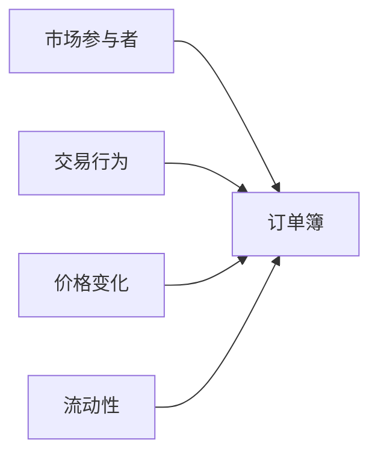
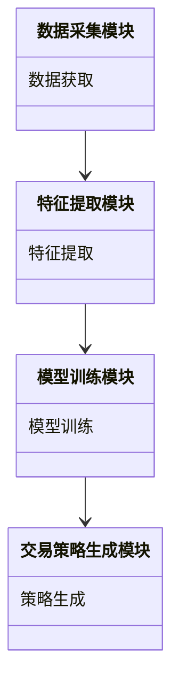
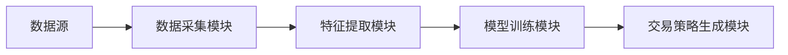

                 


```markdown
# AI驱动的市场微观结构变化影响分析

> 关键词：人工智能，金融市场，微观结构，算法交易，市场影响，数据分析，技术驱动

> 摘要：随着人工智能技术的迅速发展，金融市场中的市场微观结构发生了显著的变化。本文深入分析了AI驱动的市场微观结构变化，探讨了其对市场行为、价格发现和交易策略的影响。通过系统分析和实际案例，本文揭示了AI在市场微观结构中的广泛应用，并提供了对未来研究方向的展望。

---

## 第1章: AI驱动的市场微观结构概述

### 1.1 市场微观结构的基本概念

#### 1.1.1 市场微观结构的定义
市场微观结构是指金融市场中交易活动的具体运作方式和参与者之间的互动关系。它包括订单簿、流动性、价格形成机制等核心要素。

#### 1.1.2 AI在金融市场中的作用
人工智能技术通过大数据分析、模式识别和自动化交易，极大地改变了市场的微观结构。AI能够实时处理海量数据，优化交易策略，并提高市场效率。

#### 1.1.3 微观结构变化的定义与特征
微观结构变化指的是由于技术进步或市场参与者行为变化导致的市场运行机制的调整。其特征包括动态性、复杂性和不可预测性。

### 1.2 AI驱动的市场变化背景

#### 1.2.1 传统市场微观结构分析
传统市场分析依赖于经验和统计方法，而AI技术的引入使得分析更加精准和高效。

#### 1.2.2 AI技术的快速发展
AI技术的进步，尤其是机器学习和深度学习，为金融市场分析提供了新的工具和方法。

#### 1.2.3 金融市场的智能化转型
随着AI技术的应用，金融市场正在从传统的人工决策向智能化、自动化方向转型。

### 1.3 问题背景与研究意义

#### 1.3.1 问题背景
AI技术的广泛应用使得市场微观结构发生了显著变化，但其影响尚未被系统研究。

#### 1.3.2 问题描述
本文旨在探讨AI驱动的市场微观结构变化，分析其对市场行为和价格发现的影响。

#### 1.3.3 问题解决的必要性
理解AI对市场微观结构的影响有助于优化交易策略，提高市场效率。

#### 1.3.4 研究的边界与外延
本文主要关注算法交易和价格预测，不涉及宏观市场分析。

### 1.4 核心概念与联系

#### 1.4.1 核心概念原理
市场微观结构的核心要素包括订单簿、流动性、价格形成机制等。

#### 1.4.2 核心概念属性特征对比
```mermaid
| 概念               | 特征                   |
|--------------------|-----------------------|
| 市场微观结构       | 多维性、动态性、复杂性 |
| AI驱动             | 数据驱动、实时性、可解释性 |
```

#### 1.4.3 实体关系图


## 第2章: AI驱动的市场微观结构变化分析

### 2.1 市场微观结构的核心要素

#### 2.1.1 市场参与者
市场参与者包括机构投资者、个人投资者和算法交易系统。

#### 2.1.2 订单簿
订单簿记录了市场参与者的所有订单信息，是市场微观结构的核心组成部分。

#### 2.1.3 交易行为
交易行为包括订单生成、成交和撤单，反映了市场参与者的策略。

### 2.2 AI算法对市场微观结构的影响

#### 2.2.1 常见的AI算法
常用的AI算法包括支持向量机（SVM）、随机森林（Random Forest）和深度学习模型。

#### 2.2.2 AI算法流程图


### 2.3 市场微观结构变化的具体表现

#### 2.3.1 订单簿的变化
AI算法导致订单数量增加，订单价格更加分散。

#### 2.3.2 流动性的影响
AI交易提高了市场的流动性，但也可能导致短期波动加剧。

#### 2.3.3 价格形成机制的变化
AI算法影响价格发现过程，可能导致价格预测的准确性提高。

### 2.4 变化对市场行为的影响

#### 2.4.1 市场参与者策略调整
AI驱动的交易策略使得市场参与者更加依赖数据驱动的决策。

#### 2.4.2 价格发现机制的变化
AI算法加速了价格发现过程，但也可能引发价格泡沫。

---

## 第3章: AI驱动的市场微观结构变化的数学模型分析

### 3.1 市场微观结构的数学建模

#### 3.1.1 时间序列分析模型
常用的时间序列模型包括ARIMA和GARCH。

#### 3.1.2 回归模型
回归模型用于预测市场行为，如股票价格。

### 3.2 AI算法的数学基础

#### 3.2.1 机器学习的数学基础
机器学习涉及线性代数、概率论和统计学。

#### 3.2.2 深度学习的数学模型
深度学习模型包括神经网络和卷积神经网络。

### 3.3 市场微观结构变化的数学建模与分析

#### 3.3.1 数学公式
$$ ARIMA模型：ARIMA(p, d, q) $$
$$ GARCH模型：GARCH(p, q) $$

---

## 第4章: AI驱动的市场微观结构变化的系统分析与架构设计

### 4.1 问题场景与项目介绍

#### 4.1.1 问题场景
高频交易中的订单簿分析。

#### 4.1.2 项目介绍
本项目旨在通过AI技术优化订单簿分析，提高交易效率。

### 4.2 系统功能设计

#### 4.2.1 功能模块
- 数据采集模块
- 特征提取模块
- 模型训练模块
- 交易策略生成模块

#### 4.2.2 领域模型类图


### 4.3 系统架构设计

#### 4.3.1 系统架构图


---

## 第5章: 项目实战

### 5.1 项目环境配置

#### 5.1.1 工具安装
- Python 3.8+
- TensorFlow 2.5+
- Keras 2.5+

### 5.2 系统核心实现

#### 5.2.1 数据预处理代码
```python
import pandas as pd
data = pd.read_csv('market_data.csv')
data_processed = data.dropna()
```

#### 5.2.2 模型训练代码
```python
from tensorflow.keras import layers
model = layers.Dense(10, activation='relu')(input_tensor)
```

### 5.3 代码应用与分析

#### 5.3.1 实例分析
通过实例分析，验证AI算法对市场微观结构的影响。

### 5.4 实际案例分析

#### 5.4.1 案例选择
选择某段时间内的股票交易数据进行分析。

### 5.5 项目小结
总结项目的成果，提出优化方向。

---

## 第6章: 总结与展望

### 6.1 本章总结
总结AI驱动的市场微观结构变化的影响。

### 6.2 未来展望
探讨未来的研究方向，如更复杂的AI模型和多市场分析。

---

## 第7章: 最佳实践与注意事项

### 7.1 最佳实践
提供实际应用中的最佳实践建议。

### 7.2 注意事项
提醒读者在使用AI技术时的注意事项。

### 7.3 拓展阅读
推荐相关的书籍和资源。

---

## 第8章: 附录

### 8.1 术语表
列出文章中的核心术语及其解释。

### 8.2 参考文献
列出所有引用的文献和资料。

---

## 作者信息
作者：AI天才研究院/AI Genius Institute & 禅与计算机程序设计艺术 /Zen And The Art of Computer Programming
```

