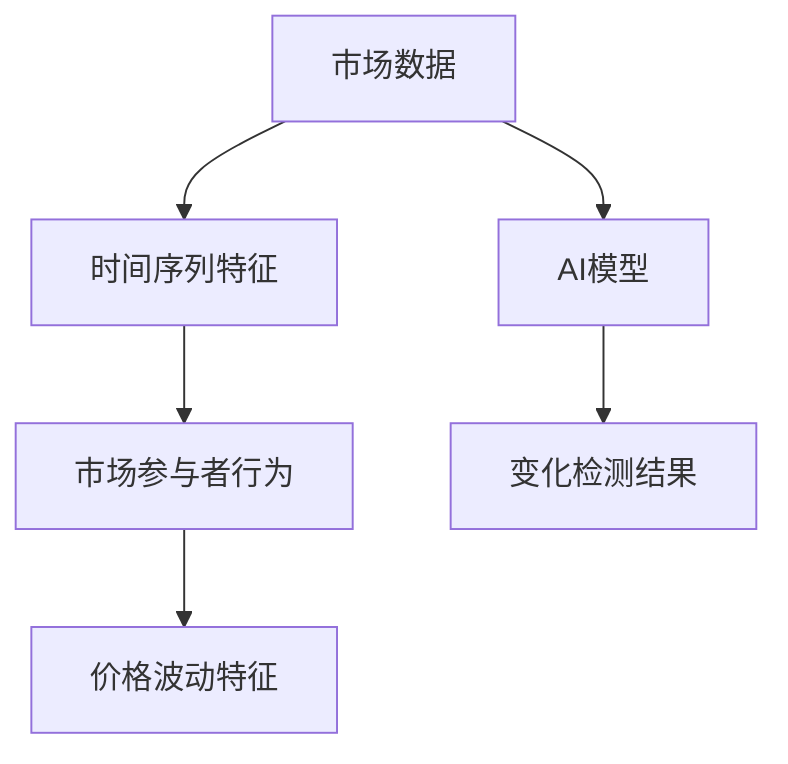
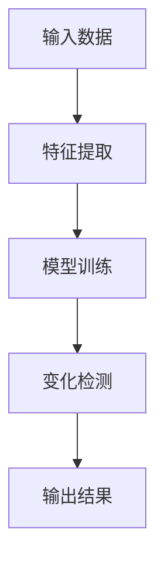
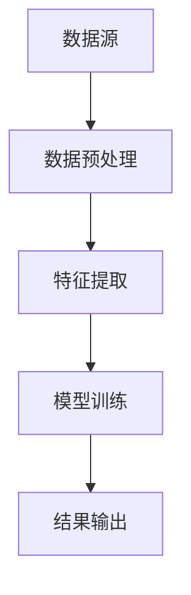
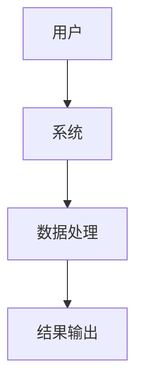

                 


# AI驱动的市场微观结构变化检测

> 关键词：AI驱动，市场微观结构，变化检测，时间序列分析，深度学习，金融数据分析

> 摘要：本文详细探讨了AI技术在金融市场微观结构变化检测中的应用。通过分析市场数据的时间序列特征、参与者行为特征和价格波动特征，结合深度学习模型（如LSTM和注意力机制），提出了一种基于AI的解决方案。文章还介绍了系统的架构设计、实现方法和实际案例分析，为金融市场的风险管理和投资决策提供了新的思路。

---

## 第一部分: AI驱动的市场微观结构变化检测背景介绍

### 第1章: 问题背景与概念解析

#### 1.1 问题背景
金融市场是一个复杂的系统，其微观结构的变化往往反映了市场的健康状况和潜在风险。传统的方法难以捕捉这些复杂的变化，而AI技术的引入为解决这一问题提供了新的可能性。

#### 1.2 问题描述
市场微观结构变化检测的目标是识别市场中的异常行为，例如操纵、闪崩等事件。这些变化可能影响市场的稳定性，因此及时检测这些变化具有重要意义。

#### 1.3 问题解决思路
通过AI技术，特别是深度学习模型，可以有效捕捉市场数据中的复杂模式和潜在关系。本文将结合时间序列分析和深度学习，提出一种新的解决方案。

#### 1.4 概念结构与核心要素
市场微观结构变化检测的核心要素包括时间序列特征、参与者行为特征和价格波动特征。AI模型的关键组成部分包括输入层、隐藏层和输出层。

### 第2章: 核心概念与联系

#### 2.1 微观结构变化的特征分析
- **时间序列特征**：包括均值、方差、自相关性等。
- **市场参与者行为特征**：包括交易频率、交易量、订单簿深度等。
- **价格波动特征**：包括波动率、跳跃率、hurst指数等。

#### 2.2 AI模型的核心原理
- **监督学习与无监督学习的区别**：监督学习需要标注数据，无监督学习则不需要。
- **深度学习模型的优势**：能够捕捉复杂的非线性关系。
- **时间序列分析的挑战**：需要处理缺失值和噪声。

#### 2.3 核心概念的对比分析
- **数据特征对比表格**：表格展示了不同特征的定义、计算方法和应用场景。
- **算法特征对比表格**：表格对比了不同算法的优缺点。
- **业务特征对比表格**：表格展示了不同业务场景下的特征选择。

#### 2.4 实体关系图（ER图）


---

## 第二部分: 算法原理与数学模型

### 第3章: 算法原理讲解

#### 3.1 时间序列分析
- **时间序列的定义**：时间序列是一组按照时间顺序排列的数据点。
- **时间序列分析的方法**：包括ARIMA模型、LSTM等。

#### 3.2 深度学习模型
- **LSTM模型**：长短期记忆网络能够有效捕捉时间序列中的长依赖关系。
- **注意力机制**：通过自注意力机制，模型可以关注重要的时间点。

#### 3.3 算法流程


#### 3.4 代码实现
```python
import numpy as np
import pandas as pd
from tensorflow.keras.models import Sequential
from tensorflow.keras.layers import LSTM, Dense, Dropout

# 示例数据
data = np.random.randn(1000, 1)

# 模型定义
model = Sequential()
model.add(LSTM(64, input_shape=(None, 1)))
model.add(Dropout(0.2))
model.add(Dense(1, activation='sigmoid'))

# 编译模型
model.compile(loss='binary_crossentropy', optimizer='adam', metrics=['accuracy'])

# 训练模型
model.fit(data, labels, epochs=10, batch_size=32)
```

#### 3.5 数学模型
- **ARIMA模型**：$$ ARIMA(p, d, q) $$
- **LSTM模型**：$$ LSTMCell(x_t) = \sigma(W_{h\text{h}} h_{t-1} + W_{x\text{h}} x_t) $$

---

## 第三部分: 系统分析与架构设计

### 第4章: 系统设计

#### 4.1 问题场景介绍
市场微观结构变化检测系统的应用场景包括实时监控、风险预警和投资决策支持。

#### 4.2 系统功能设计
- **数据采集**：从交易系统中获取实时数据。
- **特征提取**：计算时间序列特征、市场参与者行为特征和价格波动特征。
- **模型训练**：使用深度学习模型训练变化检测模型。
- **结果输出**：输出变化检测结果。

#### 4.3 系统架构设计


#### 4.4 接口设计
- **输入接口**：接收市场数据。
- **输出接口**：输出变化检测结果。

#### 4.5 交互流程图


---

## 第四部分: 项目实战

### 第5章: 项目实战

#### 5.1 环境安装
- **Python版本**：3.6以上
- **依赖库**：TensorFlow、Keras、Pandas

#### 5.2 系统实现
```python
import numpy as np
import pandas as pd
from tensorflow.keras.models import Sequential
from tensorflow.keras.layers import LSTM, Dense, Dropout

# 数据加载
data = pd.read_csv('market_data.csv')

# 模型定义
model = Sequential()
model.add(LSTM(64, input_shape=(None, 1)))
model.add(Dropout(0.2))
model.add(Dense(1, activation='sigmoid'))

# 模型训练
model.compile(loss='binary_crossentropy', optimizer='adam', metrics=['accuracy'])
model.fit(data, labels, epochs=10, batch_size=32)
```

#### 5.3 案例分析
- **案例1**：检测市场操纵行为。
- **案例2**：预测市场波动。

#### 5.4 项目小结
通过实际案例分析，验证了AI驱动的市场微观结构变化检测的有效性。

---

## 第五部分: 最佳实践与总结

### 第6章: 最佳实践

#### 6.1 小结
本文详细介绍了AI驱动的市场微观结构变化检测的方法和实现。

#### 6.2 注意事项
- 数据质量的影响
- 模型的选择和调优
- 实际应用中的法律和伦理问题

#### 6.3 拓展阅读
- 《深度学习在金融中的应用》
- 《时间序列分析的数学方法》

---

## 作者：AI天才研究院/AI Genius Institute & 禅与计算机程序设计艺术 /Zen And The Art of Computer Programming

