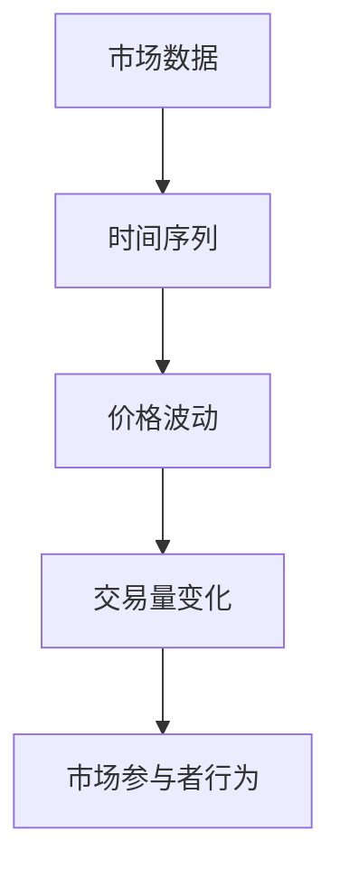
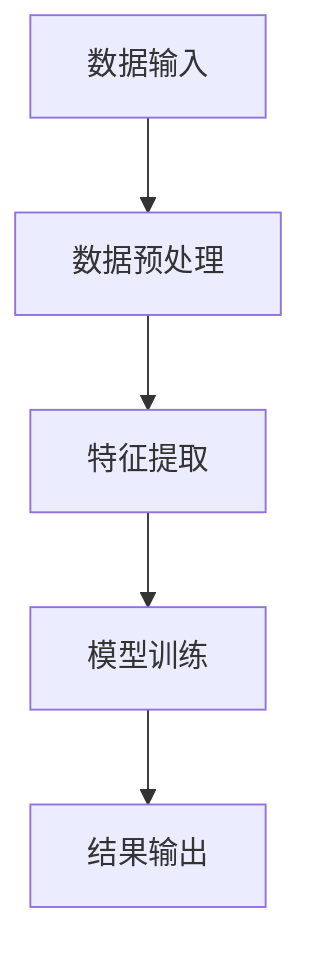
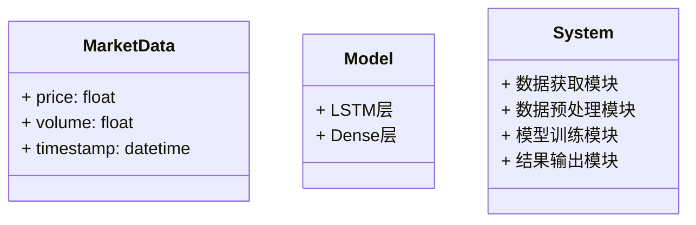
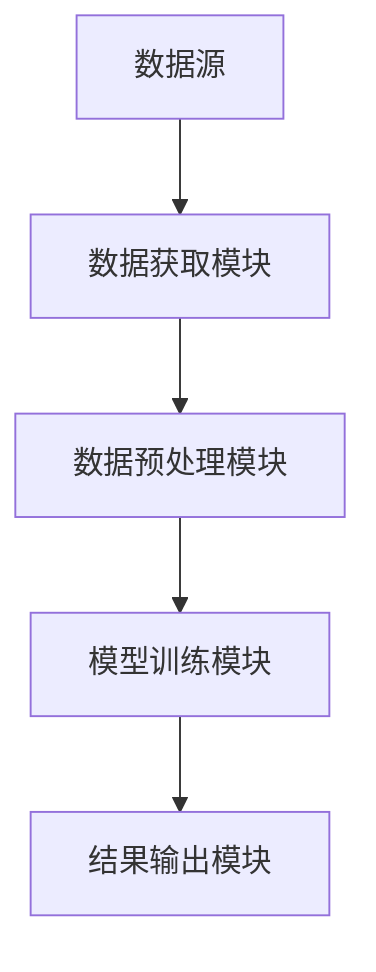
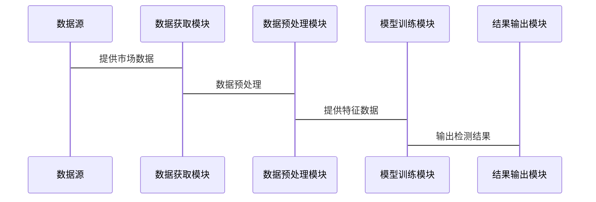

                 


# AI驱动的市场微观结构变化检测

> 关键词：市场微观结构，AI检测，金融数据分析，机器学习，算法优化

> 摘要：随着金融市场的日益复杂化，传统的市场分析方法逐渐暴露出其局限性。本文将探讨如何利用人工智能技术，特别是深度学习算法，来检测市场微观结构的变化。通过分析市场数据中的时间序列特征和异常行为，我们可以更有效地识别市场波动和潜在风险。本文将从理论基础、算法实现、系统设计到实际案例，全面解析AI在市场微观结构变化检测中的应用。

---

# 第一部分: 背景介绍与核心概念

## 第1章: 问题背景介绍

### 1.1 问题背景介绍
#### 1.1.1 市场微观结构的定义
市场微观结构是指金融市场的基本组成单元及其相互作用方式。它包括交易者的类型、交易规则、信息流动机制等。市场微观结构的变化通常反映在价格波动、交易量变化、市场深度等方面。

#### 1.1.2 微观结构变化的金融意义
- 市场微观结构的变化可能预示着市场的流动性变化、价格操纵行为或市场参与者的策略调整。
- 通过检测微观结构变化，投资者可以提前发现潜在风险或机会。

#### 1.1.3 AI技术在金融分析中的应用优势
- AI技术能够处理海量数据，发现传统方法难以察觉的模式。
- 深度学习算法在时间序列分析和异常检测方面表现优异。

### 1.2 核心概念与问题描述
#### 1.2.1 市场微观结构变化的定义
市场微观结构的变化是指市场参与者行为、交易规则或市场环境的变化，导致市场数据特征发生显著变化。

#### 1.2.2 微观结构变化的特征分析
- 数据特征：价格波动、交易量、订单簿深度、市场参与者的类型等。
- 变化类型：突然变化、渐进变化、周期性变化等。
- 检测目标：识别变化的时间点、变化的类型、变化的影响程度。

#### 1.2.3 问题解决的目标与边界
- 目标：通过AI技术实时检测市场微观结构的变化。
- 边界：仅关注数据层面的变化，不涉及具体市场参与者的分析。

---

## 第2章: 核心概念与联系

### 2.1 市场微观结构变化检测的核心要素
#### 2.1.1 数据特征
- 时间序列数据：价格、交易量、订单簿深度等。
- 非结构化数据：市场新闻、社交媒体情绪等。

#### 2.1.2 变化类型
- 突然变化：如市场闪崩。
- 渐进变化：如市场参与者行为的逐渐转变。
- 周期性变化：如季节性波动。

#### 2.1.3 检测目标
- 识别变化的时间点。
- 分类变化的类型。
- 评估变化的影响程度。

### 2.2 核心概念属性对比
#### 2.2.1 数据特征对比表
| 数据特征 | 描述 |
|----------|------|
| 时间序列 | 连续的、有序的市场数据 |
| 交易量 | 反映市场活跃度 |
| 价格波动 | 衡量市场的波动性 |

#### 2.2.2 变化类型对比表
| 变化类型 | 描述 |
|----------|------|
| 突然变化 | 短期内的剧烈波动 |
| 渐进变化 | 长期缓慢的变化 |
| 周期性变化 | 具有规律性的波动 |

#### 2.2.3 检测目标对比表
| 检测目标 | 描述 |
|----------|------|
| 时间点 | 变化发生的具体时间 |
| 类型 | 变化是突然的还是渐进的 |
| 影响程度 | 变化对市场的影响大小 |

### 2.3 ER实体关系图


---

## 第3章: 算法原理与实现

### 3.1 算法原理概述
#### 3.1.1 时间序列分析
时间序列分析是一种通过历史数据预测未来趋势的方法。常用的模型包括ARIMA、LSTM等。

#### 3.1.2 异常检测算法
异常检测算法用于识别数据中的异常点。常用的算法包括Isolation Forest、One-Class SVM等。

#### 3.1.3 机器学习模型
机器学习模型可以学习数据的特征，并用于分类或回归任务。常用的模型包括随机森林、神经网络等。

### 3.2 算法实现流程


### 3.3 算法代码实现
```python
import numpy as np
from sklearn.model_selection import train_test_split
from tensorflow.keras.models import Sequential
from tensorflow.keras.layers import LSTM, Dense

# 示例代码：LSTM模型训练
def model():
    model = Sequential()
    model.add(LSTM(128, input_shape=(None, 1)))
    model.add(Dense(1))
    model.compile(loss='mean_squared_error', optimizer='adam')
    return model

# 数据准备
X_train, X_test, y_train, y_test = train_test_split(X, y, test_size=0.2)
model = model()
model.fit(X_train, y_train, epochs=10, batch_size=32, validation_data=(X_test, y_test))
```

---

## 第4章: 系统分析与架构设计

### 4.1 问题场景介绍
本文设计了一个基于AI的市场微观结构变化检测系统，用于实时监测金融市场数据，发现潜在的变化。

### 4.2 系统功能设计


### 4.3 系统架构设计


### 4.4 系统接口设计
- 数据接口：从数据库或API获取市场数据。
- 模型接口：接收预处理后的数据，输出检测结果。

### 4.5 系统交互流程


---

## 第5章: 项目实战

### 5.1 环境安装
- 安装Python和必要的库：numpy、pandas、tensorflow、scikit-learn。

### 5.2 数据获取
```python
import pandas as pd
data = pd.read_csv('market_data.csv')
```

### 5.3 特征工程
```python
from sklearn.preprocessing import StandardScaler
scaler = StandardScaler()
X_scaled = scaler.fit_transform(X)
```

### 5.4 模型训练
```python
model = model()
model.fit(X_train, y_train, epochs=10, batch_size=32, validation_data=(X_test, y_test))
```

### 5.5 结果分析
```python
y_pred = model.predict(X_test)
```

---

## 第6章: 最佳实践与小结

### 6.1 最佳实践
- 数据预处理是关键，尤其是缺失值和异常值的处理。
- 选择合适的模型和参数，避免过拟合。

### 6.2 小结
本文详细介绍了AI驱动的市场微观结构变化检测的方法和实现过程，通过理论分析和实际案例，展示了如何利用AI技术解决金融分析中的复杂问题。

---

作者：AI天才研究院/AI Genius Institute & 禅与计算机程序设计艺术 /Zen And The Art of Computer Programming

