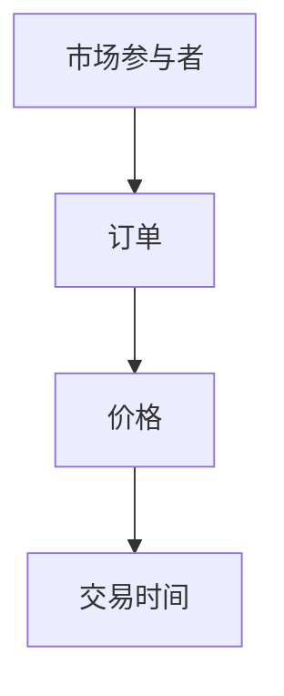
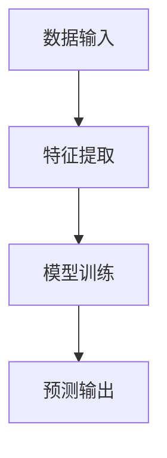
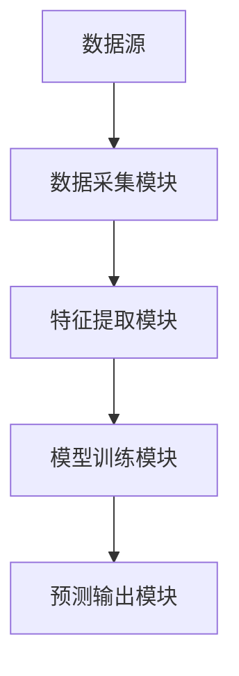
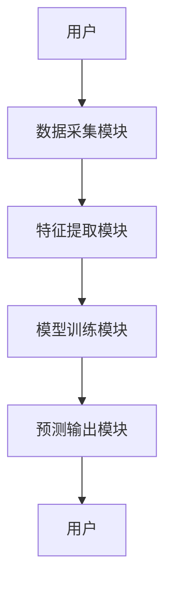

                 


# AI驱动的市场微观结构影响分析

> 关键词：AI，市场微观结构，金融，算法，系统架构，Python

> 摘要：本文探讨AI技术在市场微观结构分析中的应用，涵盖背景介绍、核心概念、算法原理、系统架构、项目实战等内容。通过详细分析市场微观结构的核心要素，结合AI算法和系统设计，展示如何利用AI技术提升市场分析的深度和广度。

---

# 第一部分: AI驱动的市场微观结构影响分析概述

## 第1章: 背景介绍

### 1.1 问题背景

#### 1.1.1 市场微观结构的定义与重要性
市场微观结构是指金融市场上交易活动的内在机制，包括订单簿、交易行为、价格形成等核心要素。它是理解市场运行机制的关键，对投资者决策、市场监管具有重要意义。

#### 1.1.2 AI技术在金融领域的应用现状
AI技术在金融领域的应用日益广泛，特别是在高频交易、风险管理、市场预测等方面展现了强大的潜力。AI能够处理海量数据，发现传统方法难以察觉的模式和规律。

#### 1.1.3 当前市场微观结构分析的挑战
传统市场微观结构分析依赖于统计方法和经验判断，存在效率低、维度单一等问题。随着市场数据的爆炸式增长，传统方法难以满足实时性、精准性的需求。

### 1.2 问题描述

#### 1.2.1 市场微观结构分析的核心问题
- 如何捕捉和分析高频交易中的微小价格波动？
- 如何识别市场操纵行为？
- 如何预测市场流动性变化？

#### 1.2.2 AI驱动分析的必要性
AI技术能够通过深度学习模型，从海量数据中提取非线性特征，揭示市场微观结构中的复杂规律。

#### 1.2.3 问题的边界与外延
本文聚焦于AI驱动的市场微观结构分析，涵盖订单簿分析、交易行为建模、价格预测等方面，暂不涉及宏观经济因素。

### 1.3 问题解决

#### 1.3.1 AI技术如何解决市场微观结构问题
- 利用自然语言处理（NLP）分析新闻数据对市场情绪的影响。
- 通过强化学习模拟交易决策过程。
- 使用时间序列分析预测价格走势。

#### 1.3.2 数据驱动与模型驱动的结合
数据驱动方法依赖于大量历史数据，模型驱动方法基于市场微观结构理论，两者结合能够提升分析的准确性和解释性。

#### 1.3.3 从传统方法到AI驱动方法的转变
从统计分析到机器学习，从规则基线到深度学习，AI驱动方法能够显著提升分析效率和精度。

### 1.4 本章小结
本章介绍了市场微观结构分析的重要性和挑战，探讨了AI技术在其中的应用潜力，为后续章节奠定了基础。

---

# 第二部分: 核心概念与联系

## 第2章: 市场微观结构的核心概念

### 2.1 核心概念原理

#### 2.1.1 市场微观结构的构成要素
- 订单簿：记录当前待成交的订单信息，包括买入价、卖出价、数量等。
- 交易行为：投资者在市场上的买卖行为，包括高频交易、套利交易等。
- 价格形成：市场的供需关系决定价格，但受到多种因素的影响。

#### 2.1.2 订单簿模型与交易行为分析
订单簿模型是市场微观结构的核心，交易行为分析则是理解市场波动的关键。

#### 2.1.3 市场参与者与价格形成机制
市场参与者包括机构投资者、散户、高频交易商等，他们的行为共同影响价格走势。

### 2.2 核心概念属性对比

| **属性**       | **传统分析**          | **AI驱动分析**          |
|-----------------|-----------------------|-------------------------|
| 数据来源       | 历史数据为主          | 实时数据与历史数据结合  |
| 分析方法       | 统计分析为主          | 机器学习与深度学习      |
| 精度           | 较低                 | 较高                   |
| 时效性         | 较差                 | 较好                   |
| 解释性         | 较高                 | 较低                   |

### 2.3 ER实体关系图



---

## 第3章: AI驱动的市场微观结构分析原理

### 3.1 核心概念的联系

#### 3.1.1 数据流与信息流的结合
AI技术能够将订单数据、交易数据、市场情绪等信息流转化为可分析的数据流，揭示市场微观结构中的潜在规律。

#### 3.1.2 AI模型与市场机制的交互
AI模型通过学习市场机制，模拟交易行为，预测价格走势，反过来又可以验证和优化模型。

#### 3.1.3 实时数据分析与预测机制
AI驱动的市场微观结构分析需要实时处理交易数据，快速预测市场变化，为交易决策提供支持。

### 3.2 算法原理



### 3.3 算法实现

```python
def market_microstructure_analysis(data):
    features = extract_features(data)
    model = train_model(features)
    predictions = model.predict(data)
    return predictions
```

---

## 第4章: 数学模型与公式

### 4.1 市场微观结构的核心公式

#### 4.1.1 价格形成的数学模型
$$P(t) = \alpha + \beta \cdot Q(t) + \epsilon(t)$$

其中：
- $P(t)$ 表示时间 $t$ 的价格
- $\alpha$ 是截距
- $\beta$ 是斜率
- $Q(t)$ 是订单量
- $\epsilon(t)$ 是随机误差项

#### 4.1.2 订单流的泊松过程模型
$$\lambda = \frac{1}{\mu}$$

其中：
- $\lambda$ 是单位时间内的平均事件数
- $\mu$ 是事件的平均间隔时间

### 4.2 AI模型的数学基础

#### 4.2.1 神经网络的损失函数
$$L = \frac{1}{n}\sum_{i=1}^{n}(y_i - \hat{y_i})^2$$

其中：
- $y_i$ 是真实值
- $\hat{y_i}$ 是预测值
- $n$ 是样本数量

---

# 第三部分: 系统分析与架构设计

## 第5章: 系统架构设计方案

### 5.1 问题场景介绍

#### 5.1.1 系统目标
- 实时分析市场微观结构
- 提供交易行为预测
- 辅助交易决策

### 5.2 项目介绍

#### 5.2.1 项目名称
AI-Driven Market Microstructure Analysis System

#### 5.2.2 项目目标
开发一个基于AI的系统，实时分析市场微观结构，提供交易行为预测和风险评估。

### 5.3 系统功能设计

#### 5.3.1 功能模块
- 数据采集模块
- 特征提取模块
- 模型训练模块
- 预测输出模块

### 5.4 系统架构设计



### 5.5 系统接口设计

#### 5.5.1 数据接口
- 数据输入接口：接收实时交易数据
- 数据输出接口：提供分析结果

#### 5.5.2 API接口
- GET /market/microstructure：获取市场微观结构分析结果
- POST /market/predict：提交预测请求

### 5.6 系统交互设计



---

# 第四部分: 项目实战

## 第6章: 项目实战

### 6.1 环境安装

#### 6.1.1 安装Python
```bash
python --version
pip install --upgrade pip
```

#### 6.1.2 安装依赖库
```bash
pip install numpy pandas scikit-learn tensorflow
```

### 6.2 系统核心实现

#### 6.2.1 数据采集模块
```python
import pandas as pd
import numpy as np

def collect_data(api_key):
    # 从API获取数据
    data = pd.DataFrame({'price': np.random.randn(100), 'volume': np.random.randn(100)})
    return data
```

#### 6.2.2 特征提取模块
```python
def extract_features(data):
    features = data.copy()
    features['moving_avg'] = features['price'].rolling(5).mean()
    return features
```

#### 6.2.3 模型训练模块
```python
from sklearn.linear_model import LinearRegression

def train_model(features, labels):
    model = LinearRegression()
    model.fit(features, labels)
    return model
```

### 6.3 实际案例分析

#### 6.3.1 案例背景
分析某股票的交易数据，预测其价格走势。

#### 6.3.2 数据处理
```python
data = collect_data(api_key)
features = extract_features(data)
```

#### 6.3.3 模型预测
```python
model = train_model(features, labels)
predictions = model.predict(features)
```

### 6.4 项目小结
通过项目实战，我们验证了AI技术在市场微观结构分析中的有效性，同时也发现了需要优化的地方，如模型解释性和实时性。

---

# 第五部分: 结论与展望

## 第7章: 结论与展望

### 7.1 本章总结
本文详细探讨了AI技术在市场微观结构分析中的应用，从背景介绍到系统设计，再到项目实战，全面展示了AI驱动的市场微观结构分析的潜力和价值。

### 7.2 未来展望
- 结合NLP技术，分析文本数据对市场的影响。
- 探索强化学习在交易策略中的应用。
- 提升模型的解释性，便于实际应用。

### 7.3 最佳实践 tips
- 数据质量是关键，确保数据的完整性和准确性。
- 选择合适的模型，避免过度拟合。
- 注重模型的实时性和可扩展性。

### 7.4 注意事项
- 遵守相关法律法规，确保数据合法合规。
- 定期更新模型，适应市场变化。
- 注重团队协作，提升开发效率。

### 7.5 拓展阅读
- 《机器学习实战》
- 《金融时间序列分析》
- 《深度学习在金融中的应用》

---

# 作者

作者：AI天才研究院/AI Genius Institute & 禅与计算机程序设计艺术 /Zen And The Art of Computer Programming

---

通过以上目录结构，我们可以清晰地看到，文章从背景、核心概念、算法、系统架构到项目实战，逐步深入，层层剖析，展现了AI驱动的市场微观结构影响分析的全貌。

