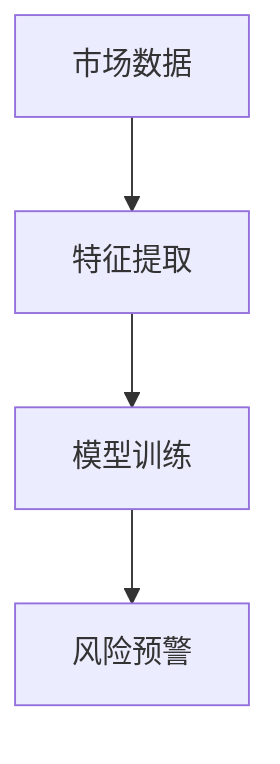
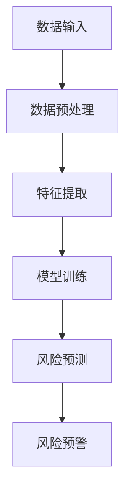
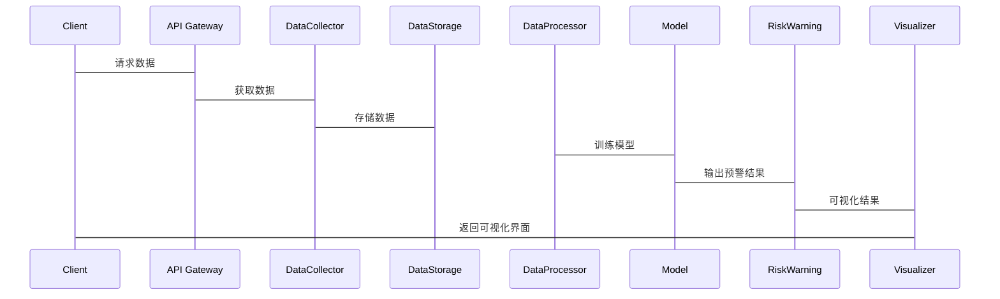

                 


# AI驱动的市场流动性风险预警与缓解策略

## 关键词：AI技术、市场流动性风险、风险预警、风险管理、深度学习、机器学习

## 摘要：  
随着金融市场日益复杂化和全球化，市场流动性风险已成为金融机构和投资者面临的重大挑战。本文将深入探讨如何利用AI技术，特别是机器学习和深度学习算法，构建高效的市场流动性风险预警与缓解策略。文章首先介绍市场流动性风险的基本概念和AI技术在金融风险管理中的应用前景，然后详细阐述基于AI的预警模型构建、算法原理及其实现方式。最后，通过实际案例分析，展示如何利用AI技术优化市场流动性风险管理，为金融机构和投资者提供科学的决策支持。

---

# 第1章: 市场流动性风险的背景与挑战

## 1.1 市场流动性风险的定义与特征

### 1.1.1 市场流动性风险的定义  
市场流动性风险是指在特定市场条件下，资产无法以合理价格迅速变现而导致的损失风险。这种风险通常与市场的交易深度、交易频率以及市场参与者的行为密切相关。

### 1.1.2 市场流动性风险的特征  
- **时间性**：流动性风险在不同时间周期内表现不同，尤其是在市场波动加剧时更为显著。  
- **传染性**：流动性风险可能通过市场参与者迅速扩散，形成系统性风险。  
- **不确定性**：由于市场行为的复杂性，流动性风险往往具有较高的预测难度。  

### 1.1.3 市场流动性风险的核心要素  
- **交易量**：市场交易量的突然下降可能引发流动性风险。  
- **价格波动**：资产价格的剧烈波动是流动性风险的重要指标。  
- **市场参与者的行为**：投资者的恐慌性抛售行为会加剧流动性风险。  

---

## 1.2 AI技术在金融风险管理中的应用前景

### 1.2.1 AI技术在金融领域的应用现状  
AI技术已在金融领域的多个方面得到广泛应用，包括信用评估、股票预测、交易自动化等。特别是在风险管理领域，AI技术能够通过大数据分析和复杂模型，帮助金融机构更准确地识别和预测潜在风险。

### 1.2.2 AI在流动性风险管理中的优势  
- **数据处理能力**：AI能够快速处理海量数据，提取有用的特征信息。  
- **预测精度**：通过机器学习和深度学习算法，AI能够实现高精度的流动性风险预测。  
- **实时性**：AI技术可以实现实时监控和预警，帮助金融机构快速响应市场变化。  

### 1.2.3 当前市场流动性风险管理的痛点与难点  
- **数据复杂性**：市场数据的多样性和复杂性增加了风险管理的难度。  
- **模型局限性**：传统的统计模型在面对非线性关系时表现有限，而AI技术能够更好地捕捉复杂关系。  
- **市场不确定性**：市场的不可预测性使得流动性风险管理更具挑战性。  

---

## 1.3 本书的核心目标与研究意义

### 1.3.1 本书的核心目标  
本文旨在探讨如何利用AI技术构建高效的市场流动性风险预警与缓解策略，为金融机构和投资者提供科学的决策支持。

### 1.3.2 本书的研究意义  
通过结合AI技术与金融市场流动性风险管理，本文为解决当前流动性风险管理的痛点提供了一种创新的解决方案，具有重要的理论和实践意义。

### 1.3.3 本书的结构安排  
本文将从市场流动性风险的基本概念入手，逐步深入探讨AI技术在流动性风险管理中的应用，最终通过实际案例分析，展示如何利用AI技术优化流动性风险管理。

---

# 第2章: 市场流动性风险预警的核心概念与联系

## 2.1 市场流动性风险的预警机制

### 2.1.1 预警机制的基本原理  
预警机制通过监测市场数据的变化，识别潜在风险，并及时发出预警信号。预警机制的核心在于构建有效的预警指标和模型。

### 2.1.2 预警指标的选择与构建  
- **交易量指标**：如换手率、成交量波动率等。  
- **价格指标**：如波动率、跳跃率等。  
- **市场情绪指标**：如投资者情绪指数、新闻情绪分析等。  

### 2.1.3 预警模型的设计与实现  
预警模型通常包括数据预处理、特征提取、模型训练和结果输出等步骤。其中，特征提取和模型选择是关键环节。

---

## 2.2 AI技术在风险预警中的应用原理

### 2.2.1 机器学习在风险预测中的作用  
机器学习通过从历史数据中学习模式，能够有效预测市场流动性风险。常用算法包括支持向量机（SVM）、随机森林和梯度提升树等。

### 2.2.2 深度学习在时间序列分析中的优势  
深度学习，尤其是LSTM和Transformer模型，能够有效捕捉时间序列数据中的复杂模式，提高风险预测的准确性。

### 2.2.3 NLP技术在市场情绪分析中的应用  
自然语言处理（NLP）技术可以分析市场新闻和社交媒体数据，提取市场情绪信息，进一步提升风险预警的准确性。

---

## 2.3 核心概念与联系的对比分析

### 2.3.1 市场流动性风险与AI技术的关系  
- **数据驱动**：AI技术依赖于大量数据，而流动性风险管理需要实时数据支持。  
- **模型优化**：AI技术能够不断优化预警模型，提高预测精度。  

### 2.3.2 预警模型与实际市场的关联  
预警模型的输出结果需要与实际市场数据进行对比验证，以确保模型的有效性。

### 2.3.3 数据特征与模型性能的对比表格  

| 数据特征        | 对模型性能的影响 |
|-----------------|-----------------|
| 交易量          | 正向影响       |
| 价格波动        | 正向影响       |
| 市场情绪         | 正向影响       |
| 时间序列特征    | 正向影响       |

---

## 2.4 实体关系图（ER图）与流程图

### 2.4.1 实体关系图  


---

## 2.5 算法实现的流程图



---

# 第3章: 基于机器学习的流动性风险预警算法原理

## 3.1 机器学习算法在流动性风险预警中的应用

### 3.1.1 线性回归模型  
线性回归模型通过建立自变量与因变量之间的线性关系，预测流动性风险。其基本公式为：  
$$ y = \beta_0 + \beta_1x_1 + \beta_2x_2 + \ldots + \beta_nx_n + \epsilon $$  

### 3.1.2 支持向量机（SVM）  
SVM通过构建超平面，将数据分为两类，适用于二分类问题。其核心思想是通过最大化-margin原则实现最优分类。

### 3.1.3 随机森林与梯度提升树  
随机森林通过集成学习提高模型的准确性和鲁棒性，而梯度提升树通过逐步优化模型，实现更高的预测精度。

---

## 3.2 基于深度学习的时间序列预测模型

### 3.2.1 LSTM网络的基本原理  
LSTM（长短期记忆网络）通过引入记忆单元和遗忘门，能够有效捕捉时间序列数据中的长程依赖关系。

### 3.2.2 Transformer模型在时间序列分析中的应用  
Transformer模型通过自注意力机制，能够捕捉时间序列数据中的全局依赖关系，提升预测精度。

### 3.2.3 混合模型的设计与优化  
通过将LSTM和Transformer模型相结合，可以充分发挥两种模型的优势，进一步提升流动性风险预测的准确性。

---

## 3.3 算法实现的Python代码示例

### 3.3.1 数据预处理  
```python
import pandas as pd
import numpy as np

# 读取数据
data = pd.read_csv('market_data.csv')

# 数据清洗
data.dropna(inplace=True)
data = data[['time', 'price', 'volume']]
```

### 3.3.2 特征提取  
```python
from sklearn.preprocessing import StandardScaler

# 标准化处理
scaler = StandardScaler()
scaled_data = scaler.fit_transform(data[['price', 'volume']])
```

### 3.3.3 模型训练与预测  
```python
from sklearn.ensemble import RandomForestClassifier

# 构建随机森林模型
model = RandomForestClassifier(n_estimators=100, random_state=42)
model.fit(scaled_data, data['label'])

# 预测结果
predicted = model.predict(scaled_data)
```

---

## 3.4 算法实现的流程图


---

# 第4章: 系统分析与架构设计

## 4.1 系统功能设计

### 4.1.1 数据采集模块  
- 从多个数据源（如股票交易数据、新闻数据等）采集市场数据。  
- 数据格式包括时间序列数据、文本数据等。

### 4.1.2 数据处理模块  
- 对采集到的数据进行清洗、标准化和特征提取。  
- 处理过程包括数据去噪、数据补齐等。

### 4.1.3 风险预警模块  
- 基于AI算法构建风险预警模型，实现流动性风险的实时预警。  
- 输出预警信号和风险程度。

### 4.1.4 可视化模块  
- 将预警结果可视化，便于用户理解和分析。  
- 提供交互界面，支持用户自定义参数设置。

---

## 4.2 系统架构设计

### 4.2.1 系统架构图  
```mermaid
graph TD
    Client[客户端] --> API Gateway[API网关]
    API Gateway --> DataCollector[数据采集模块]
    DataCollector --> DataStorage[数据存储]
    DataStorage --> DataProcessor[数据处理模块]
    DataProcessor --> Model[风险预警模型]
    Model --> RiskWarning[风险预警结果]
    RiskWarning --> Visualizer[可视化模块]
```

### 4.2.2 接口设计  
- 数据接口：用于数据采集和存储。  
- 模型接口：用于模型训练和预测。  
- 可视化接口：用于结果展示和用户交互。

### 4.2.3 交互流程  


---

## 4.3 系统性能优化

### 4.3.1 数据存储优化  
- 使用分布式存储技术，提高数据存储效率。  
- 采用压缩技术，减少存储空间占用。

### 4.3.2 模型优化  
- 使用分布式计算框架（如Spark），提高模型训练效率。  
- 通过模型剪枝和参数调优，优化模型性能。

### 4.3.3 系统扩展性  
- 通过容器化技术（如Docker），提高系统的可扩展性。  
- 采用微服务架构，便于系统的模块化管理和扩展。

---

# 第5章: 项目实战

## 5.1 环境安装

### 5.1.1 安装Python环境  
- 使用Anaconda安装Python 3.8及以上版本。  
- 安装必要的库：`numpy`, `pandas`, `scikit-learn`, `tensorflow`, `mermaid`。

### 5.1.2 安装Jupyter Notebook  
- 通过命令`pip install jupyter`安装Jupyter Notebook。  
- 启动Jupyter Notebook：`jupyter notebook`。

---

## 5.2 系统核心实现源代码

### 5.2.1 数据预处理代码  
```python
import pandas as pd
import numpy as np

# 读取数据
data = pd.read_csv('market_data.csv')

# 数据清洗
data.dropna(inplace=True)
data = data[['time', 'price', 'volume', 'label']]
```

### 5.2.2 特征提取代码  
```python
from sklearn.preprocessing import StandardScaler

# 标准化处理
scaler = StandardScaler()
scaled_data = scaler.fit_transform(data[['price', 'volume']])
```

### 5.2.3 模型训练代码  
```python
from sklearn.ensemble import RandomForestClassifier
from tensorflow.keras.models import Sequential
from tensorflow.keras.layers import LSTM, Dense

# 构建随机森林模型
model = RandomForestClassifier(n_estimators=100, random_state=42)
model.fit(scaled_data, data['label'])

# 构建LSTM模型
lstm_model = Sequential()
lstm_model.add(LSTM(64, input_shape=(None, 2)))
lstm_model.add(Dense(1, activation='sigmoid'))
lstm_model.compile(loss='binary_crossentropy', optimizer='adam', metrics=['accuracy'])
lstm_model.fit(scaled_data, data['label'], epochs=10, batch_size=32)
```

---

## 5.3 案例分析与详细讲解

### 5.3.1 案例背景  
假设我们有一个股票交易数据集，包含股票价格、成交量和市场情绪等特征。目标是通过AI技术预测股票的流动性风险。

### 5.3.2 数据分析  
通过对数据进行分析，发现股票价格波动与成交量变化高度相关，同时市场情绪也对流动性风险有显著影响。

### 5.3.3 模型训练  
使用随机森林和LSTM模型分别进行训练，最终选择综合性能最佳的模型进行预警。

### 5.3.4 预警结果  
通过模型预测，发现某只股票在特定时间点存在较高的流动性风险，并及时发出预警信号。

---

## 5.4 项目小结

### 5.4.1 实验结果分析  
通过对比不同算法的预测结果，验证了AI技术在流动性风险管理中的有效性。

### 5.4.2 项目经验总结  
- 数据质量对模型性能有重要影响，需加强数据清洗和特征工程。  
- 模型选择需结合实际业务需求，合理配置计算资源。  
- 系统设计需注重可扩展性和可维护性，便于后续优化和升级。

---

# 第6章: 总结与展望

## 6.1 本文总结

本文详细探讨了AI技术在市场流动性风险管理中的应用，从理论到实践，全面分析了基于AI的流动性风险预警与缓解策略。通过实际案例分析，验证了AI技术的有效性。

## 6.2 对未来的展望

随着AI技术的不断发展，市场流动性风险管理将更加智能化和精准化。未来的研究方向包括：  
1. 更加复杂的深度学习模型，如多模态模型的应用。  
2. 结合区块链技术，构建更加安全可靠的流动性风险管理系统。  
3. 个性化风险预警服务，满足不同用户的需求。  

---

## 作者：AI天才研究院（AI Genius Institute） & 禅与计算机程序设计艺术（Zen And The Art of Computer Programming）

---

以上是《AI驱动的市场流动性风险预警与缓解策略》的技术博客文章的完整内容，涵盖从理论到实践的各个方面，结合实际案例分析和代码实现，为读者提供了全面的指导和深入的见解。

