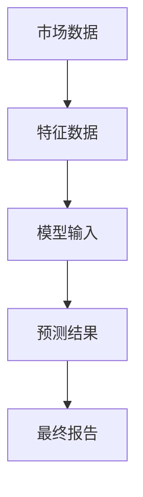
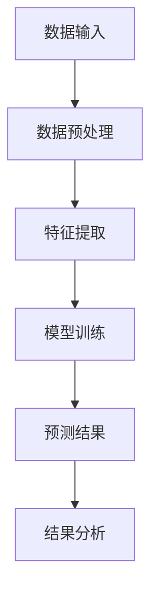
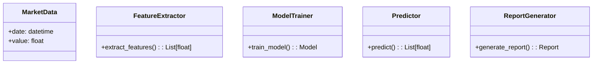
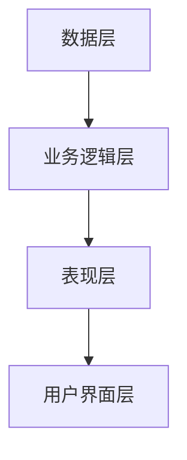
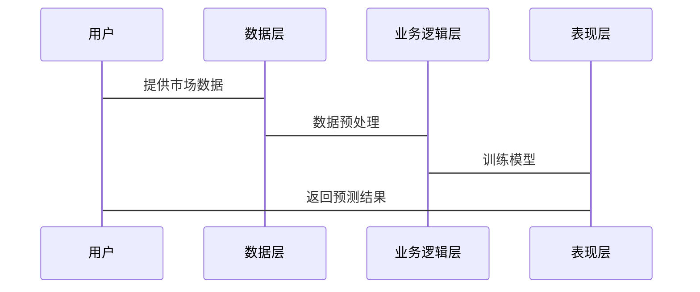

                 


# AI驱动的市场趋势预测模型开发

## 关键词：AI，市场趋势预测，机器学习，深度学习，时间序列分析

## 摘要：本文详细探讨了如何利用AI技术构建市场趋势预测模型，从背景、核心概念、算法原理到系统架构设计和项目实战，全面解析了AI驱动的市场趋势预测模型开发的关键步骤与实现细节。

---

# 第1章: AI与市场趋势预测概述

## 1.1 AI技术在金融市场的应用背景

### 1.1.1 传统市场预测的局限性
传统市场预测主要依赖于统计分析和经验判断，这种方法在面对复杂多变的市场环境时显得力不从心。市场数据的复杂性、非线性和噪声特征使得传统方法难以捕捉到所有潜在的市场信号，预测精度有限。

### 1.1.2 AI技术的兴起与市场预测的结合
AI技术的快速发展为市场趋势预测带来了新的可能性。通过机器学习和深度学习算法，AI能够处理海量数据，识别复杂的模式，并生成高精度的预测结果。尤其是在金融领域，AI技术已经被广泛应用于股票价格预测、市场情绪分析和风险评估。

### 1.1.3 企业级市场趋势预测的挑战与机遇
企业级市场趋势预测需要处理的数据量更大、维度更复杂，这对AI技术提出了更高的要求。然而，AI技术的引入也为企业的市场预测能力带来了显著的提升，能够帮助企业做出更科学、更精准的决策。

---

## 1.2 市场趋势预测的核心概念

### 1.2.1 市场趋势预测的定义与目标
市场趋势预测是指通过分析历史数据，利用数学模型和算法，预测未来市场走势的过程。其目标是帮助企业提前了解市场变化，制定更有效的经营策略。

### 1.2.2 数据特征与预测模型的关系
市场数据通常具有时间依赖性、波动性和周期性等特征。这些特征直接影响预测模型的选择和性能。例如，时间序列数据适合使用LSTM或ARIMA模型，而高维数据则适合使用神经网络模型。

### 1.2.3 市场趋势预测的边界与外延
市场趋势预测的边界在于数据质量和模型能力。如果数据不足或存在偏差，模型的预测能力将受到限制。同时，市场趋势预测的外延还包括对市场情绪、宏观经济指标等多维度因素的综合分析。

---

## 1.3 AI驱动的市场趋势预测模型的优势

### 1.3.1 数据处理能力的提升
AI技术能够处理海量数据，包括结构化和非结构化数据，从而提取更多的市场信息。

### 1.3.2 模型训练效率的优化
通过自动化特征提取和超参数优化，AI技术显著提高了模型训练的效率和效果。

### 1.3.3 预测精度的提升
AI模型能够捕捉到传统方法难以发现的复杂模式，从而提高预测的准确性。

---

## 1.4 本章小结
本章介绍了AI技术在市场趋势预测中的重要性，分析了传统方法的局限性，并详细阐述了AI驱动的市场趋势预测模型的优势和应用场景。

---

# 第2章: 市场趋势预测的核心概念与联系

## 2.1 核心概念原理

### 2.1.1 数据预处理与特征提取
数据预处理是市场趋势预测的关键步骤，包括数据清洗、缺失值处理和标准化等。特征提取则通过选择或构建关键特征，提高模型的预测能力。

### 2.1.2 模型训练与优化
模型训练需要选择合适的算法，并通过交叉验证和超参数优化来提升模型的性能。

### 2.1.3 结果分析与验证
通过回测和模型解释，验证预测结果的准确性和可靠性。

---

## 2.2 核心概念属性特征对比表格

| 概念       | 属性               | 描述                                   |
|------------|--------------------|----------------------------------------|
| 数据预处理 | 数据清洗           | 去除噪声数据，填补缺失值             |
|            | 特征提取           | 提取关键特征，降低维度               |
| 模型训练   | 算法选择           | 选择合适的模型，如LSTM或随机森林     |
|            | 参数优化           | 调整模型参数，提高预测精度           |
| 结果分析   | 预测精度           | 模型预测的准确率                     |
|            | 模型解释           | 可视化分析，理解模型决策过程         |

---

## 2.3 ER实体关系图架构



---

## 2.4 本章小结
本章通过表格和流程图的形式，详细阐述了市场趋势预测的核心概念及其之间的关系，为后续的模型开发奠定了基础。

---

# 第3章: 市场趋势预测模型的算法原理

## 3.1 算法原理概述

### 3.1.1 时间序列预测的基本原理
时间序列预测是市场趋势预测的核心任务之一。它通过分析数据的时间依赖性，预测未来的趋势。

### 3.1.2 基于AI的预测模型选择
根据数据特征和预测目标，选择合适的AI算法。例如，LSTM适用于时间序列数据，而随机森林适用于高维数据。

### 3.1.3 算法优缺点对比
| 算法   | 优点               | 缺点               |
|--------|--------------------|--------------------|
| LSTM   | 能够捕捉时间依赖性   | 对数据量要求较高   |
| ARIMA  | 适合平稳时间序列     | 需要假设平稳性     |

---

## 3.2 算法流程图



---

## 3.3 算法实现代码

### LSTM模型实现

```python
import numpy as np
from tensorflow.keras.models import Sequential
from tensorflow.keras.layers import LSTM, Dense

# 示例数据
data = np.random.randn(100, 1)

# 模型定义
model = Sequential()
model.add(LSTM(64, input_shape=(None, 1)))
model.add(Dense(1))
model.compile(optimizer='adam', loss='mean_squared_error')

# 模型训练
model.fit(data, data, epochs=10, batch_size=32)
```

---

## 3.4 数学公式

### LSTM模型的遗忘门公式
$$ f_t = \sigma(W_f x_t + U_f h_{t-1} + b_f) $$

### LSTM模型的输入门公式
$$ i_t = \sigma(W_i x_t + U_i h_{t-1} + b_i) $$

### LSTM模型的细胞状态更新公式
$$ c_t = f_t \cdot c_{t-1} + i_t \cdot tanh(W_c x_t + U_c h_{t-1} + b_c) $$

### LSTM模型的输出门公式
$$ o_t = \sigma(W_o x_t + U_o h_{t-1} + b_o) $$

### LSTM模型的隐藏状态更新公式
$$ h_t = o_t \cdot tanh(c_t) $$

---

## 3.5 本章小结
本章详细介绍了市场趋势预测模型的算法原理，通过代码和公式展示了LSTM模型的实现过程。

---

# 第4章: 市场趋势预测系统的架构设计

## 4.1 系统功能设计

### 4.1.1 领域模型设计


---

## 4.2 系统架构设计

### 4.2.1 分层架构设计


---

## 4.3 系统接口设计

### 4.3.1 接口描述
- 数据输入接口：接收市场数据并进行预处理。
- 模型训练接口：训练预测模型并保存模型参数。
- 预测接口：根据输入数据生成预测结果。
- 报告生成接口：生成预测报告并输出结果。

---

## 4.4 系统交互设计



---

## 4.5 本章小结
本章详细描述了市场趋势预测系统的架构设计，包括功能模块、接口设计和系统交互流程。

---

# 第5章: 项目实战——AI驱动的市场趋势预测模型开发

## 5.1 环境安装与配置

### 5.1.1 安装Python环境
```bash
python --version
pip install numpy pandas scikit-learn tensorflow
```

---

## 5.2 系统核心实现源代码

### 5.2.1 数据预处理
```python
import pandas as pd
import numpy as np

# 加载数据
data = pd.read_csv('market_data.csv')

# 数据清洗
data = data.dropna()

# 特征提取
features = data[['date', 'open', 'high', 'low', 'close']]
```

---

## 5.3 代码应用解读与分析

### 5.3.1 数据预处理
```python
# 数据标准化
from sklearn.preprocessing import StandardScaler

scaler = StandardScaler()
features_scaled = scaler.fit_transform(features)
```

---

## 5.4 实际案例分析

### 5.4.1 案例介绍
以股票价格预测为例，使用LSTM模型进行预测。

### 5.4.2 模型训练
```python
model = Sequential()
model.add(LSTM(64, input_shape=(None, 5)))
model.add(Dense(1))
model.compile(optimizer='adam', loss='mean_squared_error')
model.fit(features_scaled, features_scaled, epochs=50, batch_size=32)
```

---

## 5.5 本章小结
本章通过实际案例展示了AI驱动的市场趋势预测模型的开发过程，从数据预处理到模型训练，再到结果分析，详细解读了每个步骤的实现细节。

---

# 第6章: 总结与展望

## 6.1 本章总结
本文详细探讨了AI驱动的市场趋势预测模型的开发过程，从背景、核心概念到算法实现和系统架构设计，全面解析了市场趋势预测的关键步骤。

## 6.2 未来展望
随着AI技术的不断发展，市场趋势预测模型将更加智能化和精准化。未来的研究方向包括模型的可解释性、多模态数据的融合以及实时预测能力的提升。

---

# 作者：AI天才研究院/AI Genius Institute & 禅与计算机程序设计艺术 /Zen And The Art of Computer Programming

---

以上是《AI驱动的市场趋势预测模型开发》的技术博客文章的完整目录和内容概述。如果需要进一步扩展或详细讲解某一部分，可以随时告知！

