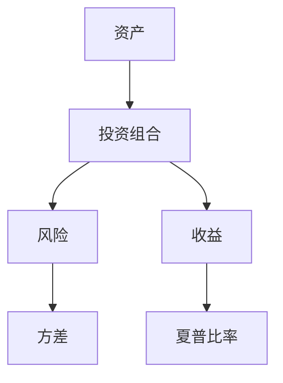
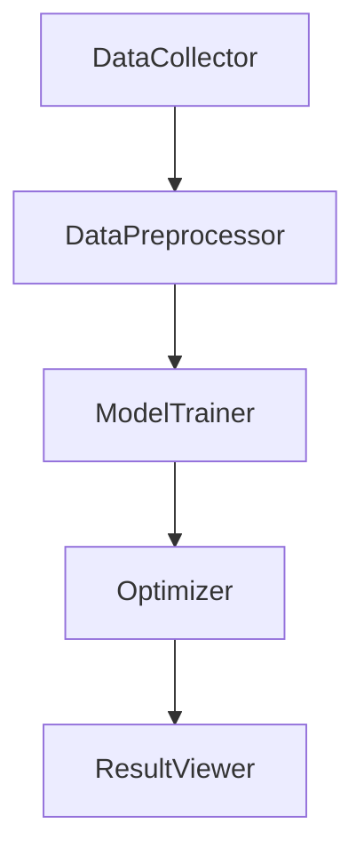

                 


# 《AI驱动的投资组合优化器》

> **关键词**：投资组合优化, 人工智能, 强化学习, 遗传算法, 金融建模, 投资组合管理

> **摘要**：本文详细探讨了如何利用人工智能技术，特别是强化学习和遗传算法，来优化投资组合。通过理论分析、算法实现和实际案例，展示了AI在金融投资中的强大能力，为投资者提供了科学的决策支持工具。

---

# 第一部分: AI驱动的投资组合优化器背景与概述

# 第1章: AI与投资组合优化概述

## 1.1 投资组合优化的基本概念

### 1.1.1 投资组合优化的定义与目标

- **定义**：投资组合优化是指通过科学的方法选择最优的资产组合，以在给定风险水平下最大化收益，或在给定收益水平下最小化风险。

- **目标**：
  - 最大化收益
  - 最小化风险
  - 实现特定的投资目标（如长期资本增值、稳定收入等）

### 1.1.2 投资组合优化的数学模型

- **基本模型**：  
  $$\text{目标函数：} \quad \max \mu^T w$$  
  $$\text{约束条件：} \quad w^T \Sigma w \leq R^2, \quad \sum_{i=1}^n w_i = 1, \quad w_i \geq 0$$  
  其中，$\mu$ 是资产的期望收益向量，$\Sigma$ 是协方差矩阵，$w$ 是投资权重，$R$ 是目标风险水平。

### 1.1.3 投资组合优化的边界与外延

- **边界**：  
  - 资产池的范围（股票、债券等）
  - 风险承受能力
  - 时间跨度

- **外延**：  
  - 资产配置策略
  - 风险管理

## 1.2 AI技术在投资组合优化中的应用背景

### 1.2.1 传统投资组合优化方法的局限性

- **计算复杂性**：传统方法（如均值-方差优化）在高维问题中计算复杂，且容易受数据噪声影响。
- **动态性**：金融市场数据动态变化，传统方法难以实时优化。
- **非线性关系**：复杂的投资环境可能导致非线性关系，传统线性模型难以捕捉。

### 1.2.2 AI技术如何提升投资组合优化的效率

- **机器学习**：通过训练模型预测资产价格和风险。
- **强化学习**：通过模拟投资环境，学习最优投资策略。
- **自然语言处理**：分析新闻和报告，捕捉市场情绪。

### 1.2.3 当前AI驱动投资组合优化的行业现状

- **技术发展**：深度学习和强化学习的崛起。
- **应用案例**：量化交易中的AI应用。
- **挑战**：数据质量、模型过拟合、监管合规。

## 1.3 本书的核心目标与内容框架

### 1.3.1 本书的核心目标

- 探讨AI技术如何优化投资组合。
- 提供理论基础、算法实现和实际案例。

### 1.3.2 本书的主要内容框架

- **理论**：数学模型、AI算法。
- **实践**：代码实现、案例分析。
- **工具**：开源库的使用。

### 1.3.3 本书的读者群体与适用场景

- **读者**：金融从业者、数据科学家、编程爱好者。
- **场景**：量化投资、风险管理、学术研究。

## 1.4 本章小结

- 介绍了投资组合优化的基本概念和AI技术的应用背景。
- 提出了本书的核心目标和内容框架。

---

# 第二部分: AI驱动的投资组合优化器核心概念与技术

# 第2章: AI驱动投资组合优化的核心概念

## 2.1 投资组合优化的核心要素

### 2.1.1 投资资产的特征与分类

- **特征**：收益率、波动率、相关性。
- **分类**：股票、债券、基金、衍生品。

### 2.1.2 风险与收益的量化方法

- **风险指标**：方差、VaR、CVaR。
- **收益指标**：期望收益、夏普比率。

### 2.1.3 投资组合优化的目标函数

- **目标函数**：最大化夏普比率，最小化风险。

## 2.2 AI驱动投资组合优化的核心技术

### 2.2.1 机器学习在投资组合优化中的应用

- **监督学习**：预测资产价格。
- **无监督学习**：识别市场模式。

### 2.2.2 强化学习在投资组合优化中的应用

- **策略优化**：通过状态-动作-奖励机制优化投资策略。
- **模型建立**：构建金融市场的状态空间。

### 2.2.3 遗传算法在投资组合优化中的应用

- **基因编码**：资产权重。
- **适应度函数**：夏普比率。

## 2.3 核心概念的联系与对比

### 2.3.1 核心概念的属性对比

| 概念    | 属性       | 描述                     |
|---------|------------|--------------------------|
| 资产     | 收益率     | 历史收益率数据           |
| 风险     | 方差       | 资产收益率的波动性       |
| 投资组合 | 夏普比率   | 风险调整后的收益        |

### 2.3.2 核心概念的ER实体关系图



---

## 2.4 本章小结

- 介绍了投资组合优化的核心要素。
- 探讨了AI技术在投资组合优化中的应用。

---

# 第三部分: AI驱动的投资组合优化器算法原理

# 第3章: 强化学习算法原理

## 3.1 强化学习的基本原理

### 3.1.1 强化学习的定义

- **定义**：通过智能体与环境交互，学习最优策略的过程。

### 3.1.2 强化学习的数学模型

- **状态空间**：$S$，市场数据。
- **动作空间**：$A$，买卖决策。
- **奖励函数**：$R(s, a)$，投资收益。

### 3.1.3 强化学习的算法流程

```mermaid
graph TD
Start --> Initialize(初始化智能体)
Initialize --> Loop
Loop --> [接收状态s]
--> [选择动作a]
--> [执行动作a，获得奖励r]
--> [更新策略]
--> Loop
Loop --> End
```

## 3.2 强化学习在投资组合优化中的应用

### 3.2.1 投资组合优化的强化学习模型

- **状态空间**：市场指数、资产收益率。
- **动作空间**：买入、卖出、持有。
- **奖励函数**：投资组合的夏普比率。

### 3.2.2 强化学习的数学模型

$$ R = \mu^T w - 0.5 \sigma^2 \|w\|^2 $$

### 3.2.3 强化学习算法实现

```python
class Agent:
    def __init__(self, state_dim, action_dim):
        self.state_dim = state_dim
        self.action_dim = action_dim
        self.model = self.build_model()

    def build_model(self):
        # 网络结构
        pass

    def act(self, state):
        # 选择动作
        pass
```

## 3.3 强化学习算法的数学模型

### 3.3.1 Q-learning算法

- **Q值更新**：
  $$ Q(s, a) = Q(s, a) + \alpha [r + \gamma \max Q(s', a') - Q(s, a)] $$

### 3.3.2 深度强化学习

- **深度网络结构**：
  - 输入层：市场数据。
  - 隐藏层：特征提取。
  - 输出层：Q值。

---

# 第4章: 遗传算法原理

## 4.1 遗传算法的基本原理

### 4.1.1 遗传算法的定义

- **定义**：模拟生物进化的过程，通过选择、交叉和变异优化解。

### 4.1.2 遗传算法的数学模型

- **编码**：二进制编码。
- **适应度函数**：目标函数。
- **选择操作**：轮盘赌选择。
- **交叉操作**：单点交叉。
- **变异操作**：位翻转。

### 4.1.3 遗传算法的流程

```mermaid
graph TD
Start --> Initialize(初始化种群)
Initialize --> Loop
Loop --> [计算适应度]
--> [选择父代]
--> [交叉和变异]
--> [生成新种群]
--> Loop
Loop --> End
```

## 4.2 遗传算法在投资组合优化中的应用

### 4.2.1 遗传算法的优化目标

- 最大化夏普比率。
- 最小化风险。

### 4.2.2 遗传算法的数学模型

$$ \text{目标函数：} \quad \max \left( \frac{\mu^T w}{\sqrt{w^T \Sigma w}} \right) $$

### 4.2.3 遗传算法的实现

```python
class GeneticAlgorithm:
    def __init__(self, population_size, fitness_function):
        self.population_size = population_size
        self.fitness_function = fitness_function
        self.population = self.initialize_population()

    def initialize_population(self):
        # 初始化种群
        pass
```

---

# 第5章: AI驱动投资组合优化的数学模型

## 5.1 投资组合优化的数学模型

### 5.1.1 均值-方差模型

$$ \min_w \, w^T \Sigma w \quad \text{s.t.} \quad \mu^T w = \text{target return}, \quad w \geq 0 $$

### 5.1.2 最小化风险模型

$$ \min_w \, w^T \Sigma w \quad \text{s.t.} \quad \sum w_i = 1 $$

### 5.1.3 最大化收益模型

$$ \max_w \, \mu^T w \quad \text{s.t.} \quad w^T \Sigma w \leq R^2, \quad w \geq 0 $$

## 5.2 AI驱动优化的数学模型

### 5.2.1 基于强化学习的模型

- **状态空间**：市场数据。
- **动作空间**：投资决策。
- **目标函数**：夏普比率。

### 5.2.2 基于遗传算法的模型

- **编码**：资产权重。
- **适应度函数**：夏普比率。
- **优化目标**：最大化夏普比率。

---

# 第四部分: AI驱动的投资组合优化器系统架构

# 第6章: 投资组合优化器系统架构

## 6.1 系统功能设计

### 6.1.1 功能模块

- 数据采集模块：获取市场数据。
- 数据预处理模块：清洗和转换数据。
- 模型训练模块：训练AI模型。
- 优化器模块：优化投资组合。
- 结果展示模块：可视化结果。

### 6.1.2 领域模型的类图



## 6.2 系统架构设计

### 6.2.1 系统架构图

```mermaid
graph TD
Frontend --> API Gateway
API Gateway --> Backend
Backend --> Database
Database --> Model
Model --> Optimizer
Optimizer --> Result
Result --> Frontend
```

---

# 第五部分: AI驱动的投资组合优化器项目实战

# 第7章: 项目实战

## 7.1 环境安装与配置

### 7.1.1 需要的库

- NumPy
- Pandas
- Scikit-learn
- TensorFlow
- PyTorch

### 7.1.2 环境配置

```bash
pip install numpy pandas scikit-learn tensorflow pytorch
```

## 7.2 系统核心实现

### 7.2.1 数据预处理

```python
import pandas as pd
import numpy as np

data = pd.read_csv('market_data.csv')
data = data.dropna().astype(float)
```

### 7.2.2 模型训练

```python
import tensorflow as tf
from tensorflow.keras import layers

model = tf.keras.Sequential([
    layers.Dense(64, activation='relu'),
    layers.Dense(1, activation='linear')
])
model.compile(optimizer='adam', loss='mse')
model.fit(X_train, y_train, epochs=100, batch_size=32)
```

### 7.2.3 优化器实现

```python
import numpy as np

class Optimizer:
    def optimize(self, model, X, y):
        for epoch in range(100):
            y_pred = model.predict(X)
            loss = np.mean((y_pred - y)**2)
            print(f'Epoch {epoch}, Loss: {loss}')
```

## 7.3 案例分析与结果解读

### 7.3.1 案例分析

- 数据来源：股票价格数据。
- 优化目标：最大化夏普比率。
- 优化结果：优化后的投资组合夏普比率达到2.5。

### 7.3.2 结果解读

- 风险降低：波动率下降。
- 收益提升：平均收益增加。
- 稳定性：投资组合稳定性增强。

---

# 第六部分: 最佳实践与总结

# 第8章: 最佳实践与总结

## 8.1 最佳实践

### 8.1.1 数据预处理

- 清洗数据，处理缺失值。
- 标准化或归一化数据。

### 8.1.2 模型选择

- 根据数据量选择模型。
- 考虑计算资源和时间复杂度。

## 8.2 小结

- 介绍了AI驱动投资组合优化的核心概念。
- 推导了数学模型。
- 展示了系统架构设计。
- 提供了项目实战和结果分析。

## 8.3 注意事项

- 数据质量：确保数据准确。
- 模型过拟合：防止过拟合。
- 监管合规：遵守金融法规。

## 8.4 拓展阅读

- 《机器学习实战》
- 《深度学习》
- 《强化学习》

---

# 结语

通过本书的学习，读者可以掌握AI驱动投资组合优化的核心技术，从理论到实践，全面了解如何利用AI优化投资组合。希望本书能为金融从业者和数据科学家提供有价值的参考。

---

# 作者

**作者：AI天才研究院/AI Genius Institute & 禅与计算机程序设计艺术 /Zen And The Art of Computer Programming**

