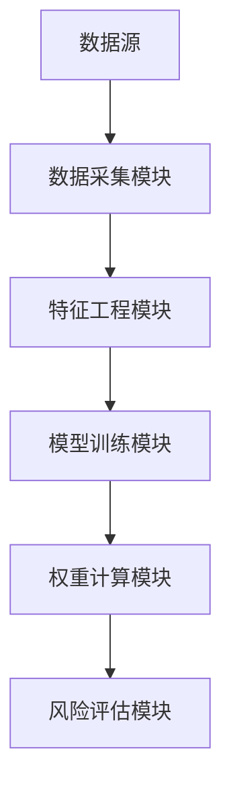
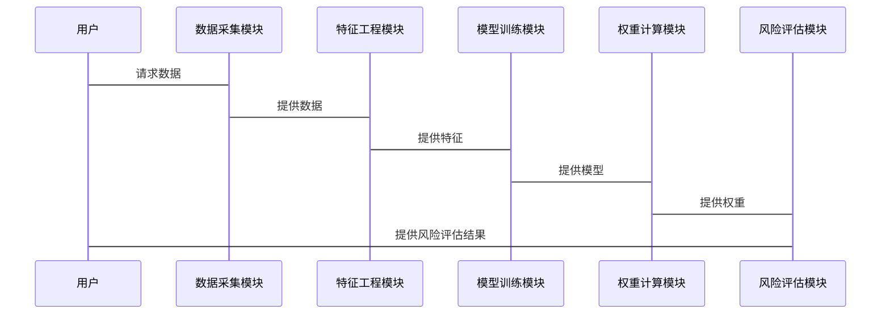

                 


# AI驱动的投资组合因子暴露优化

> 关键词：投资组合、因子暴露、AI、机器学习、优化算法、金融建模

> 摘要：本文详细探讨了AI技术在投资组合因子暴露优化中的应用，结合现代投资组合理论和机器学习算法，提出了一种基于AI的优化方法，通过系统化的建模、算法设计和实战案例分析，展示了如何利用AI技术有效降低投资组合风险并提升收益。文章内容涵盖背景介绍、理论基础、算法实现、系统架构、项目实战等多方面，旨在为金融从业者和AI技术爱好者提供深度的技术见解和实践指导。

---

# 第一部分: AI驱动的投资组合因子暴露优化概述

## # 第1章: 问题背景与核心概念

### 1.1 投资组合因子暴露的定义与意义
#### 1.1.1 因子暴露的基本概念
因子暴露（Factor Exposure）是指投资组合对某一特定风险因子的敏感程度，量化了组合在不同市场因子上的风险敞口。

#### 1.1.2 因子暴露的分类
- 市场因子（如市值、Beta）
- 风险因子（如波动率、信用风险）
- 特定因子（如行业、风格）

#### 1.1.3 因子暴露优化的目标
通过调整组合中各资产的权重，降低对不利因子的暴露，同时最大化收益。

### 1.2 AI驱动优化的核心价值
#### 1.2.1 传统优化方法的局限性
- 依赖人工经验
- 模型假设的简化
- 计算复杂度高

#### 1.2.2 AI技术的引入与优势
- 数据驱动的自动化优化
- 高维因子空间的处理能力
- 非线性关系的挖掘能力

#### 1.2.3 与传统优化方法的区别
- 数据驱动 vs. 模型驱动
- 非线性建模能力 vs. 线性假设
- 高维处理能力 vs. 维度限制

### 1.3 本书的核心内容与结构
#### 1.3.1 核心问题
如何利用AI技术构建一个高效的因子暴露优化模型。

#### 1.3.2 核心方法
- 机器学习模型的构建与训练
- 多目标优化算法的设计与实现
- 风险预测与收益预测的结合

#### 1.3.3 本书结构
- 第一部分：背景与概念
- 第二部分：理论基础
- 第三部分：算法实现
- 第四部分：系统架构
- 第五部分：项目实战
- 第六部分：总结与展望

---

# 第二部分: 投资组合因子暴露优化的理论基础

## # 第2章: 因子模型与风险度量

### 2.1 多因子模型的构建与应用
#### 2.1.1 多因子模型的构建方法
- 筛选因子：通过统计显著性、经济意义等标准筛选因子
- 权重分配：通过回归分析确定各因子的权重

#### 2.1.2 因子模型的优劣势分析
- 优势：能够捕捉多种风险来源
- 劣势：因子间的多重共线性问题

### 2.2 风险度量与优化目标
#### 2.2.1 风险的定义与度量方法
- 方差：衡量资产收益的波动性
- Value-at-Risk (VaR)：在一定置信水平下的潜在损失
- Conditional VaR (CVaR)：VaR的预期损失

#### 2.2.2 投资组合优化的目标函数
- 最小化风险
- 最大化收益
- 风险-收益平衡

#### 2.2.3 风险-收益平衡的核心思想
在给定风险水平下最大化收益，或在给定收益水平下最小化风险。

### 2.3 AI在因子优化中的应用潜力
#### 2.3.1 机器学习在因子筛选中的作用
- 使用特征选择算法（如Lasso、随机森林）筛选重要因子
- 利用聚类分析发现新的因子组合

#### 2.3.2 AI驱动的因子权重优化
- 使用神经网络预测因子权重
- 利用强化学习优化权重分配

#### 2.3.3 风险预测的AI方法
- 时间序列预测模型（如LSTM）
- 非监督学习发现隐含风险因素

---

# 第三部分: AI驱动的因子暴露优化算法

## # 第3章: 基于AI的因子优化算法原理

### 3.1 优化模型的构建
#### 3.1.1 优化目标的数学表达
$$ \text{目标函数} = \min_w \sum_{i=1}^{n} w_i^2 \cdot \text{风险因子}_i + \lambda \cdot \text{惩罚项} $$

#### 3.1.2 约束条件的设定
$$ \sum_{i=1}^{n} w_i = 1 \quad (\text{权重归一化}) $$

$$ w_i \geq 0 \quad (\text{权重非负}) $$

### 3.2 基于机器学习的优化方法
#### 3.2.1 机器学习模型的选择
- 线性回归：用于预测因子权重
- 支持向量机（SVM）：用于分类问题
- 随机森林：用于特征重要性分析

#### 3.2.2 神经网络模型的应用
- 使用深度学习模型预测因子权重
- 利用自注意力机制捕捉因子间的非线性关系

### 3.3 优化算法的实现步骤
1. 数据预处理：清洗和标准化数据
2. 特征工程：提取有用的特征
3. 模型训练：训练机器学习模型
4. 模型优化：调整超参数
5. 权重计算：预测最优权重

### 3.4 算法实现的数学模型
$$ \text{损失函数} = \sum_{i=1}^{n} (y_i - \hat{y}_i)^2 + \lambda \cdot \sum_{i=1}^{n} |w_i| $$

其中，$y_i$ 是实际值，$\hat{y}_i$ 是预测值，$w_i$ 是权重，$\lambda$ 是正则化参数。

---

# 第四部分: 系统架构与实现

## # 第4章: 系统架构设计

### 4.1 系统功能设计
- 数据采集模块：获取市场数据和因子数据
- 特征工程模块：处理和提取特征
- 模型训练模块：训练机器学习模型
- 权重计算模块：预测最优权重
- 风险评估模块：评估组合风险

### 4.2 系统架构图


### 4.3 接口设计
- 数据接口：与数据源对接
- 模型接口：与其他系统模块对接
- 用户接口：提供用户交互界面

### 4.4 系统交互图


---

# 第五部分: 项目实战

## # 第5章: 项目实战与案例分析

### 5.1 项目背景与目标
- 数据来源：某金融数据集
- 目标：优化投资组合的因子暴露

### 5.2 环境搭建
- 安装Python
- 安装必要的库：pandas、numpy、scikit-learn、xgboost

### 5.3 核心代码实现
```python
import pandas as pd
import numpy as np
from sklearn.model import LinearRegression
from sklearn.metrics import mean_squared_error

# 数据加载
data = pd.read_csv('factor_data.csv')

# 特征工程
X = data[['factor1', 'factor2', ...]]
y = data['target']

# 模型训练
model = LinearRegression()
model.fit(X, y)

# 预测权重
weights = model.predict(X)
weights = weights / np.sum(weights)  # 归一化权重
```

### 5.4 实际案例分析
- 数据分析与结果解读
- 模型调优与效果对比
- 风险评估与收益分析

### 5.5 项目总结
- 成果展示
- 经验总结
- 改进建议

---

# 第六部分: 总结与展望

## # 第6章: 总结与展望

### 6.1 核心总结
- 本文提出了基于AI的投资组合因子暴露优化方法
- 展示了从理论到实践的完整实现过程
- 通过案例分析验证了方法的有效性

### 6.2 未来展望
- 更多因子的引入与优化
- 更复杂的模型（如深度学习）的应用
- 实时优化系统的开发

---

作者：AI天才研究院/AI Genius Institute & 禅与计算机程序设计艺术 /Zen And The Art of Computer Programming

