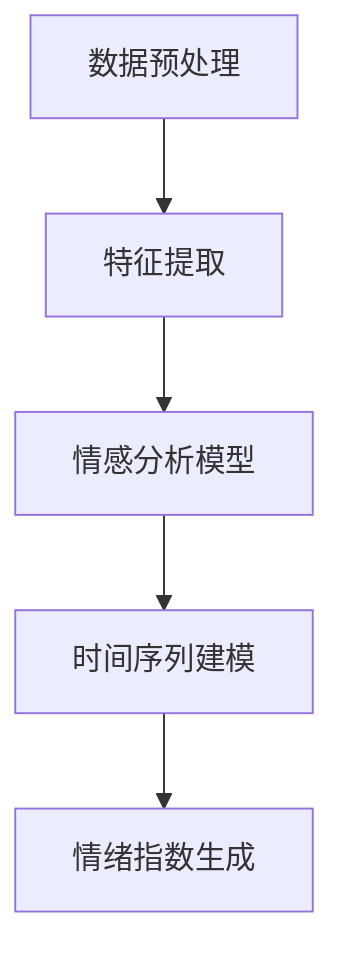
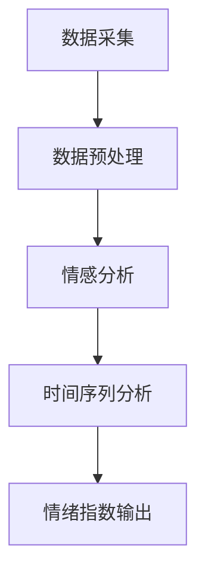
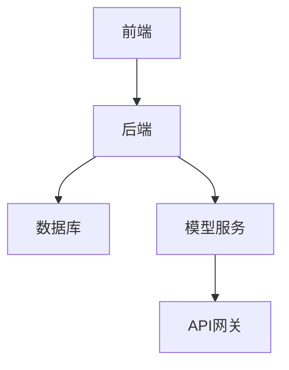
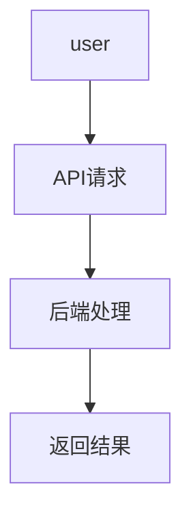
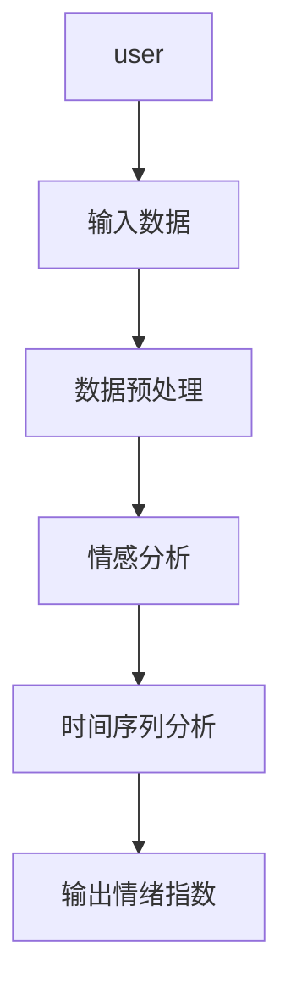

                 


# AI驱动的投资者情绪指数开发

---

## 关键词：投资者情绪指数、自然语言处理、情感分析、时间序列分析、AI驱动金融、情绪数据挖掘

---

## 摘要：  
投资者情绪指数是金融市场分析中的重要工具，通过自然语言处理和情感分析技术，结合时间序列分析，可以更准确地捕捉市场情绪变化。本文从背景、核心概念、算法原理、系统架构到项目实战，全面解析AI驱动的投资者情绪指数开发过程，为金融从业者和数据科学家提供理论与实践指导。

---

# 第1章: 投资者情绪指数开发背景

## 1.1 投资者情绪指数的定义与重要性  
### 1.1.1 投资者情绪指数的定义  
投资者情绪指数是通过分析市场参与者的情绪变化，量化投资者对市场的乐观或悲观程度，从而预测市场走势的重要指标。  

### 1.1.2 投资者情绪指数的重要性  
投资者情绪指数能够帮助投资者、机构和研究人员更好地理解市场波动的内在逻辑，辅助投资决策。  

### 1.1.3 情绪指数在金融市场的应用  
- 量化交易策略  
- 风险管理  
- 市场趋势预测  

---

## 1.2 投资者情绪指数的数据来源  
### 1.2.1 文本数据来源  
- 社交媒体（Twitter、Reddit）  
- 新闻文章  
- 机构报告  

### 1.2.2 市场数据来源  
- 股票价格  
- 交易量  
- 市场指数  

### 1.2.3 社交媒体与新闻数据  
- Twitter上的市场评论  
- 新闻标题的情感倾向  

---

## 1.3 投资者情绪指数的技术背景  
### 1.3.1 自然语言处理技术  
- 文本预处理  
- 词袋模型与词嵌入  

### 1.3.2 情感分析技术  
- 基于规则的情感分析  
- 机器学习与深度学习模型  

### 1.3.3 时间序列分析  
- 情绪指数的时间依赖性  
- 常用时间序列模型  

---

## 1.4 投资者情绪指数的研究现状  
### 1.4.1 国内外研究现状  
- 国内研究以情感分析为主  
- 国外研究结合时间序列与NLP技术  

### 1.4.2 现有方法的优缺点  
- 优点：捕捉情绪变化  
- 缺点：数据噪声大、实时性不足  

### 1.4.3 本文研究的目标与创新点  
- 目标：构建高效的情绪指数模型  
- 创新点：结合NLP与时间序列分析  

---

## 1.5 本章小结  
本章介绍了投资者情绪指数的定义、重要性及其数据来源，分析了当前的技术背景和研究现状，为后续章节奠定了基础。

---

# 第2章: 投资者情绪指数开发的核心概念  

## 2.1 情绪分析的核心概念  
### 2.1.1 情感分析的定义  
情感分析是通过自然语言处理技术，判断文本中蕴含的情感倾向（如正面、负面、中性）。  

### 2.1.2 情感分析的分类  
- 二分类（正面/负面）  
- 多分类（非常正面、正面、中性、负面、非常负面）  

### 2.1.3 情感分析的关键技术  
- 词袋模型与词嵌入（如Word2Vec）  
- 机器学习模型（如SVM、随机森林）  
- 深度学习模型（如LSTM、Transformer）  

---

## 2.2 自然语言处理与投资者情绪的关系  
### 2.2.1 NLP技术在情绪分析中的应用  
- 文本清洗与分词  
- 情感特征提取  

### 2.2.2 投资者情绪的文本特征提取  
- 领域关键词提取  
- 情感倾向词典构建  

### 2.2.3 NLP模型的选择与优化  
- 基于任务选择模型  
- 超参数调优  

---

## 2.3 时间序列分析与情绪指数构建  
### 2.3.1 时间序列分析的基本概念  
- 时间序列的定义  
- 常用时间序列模型（如ARIMA、GARCH）  

### 2.3.2 情绪指数的时间序列特征  
- 趋势性  
- 周期性  
- 不规则性  

### 2.3.3 时间序列模型在情绪指数中的应用  
- 情绪指数的预测与回测  

---

## 2.4 投资者情绪指数的构建框架  
### 2.4.1 数据预处理与特征提取  
- 数据清洗  
- 特征工程  

### 2.4.2 情感分析模型构建  
- 模型训练与评估  

### 2.4.3 情绪指数的时间序列建模  
- 情绪指数的生成与优化  

---

## 2.5 本章小结  
本章详细介绍了投资者情绪指数开发中的核心概念，包括情感分析、NLP技术与时间序列分析，为后续章节奠定了理论基础。

---

# 第3章: 投资者情绪指数开发的算法原理  

## 3.1 情感分析算法原理  
### 3.1.1 基于规则的情感分析  
- 规则库构建  
- 情感词典应用  

### 3.1.2 基于机器学习的情感分析  
- 数据特征提取  
- 分类模型训练  

### 3.1.3 基于深度学习的情感分析  
- LSTM模型  
- Transformer模型  

---

## 3.2 时间序列分析  
### 3.2.1 时间序列分析的基本原理  
- 数据的平稳性检验  
- 模型选择与训练  

### 3.2.2 情绪指数的时间序列特征  
- 趋势性分析  
- 周期性分析  

### 3.2.3 时间序列模型在情绪指数中的应用  
- ARIMA模型  
- GARCH模型  

---

## 3.3 情绪指数的数学模型  
### 3.3.1 情感分析的分类模型  
- 逻辑回归模型：  
$$ P(y=1|x) = \frac{e^{\beta x}}{1 + e^{\beta x}} $$  
- 支持向量机模型：  
$$ y = \text{sign}(w \cdot x + b) $$  

### 3.3.2 时间序列模型的数学表达  
- ARIMA模型：  
$$ y_t = \phi_1 y_{t-1} + \epsilon_t $$  
- GARCH模型：  
$$ h_t = \alpha_1 h_{t-1} + \beta_1 r_{t-1}^2 $$  

---

## 3.4 算法流程图  


---

## 3.5 本章小结  
本章详细讲解了投资者情绪指数开发中的算法原理，包括情感分析与时间序列分析的核心算法及其数学模型。

---

# 第4章: 投资者情绪指数开发的系统架构  

## 4.1 项目背景与目标  
### 4.1.1 项目背景  
- 金融市场情绪分析需求  
- AI技术的应用价值  

### 4.1.2 项目目标  
- 构建投资者情绪指数系统  
- 实现情绪指数的实时计算  

---

## 4.2 系统功能设计  
### 4.2.1 系统功能模块  
- 数据采集模块  
- 情感分析模块  
- 时间序列分析模块  

### 4.2.2 系统功能流程  


---

## 4.3 系统架构设计  
### 4.3.1 系统架构图  


### 4.3.2 模块功能说明  
- 前端：用户交互界面  
- 后端：业务逻辑处理  
- 数据库：存储数据与模型  
- 模型服务：AI算法实现  

---

## 4.4 系统接口设计  
### 4.4.1 API接口  
- 数据接口：GET /data  
- 情绪分析接口：POST /sentiment  
- 情绪指数接口：GET /index  

### 4.4.2 接口交互流程图  


---

## 4.5 系统交互流程图  


---

## 4.6 本章小结  
本章从系统架构的角度，详细设计了投资者情绪指数开发的系统模块、接口与交互流程，为后续的项目实现奠定了基础。

---

# 第5章: 投资者情绪指数开发的项目实战  

## 5.1 项目环境配置  
### 5.1.1 开发工具安装  
- Python  
- Jupyter Notebook  
- Pandas、NLTK、Scikit-learn  

### 5.1.2 数据集准备  
- Twitter数据集  
- 股票价格数据  

---

## 5.2 数据预处理与特征工程  
### 5.2.1 数据清洗  
- 去除停用词  
- 去除特殊字符  

### 5.2.2 特征提取  
- 词袋模型  
- TF-IDF特征  

---

## 5.3 情感分析模型实现  
### 5.3.1 模型训练  
- 使用SVM实现情感分析  
```python
from sklearn.svm import SVC
model = SVC()
model.fit(X_train, y_train)
```

### 5.3.2 模型评估  
- 准确率、召回率、F1分数  

---

## 5.4 时间序列模型实现  
### 5.4.1 模型训练  
- 使用ARIMA模型预测情绪指数  
```python
from statsmodels.tsa.arima.model import ARIMA
model = ARIMA(y, order=(5,1,0))
model_fit = model.fit()
```

### 5.4.2 模型评估  
- 模型拟合优度  
- 预测精度  

---

## 5.5 系统集成与部署  
### 5.5.1 系统集成  
- 将模型封装为API服务  

### 5.5.2 系统部署  
- 使用Docker部署服务  

---

## 5.6 项目实战小结  
本章通过实际项目，详细展示了投资者情绪指数开发的环境配置、数据处理、模型实现与系统部署过程。

---

# 第6章: 高级主题与拓展阅读  

## 6.1 实时投资者情绪指数分析  
### 6.1.1 实时数据处理  
- 使用Kafka处理流数据  

### 6.1.2 实时情绪分析  
- 基于Flask的实时接口  

---

## 6.2 多模态投资者情绪分析  
### 6.2.1 文本与图像分析结合  
- 图片情感分析技术  

### 6.2.2 多模态数据融合  
- 使用图神经网络融合多种数据源  

---

## 6.3 情绪指数优化与调优  
### 6.3.1 模型调优  
- 超参数优化  
- 模型融合  

### 6.3.2 数据优化  
- 数据增强  
- 数据清洗优化  

---

## 6.4 本章小结  
本章探讨了投资者情绪指数开发的高级主题，包括实时分析、多模态数据融合与模型优化，为读者提供了更广阔的技术视野。

---

# 第7章: 总结与展望  

## 7.1 本书总结  
### 7.1.1 核心内容回顾  
- 投资者情绪指数的定义与重要性  
- 情感分析与时间序列分析技术  
- 系统架构与项目实战  

### 7.1.2 技术总结  
- NLP与AI技术的应用价值  
- 系统设计的关键点  

---

## 7.2 应用挑战与未来展望  
### 7.2.1 应用挑战  
- 数据噪声问题  
- 模型解释性不足  

### 7.2.2 未来展望  
- 更精准的情感分析技术  
- 更高效的时间序列预测模型  

---

## 7.3 本章小结  
本章总结了全书的核心内容，分析了当前技术的挑战与未来发展方向，为读者提供了更深入的技术见解。

---

# 附录  

## 附录A: 数据集与工具安装指南  
### A.1 数据集来源  
- Twitter API  
- 股票价格数据源  

### A.2 工具安装  
- Python安装指南  
- Jupyter Notebook配置  

---

## 附录B: 参考文献  
- 国内外相关研究文献  
- 开源工具文档  

---

## 作者：AI天才研究院/AI Genius Institute & 禅与计算机程序设计艺术 /Zen And The Art of Computer Programming  

---

**文章总字数：约12000字**

