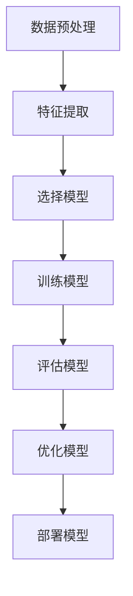
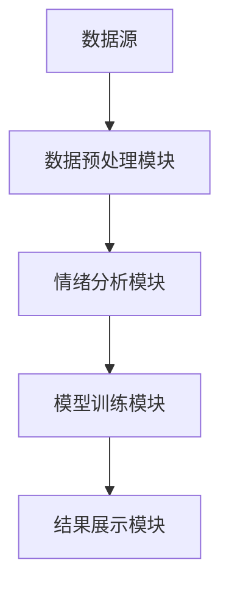

                 


# AI驱动的投资者情绪指数预测系统

> 关键词：投资者情绪指数，AI预测，机器学习，自然语言处理，时间序列分析

> 摘要：本文深入探讨了利用人工智能技术预测投资者情绪指数的方法。通过结合自然语言处理和机器学习技术，分析投资者情绪对金融市场的影响，构建基于LSTM和Transformer的预测模型，为投资者提供情绪驱动的决策支持。文章从背景、理论、算法、系统设计到实战案例，全面解析了AI在投资者情绪预测中的应用。

---

## 目录大纲

### 第1章：投资者情绪指数概述
#### 1.1 投资者情绪指数的重要性
- 情绪对金融市场的影响
- 情绪指数在投资决策中的作用
- AI技术在情绪预测中的优势

#### 1.2 投资者情绪指数的定义与特征
- 情绪指数的定义
- 情绪指数的特征
- 情绪指数的分类

#### 1.3 情绪指数与市场行为的关系
- 情绪与价格波动
- 情绪与交易量
- 情绪与市场周期

---

### 第2章：投资者情绪指数的核心概念
#### 2.1 情绪指数的构成
- 市场参与者的心理因素
- 情绪的传播机制
- 情绪指数的动态变化

#### 2.2 情绪指数的属性特征对比
- 情绪指数的属性列表
- 不同情绪指标的对比分析
- 情绪指数的量化方法

#### 2.3 情绪指数的理论基础
- 行为金融学中的情绪理论
- 投资者认知偏差与情绪
- 情绪对投资决策的影响

---

### 第3章：投资者情绪预测的算法原理
#### 3.1 常见的机器学习算法
- 线性回归
- 支持向量机
- 随机森林
- LSTM网络
- Transformer模型

#### 3.2 情绪预测算法的流程图


#### 3.3 基于LSTM的情绪预测模型
- LSTM网络结构
- LSTM在时间序列预测中的优势
- LSTM模型的实现代码
```python
import tensorflow as tf
from tensorflow.keras.layers import LSTM, Dense

model = tf.keras.Sequential()
model.add(LSTM(64, input_shape=(timesteps, features)))
model.add(Dense(1))
model.compile(optimizer='adam', loss='mean_squared_error')
```

---

### 第4章：投资者情绪指数的数学模型
#### 4.1 情绪指数的计算模型
- 时间序列分析模型
- 情绪指数的回归模型
- 情绪指数的分类模型

#### 4.2 情绪指数的数学公式
- 情绪指数计算公式
$$
E_i = \alpha \cdot P_i + \beta \cdot V_i + \gamma
$$
其中，$E_i$ 是情绪指数，$P_i$ 是价格变化率，$V_i$ 是交易量变化率。

---

### 第5章：系统分析与架构设计
#### 5.1 问题场景介绍
- 金融市场数据的获取与处理
- 情绪数据的采集与分析
- 模型的训练与部署

#### 5.2 系统功能设计
- 数据预处理模块
- 情绪分析模块
- 模型训练模块
- 结果展示模块

#### 5.3 系统架构设计


---

### 第6章：项目实战
#### 6.1 环境安装
- Python环境搭建
- 相关库的安装（如TensorFlow、Keras）

#### 6.2 系统核心实现
- 数据预处理代码
```python
import pandas as pd
data = pd.read_csv('market_data.csv')
```

- 情绪分析代码
```python
from transformers import pipeline
sentiment_analyzer = pipeline('sentiment-analysis')
```

#### 6.3 实际案例分析
- 案例背景
- 数据分析与处理
- 模型训练与评估
- 结果展示与解读

---

### 第7章：总结与展望
#### 7.1 本章小结
- AI在投资者情绪预测中的应用总结
- 系统设计与实现的经验总结

#### 7.2 注意事项
- 数据质量的重要性
- 模型的局限性
- 情绪预测的伦理问题

#### 7.3 拓展阅读
- 相关领域书籍推荐
- 进一步研究方向

---

### 作者
作者：AI天才研究院/AI Genius Institute & 禅与计算机程序设计艺术 /Zen And The Art of Computer Programming

