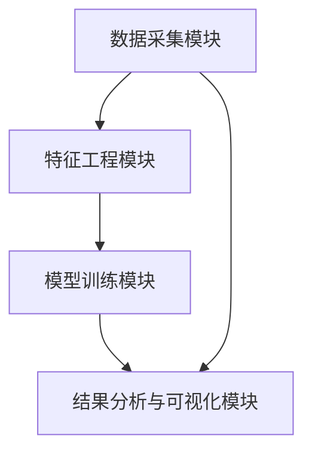
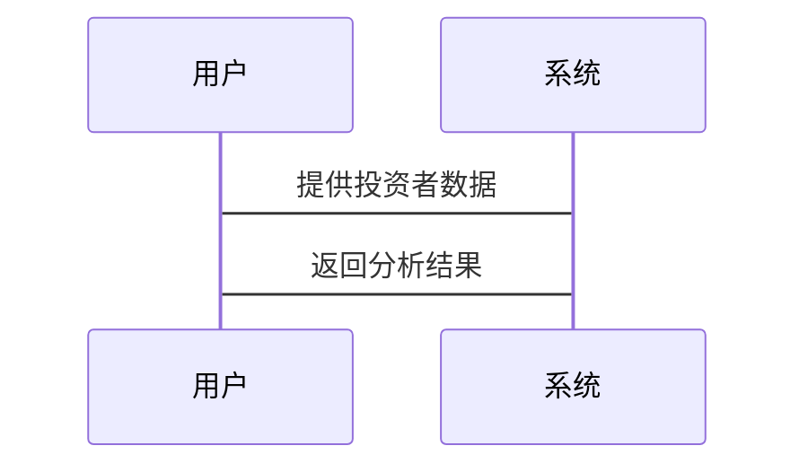

                 


# AI驱动的投资者行为分析

> 关键词：人工智能、投资者行为分析、机器学习、情感计算、自然语言处理

> 摘要：AI驱动的投资者行为分析是一种结合人工智能技术来分析投资者行为模式的方法。通过机器学习、自然语言处理和情感计算等技术，可以深入挖掘投资者的决策模式、情绪波动和行为偏好，从而为投资决策提供科学依据。本文将系统地介绍AI在投资者行为分析中的核心概念、算法原理、系统架构设计以及实际应用案例，帮助读者全面理解并掌握这一领域的最新进展。

---

# 第一部分: AI驱动的投资者行为分析概述

## 第1章: 投资者行为分析的背景与挑战

### 1.1 投资者行为分析的基本概念

#### 1.1.1 投资者行为分析的定义
投资者行为分析是研究投资者在金融市场中的决策过程、行为模式和情绪波动的学科。通过分析投资者的行为数据，可以揭示其投资策略、风险偏好和决策逻辑。

#### 1.1.2 投资者行为分析的重要性
投资者行为分析在金融领域具有重要意义，它可以帮助投资者优化决策、降低风险，并为机构投资者提供市场洞察。传统的分析方法依赖于市场数据和基本面分析，但难以捕捉投资者的主观行为特征。

#### 1.1.3 投资者行为分析的边界与外延
投资者行为分析的边界包括投资者的决策过程、情绪波动和行为模式，而外延则涉及市场整体走势、机构行为和个体差异。

### 1.2 AI驱动的投资者行为分析的背景

#### 1.2.1 传统投资者行为分析的局限性
传统投资者行为分析主要依赖于市场数据和统计分析，难以捕捉投资者的主观情绪和行为偏好。此外，传统方法在处理大规模数据和实时分析方面存在局限性。

#### 1.2.2 AI技术如何改变投资者行为分析
AI技术通过机器学习、自然语言处理和情感计算等方法，能够从海量数据中提取投资者的行为特征，实时分析市场情绪，并预测投资行为。

#### 1.2.3 当前AI在金融领域的应用现状
当前，AI技术在金融领域的应用日益广泛，特别是在高频交易、风险管理和智能投顾方面。投资者行为分析作为其中的重要分支，正逐步从传统方法向AI驱动的模式转变。

### 1.3 本章小结
本章介绍了投资者行为分析的基本概念、重要性以及AI技术在其中的变革作用，为后续章节奠定了基础。

---

# 第二部分: AI驱动的投资者行为分析的核心概念

## 第2章: AI驱动的投资者行为分析的核心概念与联系

### 2.1 核心概念原理

#### 2.1.1 数据驱动的投资者行为分析
数据驱动的投资者行为分析通过收集和分析大量投资者数据，揭示其行为模式和决策逻辑。数据来源包括交易记录、社交媒体评论和新闻报道。

#### 2.1.2 AI技术在行为分析中的应用
AI技术通过机器学习、自然语言处理和情感计算等方法，从投资者数据中提取情感特征、行为模式和决策偏好。

### 2.2 核心概念属性特征对比表格

| **核心概念** | **传统分析** | **AI驱动分析** |
|--------------|--------------|----------------|
| 数据来源     | 市场数据       | 交易记录、社交媒体 |
| 分析方法     | 统计分析       | 机器学习、NLP |
| 分析结果     | 市场趋势       | 投资者情绪、行为模式 |

### 2.3 ER实体关系图架构

```mermaid
erDiagram
    user {
        <属性>
        用户ID : string
        投资行为 : string
        情绪特征 : string
        }
    market {
        <属性>
        交易时间 : datetime
        股票代码 : string
        价格变化 : float
        }
    news {
        <属性>
        新闻标题 : string
        发布时间 : datetime
        情感倾向 : float
        }
    user ~market : 参与交易
    user ~news : 关注新闻
    news ~market : 影响市场
```

---

# 第三部分: AI驱动的投资者行为分析的算法原理

## 第3章: 机器学习算法在投资者行为分析中的应用

### 3.1 机器学习算法概述

#### 3.1.1 监督学习
监督学习通过训练数据，预测投资者的未来行为。例如，使用回归算法预测股票价格变化。

#### 3.1.2 无监督学习
无监督学习用于发现投资者群体中的潜在模式。例如，使用聚类算法将投资者分为不同类型。

#### 3.1.3 强化学习
强化学习模拟投资者的决策过程，通过与环境的交互优化投资策略。

### 3.2 基于机器学习的投资者行为预测模型

#### 3.2.1 模型输入特征
模型输入包括历史交易数据、市场新闻、社交媒体情绪等。

#### 3.2.2 模型输出结果
模型输出包括投资者情绪预测、交易行为预测和市场趋势预测。

#### 3.2.3 模型训练过程
模型训练使用历史数据，通过优化算法调整模型参数，提高预测准确率。

### 3.3 机器学习算法的实现代码

```python
# 环境安装
import numpy as np
from sklearn.model_selection import train_test_split
from sklearn.linear_model import LinearRegression

# 数据准备
X = np.array([[1, 2], [3, 4], [5, 6]])
y = np.array([7, 8, 9])

# 数据分割
X_train, X_test, y_train, y_test = train_test_split(X, y, test_size=0.33)

# 模型训练
model = LinearRegression()
model.fit(X_train, y_train)

# 模型预测
print(model.predict(X_test))
```

---

# 第四部分: AI驱动的投资者行为分析的系统架构设计

## 第4章: 系统架构设计与实现

### 4.1 系统功能模块划分

#### 4.1.1 数据采集模块
数据采集模块负责收集投资者的交易数据、社交媒体评论和市场新闻。

#### 4.1.2 特征工程模块
特征工程模块对数据进行预处理，提取有用的特征，如情绪特征和行为特征。

#### 4.1.3 模型训练模块
模型训练模块使用机器学习算法训练模型，优化模型参数。

#### 4.1.4 结果分析与可视化模块
结果分析与可视化模块对模型输出进行分析，并生成可视化报告。

### 4.2 系统架构设计



### 4.3 系统接口设计



---

# 作者

作者：AI天才研究院 & 禅与计算机程序设计艺术

