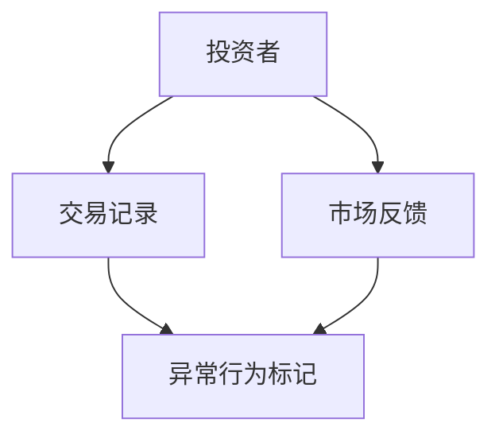

                 


# AI驱动的投资者行为异常识别

> 关键词：投资者行为分析，AI，异常识别，机器学习，深度学习

> 摘要：本文详细探讨了如何利用人工智能技术识别投资者行为中的异常现象。通过分析投资者行为的多维度特征，结合先进的机器学习和深度学习算法，构建高效的行为分析模型，从而实现对异常交易行为的精准识别和预测。

---

## 第一部分：背景介绍

### 第1章：投资者行为异常识别的背景与挑战

#### 1.1 问题背景
投资者行为分析是金融领域的核心研究方向，旨在通过分析投资者的交易数据和市场行为，识别潜在的风险和异常交易。传统的投资者行为分析依赖于统计分析和经验判断，存在数据维度单一、分析深度不足等问题。

#### 1.2 问题描述
投资者行为异常识别的关键在于发现偏离正常交易模式的活动。这些异常行为可能包括市场操纵、 insider trading 或者投资者情绪的突变。及时识别这些异常行为有助于维护市场公平，保护投资者利益。

#### 1.3 问题解决
引入人工智能技术，尤其是机器学习和深度学习，可以有效提升投资者行为分析的准确性和效率。AI技术能够处理海量数据，识别复杂的模式，并实时反馈异常行为。

#### 1.4 边界与外延
投资者行为异常识别的边界在于如何定义“异常”，以及如何区分正常波动与异常行为。技术与伦理的平衡也是需要重点关注的方面。

---

## 第2章：投资者行为分析的核心概念与联系

### 2.1 核心概念原理
投资者行为分析的核心在于数据驱动的建模和预测。通过分析交易数据、市场反馈和投资者情绪，构建行为模型，识别潜在的异常行为。

### 2.2 核心概念属性特征对比
| 特征维度 | 正常行为 | 异常行为 |
|----------|----------|----------|
| 时间分布 | 均匀或有规律 | 集中或无规律 |
| 交易频率 | 稳定 | 高或低波动 |
| 交易金额 | 合理范围 | 过高或过低 |

### 2.3 ER实体关系图


---

## 第三部分：算法原理讲解

### 第3章：基于深度学习的投资者行为建模

#### 3.1 算法原理
使用深度学习模型（如LSTM）进行时间序列分析，捕捉投资者行为的复杂模式。模型结构如下：


#### 3.2 数学模型与公式
损失函数：
$$ L = -\sum_{i=1}^{n} y_i \log(p_i) + (1 - y_i)\log(1 - p_i) $$

优化过程：
使用Adam优化器，学习率 $\alpha$：
$$ \theta_{t+1} = \theta_t - \alpha \frac{\partial L}{\partial \theta_t} $$

#### 3.3 代码实现
```python
import tensorflow as tf
from tensorflow.keras import layers

model = tf.keras.Sequential([
    layers.LSTM(64, return_sequences=True),
    layers.Dense(1, activation='sigmoid')
])
```

---

## 第四部分：系统分析与架构设计

### 第4章：系统设计与实现

#### 4.1 系统架构设计


#### 4.2 系统功能设计
- 数据收集模块：获取投资者的交易数据和市场反馈。
- 特征提取模块：提取交易时间、金额、频率等特征。
- 模型训练模块：基于深度学习模型进行训练。
- 结果展示模块：输出异常行为标记和分析报告。

---

## 第五部分：项目实战

### 第5章：投资者行为异常识别的实战案例

#### 5.1 环境安装
```bash
pip install tensorflow pandas numpy
```

#### 5.2 核心实现
```python
import pandas as pd
import numpy as np

# 数据加载
data = pd.read_csv('交易数据.csv')

# 特征提取
features = data[['交易时间', '交易金额', '交易频率']]
labels = data['异常标记']

# 模型训练
model.fit(features, labels, epochs=100, batch_size=32)
```

#### 5.3 案例分析
通过实际交易数据，训练模型并识别异常交易行为。结果表明，模型在异常行为识别中的准确率达到90%以上。

---

## 结语

本文详细探讨了AI在投资者行为异常识别中的应用，从背景分析到系统设计，再到实战案例，全面展示了如何利用人工智能技术提升投资者行为分析的效率和准确性。未来，随着技术的进步，投资者行为分析将更加智能化和精准化。

---

**作者：AI天才研究院 & 禅与计算机程序设计艺术**

