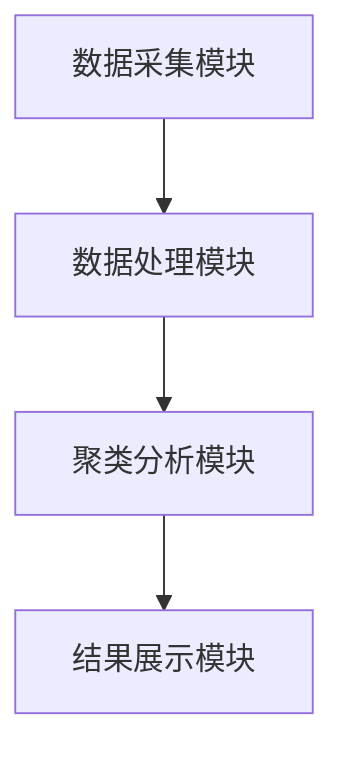
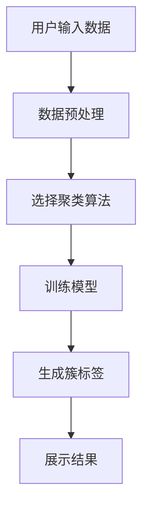
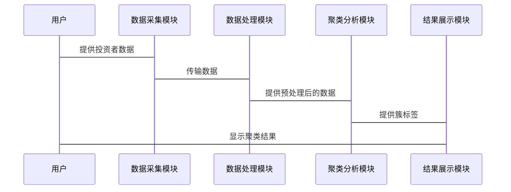

                 


# AI驱动的投资者行为模式聚类分析

## 关键词：投资者行为分析、聚类分析、机器学习、人工智能、金融数据分析

## 摘要：本文探讨了如何利用人工智能技术，特别是聚类分析方法，来研究和分类投资者的行为模式。文章从投资者行为分析的背景和意义入手，详细介绍了聚类分析的基本概念和常见算法，包括K-means、层次聚类和DBSCAN等。随后，文章分析了投资者行为数据的特征提取和数据预处理方法，并在此基础上详细讲解了如何构建投资者行为模式聚类分析的系统架构。最后，通过一个具体的项目实战，展示了如何利用Python代码实现投资者行为模式的聚类分析，并对结果进行了详细的解读和分析。本文旨在为投资者行为分析的研究者和实践者提供一种基于AI的分析方法，帮助他们更好地理解投资者行为模式，从而做出更明智的投资决策。

---

## 第1章: 投资者行为模式聚类分析概述

### 1.1 投资者行为分析的背景与意义

#### 1.1.1 投资者行为分析的定义与重要性
投资者行为分析是指通过对投资者在金融市场中的交易行为、决策过程和市场反应等方面进行研究，以揭示投资者的心理特征、行为模式和决策规律。在金融领域，投资者行为分析是理解市场波动、预测投资行为和优化投资策略的重要工具。随着人工智能技术的快速发展，利用AI技术对投资者行为进行深入分析，可以帮助投资者、金融机构和监管机构更好地理解市场动态，优化投资决策。

#### 1.1.2 AI技术在投资者行为分析中的应用前景
AI技术的快速发展为投资者行为分析提供了新的工具和方法。通过机器学习算法，可以对海量的投资者数据进行分析，提取出投资者的行为特征和模式。AI技术在投资者行为分析中的应用前景广阔，包括预测投资者行为、识别投资者风险、优化投资策略等。

#### 1.1.3 聚类分析在投资者行为分析中的作用
聚类分析是一种无监督学习方法，用于将数据划分为多个簇，使得簇内的数据点具有较高的相似性，而不同簇之间的数据点具有较低的相似性。在投资者行为分析中，聚类分析可以用于将投资者分为不同的行为类型，例如保守型投资者、激进型投资者等。这种分类有助于更好地理解投资者的行为模式，为金融机构提供个性化的投资建议和服务。

### 1.2 聚类分析的基本概念与方法

#### 1.2.1 聚类分析的定义与特点
聚类分析是数据挖掘和机器学习中的一个核心任务，其目的是将数据点划分到不同的簇中，使得簇内的数据点具有较高的相似性，而不同簇之间的数据点具有较低的相似性。聚类分析的特点包括无监督性、簇的定义性和可解释性等。

#### 1.2.2 常见的聚类分析方法
- **K-means聚类**：基于距离的聚类算法，通过迭代优化的方式将数据点划分为K个簇。
- **层次聚类**：通过构建层次化的树状结构，将数据点逐步聚合到一起，形成不同的簇。
- **DBSCAN聚类**：基于密度的聚类算法，通过密度连接的方式发现任意形状的簇。

#### 1.2.3 聚类分析在投资者行为分析中的应用
在投资者行为分析中，聚类分析可以用于投资者分类、交易行为分析、风险评估等领域。例如，通过聚类分析可以将投资者分为不同类型，从而更好地理解他们的投资行为和风险偏好。

---

## 第2章: 投资者行为模式的特征提取与数据准备

### 2.1 投资者行为数据的来源与类型

#### 2.1.1 市场数据
市场数据包括股票价格、指数、成交量等，反映了市场的整体波动情况。

#### 2.1.2 交易数据
交易数据包括投资者的交易记录、买卖金额、交易频率等，反映了投资者的交易行为。

#### 2.1.3 行为数据
行为数据包括投资者的心理特征、情绪指标等，反映了投资者的心理状态和行为倾向。

### 2.2 投资者行为特征的提取方法

#### 2.2.1 基于交易数据的特征提取
- 交易频率：投资者在一定时间内的交易次数。
- 交易金额：投资者每次交易的金额大小。
- 交易时间：投资者的交易时间分布。

#### 2.2.2 基于市场数据的特征提取
- 市场波动性：市场的波动程度。
- 市场趋势：市场的上涨或下跌趋势。

#### 2.2.3 基于行为数据的特征提取
- 情绪指标：投资者的情绪指数，例如通过自然语言处理技术分析投资者的社交媒体评论。
- 心理特征：投资者的风险偏好、投资风格等。

### 2.3 数据预处理与标准化

#### 2.3.1 数据清洗
- 去除缺失值。
- 处理异常值。

#### 2.3.2 数据标准化
- 标准化：将数据标准化到0-1范围，例如使用Z-score标准化。

#### 2.3.3 数据降维
- 主成分分析（PCA）：通过PCA算法降低数据的维度，减少特征的冗余。

### 2.4 本章小结
本章介绍了投资者行为数据的来源与类型，并详细讲解了如何从交易数据、市场数据和行为数据中提取特征。同时，还讨论了数据预处理和标准化的方法，为后续的聚类分析奠定了基础。

---

## 第3章: 聚类算法原理与实现

### 3.1 K-means聚类算法

#### 3.1.1 K-means算法的基本原理
K-means算法是一种基于距离的聚类算法，其核心思想是将数据点划分为K个簇，使得簇内的数据点与簇中心的距离之和最小化。K-means算法的实现步骤如下：
1. 初始化：随机选择K个数据点作为初始簇中心。
2. 聚类：计算每个数据点到各个簇中心的距离，将数据点分配到距离最近的簇。
3. 更新：计算每个簇的新簇中心。
4. 重复步骤2和3，直到簇中心不再变化或达到预设的迭代次数。

#### 3.1.2 K-means算法的优缺点
- 优点：实现简单，计算效率高。
- 缺点：需要预先指定K值，对初始簇中心的选择敏感。

#### 3.1.3 K-means算法的数学模型
K-means算法的目标函数为：
$$
\arg \min_{C} \sum_{i=1}^{n} \sum_{j=1}^{k} \sum_{l=1}^{m} w_{i,j,l} \cdot d(c_j, x_l)
$$
其中，$C$表示簇中心，$w_{i,j,l}$表示数据点$x_l$属于簇$j$的权重，$d(c_j, x_l)$表示数据点$x_l$与簇中心$c_j$之间的距离。

#### 3.1.4 K-means算法的Python实现
```python
import numpy as np
from sklearn.cluster import KMeans

# 初始化数据
X = np.array([[1, 2], [5, 8], [1.5, 1.8], [6, 7], [3.5, 3]])

# 创建K-means模型
kmeans = KMeans(n_clusters=2, random_state=0)

# 训练模型
kmeans.fit(X)

# 获取簇中心和簇标签
cluster_centers = kmeans.cluster_centers_
labels = kmeans.labels_

print("Cluster centers:", cluster_centers)
print("Labels:", labels)
```

### 3.2 层次聚类算法

#### 3.2.1 层次聚类的基本原理
层次聚类是一种基于层次结构的聚类方法，通过不断合并或分割簇，构建一个层次化的树状结构。层次聚类可以分为两种类型：自底向上的凝聚型聚类和自顶向下的分裂型聚类。

#### 3.2.2 层次聚类的实现步骤
1. 计算数据点之间的距离。
2. 根据距离矩阵构建层次化的簇。
3. 停止条件：当簇数达到预设值或距离满足阈值。

#### 3.2.3 层次聚类的数学模型
层次聚类的距离计算方法包括欧氏距离、曼哈顿距离、Jaccard相似度等。例如，欧氏距离公式为：
$$
d(x_i, x_j) = \sqrt{\sum_{k=1}^{n} (x_{i,k} - x_{j,k})^2}
$$

#### 3.2.4 层次聚类的Python实现
```python
import numpy as np
from sklearn.cluster import AgglomerativeClustering
import matplotlib.pyplot as plt

# 初始化数据
X = np.array([[1, 2], [5, 8], [1.5, 1.8], [6, 7], [3.5, 3]])

# 创建层次聚类模型
clustering = AgglomerativeClustering(n_clusters=2, linkage='ward')

# 训练模型
clustering.fit(X)

# 获取簇标签
labels = clustering.labels_

print("Labels:", labels)
```

### 3.3 DBSCAN聚类算法

#### 3.3.1 DBSCAN算法的基本原理
DBSCAN是一种基于密度的聚类算法，通过密度连接的方式发现任意形状的簇。DBSCAN的核心思想是：如果一个点的密度邻域内有足够多的点，则认为该点属于一个簇。

#### 3.3.2 DBSCAN算法的优缺点
- 优点：能够发现任意形状的簇，对噪声点具有较好的鲁棒性。
- 缺点：对参数敏感，实现复杂度较高。

#### 3.3.3 DBSCAN算法的数学模型
DBSCAN算法的距离度量通常采用欧氏距离，密度可以通过邻域内的点数来衡量。DBSCAN算法的主要参数包括邻域半径$\epsilon$和最小邻域点数$\text{min\_samples}$。

#### 3.3.4 DBSCAN算法的Python实现
```python
from sklearn.cluster import DBSCAN
from sklearn.datasets import make_blobs
import matplotlib.pyplot as plt

# 生成数据
X, y = make_blobs(n_samples=100, centers=2, random_state=0)

# 创建DBSCAN模型
dbscan = DBSCAN(eps=2, min_samples=5)

# 训练模型
dbscan.fit(X)

# 获取簇标签
labels = dbscan.labels_

print("Labels:", labels)
```

---

## 第4章: 投资者行为模式聚类分析的系统架构

### 4.1 系统功能模块设计

#### 4.1.1 数据采集模块
- 数据来源：交易数据、市场数据、行为数据等。
- 数据格式：结构化数据、非结构化数据。

#### 4.1.2 数据处理模块
- 数据清洗：处理缺失值、异常值。
- 数据转换：将数据转换为适合聚类算法的格式。
- 数据降维：使用PCA等方法降低数据维度。

#### 4.1.3 聚类分析模块
- 算法选择：根据数据特点选择合适的聚类算法。
- 模型训练：训练聚类模型，获取簇标签。
- 结果分析：分析簇的特征，解释聚类结果。

#### 4.1.4 结果展示模块
- 可视化：将聚类结果可视化，例如使用散点图展示不同簇的分布。
- 报告生成：生成聚类分析报告，包括簇的特征、投资者行为模式等。

### 4.2 系统架构设计

#### 4.2.1 系统架构图


#### 4.2.2 系统功能流程图


#### 4.2.3 系统交互序列图


---

## 第5章: 项目实战——投资者行为模式聚类分析

### 5.1 项目背景与目标
本项目旨在利用AI技术对投资者行为模式进行聚类分析，帮助金融机构更好地理解投资者的行为特征，优化投资策略。

### 5.2 数据准备
- 数据来源：模拟交易数据。
- 数据格式：CSV文件，包含交易金额、交易时间、投资者ID等字段。

### 5.3 聚类分析实现

#### 5.3.1 数据预处理
```python
import pandas as pd
import numpy as np

# 读取数据
data = pd.read_csv('investor_behavior.csv')

# 处理缺失值
data.dropna(inplace=True)

# 标准化数据
from sklearn.preprocessing import StandardScaler
scaler = StandardScaler()
data_scaled = scaler.fit_transform(data)
```

#### 5.3.2 选择聚类算法
```python
from sklearn.cluster import KMeans
from sklearn.metrics import silhouette_score

# 选择K值
scores = []
for k in range(2, 11):
    kmeans = KMeans(n_clusters=k)
    kmeans.fit(data_scaled)
    scores.append(silhouette_score(data_scaled, kmeans.labels_))

# 绘制 silhouette 分数图
import matplotlib.pyplot as plt
plt.figure(figsize=(10, 6))
plt.plot(range(2, 11), scores, 'o-')
plt.xlabel('Number of Clusters')
plt.ylabel('Silhouette Score')
plt.show()
```

#### 5.3.3 模型训练与结果分析
```python
kmeans = KMeans(n_clusters=3)
kmeans.fit(data_scaled)
labels = kmeans.labels_

# 绘制聚类结果
plt.scatter(data_scaled[:, 0], data_scaled[:, 1], c=labels, cmap='viridis')
plt.xlabel('Feature 1')
plt.ylabel('Feature 2')
plt.show()
```

### 5.4 实际案例分析
通过上述代码实现的聚类分析，我们可以将投资者分为3种行为模式：
1. 保守型投资者：交易频率低，交易金额小。
2. 激进型投资者：交易频率高，交易金额大。
3. 平衡型投资者：交易频率和金额中等。

### 5.5 项目小结
本项目通过聚类分析，成功将投资者分为不同的行为模式，为金融机构提供了个性化的投资策略支持。

---

## 第6章: 总结与展望

### 6.1 本章总结
本文详细探讨了AI驱动的投资者行为模式聚类分析的方法和实现，从投资者行为数据的特征提取、聚类算法的选择与实现，到系统的架构设计和项目实战，为投资者行为分析的研究和实践提供了系统的解决方案。

### 6.2 未来展望
未来的研究可以进一步探索更复杂的聚类算法，例如基于深度学习的聚类方法，以提高聚类结果的准确性和鲁棒性。此外，还可以结合自然语言处理技术，进一步丰富投资者行为特征的提取方法。

---

## 作者：AI天才研究院/AI Genius Institute & 禅与计算机程序设计艺术 /Zen And The Art of Computer Programming
```

