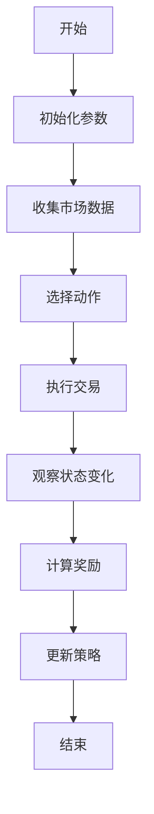
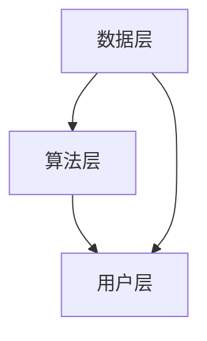
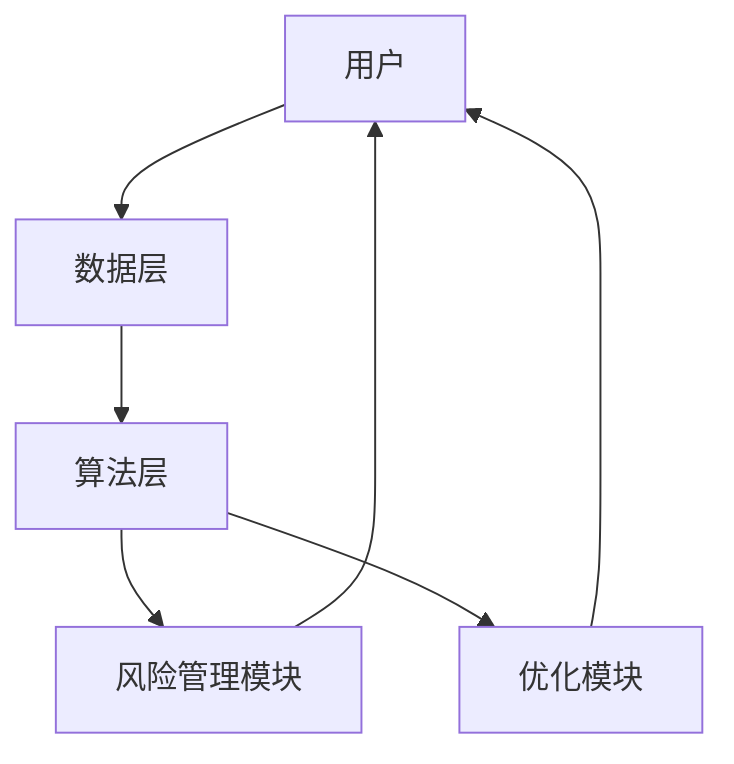

                 


# AI驱动的智能投资组合管理解决方案

## 关键词
AI驱动投资组合管理，人工智能，强化学习，量化交易，智能投资组合优化，风险管理

## 摘要
随着人工智能技术的快速发展，投资组合管理领域正经历一场深刻的变革。传统的投资组合管理方法依赖于人工判断和固定模型，难以应对复杂多变的市场环境。本文将探讨如何利用人工智能技术，特别是强化学习算法，构建智能投资组合管理解决方案。文章首先介绍智能投资组合管理的背景与核心概念，然后深入分析基于强化学习的投资组合优化算法，接着阐述系统的架构设计，最后通过具体项目实战展示如何实现AI驱动的智能投资组合管理系统。文章旨在为技术专家和金融从业者提供一份全面的技术指南，帮助他们在实际投资中更好地应用AI技术。

---

## 第二部分: AI驱动的智能投资组合管理核心概念

### 第2章: AI驱动的智能投资组合管理核心概念

#### 2.1 智能投资组合管理的定义与特点

##### 2.1.1 智能投资组合管理的定义
智能投资组合管理是指利用人工智能技术，通过数据驱动的方式，动态优化投资组合配置，以实现收益最大化和风险最小化的过程。与传统投资组合管理相比，智能投资组合管理具有高度的自动化、智能化和适应性。

##### 2.1.2 AI在投资组合管理中的核心作用
- 数据处理与分析：AI能够快速处理海量数据，提取有用的特征信息。
- 动态优化：通过实时市场数据和模型预测，AI能够动态调整投资组合。
- 风险管理：AI能够量化风险并提出最优的风险控制策略。

##### 2.1.3 智能投资组合管理的特点与优势
- **自动化**：AI系统可以自动收集数据、分析市场趋势并做出决策。
- **实时性**：能够根据市场变化快速调整投资组合。
- **数据驱动**：依赖于大量历史数据和实时数据进行决策。
- **可扩展性**：适用于不同规模和复杂程度的投资组合。

##### 2.1.4 智能投资组合管理与传统投资组合管理的对比
| 对比维度 | 传统投资组合管理 | AI驱动的智能投资组合管理 |
|----------|------------------|--------------------------|
| 数据依赖 | 较低，依赖经验     | 高，依赖大数据分析       |
| 调整频率 | 低，定期调整       | 高，实时动态调整         |
| 风险控制 | 线性模型，简单     | 非线性模型，复杂         |
| 精准度   | 较低              | 较高                     |

---

#### 2.2 核心概念与联系

##### 2.2.1 投资组合优化的数学模型
投资组合优化的核心目标是最大化收益或最小化风险。经典的优化模型是均值-方差模型（Markowitz的现代投资组合理论）。

$$ \text{目标函数：} \quad \min_w \sigma^2(w) \quad \text{或} \quad \max_w \mu^T w $$

其中：
- \( w \) 是权重向量，表示各资产在投资组合中的权重。
- \( \mu \) 是资产的期望收益向量。
- \( \sigma^2(w) \) 是投资组合的方差，表示风险。

##### 2.2.2 AI算法在投资组合管理中的应用
AI算法，尤其是强化学习（Reinforcement Learning），在投资组合管理中具有广泛的应用潜力。强化学习通过智能体与环境的交互，学习最优的投资策略。

##### 2.2.3 实体关系图（ER图）与投资组合管理的关联
以下是投资组合管理的实体关系图：

```mermaid
erDiagram
    actor 投资者
    actor 市场数据提供者
    actor 风险管理者
    class 资产
    class 投资组合
    class 市场数据
    class 风险指标
    投资者 --> 资产: 持有
    投资者 --> 投资组合: 管理
    市场数据提供者 --> 市场数据: 提供
    风险管理者 --> 风险指标: 监控
    资产 --> 投资组合: 组成
    市场数据 --> 风险指标: 计算
```

---

#### 2.3 投资组合管理的核心要素组成

##### 2.3.1 核心要素
- **资产选择**：选择哪些资产纳入投资组合。
- **权重分配**：确定各资产在组合中的权重。
- **风险控制**：量化和管理投资组合的风险。
- **动态调整**：根据市场变化实时优化组合。

##### 2.3.2 核心要素之间的关系
以下通过表格展示核心要素之间的关系：

| 核心要素 | 相关性描述           |
|----------|----------------------|
| 资产选择 | 决定权重分配的基础   |
| 权重分配 | 影响投资组合的收益与风险 |
| 风险控制 | 确保投资组合的稳定性   |
| 动态调整 | 实现长期最优配置       |

---

#### 2.4 本章小结
本章介绍了AI驱动的智能投资组合管理的核心概念，包括其定义、特点、与传统方法的对比以及核心要素组成。通过ER图和表格分析，展示了系统各部分之间的关系与联系，为后续的算法设计和系统实现奠定了基础。

---

## 第三部分: AI驱动的智能投资组合管理算法原理

### 第3章: 基于强化学习的投资组合优化算法

#### 3.1 强化学习算法概述

##### 3.1.1 强化学习的基本概念
强化学习是一种机器学习范式，通过智能体与环境的交互，学习最优策略以最大化累积奖励。核心要素包括：
- **智能体**：决策的主体。
- **环境**：智能体所处的环境。
- **动作**：智能体在环境中的行为。
- **状态**：环境在某一时间点的描述。
- **奖励**：智能体行为的价值反馈。

##### 3.1.2 强化学习的核心要素
| 核心要素 | 描述                   |
|----------|------------------------|
| 状态空间 | 环境的所有可能状态       |
| 动作空间 | 智能体的所有可能动作     |
| 奖励函数 | 衡量智能体行为价值的函数 |
| 策略     | 智能体选择动作的规则     |

##### 3.1.3 强化学习在投资组合管理中的应用潜力
- **动态调整**：实时根据市场反馈调整投资组合。
- **非线性关系**：能够处理复杂的市场动态。
- **自适应性**：适应不同市场环境的变化。

---

#### 3.2 基于强化学习的投资组合优化算法

##### 3.2.1 算法原理与流程
以下是一个基于强化学习的投资组合优化算法的流程图：



##### 3.2.2 算法实现步骤
1. **数据收集**：收集历史市场数据，包括资产价格、收益率等。
2. **状态定义**：定义智能体的状态，如当前市场趋势、资产波动率等。
3. **动作空间**：定义智能体可执行的动作，如买入、卖出或持有。
4. **奖励函数设计**：设计奖励函数，根据投资组合的收益和风险计算奖励值。
5. **策略选择**：选择合适的强化学习算法（如DQN、PPO）训练策略网络。
6. **训练与优化**：通过大量数据训练模型，优化投资组合的收益-风险比。

##### 3.2.3 算法的优缺点分析
- **优点**：
  - 能够处理复杂非线性关系。
  - 具有良好的适应性和动态调整能力。
  - 可以实现全局最优。
- **缺点**：
  - 训练时间较长。
  - 对数据质量和数量要求高。
  - 黑箱特性，难以解释决策过程。

---

#### 3.3 强化学习算法的数学模型与公式

##### 3.3.1 状态空间的定义
状态空间可以表示为市场中的多种因素，例如：
$$ S = (s_1, s_2, \ldots, s_n) $$
其中，\( s_i \) 表示第 \( i \) 个状态特征，如资产收益率、波动率等。

##### 3.3.2 动作空间的定义
动作空间可以定义为智能体的可能操作，例如：
$$ A = (a_1, a_2, \ldots, a_m) $$
其中，\( a_j \) 表示第 \( j \) 个动作，如买入股票、卖出债券等。

##### 3.3.3 奖励函数的构建
奖励函数用于衡量智能体行为的价值，通常设计为：
$$ R(s_t, a_t) = r \times \text{收益} - c \times \text{风险} $$
其中，\( r \) 和 \( c \) 是调节参数。

##### 3.3.4 策略函数的数学表达式
策略函数可以表示为：
$$ \pi(a|s) = P(\text{选择动作 } a | \text{状态 } s) $$
在强化学习中，策略函数通常通过神经网络进行参数化。

---

#### 3.4 本章小结
本章详细介绍了基于强化学习的投资组合优化算法，包括算法原理、实现步骤和数学模型。通过流程图和公式推导，读者可以清晰地理解强化学习在投资组合管理中的应用方式。

---

## 第四部分: AI驱动的智能投资组合管理系统架构与设计

### 第4章: 智能投资组合管理系统的架构设计

#### 4.1 系统功能需求分析

##### 4.1.1 投资组合优化模块
- 功能：根据市场数据和风险偏好，生成最优投资组合。
- 输入：市场数据、用户风险偏好。
- 输出：各资产的配置权重。

##### 4.1.2 风险管理模块
- 功能：量化投资组合的风险，监控市场波动。
- 输入：投资组合权重、市场数据。
- 输出：风险指标（如VaR、CVaR）。

##### 4.1.3 数据处理与分析模块
- 功能：清洗、转换和分析市场数据。
- 输入：原始市场数据。
- 输出：标准化数据集。

#### 4.2 系统架构设计

##### 4.2.1 分层架构设计
系统的分层架构包括数据层、算法层和应用层。



##### 4.2.2 模块之间的交互关系
以下展示了系统各模块之间的交互关系：



##### 4.2.3 系统的可扩展性与可维护性
- **可扩展性**：通过模块化设计，支持新增资产和策略。
- **可维护性**：通过清晰的接口定义，便于后续优化和维护。

#### 4.3 系统接口设计

##### 4.3.1 数据输入接口
```python
class DataInput:
    def __init__(self, market_data):
        self.market_data = market_data
```

##### 4.3.2 数据输出接口
```python
class Output:
    def __init__(self, weights, risk_metrics):
        self.weights = weights
        self.risk_metrics = risk_metrics
```

##### 4.3.3 用户交互接口
```python
class UI:
    def __init__(self, user_input):
        self.user_input = user_input
```

#### 4.4 本章小结
本章详细分析了智能投资组合管理系统的架构设计，包括功能模块划分、模块交互关系和接口设计。通过分层架构和模块化设计，确保系统的可扩展性和可维护性。

---

## 第五部分: 项目实战与案例分析

### 第5章: 基于Python的智能投资组合管理系统实现

#### 5.1 项目环境搭建

##### 5.1.1 Python环境的安装与配置
- 安装Python：推荐使用Anaconda或Miniconda。
- 安装相关库：`numpy`, `pandas`, `scikit-learn`, `tensorflow`, `keras`。

##### 5.1.2 相关库的安装
```bash
pip install numpy pandas scikit-learn tensorflow keras
```

#### 5.2 系统核心实现源代码

##### 5.2.1 数据处理与分析模块
```python
import numpy as np
import pandas as pd

class DataProcessor:
    def __init__(self, data_path):
        self.data = pd.read_csv(data_path)
    
    def preprocess(self):
        # 数据清洗
        self.data.dropna(inplace=True)
        # 标准化处理
        self.data = (self.data - self.data.mean()) / self.data.std()
        return self.data
```

##### 5.2.2 投资组合优化模块
```python
import keras
from keras.layers import Dense, Input
from keras.models import Model

class PortfolioOptimizer:
    def __init__(self, input_dim):
        self.model = self.build_model(input_dim)
    
    def build_model(self, input_dim):
        inputs = Input(shape=(input_dim,))
        x = Dense(64, activation='relu')(inputs)
        x = Dense(32, activation='relu')(x)
        outputs = Dense(1, activation='linear')(x)
        model = Model(inputs=inputs, outputs=outputs)
        model.compile(optimizer='adam', loss='mse')
        return model
    
    def train(self, x_train, y_train):
        self.model.fit(x_train, y_train, epochs=100, batch_size=32)
```

##### 5.2.3 风险管理模块
```python
import numpy as np
import pandas as pd

class RiskManager:
    def __init__(self, portfolio_weights):
        self.weights = portfolio_weights
    
    def calculate VaR(self, returns, confidence_level=0.95):
        sorted_returns = np.sort(returns)
        var_index = int(len(sorted_returns) * (1 - confidence_level))
        var = sorted_returns[var_index]
        return -var  # 转换为正数
```

#### 5.3 代码应用解读与分析

##### 5.3.1 数据处理模块解读
- 数据清洗：删除缺失值。
- 数据标准化：对数据进行均值-方差标准化，便于模型训练。

##### 5.3.2 投资组合优化模块解读
- 使用神经网络模型进行投资组合优化。
- 输入为市场数据特征，输出为最优权重。
- 采用Adam优化器和均方误差损失函数。

##### 5.3.3 风险管理模块解读
- 计算VaR（Value at Risk）：衡量投资组合在给定置信水平下的潜在损失。
- 通过排序法计算VaR，简单且易于实现。

#### 5.4 实际案例分析

##### 5.4.1 数据来源与预处理
假设我们有如下数据集：
```csv
date,price
2023-01-01,100
2023-01-02,101
...
```

数据预处理后：
```python
processed_data = DataProcessor('data.csv').preprocess()
print(processed_data.head())
```

##### 5.4.2 模型训练与优化
```python
# 数据准备
x_train = processed_data.drop('label', axis=1).values
y_train = processed_data['label'].values

# 初始化优化器
optimizer = PortfolioOptimizer(x_train.shape[1])
optimizer.train(x_train, y_train)
```

##### 5.4.3 风险管理与评估
```python
# 计算VaR
returns = processed_data['returns'].values
var = RiskManager(weights).calculate_VaR(returns, confidence_level=0.95)
print(f"VaR at 95% confidence level: {var}")
```

#### 5.5 项目小结
本章通过具体的Python代码实现，展示了如何构建一个基于AI的智能投资组合管理系统。通过数据处理、模型训练和风险管理模块的实现，读者可以理解AI技术在投资组合管理中的实际应用。

---

## 第六部分: 最佳实践与总结

### 6.1 最佳实践

#### 6.1.1 系统设计与实现
- 确保数据的实时性和准确性。
- 选择合适的强化学习算法，根据具体问题进行调整。
- 设计合理的奖励函数，平衡收益与风险。

#### 6.1.2 代码实现注意事项
- 数据预处理是关键，确保数据质量。
- 模型训练时，注意过拟合问题，使用交叉验证和正则化。
- 风险管理模块的设计要简洁有效。

#### 6.1.3 系统优化与维护
- 定期更新模型，适应市场变化。
- 监控系统性能，及时优化代码。
- 记录运行日志，便于问题排查。

### 6.2 小结
通过本文的详细讲解，读者可以掌握AI驱动的智能投资组合管理的核心概念、算法原理和系统实现。AI技术的应用不仅提高了投资组合管理的效率，还增强了其在复杂市场环境下的适应性。

### 6.3 注意事项
- AI模型的预测结果仅供参考，实际投资需谨慎。
- 确保数据来源的合法性和合规性。
- 风险管理是投资组合管理的核心，必须始终放在首位。

### 6.4 拓展阅读
- 《Reinforcement Learning: Theory and Algorithms》
- 《Machine Learning for Asset Managers》
- 《Python机器学习实战》

---

## 作者：AI天才研究院/AI Genius Institute & 禅与计算机程序设计艺术/Zen And The Art of Computer Programming

---

以上是完整的文章目录和内容框架，涵盖了从理论到实践的各个方面，确保读者能够全面理解AI驱动的智能投资组合管理解决方案。

