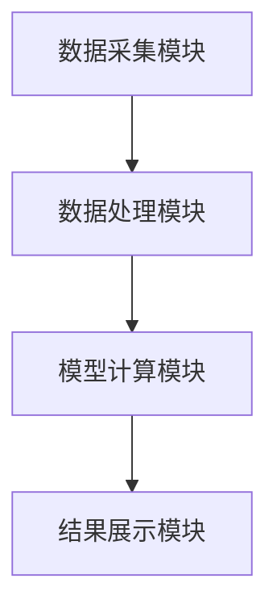
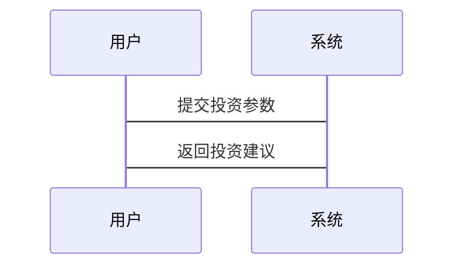

                 


# AI驱动的私募股权投资分析

## 关键词：私募股权投资、人工智能、机器学习、数据驱动、算法模型、系统架构、投资决策

## 摘要：  
本文深入探讨了人工智能在私募股权投资分析中的应用，从理论基础到实际案例，系统地分析了如何利用AI技术提升投资决策的效率和准确性。文章首先介绍了私募股权投资的基本概念和AI在金融领域的应用现状，随后详细阐述了AI驱动的分析模型、核心算法及其在私募股权投资中的具体应用。通过实际案例分析，展示了如何构建基于AI的私募股权分析系统，并提供了系统的架构设计和实现方案。最后，本文总结了AI驱动私募股权投资分析的优势与挑战，并对未来的发展趋势进行了展望。

---

# 第一部分：AI驱动的私募股权投资分析背景与基础

## 第1章：私募股权投资的定义与特点

### 1.1 私募股权投资的定义  
私募股权投资（Private Equity Investment）是指通过非公开市场，以私募方式投资于未上市公司或上市公司非公开部分的股权，以实现资本增值的投资行为。其核心目标是通过长期持有目标公司的股权，通过优化管理和战略调整，实现公司价值的提升，最终通过退出机制（如IPO或并购）实现收益。

#### 1.1.1 私募股权的定义与分类  
- **定义**：私募股权是指未在公开市场上交易的股权，投资者通过私募基金或直接投资的方式参与。  
- **分类**：  
  - **风险投资（Venture Capital）**：主要投资于初创企业，注重高成长性。  
  - **私募股权基金（Private Equity Fund）**：投资于成熟企业，通过杠杆收购、管理层收购等方式实现价值提升。  
  - **成长资本（Growth Capital）**：介于风险投资和私募股权基金之间，投资于具有稳定增长潜力的企业。  

#### 1.1.2 私募股权投资的核心特点  
- **高收益潜力**：通过资本增值和退出机制实现高收益。  
- **高风险**：依赖于被投企业的经营状况和市场环境。  
- **长期性**：私募股权通常需要较长时间（3-10年）才能实现退出和收益。  
- **专业性**：依赖于专业的投资团队和丰富的行业经验。  

#### 1.1.3 私募股权投资的参与者与流程  
- **参与者**：  
  - **投资者**：提供资金的机构或个人。  
  - **管理人**：私募基金管理公司，负责投资决策和管理。  
  - **目标公司**：被投资的企业。  
  - **中介机构**：包括律师事务所、会计师事务所、投行等。  
- **流程**：  
  1. **项目筛选**：通过行业分析、财务指标、管理团队等筛选潜在目标。  
  2. **尽职调查**：对目标公司进行财务、法律、市场等方面深入调查。  
  3. **投资决策**：基于尽职调查结果，评估投资风险和回报，做出投资决策。  
  4. **投资执行**：完成投资协议签署，注资并监控企业经营。  
  5. **退出机制**：通过IPO、并购等方式退出，实现收益。  

---

### 1.2 AI在金融领域的应用现状

#### 1.2.1 AI在金融分析中的应用  
- **量化交易**：利用算法进行高频交易和市场预测。  
- **风险评估**：通过机器学习模型评估投资风险。  
- **市场情绪分析**：利用自然语言处理技术分析市场情绪。  

#### 1.2.2 私募股权投资中的AI技术  
- **数据挖掘**：从海量数据中提取有价值的信息，帮助识别潜在投资机会。  
- **预测模型**：利用机器学习模型预测企业业绩和市场趋势。  
- **组合优化**：通过算法优化投资组合，降低风险并提高收益。  

#### 1.2.3 当前AI技术的局限性与挑战  
- **数据质量问题**：私募股权投资涉及大量非结构化数据，数据清洗和预处理难度大。  
- **模型解释性**：复杂的深度学习模型难以解释其决策逻辑，影响投资决策的透明性。  
- **市场不确定性**：金融市场具有高度不确定性，AI模型的预测能力受到限制。  

---

### 1.3 AI驱动的私募股权投资分析的核心概念

#### 1.3.1 数据驱动的分析模式  
- **数据驱动**：通过大量数据的分析和挖掘，发现投资机会和风险。  
- **实时分析**：利用实时数据和流数据处理技术，快速做出投资决策。  

#### 1.3.2 AI算法在投资决策中的作用  
- **特征提取**：通过算法提取关键的财务指标和市场信号。  
- **模式识别**：识别市场趋势和企业经营中的潜在问题。  
- **决策支持**：基于算法模型提供投资建议和风险预警。  

#### 1.3.3 私募股权投资的智能化转型  
- **智能化转型**：通过AI技术实现投资流程的自动化和智能化。  
- **数据闭环**：从数据采集、分析到决策，形成完整的数据闭环。  

---

## 第2章：AI驱动的私募股权投资分析的技术基础

### 2.1 数据采集与处理

#### 2.1.1 数据来源与类型  
- **数据来源**：  
  - **公开数据**：上市公司财报、行业报告、新闻数据等。  
  - **非公开数据**：目标公司的内部数据、行业专家意见等。  
- **数据类型**：  
  - **结构化数据**：如财务报表、交易数据等。  
  - **非结构化数据**：如新闻、社交媒体、管理团队访谈记录等。  

#### 2.1.2 数据清洗与预处理  
- **数据清洗**：去除噪声数据、处理缺失值、标准化数据。  
- **数据增强**：通过特征工程提取有用信息，如计算财务比率、构建市场指数等。  

#### 2.1.3 数据存储与管理  
- **数据库选择**：根据数据类型选择关系型数据库（如MySQL）或非关系型数据库（如MongoDB）。  
- **数据仓库**：构建数据仓库，支持高效的数据查询和分析。  

---

### 2.2 AI算法基础

#### 2.2.1 机器学习算法概述  
- **监督学习**：用于分类和回归问题，如预测企业盈利能力。  
- **无监督学习**：用于聚类和降维，如识别市场趋势。  
- **半监督学习**：结合少量标注数据和大量未标注数据进行学习。  

#### 2.2.2 深度学习算法概述  
- **神经网络**：用于复杂模式识别，如自然语言处理和图像识别。  
- **循环神经网络（RNN）**：用于时间序列数据的分析，如预测股价走势。  
- **卷积神经网络（CNN）**：用于图像和文本数据的特征提取。  

#### 2.2.3 自然语言处理与时间序列分析  
- **自然语言处理（NLP）**：用于分析新闻、社交媒体等文本数据，提取市场情绪。  
- **时间序列分析**：用于分析股票价格、经济指标等时间序列数据。  

---

### 2.3 私募股权投资分析中的关键算法

#### 2.3.1 回归分析  
- **线性回归**：用于预测连续型变量，如企业净利润。  
- **逻辑回归**：用于分类问题，如判断企业是否具备投资价值。  

#### 2.3.2 聚类分析  
- **K-means**：用于将相似的企业分组，识别行业趋势。  
- **层次聚类**：用于构建企业间的层次关系，发现潜在投资机会。  

#### 2.3.3 神经网络模型  
- **多层感知机（MLP）**：用于复杂的非线性分类和回归问题。  
- **长短期记忆网络（LSTM）**：用于时间序列预测，如预测股票价格走势。  

---

### 2.4 本章小结

---

## 第3章：私募股权投资分析的核心模型与算法

### 3.1 数据特征提取

#### 3.1.1 财务指标分析  
- **关键指标**：净利润、营业收入、资产负债率、毛利率等。  
- **特征选择**：通过统计分析和机器学习方法选择重要特征。  

#### 3.1.2 市场情绪分析  
- **市场情绪指标**：通过新闻、社交媒体等数据计算市场情绪指数。  
- **情感分析**：利用NLP技术分析文本数据，判断市场情绪。  

#### 3.1.3 竞争对手分析  
- **竞争分析**：通过行业数据分析竞争对手的市场份额和经营状况。  
- **竞争模型**：构建竞争模型，预测市场格局变化。  

---

### 3.2 AI算法在私募股权投资中的应用

#### 3.2.1 基于回归分析的投资预测  
- **线性回归模型**：预测企业的净利润增长。  
- **逻辑回归模型**：预测企业的财务风险。  

#### 3.2.2 基于聚类分析的投资组合优化  
- **聚类分析**：将相似的企业分组，优化投资组合的分散性。  
- **层次聚类**：构建企业间的层次关系，发现潜在投资机会。  

#### 3.2.3 基于神经网络的市场趋势预测  
- **LSTM模型**：用于预测股票价格走势。  
- **CNN模型**：用于分析图像数据，如K线图。  

---

### 3.3 模型评估与优化

#### 3.3.1 模型评估指标  
- **准确率**：分类问题中正确预测的比例。  
- **召回率**：分类问题中正确识别的正例比例。  
- **F1分数**：综合准确率和召回率的调和平均数。  

#### 3.3.2 超参数调优  
- **网格搜索**：通过遍历所有可能的参数组合，找到最优参数。  
- **随机搜索**：随机选择参数组合，减少计算成本。  

#### 3.3.3 模型的鲁棒性与可解释性  
- **鲁棒性**：模型在数据分布变化时的稳定性。  
- **可解释性**：模型决策过程的透明性和可解释性。  

---

## 第4章：私募股权投资分析的系统架构与实现

### 4.1 系统架构设计

#### 4.1.1 系统功能模块划分  
- **数据采集模块**：负责采集结构化和非结构化数据。  
- **数据处理模块**：负责数据清洗、特征提取和数据增强。  
- **模型计算模块**：负责构建和训练机器学习模型。  
- **结果展示模块**：负责将分析结果以可视化形式呈现。  

#### 4.1.2 系统架构图  


---

### 4.2 数据流与信息流设计

#### 4.2.1 数据采集模块  
- **功能**：从多个数据源（如数据库、API接口）采集数据。  
- **实现**：使用爬虫技术采集新闻数据，通过API接口获取财务数据。  

#### 4.2.2 数据处理模块  
- **功能**：对采集到的数据进行清洗、转换和预处理。  
- **实现**：使用Python的pandas库进行数据清洗，使用scikit-learn库进行特征提取。  

#### 4.2.3 模型计算模块  
- **功能**：构建机器学习模型，训练模型并进行预测。  
- **实现**：使用TensorFlow或PyTorch框架构建深度学习模型。  

---

### 4.3 系统实现与接口设计

#### 4.3.1 系统实现流程  
1. 数据采集：从多个数据源采集数据。  
2. 数据处理：清洗数据并提取特征。  
3. 模型训练：构建并训练机器学习模型。  
4. 结果展示：将分析结果以可视化形式呈现。  

#### 4.3.2 系统接口设计  
- **输入接口**：接收用户输入的投资参数。  
- **输出接口**：输出投资建议和风险预警。  

#### 4.3.3 系统交互序列图  


---

### 4.4 本章小结

---

## 第5章：项目实

#### 5.1 环境安装  
- **Python环境**：安装Anaconda或Miniconda，配置Python 3.8以上版本。  
- **依赖库安装**：使用pip安装numpy、pandas、scikit-learn、tensorflow等库。  

#### 5.2 核心代码实现  
```python
import numpy as np
import pandas as pd
from sklearn.linear_model import LinearRegression
from sklearn.metrics import mean_squared_error

# 数据加载
data = pd.read_csv('data.csv')

# 特征选择
X = data[['revenue', 'profit_margin']]
y = data['net_profit']

# 模型训练
model = LinearRegression()
model.fit(X, y)

# 模型预测
y_pred = model.predict(X)
print('均方误差:', mean_squared_error(y, y_pred))
```

#### 5.3 代码解读与分析  
- **数据加载**：从CSV文件中读取数据。  
- **特征选择**：选择收入和利润率作为特征。  
- **模型训练**：使用线性回归模型训练模型。  
- **模型预测**：对测试数据进行预测，并计算均方误差。  

#### 5.4 实际案例分析  
假设我们有一个企业A，其收入为1000万元，利润率为10%。通过模型预测，其净利润为800万元。  

#### 5.5 项目小结  
通过本项目，我们展示了如何利用线性回归模型进行企业净利润预测，验证了AI在私募股权投资分析中的应用潜力。  

---

## 第6章：最佳实践与未来展望

### 6.1 最佳实践

#### 6.1.1 数据质量控制  
- 确保数据的准确性和完整性。  
- 使用数据清洗和特征工程提升模型性能。  

#### 6.1.2 模型解释性  
- 选择可解释性较强的模型，如线性回归和决策树。  
- 使用SHAP值等工具解释模型决策。  

#### 6.1.3 持续优化  
- 定期更新模型，适应市场变化。  
- 结合专家意见，优化投资策略。  

### 6.2 小结  
本文系统地介绍了AI驱动的私募股权投资分析的核心概念、算法原理和系统架构，并通过实际案例展示了AI技术在私募股权投资中的应用。  

### 6.3 注意事项  
- **数据隐私**：确保数据采集和处理符合相关法律法规。  
- **模型风险**：AI模型可能存在过拟合或欠拟合的问题，需谨慎使用。  
- **市场变化**：金融市场具有不确定性，AI模型需结合人工判断。  

### 6.4 拓展阅读  
- 《机器学习实战》：深入理解机器学习算法。  
- 《Python金融数据分析》：掌握金融数据分析的技巧。  
- 《私募股权基金运作实务》：了解私募股权的实际操作。  

---

## 作者：AI天才研究院/AI Genius Institute & 禅与计算机程序设计艺术/Zen And The Art of Computer Programming

---

通过以上结构，我们可以看到，AI驱动的私募股权投资分析不仅涉及技术层面的实现，还包括对金融市场的深刻理解。未来，随着AI技术的不断发展，私募股权投资分析将更加智能化和高效化，为投资者提供更精准的决策支持。

