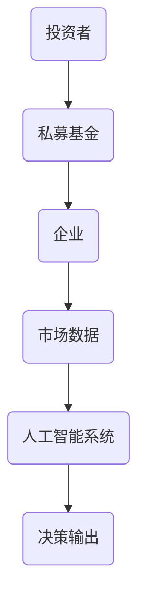
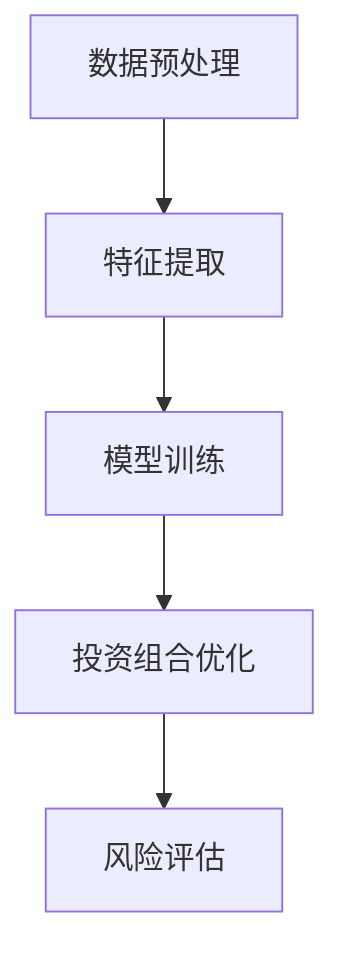
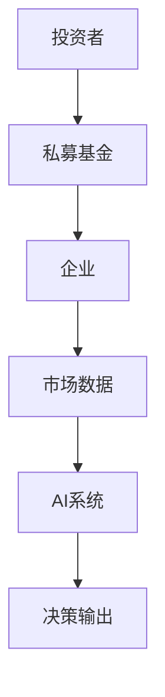
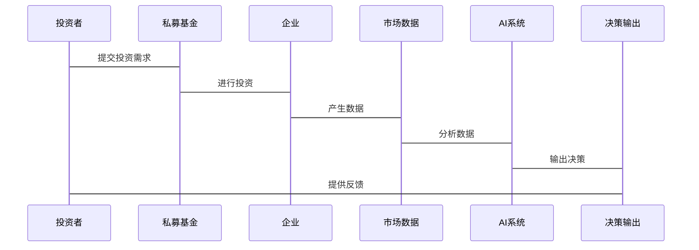

                 


# AI驱动的私募股权投资组合构建

> 关键词：私募股权，AI驱动，投资组合，风险管理，机器学习，深度学习

> 摘要：本文详细探讨了如何利用人工智能技术构建高效的私募股权投资组合。通过分析私募股权的特点、AI在金融投资中的应用背景，以及结合AI技术的核心理念，本文深入介绍了AI驱动投资的核心概念、算法原理、系统架构设计、项目实战等内容。文章从理论到实践，全面解析了如何利用AI技术优化投资组合构建过程，帮助投资者在复杂多变的市场中实现更优的风险收益平衡。

---

# 第一部分: 背景介绍

# 第1章: 私募股权投资与AI驱动投资概述

## 1.1 私募股权投资的基本概念

### 1.1.1 私募股权的定义与特点
私募股权（Private Equity）是指通过非公开市场进行的股权投资，其特点包括：
- **非公开性**：私募股权的投资活动不通过公开市场进行，主要依赖于私募基金或直接投资。
- **高门槛**：通常要求较高的投资金额，适合机构投资者或高净值个人。
- **高风险高收益**：私募股权的投资回报通常较高，但伴随的风险也较大。
- **长期性**：私募股权的投资周期较长，通常需要3-7年甚至更长时间。

### 1.1.2 私募股权投资的参与者与流程
私募股权投资的参与者包括：
- **投资者**：提供资金的个人或机构。
- **私募基金管理人**：负责管理和运作投资组合的专业机构。
- **目标企业**：被投资的企业，通常处于成长期或成熟期。

私募股权投资的流程一般包括以下几个步骤：
1. **项目筛选**：通过数据分析、尽职调查等方式筛选出具有潜力的企业。
2. **投资决策**：基于团队判断和数据分析，决定是否投资。
3. **投资执行**：完成资金的投入，并签订相关协议。
4. **监控与退出**：对投资企业进行持续监控，并在适当时机选择退出策略。

### 1.1.3 私募股权投资的收益与风险
私募股权的收益主要来源于：
- **资本增值**：企业价值的增加。
- **股息收益**：企业在盈利后分配的股息。

私募股权的风险主要来源于：
- **市场风险**：宏观经济波动对企业价值的影响。
- **企业经营风险**：被投资企业自身经营状况的变化。
- **流动性风险**：私募股权的流动性较低，退出渠道有限。

---

## 1.2 AI在金融投资中的应用背景

### 1.2.1 传统金融投资的局限性
传统金融投资主要依赖于人工分析和经验判断，存在以下问题：
- **信息处理能力有限**：人类难以处理海量的市场数据。
- **决策主观性**：投资决策受主观因素影响较大。
- **反应速度慢**：在快速变化的市场中，人工决策难以及时调整。

### 1.2.2 大数据与AI技术的兴起
随着信息技术的发展，金融行业积累了大量的市场数据，包括价格数据、交易数据、新闻数据等。同时，人工智能技术的进步使得处理这些数据成为可能。

### 1.2.3 AI在金融投资中的优势
AI在金融投资中的优势体现在以下几个方面：
- **数据处理能力强**：能够快速处理海量数据。
- **决策客观性**：基于数据的分析结果，减少人为情绪干扰。
- **实时性**：能够实时分析市场动态，快速调整投资策略。

---

## 1.3 AI驱动私募股权投资的核心理念

### 1.3.1 数据驱动的投资决策
通过收集和分析海量数据，利用AI技术进行特征提取和建模，从而做出更科学的投资决策。

### 1.3.2 智能化投资组合优化
利用AI技术优化投资组合的配置，以实现风险可控的前提下收益最大化。

### 1.3.3 风险预测与管理的AI化
通过AI技术预测市场风险，优化风险控制策略，降低投资组合的整体风险。

---

## 1.4 本章小结
本章主要介绍了私募股权投资的基本概念、AI在金融投资中的应用背景，以及AI驱动私募股权投资的核心理念。通过这些内容，读者可以理解AI技术在私募股权投资中的重要性。

---

# 第2章: AI驱动投资的核心概念与联系

## 2.1 核心概念原理

### 2.1.1 数据驱动的特征工程
特征工程是AI驱动投资的核心环节之一，包括：
- **数据清洗**：处理缺失值、异常值等。
- **特征提取**：从原始数据中提取有用的特征。
- **特征选择**：选择对目标变量影响较大的特征。

### 2.1.2 智能化投资决策模型
智能化投资决策模型基于机器学习算法，能够自动学习数据中的规律，从而做出投资决策。

### 2.1.3 风险预测与管理机制
通过AI技术预测市场风险，优化风险控制策略，降低投资组合的整体风险。

---

## 2.2 核心概念属性特征对比表

| 特征 | 传统投资 | AI驱动投资 |
|------|----------|------------|
| 数据来源 | 有限市场数据 | 多源异构数据 |
| 模型复杂度 | 简单线性模型 | 复杂非线性模型 |
| 决策速度 | 人工分析驱动 | 实时数据处理驱动 |

---

## 2.3 ER实体关系图



---

## 2.4 本章小结
本章通过对比传统投资和AI驱动投资的核心概念，进一步明确了AI技术在私募股权投资中的应用价值。

---

# 第3章: AI驱动投资的算法原理

## 3.1 算法原理概述

### 3.1.1 机器学习在投资组合中的应用
机器学习算法可以用于预测股票价格、识别市场趋势等。

### 3.1.2 深度学习在金融时间序列分析中的应用
深度学习算法，如LSTM（长短期记忆网络），可以用于分析金融时间序列数据。

### 3.1.3 强化学习在动态投资决策中的应用
强化学习算法可以模拟投资决策过程，通过不断试错优化投资策略。

---

## 3.2 算法流程图



---

## 3.3 算法实现代码

```python
import numpy as np
import pandas as pd
from sklearn.model_selection import train_test_split
from sklearn.ensemble import RandomForestRegressor

# 示例数据加载
data = pd.read_csv('investment_data.csv')
X = data.drop('return', axis=1)
y = data['return']

# 数据分割
X_train, X_test, y_train, y_test = train_test_split(X, y, test_size=0.2)

# 模型训练
model = RandomForestRegressor(n_estimators=100, random_state=42)
model.fit(X_train, y_train)

# 模型预测
y_pred = model.predict(X_test)
```

---

## 3.4 算法的数学模型与公式

### 3.4.1 随机森林模型
随机森林是一种基于树的集成方法，其数学模型如下：

$$
y = \sum_{i=1}^{n} \text{Tree}(x_i)
$$

其中，$x_i$ 是输入特征，$\text{Tree}$ 是单棵决策树的预测结果。

### 3.4.2 LSTM模型
LSTM（长短期记忆网络）的数学模型如下：

$$
f_t(x_t) = \sigma(W_f x_t + U_f h_{t-1} + b_f)
$$

其中，$x_t$ 是输入，$h_{t-1}$ 是前一时刻的隐藏状态，$W_f$ 和 $U_f$ 是权重矩阵，$b_f$ 是偏置项，$\sigma$ 是sigmoid函数。

---

## 3.5 本章小结
本章详细介绍了AI驱动投资中常用的算法原理，包括机器学习、深度学习和强化学习等，并通过流程图和代码示例帮助读者理解这些算法的应用。

---

# 第4章: 系统架构设计

## 4.1 问题场景介绍
私募股权投资组合构建系统需要解决以下问题：
- 如何高效地处理海量市场数据？
- 如何利用AI技术优化投资组合？
- 如何实时监控投资组合的风险？

---

## 4.2 系统功能设计

### 4.2.1 领域模型（类图）


---

## 4.3 系统架构设计



---

## 4.4 系统接口设计
系统接口设计包括：
- 数据接口：与市场数据源对接。
- 模型接口：与AI模型对接。
- 用户接口：与投资者或私募基金对接。

---

## 4.5 系统交互流程图



---

## 4.6 本章小结
本章通过系统架构设计，明确了私募股权投资组合构建系统的各个模块及其相互关系，为后续的实现提供了指导。

---

# 第5章: 项目实战

## 5.1 环境配置
需要安装的工具包括：
- Python 3.8+
- Jupyter Notebook
- Pandas、NumPy、Scikit-learn等库

## 5.2 系统核心实现源代码

```python
import pandas as pd
from sklearn.ensemble import RandomForestRegressor
from sklearn.metrics import mean_squared_error

# 加载数据
data = pd.read_csv('investment_data.csv')

# 数据预处理
data = data.dropna()
X = data.drop('return', axis=1)
y = data['return']

# 数据分割
X_train, X_test, y_train, y_test = train_test_split(X, y, test_size=0.2, random_state=42)

# 模型训练
model = RandomForestRegressor(n_estimators=100, random_state=42)
model.fit(X_train, y_train)

# 模型预测
y_pred = model.predict(X_test)

# 模型评估
mse = mean_squared_error(y_test, y_pred)
print(f'均方误差: {mse}')
```

---

## 5.3 实际案例分析
以某私募基金为例，利用随机森林模型进行投资组合优化。通过分析模型预测结果，优化投资组合配置，降低风险。

---

## 5.4 项目小结
本章通过实际案例展示了如何利用AI技术构建私募股权投资组合，并对模型的性能进行了评估。

---

# 第6章: 总结与展望

## 6.1 总结
本文详细介绍了AI驱动的私募股权投资组合构建的背景、核心概念、算法原理、系统架构设计以及项目实战。通过这些内容，读者可以全面理解如何利用AI技术优化私募股权投资组合。

## 6.2 注意事项
在实际应用中，需要注意以下几点：
- 数据的准确性和完整性。
- 模型的可解释性和鲁棒性。
- 风险管理的重要性。

## 6.3 拓展阅读
推荐读者进一步阅读以下书籍和论文：
- 《机器学习实战》
- 《Python机器学习》
- 《金融风险管理》

---

# 作者：AI天才研究院 & 禅与计算机程序设计艺术

