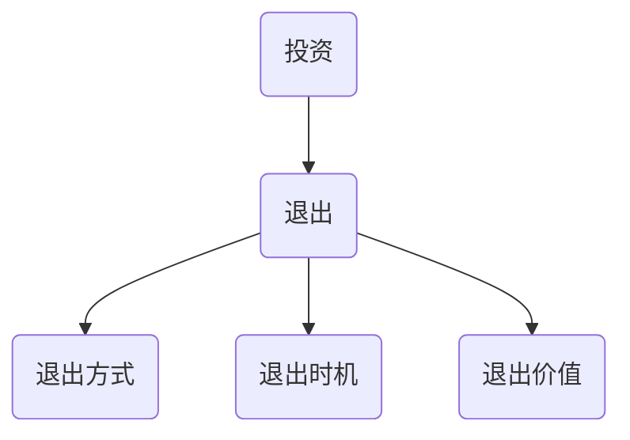
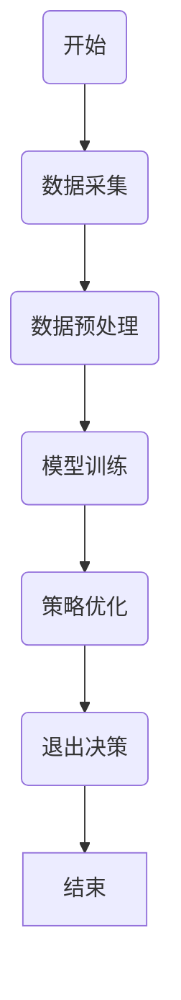
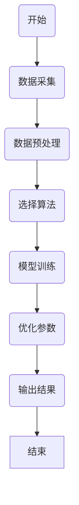
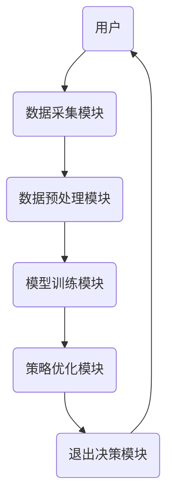

                 


# AI驱动的私募股权投资退出策略优化

> 关键词：私募股权、AI驱动、退出策略、机器学习、投资优化

> 摘要：随着人工智能技术的快速发展，私募股权投资领域的退出策略也在不断优化。本文通过分析私募股权退出策略的核心概念、问题与挑战、算法原理、数学模型、系统架构设计、项目实战以及最佳实践，深入探讨了如何利用AI技术优化私募股权退出策略。文章内容丰富，结构清晰，结合实际案例和详细的技术实现，为读者提供了全面的指导和参考。

---

## 第一部分: 私募股权退出策略的基本概念

### 第1章: 私募股权退出策略的基本概念

#### 1.1 私募股权退出的定义与特点

私募股权退出是指私募基金将其持有的公司股份出售或通过其他方式退出投资的过程。私募股权退出的主要方式包括首次公开募股（IPO）、并购（M&A）、股权转让、清算等。私募股权退出的核心目标是实现投资收益最大化，同时降低投资风险。

私募股权退出策略具有以下特点：
1. **多样性**：退出方式多样，需要根据市场环境、公司发展状况等因素灵活选择。
2. **复杂性**：退出策略涉及多个因素，包括市场波动、公司估值、行业趋势等。
3. **风险性**：退出策略的执行过程面临较高的市场风险和操作风险。

#### 1.2 AI驱动的私募股权退出策略的优势

AI技术的引入为私募股权退出策略的优化带来了显著优势：
1. **数据驱动决策**：通过分析大量的历史数据和市场信息，AI能够提供更精准的退出时机和方式建议。
2. **机器学习应用**：利用机器学习算法，可以预测市场趋势、公司估值和退出风险，从而优化退出策略。
3. **多目标优化**：AI可以通过多目标优化算法，在多个目标（如收益最大化、风险最小化）之间找到最佳平衡点。

---

### 第2章: 私募股权退出策略中的问题与挑战

#### 2.1 私募股权退出的主要问题

私募股权退出过程中面临的主要问题包括：
1. **市场波动风险**：市场波动可能导致退出时机不佳，影响退出收益。
2. **退出时机选择困难**：如何选择最佳的退出时机是一个复杂的决策问题。
3. **退出策略多样性**：不同退出方式的优劣难以量化，需要综合考虑多方面因素。

#### 2.2 传统退出策略的局限性

传统退出策略的局限性主要体现在以下几个方面：
1. **主观性较强**：传统退出策略依赖于投资经理的主观判断，容易受到个人经验和判断的影响。
2. **数据利用不足**：传统策略往往未能充分利用大数据和机器学习技术，导致决策不够精准。
3. **缺乏动态调整**：传统策略在面对市场变化时，难以快速调整退出策略。

#### 2.3 AI驱动退出策略的解决方案

AI驱动的退出策略通过以下方式解决传统策略的局限性：
1. **数据分析与预测**：利用大数据技术，分析历史数据和市场信息，预测市场趋势和公司估值。
2. **机器学习算法**：通过机器学习算法，建立预测模型，优化退出时机和方式。
3. **多目标优化**：利用多目标优化算法，在收益和风险之间找到最佳平衡点。

---

### 第3章: 私募股权退出策略的核心概念与联系

#### 3.1 核心概念的定义与解释

私募股权退出策略的核心概念包括：
1. **退出价值预测**：通过分析市场数据和公司基本面，预测退出时的公司估值。
2. **退出时机选择**：根据市场趋势和公司发展状况，选择最佳的退出时机。
3. **退出方式优化**：通过分析不同退出方式的优劣，选择最优的退出方式。

#### 3.2 核心概念的属性特征对比

以下是核心概念的属性特征对比：

| 概念          | 特性                           |
|---------------|--------------------------------|
| 退出价值预测  | 数据驱动、动态调整、高精度     |
| 退出时机选择  | 时间敏感性、市场敏感性、动态性   |
| 退出方式优化  | 多目标优化、灵活性、风险控制     |

#### 3.3 实体关系图与流程图

以下是私募股权退出策略的核心实体关系图（ER图）和流程图：



退出策略优化的流程图如下：



---

## 第二部分: 私募股权退出策略的算法原理

### 第4章: 私募股权退出策略的算法原理

#### 4.1 机器学习算法的应用

私募股权退出策略的优化可以通过以下机器学习算法实现：
1. **回归分析**：用于预测退出价值和退出时机。
2. **聚类分析**：用于分类退出方式和市场环境。
3. **支持向量机（SVM）**：用于分类和预测市场趋势。

#### 4.2 算法流程图

以下是机器学习算法的流程图：



#### 4.3 退出价值预测的数学模型

退出价值预测的数学模型如下：

$$
V = \beta_0 + \beta_1X_1 + \beta_2X_2 + \ldots + \beta_nX_n + \epsilon
$$

其中，$V$ 表示退出价值，$X_i$ 表示影响退出价值的变量，$\beta_i$ 表示回归系数，$\epsilon$ 表示误差项。

---

## 第三部分: 私募股权退出策略的系统架构设计

### 第5章: 私募股权退出策略的系统架构设计

#### 5.1 系统功能设计

私募股权退出策略优化系统的功能模块包括：
1. **数据采集模块**：采集市场数据和公司基本面数据。
2. **数据预处理模块**：清洗和转换数据，为模型训练提供干净的数据集。
3. **模型训练模块**：训练机器学习模型，预测退出价值和退出时机。
4. **策略优化模块**：根据模型预测结果，优化退出策略。
5. **退出决策模块**：输出最优退出策略。

#### 5.2 系统架构设计

以下是系统的架构图：



#### 5.3 系统接口设计

系统接口设计如下：
1. **数据接口**：提供数据采集和数据预处理的API接口。
2. **模型接口**：提供模型训练和预测的API接口。
3. **决策接口**：提供退出策略优化和退出决策的API接口。

---

## 第四部分: 私募股权退出策略的项目实战

### 第6章: 私募股权退出策略的项目实战

#### 6.1 项目环境配置

项目环境配置如下：
1. **Python 3.8 或更高版本**
2. **NumPy、Pandas、Scikit-learn、XGBoost 等库**
3. **Jupyter Notebook 或 VS Code**

#### 6.2 系统核心实现源代码

以下是系统核心实现的源代码：

```python
import numpy as np
import pandas as pd
from sklearn.model import LinearRegression
from sklearn.metrics import mean_squared_error

# 数据加载
data = pd.read_csv('exit_strategy_data.csv')

# 数据预处理
X = data[['market_value', 'company_growth', 'industry_trend']]
y = data['exit_value']

# 模型训练
model = LinearRegression()
model.fit(X, y)

# 预测退出价值
predicted_values = model.predict(X)
print('预测退出价值:', predicted_values)

# 模型评估
mse = mean_squared_error(y, predicted_values)
print('均方误差:', mse)
```

#### 6.3 代码应用解读与分析

上述代码实现了以下功能：
1. **数据加载**：读取CSV格式的数据文件。
2. **数据预处理**：选择影响退出价值的相关变量。
3. **模型训练**：使用线性回归模型训练退出价值预测模型。
4. **预测与评估**：预测退出价值，并评估模型的均方误差。

---

## 第五部分: 私募股权退出策略的最佳实践

### 第7章: 私募股权退出策略的最佳实践

#### 7.1 退出策略优化的注意事项

在实际应用中，需要注意以下事项：
1. **数据质量**：确保数据的准确性和完整性。
2. **模型选择**：根据具体问题选择合适的机器学习算法。
3. **风险管理**：制定风险管理策略，降低市场波动对退出策略的影响。

#### 7.2 退出策略优化的小结

本文通过分析私募股权退出策略的核心概念、算法原理和系统架构设计，深入探讨了如何利用AI技术优化私募股权退出策略。通过实际案例的分析和代码实现，为读者提供了全面的指导和参考。

#### 7.3 拓展阅读

推荐以下书籍和资源，供读者进一步学习和研究：
1. 《机器学习实战》
2. 《Python机器学习》
3. 《私募股权基金运作与发展》

---

## 作者信息

作者：AI天才研究院/AI Genius Institute & 禅与计算机程序设计艺术/Zen And The Art of Computer Programming

