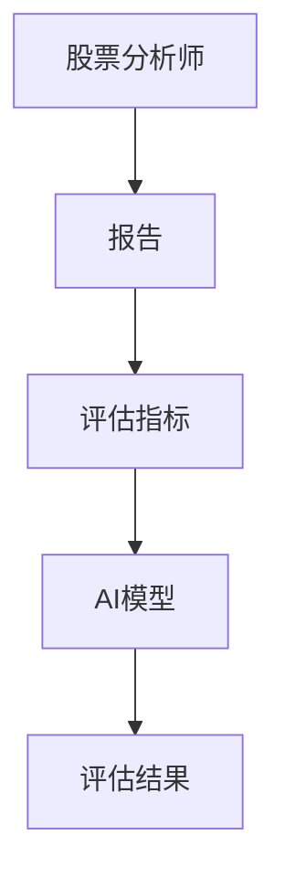
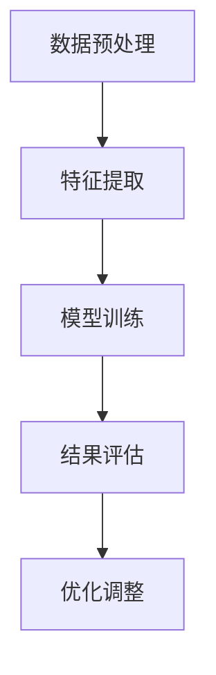

                 


# AI驱动的股票分析师报告质量评估

**关键词**：AI，股票分析师，报告质量，NLP，机器学习，文本分析

**摘要**：  
随着人工智能技术的快速发展，AI在金融领域的应用越来越广泛。本文探讨如何利用AI技术来评估股票分析师的报告质量。文章从背景介绍、核心概念、算法原理、系统架构设计、项目实战等多个方面进行详细分析。通过自然语言处理（NLP）、机器学习等技术，结合多模态数据，提出了一套AI驱动的报告质量评估系统。本文最后通过实际案例展示了系统的应用效果，并总结了未来的发展方向。

---

## 第一部分: 背景介绍

### 第1章: 背景介绍

#### 1.1 问题背景

##### 1.1.1 股票分析师报告的重要性
股票分析师的报告是投资者决策的重要依据。这些报告通常包含对市场趋势、公司基本面、行业动态等的深入分析，帮助投资者做出明智的投资决策。然而，报告的质量参差不齐，如何客观、高效地评估报告的质量成为一个重要问题。

##### 1.1.2 传统报告评估的局限性
传统的报告评估主要依赖人工阅读和主观判断，这种方式耗时且成本高昂。此外，由于主观因素的影响，评估结果可能存在偏差。面对海量的报告，人工评估的效率难以满足需求。

##### 1.1.3 AI技术在金融领域的应用潜力
AI技术，特别是自然语言处理（NLP）和机器学习，在金融领域的应用日益广泛。通过AI技术，可以自动化地分析报告内容，提取关键信息，并评估其质量和价值。

#### 1.2 问题描述

##### 1.2.1 报告质量评估的核心要素
报告质量可以从多个维度进行评估，包括信息的准确性、逻辑的严谨性、语言的清晰度等。这些要素需要通过文本分析和数据挖掘技术来量化和评估。

##### 1.2.2 评估标准的多样性与复杂性
不同类型的报告可能有不同的评估标准。例如，市场趋势分析报告可能更注重逻辑性和前瞻性，而公司基本面分析报告则更关注数据的准确性和深度。

##### 1.2.3 AI驱动评估的必要性
AI技术可以通过自动化的方式，对大量报告进行快速评估，同时避免主观因素的干扰。这使得AI成为提升报告质量评估效率和准确性的理想工具。

#### 1.3 问题解决

##### 1.3.1 AI在文本分析中的优势
AI技术可以对文本进行深度分析，提取关键词、主题、情感倾向等信息。这些信息可以用于评估报告的质量和价值。

##### 1.3.2 数据驱动的评估方法
通过收集和分析大量的报告数据，可以建立数据驱动的评估模型。这些模型可以根据报告的内容、结构和语言特点，自动给出质量评分。

##### 1.3.3 多模态分析的可行性
除了文本分析，还可以结合其他模态的数据（如市场数据、公司财务数据等）进行综合评估。多模态分析可以提供更全面的视角，提升评估的准确性。

#### 1.4 边界与外延

##### 1.4.1 评估范围的界定
报告质量评估的范围需要明确界定。例如，评估可以针对特定类型的报告（如市场分析报告、公司基本面分析报告）进行。

##### 1.4.2 与其他金融任务的关联
报告质量评估与金融领域的其他任务（如股票预测、风险评估等）密切相关。通过评估报告的质量，可以为这些任务提供更可靠的基础数据。

##### 1.4.3 技术与业务的结合点
AI技术需要与具体的金融业务相结合，才能发挥其潜力。例如，如何将NLP技术与股票分析师的报告生成和评估结合起来，是一个重要的研究方向。

#### 1.5 概念结构与核心要素

##### 1.5.1 核心概念的组成
报告质量评估的核心概念包括文本分析、数据挖掘、机器学习等技术，以及市场数据、公司财务数据等业务数据。

##### 1.5.2 要素之间的关系
文本分析是报告质量评估的基础，数据挖掘和机器学习技术用于提取和分析数据，市场数据和公司财务数据为评估提供支持。

##### 1.5.3 案例分析
以某家公司的市场分析报告为例，通过NLP技术提取报告中的关键词和主题，结合市场数据进行质量评估。

---

## 第二部分: 核心概念与联系

### 第2章: 核心概念与联系

#### 2.1 核心概念原理

##### 2.1.1 文本分析的基本原理
文本分析通过提取文本中的关键词、主题、情感倾向等信息，对文本进行量化描述。这些量化指标可以用于评估报告的质量。

##### 2.1.2 金融领域文本的特殊性
金融领域的文本通常具有专业性和复杂性。例如，市场分析报告可能包含大量的专业术语和复杂的逻辑结构。

##### 2.1.3 多模态数据的整合
多模态数据（如文本、市场数据、财务数据）的整合可以提供更全面的评估视角。例如，结合市场数据可以评估报告的预测准确性。

#### 2.2 概念属性特征对比

##### 2.2.1 文本特征与数值特征的对比
文本特征（如关键词、主题）与数值特征（如市场指数、公司财务数据）在分析方法和应用场景上有显著差异。

##### 2.2.2 不同模型的性能对比
不同的AI模型（如TF-IDF、Word2Vec、BERT）在报告质量评估中的表现可能有所不同。需要通过实验对比来选择最优模型。

##### 2.2.3 数据质量对结果的影响
数据质量直接影响评估结果的准确性。例如，噪声数据可能会影响模型的训练效果。

#### 2.3 ER实体关系图



---

## 第三部分: 算法原理讲解

### 第3章: 算法原理讲解

#### 3.1 算法流程



#### 3.2 算法实现代码

##### 3.2.1 数据预处理
```python
import pandas as pd
import numpy as np

# 加载数据
data = pd.read_csv('reports.csv')

# 删除缺失值
data = data.dropna()

# 转换为数值型数据
data['label'] = data['label'].astype(int)
```

##### 3.2.2 特征提取
```python
from sklearn.feature_extraction.text import TfidfVectorizer

# 初始化向量器
vectorizer = TfidfVectorizer(max_features=5000)

# 提取特征
X = vectorizer.fit_transform(data['text'])
```

##### 3.2.3 模型训练
```python
from sklearn.model

