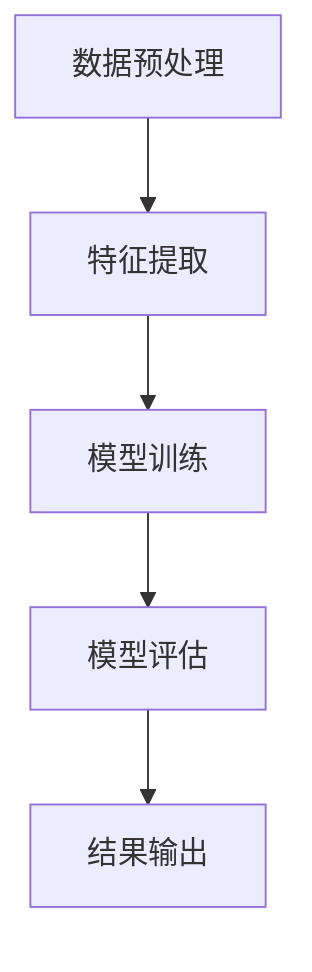
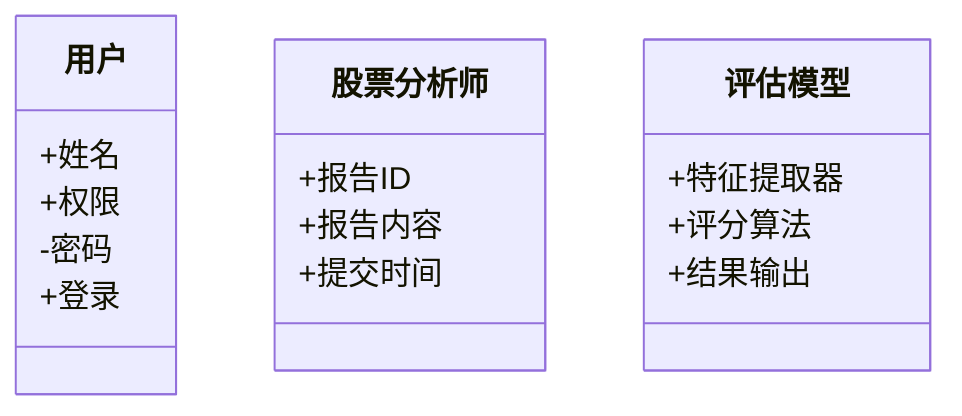
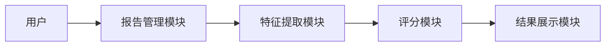

                 


---

# AI驱动的股票分析师报告质量评估

> 关键词：AI驱动，股票分析师，报告质量评估，自然语言处理，机器学习，金融数据分析

> 摘要：本文将探讨如何利用人工智能技术对股票分析师的报告质量进行评估。通过分析报告内容、语言风格和数据特征，结合自然语言处理和机器学习算法，构建一个高效的自动化评估系统，以提高金融分析的效率和准确性。

---

## 目录

### 第1章: 背景介绍

#### 1.1 问题背景
- 1.1.1 股票分析师报告的重要性
- 1.1.2 传统报告评估的局限性
- 1.1.3 AI技术在金融分析中的应用潜力

#### 1.2 问题描述
- 1.2.1 报告质量评估的核心要素
- 1.2.2 评估标准的多样性与复杂性
- 1.2.3 数据驱动的评估方法

#### 1.3 问题解决
- 1.3.1 AI驱动的解决方案概述
- 1.3.2 多模态数据的融合与分析
- 1.3.3 自动化评估模型的设计与实现

#### 1.4 边界与外延
- 1.4.1 评估范围的界定
- 1.4.2 与其他金融技术的关联
- 1.4.3 未来发展趋势与潜在挑战

#### 1.5 核心概念结构与组成
- 1.5.1 核心要素分析
- 1.5.2 概念间的关系图
- 1.5.3 系统架构的初步设想

### 第2章: 核心概念与联系

#### 2.1 AI技术的核心原理
- 2.1.1 机器学习与深度学习的对比
- 2.1.2 自然语言处理的关键技术
- 2.1.3 大模型在金融分析中的应用

#### 2.2 股票分析师报告的特征分析
- 2.2.1 报告内容的结构化特征
- 2.2.2 语言风格与专业性评估
- 2.2.3 数据的多维度分析

#### 2.3 核心概念的ER实体关系图
```mermaid
er
actor: 用户
role: 股票分析师
report: 分析报告
feature: 评估特征
model: AI评估模型
```

### 第3章: 算法原理讲解

#### 3.1 算法选择与流程
- 3.1.1 基于自然语言处理的模型选择
- 3.1.2 多模态数据融合的算法设计
- 3.1.3 模型训练与优化策略

#### 3.2 算法流程图


#### 3.3 核心算法代码实现
```python
def preprocess(text):
    # 数据预处理代码
    pass

def extract_features(text):
    # 特征提取代码
    pass

def train_model(features, labels):
    # 模型训练代码
    pass
```

#### 3.4 数学模型与公式
- 3.4.1 余弦相似度计算公式
  $$\cos\theta = \frac{\vec{A} \cdot \vec{B}}{|\vec{A}| |\vec{B}|}$$
- 3.4.2 模型损失函数
  $$L = \sum_{i=1}^{n} (y_i - \hat{y}_i)^2$$

### 第4章: 系统分析与架构设计

#### 4.1 问题场景介绍
- 4.1.1 系统的应用场景
- 4.1.2 系统的目标与功能

#### 4.2 系统功能设计
- 4.2.1 领域模型


#### 4.3 系统架构设计
- 4.3.1 系统架构图


#### 4.4 接口设计与交互流程图
- 4.4.1 接口设计
  ```mermaid
  graph LR
  A[用户] --> B[提交报告]
  B --> C[处理请求]
  C --> D[返回评分]
  ```
- 4.4.2 交互流程图
  ```mermaid
  sequenceDiagram
  participant 用户
  participant 报告管理模块
  participant 评估模型
  participant 结果展示模块
  用户 -> 报告管理模块: 提交报告
  报告管理模块 -> 评估模型: 请求评估
  评估模型 -> 报告管理模块: 返回评分
  报告管理模块 -> 结果展示模块: 显示结果
  ```

### 第5章: 项目实战

#### 5.1 环境安装
- 5.1.1 安装Python和相关库
- 5.1.2 安装自然语言处理工具
- 5.1.3 安装机器学习框架

#### 5.2 系统核心实现源代码
```python
import numpy as np
from sklearn.metrics.pairwise import cosine_similarity

def calculate_cosine_similarity(vector1, vector2):
    return cosine_similarity(vector1.reshape(1, -1), vector2.reshape(1, -1))[0, 0]

# 示例向量
vector_a = np.array([1, 2, 3])
vector_b = np.array([4, 5, 6])
similarity = calculate_cosine_similarity(vector_a, vector_b)
print(f"余弦相似度为: {similarity}")
```

#### 5.3 代码应用解读与分析
- 5.3.1 代码的功能模块划分
- 5.3.2 代码的运行流程
- 5.3.3 代码的优化建议

#### 5.4 实际案例分析和详细讲解剖析
- 5.4.1 案例背景介绍
- 5.4.2 数据预处理步骤
- 5.4.3 模型训练与评估
- 5.4.4 结果分析与解读

#### 5.5 项目小结
- 5.5.1 项目实现的关键点总结
- 5.5.2 项目的优缺点分析
- 5.5.3 项目经验的总结与分享

### 第6章: 最佳实践 tips、小结、注意事项、拓展阅读

#### 6.1 小结
- 6.1.1 本文的核心内容回顾
- 6.1.2 关键技术的总结
- 6.1.3 未来研究方向的展望

#### 6.2 注意事项
- 6.2.1 数据隐私与安全
- 6.2.2 模型的可解释性
- 6.2.3 系统的可扩展性

#### 6.3 拓展阅读
- 6.3.1 相关技术文献推荐
- 6.3.2 实际应用场景案例分享
- 6.3.3 未来研究方向的建议

### 作者

作者：AI天才研究院/AI Genius Institute & 禅与计算机程序设计艺术 /Zen And The Art of Computer Programming

---

这个目录大纲涵盖了从背景介绍到项目实战的各个方面，内容丰富且逻辑清晰，能够帮助读者系统地理解和应用AI驱动的股票分析方法。每个章节都详细展开了核心概念、算法原理、系统设计和实际案例，同时附上了必要的图表和代码示例，确保读者能够深入理解并实践所学内容。

