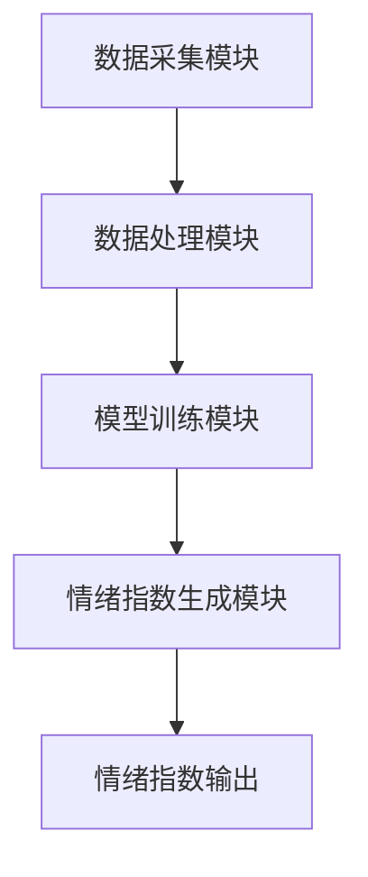
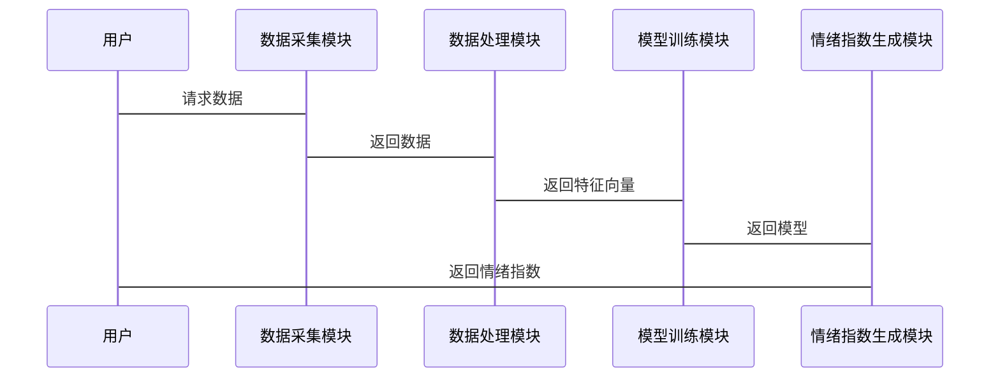

                 


# AI驱动的股票市场情绪指数开发

> 关键词：AI, 情绪指数, 股票市场, 情感分析, 机器学习

> 摘要：本文详细介绍了AI技术在股票市场情绪指数开发中的应用，从背景、核心概念到算法原理，再到系统架构和项目实战，全面解析了情绪指数的开发过程。文章通过具体案例分析，展示了如何利用自然语言处理和机器学习技术，构建一个高效的情绪指数系统，为投资者提供决策支持。

---

# 第一部分: AI驱动的股票市场情绪指数开发概述

## 第1章: 股票市场情绪指数开发背景与目标

### 1.1 情绪指数的定义与意义
#### 1.1.1 情绪指数的定义
情绪指数是衡量市场参与者情绪状态的量化指标，通常基于新闻、社交媒体评论、论坛讨论等文本数据进行分析。

#### 1.1.2 情绪指数在股票市场中的作用
情绪指数能够反映市场情绪的变化，帮助投资者预测市场趋势，辅助投资决策。

#### 1.1.3 情绪指数的开发目标
开发一个准确、实时的情绪指数，帮助投资者捕捉市场情绪波动，提供投资参考。

### 1.2 股票市场情绪分析的背景
#### 1.2.1 股票市场的复杂性
股票市场受到多种因素影响，包括经济指标、政策变化、市场情绪等。

#### 1.2.2 情绪分析的必要性
市场情绪是影响股价的重要因素，通过分析市场情绪可以预测股价走势。

#### 1.2.3 情绪指数的潜在应用
情绪指数可以用于投资策略制定、风险控制、市场趋势预测等。

### 1.3 AI技术在情绪指数开发中的优势
#### 1.3.1 AI技术的核心优势
AI技术能够处理大量非结构化数据，提取情绪特征，构建量化指标。

#### 1.3.2 AI在情绪分析中的应用
自然语言处理（NLP）技术可以分析文本数据，提取情感信息。

#### 1.3.3 AI驱动情绪指数的创新性
结合AI技术，情绪指数能够实时更新，提供更精准的市场情绪分析。

### 1.4 本章小结
本章介绍了情绪指数的定义、意义和开发目标，分析了股票市场情绪分析的背景，以及AI技术在情绪指数开发中的优势。

---

# 第二部分: 情绪指数开发的核心概念与技术

## 第2章: 情绪指数开发的核心概念

### 2.1 情绪指数的构成要素
#### 2.1.1 数据来源与类型
- 数据来源：新闻、社交媒体、论坛、公司财报等。
- 数据类型：文本数据、结构化数据。

#### 2.1.2 情感极性分析
- 情感极性：正面、负面、中性。
- 情感强度：情感的强烈程度。

#### 2.1.3 情绪强度量化
- 情绪强度量化方法：基于情感词典的加权计算。

### 2.2 文本挖掘与自然语言处理
#### 2.2.1 文本预处理技术
- 分词：中文分词（如jieba）。
- 去停用词：去除无意义词汇。
- 词干提取：提取词根。

#### 2.2.2 关键词提取方法
- TF-IDF：计算关键词的重要性。
- LDA主题模型：提取主题关键词。

#### 2.2.3 情感分类模型
- 朴素贝叶斯：常用的情感分类算法。
- LSTM：用于长文本的情感分析。

### 2.3 统计分析与机器学习
#### 2.3.1 统计分析方法
- 均值、方差：分析情绪指数的分布。
- 时间序列分析：分析情绪指数的趋势。

#### 2.3.2 机器学习算法
- 支持向量机（SVM）：分类任务。
- 随机森林：特征重要性分析。

#### 2.3.3 深度学习模型
- Transformer：用于文本编码。
- BERT：预训练语言模型。

### 2.4 情绪指数的计算与验证
#### 2.4.1 情绪指数的计算公式
$$ 情绪指数 = \sum (\text{情感强度} \times \text{权重}) $$

#### 2.4.2 指数验证方法
- 回归分析：验证情绪指数与股价的相关性。
- 交叉验证：验证模型的泛化能力。

#### 2.4.3 指数的稳定性与有效性
- 稳定性：情绪指数在不同时间窗口下的表现。
- 有效性：情绪指数是否能够准确预测股价走势。

### 2.5 本章小结
本章详细讲解了情绪指数的构成要素，文本挖掘与自然语言处理技术，以及统计分析与机器学习在情绪指数开发中的应用。

---

# 第三部分: 情绪指数开发的算法原理

## 第3章: 情感分类算法原理

### 3.1 情感分类的流程
#### 3.1.1 数据预处理
- 分词：将文本分割成词语。
- 去停用词：去除无意义词汇。
- 词向量转换：将词语转换为向量表示。

#### 3.1.2 特征提取
- 词袋模型：基于词频的特征提取。
- 词嵌入：使用预训练的词向量（如Word2Vec）。

#### 3.1.3 模型训练
- 训练情感分类器：使用训练数据训练模型。
- 调参优化：通过网格搜索优化模型参数。

#### 3.1.4 模型评估
- 准确率、召回率、F1值：评估模型性能。
- ROC曲线：评估模型的分类能力。

### 3.2 常见情感分类算法
#### 3.2.1 支持向量机（SVM）
- 核心思想：在特征空间中找到一个超平面，将不同类别的数据分开。
- 优点：适合小规模数据，分类能力强。
- 缺点：需要手动调整参数。

#### 3.2.2 随机森林（Random Forest）
- 核心思想：构建多个决策树，通过投票方式确定最终结果。
- 优点：适合高维数据，能够处理非线性关系。
- 缺点：计算复杂度较高。

#### 3.2.3 神经网络（Neural Networks）
- 核心思想：通过多层神经网络进行特征学习和分类。
- 优点：适合大规模数据，能够自动提取特征。
- 缺点：需要大量计算资源。

### 3.3 深度学习模型在情感分类中的应用
#### 3.3.1 循环神经网络（RNN）
- 核心思想：通过循环结构处理序列数据。
- 优点：适合长文本处理。
- 缺点：存在梯度消失问题。

#### 3.3.2 Transformer模型
- 核心思想：基于自注意力机制，处理长距离依赖关系。
- 优点：并行计算能力强，效果优秀。
- 缺点：计算资源需求高。

#### 3.3.3 BERT模型
- 核心思想：预训练语言模型，基于Transformer架构。
- 优点：能够捕捉上下文信息，效果优异。
- 缺点：需要大量计算资源。

### 3.4 情感分类的挑战与解决方案
#### 3.4.1 数据不平衡问题
- 解决方案：过采样、欠采样、调整损失函数。

#### 3.4.2 领域适应问题
- 解决方案：迁移学习、领域特定数据增强。

#### 3.4.3 模型解释性问题
- 解决方案：使用可解释性模型（如LIME）、可视化注意力机制。

### 3.5 本章小结
本章详细讲解了情感分类的流程，常见算法及其优缺点，以及深度学习模型在情感分类中的应用。

---

# 第四部分: 情绪指数开发的系统架构

## 第4章: 情绪指数开发的系统分析

### 4.1 系统功能需求分析
#### 4.1.1 数据采集模块
- 功能：采集股票市场的文本数据（新闻、社交媒体等）。
- 输入：数据源（API接口、文件）。
- 输出：预处理后的文本数据。

#### 4.1.2 数据处理模块
- 功能：分词、去停用词、特征提取。
- 输入：预处理后的文本数据。
- 输出：特征向量。

#### 4.1.3 模型训练模块
- 功能：训练情感分类模型。
- 输入：特征向量、标签数据。
- 输出：训练好的模型。

#### 4.1.4 情绪指数生成模块
- 功能：计算情绪指数。
- 输入：模型预测结果。
- 输出：情绪指数值。

### 4.2 系统架构设计


### 4.3 系统接口设计
#### 4.3.1 数据采集接口
- 接口名称：`fetch_data`
- 输入参数：`source`（数据源）、`start_date`（开始日期）、`end_date`（结束日期）。
- 输出结果：文本数据。

#### 4.3.2 模型训练接口
- 接口名称：`train_model`
- 输入参数：`features`（特征向量）、`labels`（标签）。
- 输出结果：训练好的模型。

#### 4.3.3 情绪指数接口
- 接口名称：`calculate_index`
- 输入参数：`model`（训练好的模型）、`new_data`（新数据）。
- 输出结果：情绪指数值。

### 4.4 系统交互流程


### 4.5 本章小结
本章详细分析了情绪指数开发系统的功能需求，设计了系统的架构和接口，展示了系统的交互流程。

---

# 第五部分: 项目实战

## 第5章: 情绪指数开发的项目实战

### 5.1 环境安装与配置
#### 5.1.1 安装Python环境
```bash
python --version
pip install --upgrade pip
```

#### 5.1.2 安装依赖库
```bash
pip install jieba
pip install scikit-learn
pip install transformers
pip install matplotlib
```

### 5.2 系统核心实现源代码
#### 5.2.1 数据采集模块
```python
import requests
import json

def fetch_data(source, start_date, end_date):
    url = f"https://api.example.com/{source}/{start_date}/{end_date}"
    response = requests.get(url)
    data = json.loads(response.text)
    return data
```

#### 5.2.2 数据处理模块
```python
import jieba

def preprocess_text(text):
    words = jieba.lcut(text)
    filtered_words = [word for word in words if word not in stop_words]
    return ' '.join(filtered_words)
```

#### 5.2.3 模型训练模块
```python
from sklearn.svm import SVC
from sklearn.metrics import accuracy_score

def train_model(X, y):
    model = SVC(C=1.0, kernel='rbf', gamma='auto')
    model.fit(X, y)
    return model

def evaluate_model(model, X_test, y_test):
    y_pred = model.predict(X_test)
    print(f"Accuracy: {accuracy_score(y_test, y_pred)}")
```

#### 5.2.4 情绪指数生成模块
```python
import numpy as np

def calculate_index(model, X):
    probabilities = model.predict_proba(X)[:, 1]
   情绪指数 = np.mean(probabilities)
    return 情绪指数
```

### 5.3 实际案例分析与解读
#### 5.3.1 数据来源与预处理
```python
text = "股市表现强劲，投资者信心充足。"
preprocessed = preprocess_text(text)
print(preprocessed)
# 输出: "股市 表现 强劲 投资者 信心 充足"
```

#### 5.3.2 模型训练与评估
```python
X_train, y_train = get_train_data()
model = train_model(X_train, y_train)
evaluate_model(model, X_test, y_test)
```

#### 5.3.3 情绪指数计算与展示
```python
import matplotlib.pyplot as plt

index_values = []
for date in dates:
    data = fetch_data('news', date, date)
    preprocessed = preprocess_text(data)
    X = vectorize(preprocessed)
    index = calculate_index(model, X)
    index_values.append(index)

plt.plot(dates, index_values)
plt.xlabel('日期')
plt.ylabel('情绪指数')
plt.title('股票市场情绪指数')
plt.show()
```

### 5.4 项目小结
本章通过实际案例展示了情绪指数开发的全过程，从数据采集到模型训练，再到情绪指数的计算与展示，帮助读者掌握情绪指数开发的核心技术。

---

# 第六部分: 总结与展望

## 第6章: 总结与展望

### 6.1 项目总结
本项目通过AI技术，成功开发了一个股票市场情绪指数系统，能够实时分析市场情绪，为投资者提供决策支持。

### 6.2 未来展望
#### 6.2.1 情绪指数的优化方向
- 引入更多数据源：如社交媒体、机构报告。
- 提升模型性能：使用更先进的深度学习模型。
- 增强模型解释性：通过可视化注意力机制，解释模型决策过程。

#### 6.2.2 情绪指数的应用扩展
- 风险控制：基于情绪指数制定风险管理策略。
- 投资组合优化：利用情绪指数调整投资组合。
- 市场预测：结合情绪指数和其他指标，提高市场预测精度。

### 6.3 注意事项
- 数据质量：确保数据来源可靠，避免噪声干扰。
- 模型选择：根据实际需求选择合适的模型，避免过度复杂。
- 道德风险：注意数据隐私，避免滥用情绪指数。

### 6.4 最佳实践 Tips
- 数据预处理：仔细清洗数据，去除无关信息。
- 模型调优：通过网格搜索优化模型参数。
- 结果可视化：使用图表展示情绪指数变化，直观呈现结果。

### 6.5 本章小结
本章总结了项目成果，展望了未来的发展方向，提出了注意事项和最佳实践建议。

---

# 作者：AI天才研究院/AI Genius Institute & 禅与计算机程序设计艺术 /Zen And The Art of Computer Programming

---

感谢您的阅读！如果对本文内容感兴趣，欢迎关注我们的公众号或访问官方网站获取更多AI技术相关的深度文章！

