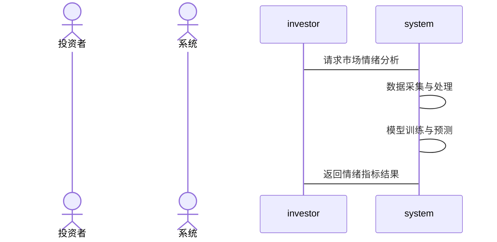

                 


# AI驱动的股票市场情绪指标开发

## 关键词：AI驱动，股票市场，情绪指标，深度学习，自然语言处理

## 摘要：  
本文详细探讨了如何利用人工智能技术开发股票市场情绪指标，从理论基础到算法实现，再到系统架构设计，结合实际案例分析，全面解析了情绪指标在股票市场中的应用价值和开发方法。文章首先介绍了情绪分析的背景与意义，然后深入分析了情绪指标的核心概念与算法原理，接着从系统架构设计、项目实战、最佳实践等多个维度展开，最后总结了开发过程中需要注意的关键点和未来的研究方向。

---

# 第一部分: AI驱动的股票市场情绪指标开发基础

## 第1章: 股票市场情绪指标开发背景

### 1.1 情绪分析的背景与意义  
股票市场作为经济活动的核心领域，其价格波动受到多种因素的影响，包括宏观经济指标、公司财报、政策变化以及市场情绪等。市场情绪是投资者在面对市场信息时的心理反应，通常表现为乐观、悲观、恐慌等情绪状态。通过对市场情绪的分析，投资者可以更好地理解市场的行为模式，从而做出更明智的投资决策。  

#### 1.1.1 情绪分析的定义与核心概念  
情绪分析（Sentiment Analysis）是一种自然语言处理（NLP）技术，旨在通过分析文本数据来判断作者的情感倾向。在股票市场中，情绪分析通常用于分析新闻、社交媒体评论、投资者论坛等文本数据，以判断市场参与者的情绪状态。  

#### 1.1.2 股票市场中的情绪分析应用  
情绪分析在股票市场中的应用主要体现在以下几个方面：  
1. **预测市场波动**：通过分析新闻标题和社交媒体情绪，预测市场的短期波动。  
2. **辅助投资决策**：投资者可以根据市场情绪的变化调整投资策略。  
3. **风险管理**：通过监测市场情绪，及时发现潜在的风险信号。  

#### 1.1.3 情绪指标在投资决策中的作用  
情绪指标通过量化市场情绪，为投资者提供了额外的决策依据。例如，当市场情绪过于乐观时，投资者可能会警惕潜在的回调风险；当市场情绪极度悲观时，投资者可能会寻找抄底的机会。  

### 1.2 股票市场的基本运作机制  
股票市场的运作机制是理解情绪指标开发的基础。股票价格的波动受到多种因素的影响，包括宏观经济指标、公司财报、政策变化、市场情绪等。  

#### 1.2.1 股票市场的定义与分类  
股票市场是指通过股票交易所进行股票买卖的市场。股票市场可以分为一级市场和二级市场，二级市场是投资者买卖股票的主要场所。  

#### 1.2.2 影响股票价格的主要因素  
股票价格的波动受到多种因素的影响，包括：  
1. **宏观经济因素**：GDP增长率、利率、通货膨胀等。  
2. **公司基本面**：公司盈利能力、财务状况、管理层变动等。  
3. **市场情绪**：投资者的心理预期和行为模式。  

#### 1.2.3 市场情绪与股票价格的关系  
市场情绪是股票价格波动的重要影响因素。当市场情绪乐观时，股票价格上涨；当市场情绪悲观时，股票价格下跌。情绪指标通过量化市场情绪，帮助投资者更好地理解市场行为。  

### 1.3 情绪指标开发的目标与边界  
情绪指标开发的目标是通过量化市场情绪，为投资者提供额外的决策依据。  

#### 1.3.1 情绪指标的核心目标  
情绪指标的核心目标是捕捉市场情绪的变化，量化投资者的心理预期。  

#### 1.3.2 情绪指标的边界与外延  
情绪指标的开发需要明确其边界，例如：  
1. 数据范围：情绪指标通常基于新闻、社交媒体等文本数据。  
2. 时间范围：情绪指标通常关注短期市场情绪的变化。  
3. 应用范围：情绪指标主要用于辅助投资决策，而非直接预测股票价格。  

#### 1.3.3 情绪指标与传统技术分析的对比  
情绪指标与传统技术分析的主要区别在于数据来源和技术手段。传统技术分析基于价格和成交量数据，而情绪指标基于文本数据。  

### 1.4 本章小结  
本章介绍了情绪分析的背景与意义，分析了股票市场的基本运作机制，明确了情绪指标开发的目标与边界。情绪指标通过量化市场情绪，为投资者提供了额外的决策依据。

---

## 第2章: 情绪指标的核心概念与联系  

### 2.1 情绪指标的定义与分类  
情绪指标是通过分析文本数据，量化市场情绪的指标。  

#### 2.1.1 情绪指标的定义  
情绪指标是一种量化市场情绪的工具，通常基于新闻、社交媒体等文本数据。  

#### 2.1.2 情绪指标的分类与特征  
情绪指标可以根据数据来源、分析方法和时间范围进行分类。例如：  
1. **数据来源**：新闻、社交媒体、投资者评论等。  
2. **分析方法**：基于关键词、情感评分、机器学习等。  
3. **时间范围**：短期、中期、长期。  

#### 2.1.3 情绪指标的计算方法  
情绪指标的计算方法包括：  
1. **基于关键词的方法**：通过统计特定关键词的出现频率，判断情绪状态。  
2. **基于情感评分的方法**：对文本进行情感评分，计算平均值或加权值。  
3. **基于机器学习的方法**：利用分类模型对文本进行情感分类。  

### 2.2 情绪指标的核心要素与关系  
情绪指标的核心要素包括数据来源、分析方法和计算模型。  

#### 2.2.1 情绪指标的实体关系图  
```mermaid
er
actor: 投资者
actor: 数据源
actor: 情绪指标系统
```

#### 2.2.2 情绪指标与市场行为的关系  


#### 2.2.3 情绪指标的核心要素与关系  
情绪指标的核心要素包括数据来源、分析方法和计算模型。这些要素相互关联，共同决定了情绪指标的准确性和实用性。

### 2.3 情绪指标与其他市场指标的对比  
情绪指标与其他市场指标的对比可以帮助投资者更好地理解其独特价值。  

#### 2.3.1 情绪指标与技术指标的对比  
情绪指标与技术指标的主要区别在于数据来源和技术手段。技术指标基于价格和成交量数据，而情绪指标基于文本数据。  

#### 2.3.2 情绪指标与基本面指标的对比  
情绪指标与基本面指标的对比可以帮助投资者更好地理解市场情绪与公司基本面的关系。  

#### 2.3.3 情绪指标与市场参与度指标的对比  
情绪指标与市场参与度指标的对比可以帮助投资者更好地理解市场情绪与市场活跃度的关系。  

### 2.4 本章小结  
本章详细介绍了情绪指标的定义与分类，分析了情绪指标的核心要素与关系，并对比了情绪指标与其他市场指标的异同。

---

## 第3章: 情绪指标开发的算法原理  

### 3.1 情绪分析的主要算法  
情绪分析算法是情绪指标开发的核心技术。  

#### 3.1.1 基于词袋模型的算法  
词袋模型是一种简单的情感分析方法，通过统计关键词的出现频率来判断情绪状态。  

#### 3.1.2 基于TF-IDF的算法  
TF-IDF（Term Frequency-Inverse Document Frequency）是一种常用的文本特征提取方法，通过计算关键词的重要性来判断情绪状态。  

#### 3.1.3 基于词嵌入的算法  
词嵌入是一种将词表示为向量的技术，常用的算法包括Word2Vec、GloVe等。词嵌入可以捕捉词义信息，提高情感分析的准确性。  

#### 3.1.4 基于深度学习的算法  
深度学习算法，如卷积神经网络（CNN）、循环神经网络（RNN）等，可以通过训练大量的文本数据，自动学习情感特征。  

### 3.2 情绪分析算法的流程图  


### 3.3 情绪分析的数学模型与公式  
情绪分析的数学模型与公式是算法实现的核心。  

#### 3.3.1 余弦相似度公式  
余弦相似度是衡量两个向量相似性的指标，公式如下：  
$$\text{余弦相似度} = \frac{\vec{A} \cdot \vec{B}}{|\vec{A}| |\vec{B}|}$$  

#### 3.3.2 TF-IDF计算公式  
TF-IDF计算公式如下：  
$$\text{TF-IDF}(t, d) = \text{TF}(t, d) \times \text{IDF}(t)$$  
其中，$\text{TF}(t, d)$表示词$t$在文档$d$中的词频，$\text{IDF}(t)$表示词$t$的逆文档频率。  

#### 3.3.3 情感评分计算公式  
情感评分是通过将文本中的情感特征向量化，然后计算其与正负情感向量的相似度来确定情感倾向。  

### 3.4 情绪分析算法的实现  
情绪分析算法的实现需要结合文本预处理、特征提取和模型训练等步骤。  

#### 3.4.1 文本预处理  
文本预处理包括分词、去停用词、词干提取等步骤。  

#### 3.4.2 特征提取  
特征提取是将文本数据转换为数值向量的过程，常用的特征提取方法包括TF-IDF、词嵌入等。  

#### 3.4.3 模型训练  
模型训练是利用训练数据对分类模型进行训练，常用的分类算法包括SVM、随机森林、神经网络等。  

### 3.5 本章小结  
本章详细介绍了情绪分析的主要算法，包括词袋模型、TF-IDF、词嵌入和深度学习算法，并通过流程图展示了算法实现的步骤。

---

## 第4章: 情绪指标开发的系统架构设计  

### 4.1 项目背景与目标  
情绪指标开发的项目背景是通过AI技术量化市场情绪，辅助投资者做出更明智的投资决策。  

#### 4.1.1 项目背景  
随着AI技术的快速发展，情绪指标开发成为股票市场分析的重要方向。  

#### 4.1.2 项目目标  
项目目标是开发一个基于AI的情绪指标系统，能够实时分析新闻、社交媒体等文本数据，量化市场情绪，并提供可视化结果。  

### 4.2 系统功能设计  
情绪指标系统的功能设计包括数据采集、特征提取、模型训练和结果展示等模块。  

#### 4.2.1 数据采集模块  
数据采集模块负责从新闻网站、社交媒体等数据源获取文本数据。  

#### 4.2.2 特征提取模块  
特征提取模块将文本数据转换为数值向量，常用的特征提取方法包括TF-IDF、词嵌入等。  

#### 4.2.3 模型训练模块  
模型训练模块利用训练数据对分类模型进行训练，常用的分类算法包括SVM、随机森林、神经网络等。  

#### 4.2.4 结果展示模块  
结果展示模块将情绪指标的计算结果可视化，提供直观的市场情绪分析报告。  

### 4.3 系统架构设计  
系统架构设计是情绪指标开发的核心内容。  

#### 4.3.1 系统架构图  


#### 4.3.2 系统模块设计  
系统模块设计包括数据采集模块、数据存储模块、特征提取模块、模型训练模块和结果展示模块。  

#### 4.3.3 系统接口设计  
系统接口设计包括数据接口、模型接口和结果接口。  

### 4.4 系统交互设计  
系统交互设计是用户与系统之间的交互流程。  

#### 4.4.1 用户需求分析  
用户需求分析包括投资者对情绪指标的需求分析。  

#### 4.4.2 系统交互流程图  


### 4.5 本章小结  
本章详细介绍了情绪指标开发的系统架构设计，包括系统功能设计、架构图和交互流程图。

---

## 第5章: 情绪指标开发的项目实战  

### 5.1 项目环境与工具安装  
项目实战需要安装必要的开发环境和工具。  

#### 5.1.1 环境要求  
情绪指标开发需要安装Python、Jupyter Notebook、TensorFlow、Keras等工具。  

#### 5.1.2 工具安装  
安装Python和相关库：  
```bash
pip install numpy
pip install pandas
pip install scikit-learn
pip install tensorflow
pip install keras
```

### 5.2 系统核心实现  
情绪指标系统的核心实现包括数据采集、特征提取和模型训练。  

#### 5.2.1 数据采集实现  
数据采集实现包括从新闻网站获取文本数据。  

#### 5.2.2 特征提取实现  
特征提取实现包括TF-IDF和词嵌入的计算。  

#### 5.2.3 模型训练实现  
模型训练实现包括情感分类模型的训练和优化。  

### 5.3 项目核心代码实现  
项目核心代码实现包括数据预处理、特征提取和模型训练。  

#### 5.3.1 数据预处理代码  
```python
import numpy as np
import pandas as pd

# 数据预处理
def preprocess(text):
    # 分词
    words = word_tokenize(text.lower())
    # 去除停用词
    filtered_words = [word for word in words if word not in stop_words]
    return filtered_words
```

#### 5.3.2 特征提取代码  
```python
from sklearn.feature_extraction.text import TfidfVectorizer

# TF-IDF特征提取
vectorizer = TfidfVectorizer()
X = vectorizer.fit_transform(texts)
```

#### 5.3.3 模型训练代码  
```python
from sklearn.svm import SVC

# SVM模型训练
model = SVC()
model.fit(X_train, y_train)
```

### 5.4 案例分析与详细解读  
案例分析包括情绪指标在实际股票市场中的应用。  

#### 5.4.1 案例背景  
案例背景包括某股票市场的新闻数据和社交媒体评论数据。  

#### 5.4.2 情绪指标计算与分析  
情绪指标计算与分析包括情绪评分、情绪趋势分析等。  

#### 5.4.3 案例结果解读  
案例结果解读包括情绪指标对股票价格波动的预测能力。  

### 5.5 本章小结  
本章通过项目实战，详细介绍了情绪指标开发的核心实现，包括数据采集、特征提取和模型训练，并通过案例分析展示了情绪指标的实际应用。

---

## 第6章: 情绪指标开发的最佳实践  

### 6.1 数据预处理的注意事项  
数据预处理是情绪指标开发的关键步骤。  

#### 6.1.1 文本清洗技巧  
文本清洗技巧包括分词、去停用词、词干提取等。  

#### 6.1.2 数据标注与清洗  
数据标注与清洗是提高模型准确性的关键。  

### 6.2 模型调优与优化  
模型调优与优化是提高情绪指标准确性的关键。  

#### 6.2.1 超参数调优  
超参数调优包括学习率、批量大小等参数的优化。  

#### 6.2.2 模型融合与集成  
模型融合与集成是提高模型准确性的有效方法。  

### 6.3 情绪指标的结果验证  
情绪指标的结果验证是评估模型性能的重要步骤。  

#### 6.3.1 结果验证方法  
结果验证方法包括准确率、召回率、F1分数等指标。  

#### 6.3.2 结果可视化与解读  
结果可视化与解读包括情绪趋势图、情绪分布图等。  

### 6.4 本章小结  
本章总结了情绪指标开发的最佳实践，包括数据预处理、模型调优和结果验证等方面。

---

## 第7章: 总结与展望  

### 7.1 总结  
本文详细介绍了AI驱动的股票市场情绪指标开发，从理论基础到算法实现，再到系统架构设计和项目实战，全面解析了情绪指标的开发过程。  

### 7.2 未来展望  
未来展望包括情绪指标的进一步优化、多模态情绪分析、实时情绪指标开发等方向。  

### 7.3 本章小结  
本章总结了全文的主要内容，并展望了未来的研究方向。

---

## 作者：AI天才研究院/AI Genius Institute & 禅与计算机程序设计艺术 /Zen And The Art of Computer Programming

