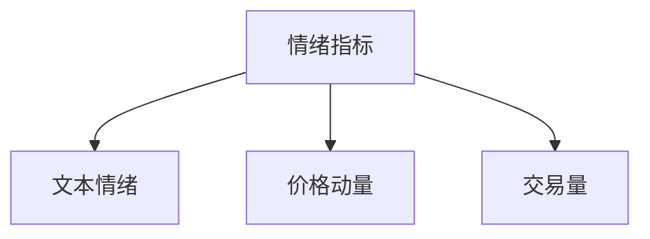
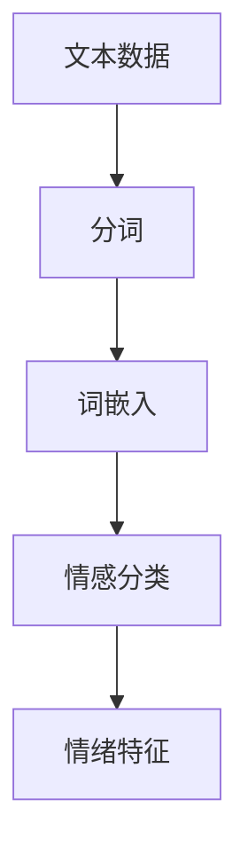
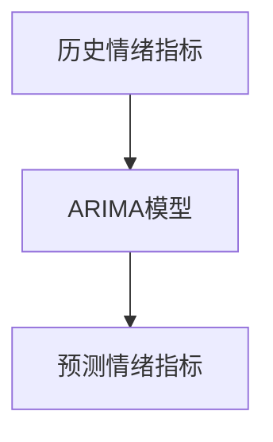
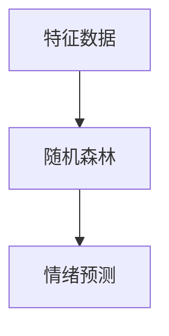
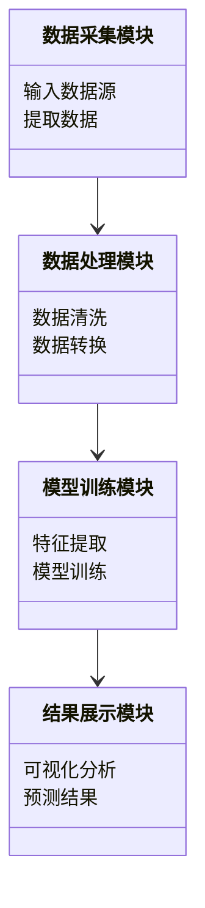
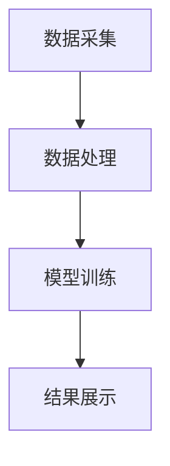
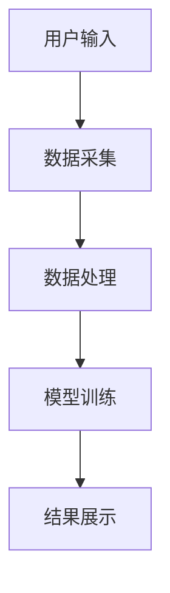
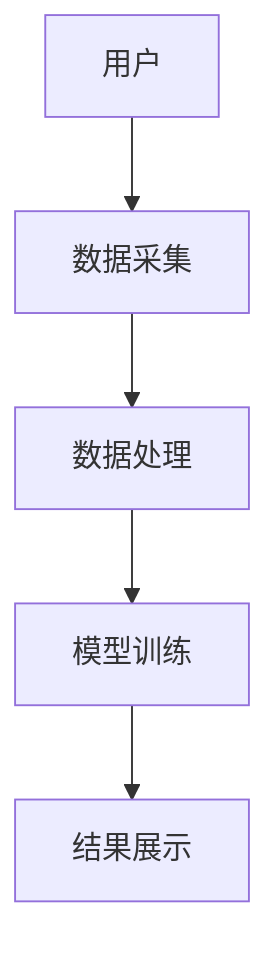

                 


# AI驱动的股票市场情绪指标开发与应用

> 关键词：AI技术、股票市场、情绪指标、自然语言处理、时间序列分析、机器学习

> 摘要：本文详细探讨了如何利用人工智能技术开发股票市场情绪指标，从情绪指标的定义、算法原理、系统架构设计到项目实战，结合具体的代码实现和案例分析，为读者提供一个全面的技术指导。

---

## 第1章: 股票市场情绪指标概述

### 1.1 情绪指标的定义与作用

#### 1.1.1 什么是股票市场情绪指标
股票市场情绪指标是衡量市场参与者情绪状态的量化工具，反映了投资者对市场的乐观或悲观程度。情绪指标可以帮助投资者预测市场走势，优化投资决策。

#### 1.1.2 情绪指标在投资决策中的作用
情绪指标能够捕捉市场情绪的波动，帮助投资者识别市场过热或过冷的情况，从而做出更明智的投资决策。例如，当市场情绪过于乐观时，可能预示着潜在的回调风险。

#### 1.1.3 情绪指标的分类与特点
情绪指标可以分为基于文本的情绪指标、基于价格的情绪指标和基于交易量的情绪指标。文本情绪指标通常基于新闻和社交媒体分析，而价格和交易量指标则基于市场数据。

### 1.2 AI在股票市场中的应用背景

#### 1.2.1 传统股票市场分析的局限性
传统的情绪分析方法依赖于简单的关键词匹配，难以捕捉复杂的市场情绪。同时，市场数据的复杂性和噪声使得传统方法难以准确预测市场走势。

#### 1.2.2 AI技术在金融领域的优势
AI技术，特别是自然语言处理和机器学习，能够处理大量非结构化数据，提取深层次的市场情绪信息。AI还能够快速适应市场变化，提供实时分析。

#### 1.2.3 情绪指标与AI技术的结合
通过AI技术，情绪指标的开发变得更加精准和高效。AI能够从大量数据中提取情绪特征，并结合历史数据进行预测，从而提升情绪指标的实用性。

### 1.3 本章小结

#### 1.3.1 核心概念回顾
情绪指标是衡量市场情绪的量化工具，AI技术的应用使其更加精准和高效。

#### 1.3.2 下文将要探讨的内容
接下来将详细介绍情绪指标的核心概念、算法原理、系统架构设计以及项目实战。

---

## 第2章: 情绪指标的核心概念与联系

### 2.1 情绪指标的定义与属性

#### 2.1.1 情绪指标的定义
情绪指标是通过分析市场参与者的行为、言论和交易数据，量化市场情绪的指标。它反映了市场的乐观或悲观情绪。

#### 2.1.2 情绪指标的属性特征对比
以下是情绪指标的几个关键属性对比：

| 属性 | 描述 |
|------|------|
| 时间性 | 情绪指标随时间变化而变化 |
| 连续性 | 情绪指标可以是连续的数值 |
| 可预测性 | 情绪指标可以帮助预测市场走势 |

#### 2.1.3 情绪指标的ER实体关系图

```mermaid
erDiagram
    participant 投资者
    participant 交易数据
    participant 社交媒体
    investor --> 交易数据: 提供交易数据
    investor --> 社交媒体: 提供社交媒体数据
    交易数据 --> 情绪指标: 用于计算情绪指标
    社交媒体 --> 情绪指标: 用于计算情绪指标
```

### 2.2 情绪指标与AI技术的关系

#### 2.2.1 情绪指标的核心要素
情绪指标的核心要素包括市场参与者的情绪、交易数据和社交媒体数据。这些要素通过AI技术进行分析和处理。

#### 2.2.2 AI技术在情绪指标中的应用
AI技术可以通过自然语言处理分析社交媒体数据，提取情绪特征；通过时间序列分析预测情绪指标的变化趋势。

#### 2.2.3 情绪指标与AI技术的相互作用
AI技术增强了情绪指标的分析能力，而情绪指标为AI技术提供了丰富的数据来源。

### 2.3 情绪指标的数学模型

#### 2.3.1 情绪指标的数学表达式
情绪指标可以通过以下公式计算：

$$
\text{情绪指标} = \alpha \cdot \text{文本情绪} + \beta \cdot \text{价格动量} + \gamma \cdot \text{交易量}
$$

其中，$\alpha$、$\beta$、$\gamma$是权重系数。

#### 2.3.2 情绪指标的计算公式
情绪指标的计算公式可以表示为：

$$
EI(t) = \sum_{i=1}^{n} w_i \cdot x_i
$$

其中，$w_i$是权重，$x_i$是各个情绪特征。

#### 2.3.3 情绪指标的数学模型图



### 2.4 本章小结

#### 2.4.1 核心概念总结
情绪指标是衡量市场情绪的重要工具，AI技术的应用使其更加精准和高效。

#### 2.4.2 下文将要探讨的内容
接下来将详细介绍情绪指标的算法原理、系统架构设计以及项目实战。

---

## 第3章: 情绪指标的算法原理

### 3.1 情绪指标的算法概述

#### 3.1.1 情绪指标算法的基本原理
情绪指标算法通过分析文本和市场数据，提取情绪特征，并利用机器学习模型进行预测。

#### 3.1.2 情绪指标算法的分类
情绪指标算法可以分为基于文本的情绪分析、基于价格的时间序列分析和基于交易量的机器学习模型。

#### 3.1.3 情绪指标算法的优缺点
- 优点：能够捕捉复杂的市场情绪。
- 缺点：需要大量高质量的数据，模型可能受市场环境影响。

### 3.2 情绪指标的自然语言处理算法

#### 3.2.1 自然语言处理的基本原理
自然语言处理通过词嵌入、句法分析和情感分类等技术，提取文本中的情绪信息。

#### 3.2.2 情绪分析的算法流程



#### 3.2.3 情绪分析的数学模型

$$
\text{情绪类别} = \arg\max_{i} P(y=i | x)
$$

其中，$x$是文本数据，$P(y=i | x)$是情绪类别$i$的概率。

### 3.3 情绪指标的时间序列分析算法

#### 3.3.1 时间序列分析的基本原理
时间序列分析通过分析历史数据，预测未来的情绪指标。

#### 3.3.2 情绪指标的时间序列预测



#### 3.3.3 情绪指标的时间序列模型
使用ARIMA模型进行预测：

$$
\text{ARIMA}(p, d, q) = \phi(B)^p (1 - B)^d \theta(B)^q (r_t - \mu)
$$

### 3.4 情绪指标的机器学习算法

#### 3.4.1 机器学习的基本原理
机器学习通过训练模型，从数据中学习情绪特征。

#### 3.4.2 情绪指标的机器学习模型



#### 3.4.3 情绪指标的机器学习应用
使用随机森林模型进行分类：

$$
y = \sum_{i=1}^{n} w_i x_i
$$

### 3.5 本章小结

#### 3.5.1 核心算法总结
情绪指标的开发涉及自然语言处理、时间序列分析和机器学习等多种算法。

#### 3.5.2 下文将要探讨的内容
接下来将详细介绍情绪指标的系统架构设计以及项目实战。

---

## 第4章: 情绪指标的系统架构设计

### 4.1 系统架构概述

#### 4.1.1 系统架构的基本概念
系统架构设计是情绪指标开发的基础，包括数据采集、处理、分析和展示模块。

#### 4.1.2 情绪指标系统的功能模块



#### 4.1.3 情绪指标系统的架构图



### 4.2 系统功能设计

#### 4.2.1 数据采集模块
数据采集模块负责从社交媒体和新闻网站获取文本数据。

#### 4.2.2 数据处理模块
数据处理模块对采集的数据进行清洗和转换，提取情绪特征。

#### 4.2.3 系统功能模块的交互流程


### 4.3 系统接口设计

#### 4.3.1 系统接口的定义
系统接口包括数据输入接口、模型训练接口和结果展示接口。

#### 4.3.2 系统接口的交互流程



### 4.4 系统交互设计

#### 4.4.1 系统交互的流程
用户输入数据，系统进行处理和分析，最后展示结果。

#### 4.4.2 系统交互的流程图



### 4.5 本章小结

#### 4.5.1 系统架构总结
情绪指标系统由数据采集、处理、训练和展示模块组成，各模块协同工作，实现情绪指标的开发与应用。

#### 4.5.2 下文将要探讨的内容
接下来将详细介绍情绪指标的项目实战，包括环境安装、核心代码实现、案例分析和项目小结。

---

## 第5章: 情绪指标的项目实战

### 5.1 环境安装

#### 5.1.1 开发环境的选择
推荐使用Python 3.8及以上版本，安装必要的库如NLTK、Scikit-learn、Pandas和Matplotlib。

#### 5.1.2 开发工具的配置
安装Jupyter Notebook，配置虚拟环境，安装必要的库。

### 5.2 系统核心实现源代码

#### 5.2.1 数据预处理代码

```python
import pandas as pd
from sklearn.feature_extraction.text import TfidfVectorizer
from sklearn.model_selection import train_test_split
from sklearn.naive_bayes import MultinomialNB
from sklearn.metrics import accuracy_score

# 加载数据
data = pd.read_csv('market_news.csv')

# 数据预处理
vectorizer = TfidfVectorizer()
X = vectorizer.fit_transform(data['text'])
y = data['label']

# 划分训练集和测试集
X_train, X_test, y_train, y_test = train_test_split(X, y, test_size=0.2)

# 训练模型
model = MultinomialNB()
model.fit(X_train, y_train)

# 预测结果
y_pred = model.predict(X_test)

# 计算准确率
print(accuracy_score(y_test, y_pred))
```

#### 5.2.2 情绪指标计算代码

```python
import pandas as pd
import numpy as np
from sklearn.linear_model import LinearRegression

# 加载数据
data = pd.read_csv('mood_index.csv')

# 数据处理
data['mood'] = data['mood'].astype(float)

# 训练模型
model = LinearRegression()
model.fit(data[['text_mood']], data['price_mood'])

# 预测结果
y_pred = model.predict(data[['text_mood']])

# 计算均方误差
print(np.mean((y_pred - data['price_mood'])**2))
```

#### 5.2.3 情绪指标应用代码

```python
import pandas as pd
import matplotlib.pyplot as plt
from sklearn.decomposition import PCA

# 加载数据
data = pd.read_csv('mood_data.csv')

# 数据处理
data['mood'] = data['mood'].astype(float)

# 应用PCA降维
pca = PCA(n_components=2)
pca.fit(data[['mood', 'volume']])

# 可视化分析
plt.scatter(pca.components_[0], pca.components_[1])
plt.xlabel('Principal Component 1')
plt.ylabel('Principal Component 2')
plt.title('Mood PCA Analysis')
plt.show()
```

### 5.3 代码应用解读与分析

#### 5.3.1 数据预处理代码的解读
这段代码使用TF-IDF方法对文本数据进行特征提取，并使用朴素贝叶斯模型进行分类。

#### 5.3.2 情绪指标计算代码的解读
这段代码使用线性回归模型，基于文本情绪和价格动量预测情绪指标。

#### 5.3.3 情绪指标应用代码的解读
这段代码使用主成分分析（PCA）对情绪指标进行降维，并通过可视化分析市场情绪。

### 5.4 案例分析与详细讲解

#### 5.4.1 案例分析
以某段时间的市场数据为例，展示如何通过上述代码计算情绪指标，并分析其对市场预测的准确性。

#### 5.4.2 详细讲解
详细解释每一步代码的功能，以及如何通过代码实现情绪指标的开发与应用。

### 5.5 项目小结

#### 5.5.1 核心代码总结
通过上述代码，读者可以了解如何从数据预处理到模型训练，再到结果展示，完成情绪指标的开发。

#### 5.5.2 项目实战总结
情绪指标的开发与应用是一个复杂的过程，需要结合多种技术，包括自然语言处理、机器学习和时间序列分析。

---

## 第6章: 总结与展望

### 6.1 总结

#### 6.1.1 核心内容回顾
情绪指标的开发与应用涉及多个技术领域，包括数据处理、机器学习和可视化分析。

#### 6.1.2 项目开发经验总结
项目开发过程中需要注意数据质量、模型选择和结果解释。

### 6.2 未来研究方向

#### 6.2.1 情绪指标的优化
未来可以研究更复杂的模型，如深度学习模型，进一步提高情绪指标的准确性。

#### 6.2.2 情绪指标的多模态分析
结合文本、图像等多种数据源，进行多模态的情绪分析，提升情绪指标的全面性。

#### 6.2.3 情绪指标的应用拓展
将情绪指标应用于更多领域，如风险管理、投资组合优化等。

### 6.3 本章小结

#### 6.3.1 核心内容总结
情绪指标的开发与应用是一个复杂但充满潜力的领域，未来需要更多的研究和实践。

---

## 作者：AI天才研究院/AI Genius Institute & 禅与计算机程序设计艺术 /Zen And The Art of Computer Programming

---

**备注：**
以上为文章的完整目录大纲，每章内容可根据实际需要进一步扩展和详细阐述，确保每部分都包含足够的技术细节和实际案例分析。

