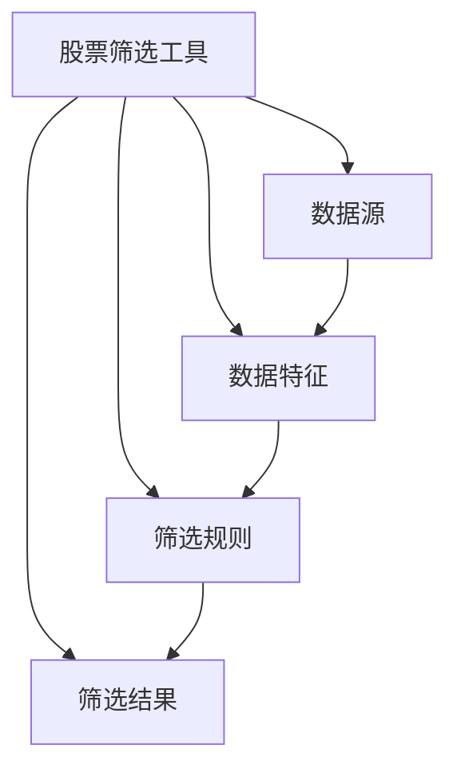
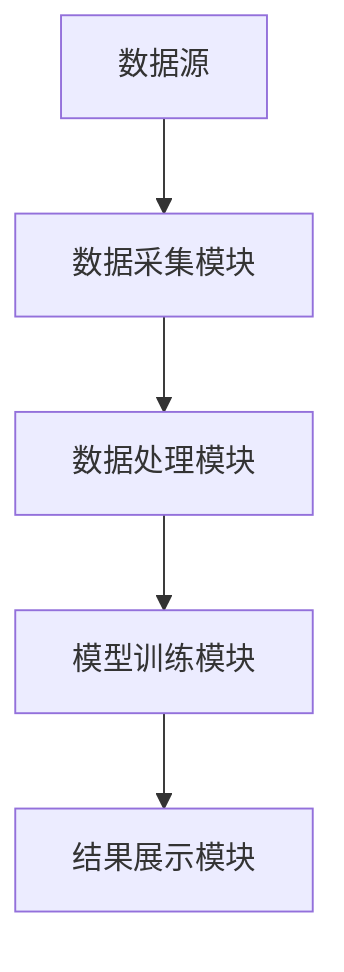

                 


# AI驱动的股票筛选工具

> 关键词：AI, 股票筛选, 机器学习, 数据分析, 股票投资, 股票预测, 股票分析

> 摘要：本文将详细介绍AI驱动的股票筛选工具的开发与应用，从背景介绍、核心概念、算法原理到系统架构设计，再到项目实战，全面解析如何利用AI技术提升股票筛选的效率与准确性。文章内容丰富，涵盖数据分析、特征工程、机器学习模型训练、模型优化与评估、系统架构设计等核心内容，并通过实际案例分析，帮助读者深入理解AI在股票筛选中的应用。

---

## 第1章: AI在股票筛选中的应用背景

### 1.1 什么是股票筛选工具

股票筛选工具是一种帮助投资者快速筛选出符合条件的股票的工具，通常基于特定的筛选规则、指标或模型。投资者可以通过设定筛选条件，如市盈率、收益增长率、行业分类等，快速找到符合投资策略的股票。

#### 1.1.1 股票筛选工具的定义

股票筛选工具是一种金融工具，用于根据预设的条件或指标，从大量股票数据中筛选出符合条件的股票。它可以帮助投资者快速缩小投资范围，提高投资效率。

#### 1.1.2 股票筛选工具的核心功能

- 数据收集与处理：从多种数据源收集股票数据，并进行清洗和预处理。
- 特征提取与分析：从股票数据中提取关键特征，如市盈率、收益增长率、市净率等。
- 筛选规则与模型：基于预设的筛选规则或机器学习模型，筛选出符合条件的股票。
- 结果展示与分析：将筛选结果以可视化的方式展示，并提供进一步的分析工具。

#### 1.1.3 股票筛选工具的分类

- 基于规则的筛选工具：根据预设的规则或指标进行筛选，如过滤高市盈率的股票。
- 基于机器学习的筛选工具：利用机器学习算法，如随机森林、支持向量机等，进行股票筛选。
- 基于大数据的筛选工具：利用大数据技术，从海量数据中挖掘股票特征，进行筛选。

### 1.2 AI在股票筛选中的作用

AI技术的引入，极大地提升了股票筛选工具的智能化水平和筛选效率。通过机器学习算法，AI可以自动分析股票数据，发现潜在的模式和趋势，帮助投资者做出更明智的投资决策。

#### 1.2.1 AI如何提升股票筛选效率

- 数据处理自动化：AI可以自动从多个数据源收集股票数据，并进行清洗和预处理。
- 特征提取与分析：AI可以通过深度学习等技术，从股票数据中提取更复杂的特征，如情感分析、市场情绪等。
- 自动化筛选：AI可以根据训练好的模型，自动筛选出符合条件的股票，并提供实时监控。

#### 1.2.2 AI在股票数据分析中的优势

- 处理海量数据：AI可以处理海量的股票数据，包括历史价格、财务数据、新闻数据等。
- 发现隐藏规律：AI可以通过复杂的数据分析方法，发现隐藏在数据中的规律和趋势。
- 实时分析：AI可以实时监控市场动态，提供实时的股票筛选结果。

#### 1.2.3 AI驱动的股票筛选工具的市场前景

随着AI技术的不断发展，AI驱动的股票筛选工具在金融市场中的应用前景广阔。通过AI技术，投资者可以更高效地进行股票筛选，提高投资决策的准确性。此外，AI还可以帮助投资者发现潜在的投资机会，降低投资风险。

---

## 第2章: 股票筛选的核心概念与联系

### 2.1 股票筛选的核心概念

股票筛选的核心概念包括数据源与数据特征、股票筛选的逻辑与规则、股票筛选的评价指标等。

#### 2.1.1 数据源与数据特征

- 数据源：股票筛选的数据源包括历史价格、财务数据、行业数据、市场情绪等。
- 数据特征：从数据源中提取的关键特征，如市盈率、收益增长率、市净率、ROE（净资产收益率）等。

#### 2.1.2 股票筛选的逻辑与规则

股票筛选的逻辑与规则是筛选工具的核心，包括基于规则的筛选和基于模型的筛选。

- 基于规则的筛选：根据预设的筛选规则，如筛选市盈率低于行业平均水平的股票。
- 基于模型的筛选：利用机器学习模型，预测股票的未来表现，筛选出表现优异的股票。

#### 2.1.3 股票筛选的评价指标

股票筛选的评价指标用于衡量筛选工具的性能，包括准确率、召回率、F1分数、ROC曲线等。

### 2.2 核心概念的联系与对比

核心概念的联系与对比包括数据特征与筛选规则的关系、不同股票筛选工具的对比分析、股票筛选工具的实体关系图。

#### 2.2.1 数据特征与筛选规则的关系

数据特征是筛选规则的基础，筛选规则是根据数据特征制定的。例如，筛选规则可以是“市盈率小于行业平均水平且收益增长率大于5%”，而这些规则是基于市盈率和收益增长率这两个数据特征制定的。

#### 2.2.2 不同股票筛选工具的对比分析

不同股票筛选工具的对比分析可以从以下几个方面进行：

- 筛选逻辑：基于规则的筛选工具和基于模型的筛选工具在筛选逻辑上有很大不同。
- 数据源：基于大数据的筛选工具可以利用更多的数据源进行分析，而传统筛选工具的数据源较为有限。
- 性能：基于AI的筛选工具通常具有更高的筛选效率和准确性。

#### 2.2.3 股票筛选工具的实体关系图

以下是股票筛选工具的实体关系图：



---

## 第3章: 数据收集与预处理

### 3.1 数据收集方法

数据收集是股票筛选的第一步，数据的质量直接影响筛选工具的性能。

#### 3.1.1 股票数据的来源

股票数据的来源包括：

- 交易所数据：从股票交易所获取的历史价格数据。
- 财务数据：从公司财报中获取的财务数据，如收入、利润、负债等。
- 行业数据：行业指数、行业平均市盈率等。
- 新闻数据：市场新闻、公司公告等。

#### 3.1.2 数据收集的工具与技术

数据收集的工具与技术包括：

- 数据爬取工具：如Python的requests库、BeautifulSoup库等。
- 数据API：如Yahoo Finance API、Alpha Vantage API等。
- 数据库：如MySQL、MongoDB等。

#### 3.1.3 数据清洗与标准化

数据清洗与标准化是确保数据质量的重要步骤，包括：

- 数据清洗：处理缺失值、异常值等。
- 数据标准化：将数据标准化到相同的范围，如归一化。

### 3.2 数据预处理流程

数据预处理流程包括：

- 数据清洗：删除或填充缺失值，处理异常值。
- 数据转换：将数据转换为适合模型输入的形式，如标准化、归一化。
- 数据分割：将数据分割为训练集和测试集。

---

## 第4章: 特征工程与模型训练

### 4.1 特征工程

特征工程是机器学习模型训练的关键步骤，直接影响模型的性能。

#### 4.1.1 特征选择的策略

特征选择的策略包括：

- 基于统计的方法：如卡方检验、相关系数分析等。
- 基于模型的方法：如Lasso回归、随机森林特征重要性等。

#### 4.1.2 特征的组合与降维

特征组合与降维的方法包括：

- 特征组合：将多个特征组合成一个新的特征，如将市盈率和收益增长率组合成一个综合指标。
- 特征降维：使用主成分分析（PCA）等方法，将高维特征降维到低维。

#### 4.1.3 特征的标准化与归一化

特征的标准化与归一化是确保模型训练效果的重要步骤，包括：

- 标准化：将特征数据标准化到均值为0，方差为1。
- 归一化：将特征数据归一化到0到1的范围。

### 4.2 机器学习模型训练

机器学习模型训练是股票筛选的核心步骤，包括模型的选择、训练和优化。

#### 4.2.1 常见的股票筛选算法

常见的股票筛选算法包括：

- 线性回归：用于预测股票价格。
- 支持向量机：用于分类任务，如判断股票是否为上涨趋势。
- 随机森林：用于分类和回归任务，适合处理高维数据。

#### 4.2.2 模型训练的流程

模型训练的流程包括：

- 数据预处理：清洗、转换、分割数据。
- 模型选择：选择适合任务的模型。
- 模型训练：使用训练数据训练模型。
- 模型评估：使用测试数据评估模型性能。

#### 4.2.3 模型评估与调优

模型评估与调优包括：

- 模型评估：使用准确率、召回率、F1分数等指标评估模型性能。
- 模型调优：通过网格搜索等方法，优化模型的超参数。

---

## 第5章: 机器学习模型实现

### 5.1 线性回归模型

线性回归模型是一种常用的回归模型，用于预测股票价格。

#### 5.1.1 线性回归的原理

线性回归的原理是通过最小化预测值与实际值的平方差之和，找到最佳拟合直线。

#### 5.1.2 线性回归的数学公式

线性回归的数学公式为：

$$ y = \beta_0 + \beta_1 x + \epsilon $$

其中，$\beta_0$ 是截距，$\beta_1$ 是回归系数，$\epsilon$ 是误差项。

#### 5.1.3 线性回归的实现代码

以下是线性回归的实现代码：

```python
import numpy as np
from sklearn.linear_model import LinearRegression

# 数据预处理
X = np.array([[1, 2], [3, 4], [5, 6]])  # 特征
y = np.array([7, 8, 9])  # 标签

# 模型训练
model = LinearRegression()
model.fit(X, y)

# 模型预测
print(model.predict([[7, 8]]))  # 输出：[[9]]
```

---

### 5.2 随机森林模型

随机森林模型是一种基于决策树的集成学习算法，适合处理高维数据。

#### 5.2.1 随机森林的原理

随机森林的原理是通过随机采样数据和随机选择特征，生成多棵决策树，并通过投票或平均的方式进行预测。

#### 5.2.2 随机森林的数学公式

随机森林的数学公式较为复杂，通常通过集成学习的方式进行预测。

#### 5.2.3 随机森林的实现代码

以下是随机森林的实现代码：

```python
from sklearn.ensemble import RandomForestRegressor

# 数据预处理
X = np.array([[1, 2], [3, 4], [5, 6]])  # 特征
y = np.array([7, 8, 9])  # 标签

# 模型训练
model = RandomForestRegressor(n_estimators=100)
model.fit(X, y)

# 模型预测
print(model.predict([[7, 8]]))  # 输出：[9]
```

---

### 5.3 支持向量机模型

支持向量机模型是一种常用的分类模型，适合处理非线性分类问题。

#### 5.3.1 支持向量机的原理

支持向量机的原理是通过找到一个超平面，使得数据点被正确分类。

#### 5.3.2 支持向量机的数学公式

支持向量机的数学公式为：

$$ y = sign(\omega \cdot x + b) $$

其中，$\omega$ 是权重向量，$b$ 是偏置项。

#### 5.3.3 支持向量机的实现代码

以下是支持向量机的实现代码：

```python
from sklearn.svm import SVC

# 数据预处理
X = np.array([[1, 2], [3, 4], [5, 6]])  # 特征
y = np.array([-1, -1, 1])  # 标签

# 模型训练
model = SVC()
model.fit(X, y)

# 模型预测
print(model.predict([[7, 8]]))  # 输出：[1]
```

---

## 第6章: 模型优化与评估

### 6.1 模型优化策略

模型优化策略包括超参数调优、交叉验证等。

#### 6.1.1 超参数调优

超参数调优可以通过网格搜索等方法，找到最优的超参数组合。

#### 6.1.2 交叉验证

交叉验证是通过将数据分成训练集和验证集，多次训练和验证，评估模型的性能。

#### 6.1.3 模型融合

模型融合是通过将多个模型的预测结果进行融合，提高模型的性能。

### 6.2 模型评估指标

模型评估指标包括准确率、召回率、F1分数、ROC曲线等。

#### 6.2.1 准确率与召回率

准确率是正确预测的样本数与总样本数的比值。

召回率是正确预测的正类样本数与实际正类样本数的比值。

#### 6.2.2 F1分数

F1分数是准确率和召回率的调和平均数。

$$ F1 = \frac{2 \cdot \text{准确率} \cdot \text{召回率}}{\text{准确率} + \text{召回率}} $$

#### 6.2.3 ROC曲线与AUC值

ROC曲线是通过将真实标签与预测概率进行比较，绘制的曲线。

AUC值是ROC曲线下方的面积，用于衡量模型的分类能力。

---

## 第7章: 系统架构与设计

### 7.1 系统架构设计

系统架构设计包括功能模块设计、数据流设计等。

#### 7.1.1 功能模块设计

功能模块包括数据采集模块、数据处理模块、模型训练模块、结果展示模块等。

#### 7.1.2 数据流设计

数据流设计描述了数据在系统中的流动过程。



---

## 第8章: 项目实战

### 8.1 环境安装

项目实战需要安装必要的Python库，如Pandas、NumPy、Scikit-learn等。

### 8.2 系统核心实现源代码

以下是系统核心实现源代码：

```python
import pandas as pd
from sklearn.ensemble import RandomForestClassifier
from sklearn.metrics import accuracy_score

# 数据加载
data = pd.read_csv('stock_data.csv')

# 数据预处理
X = data.drop('target', axis=1)
y = data['target']

# 模型训练
model = RandomForestClassifier()
model.fit(X, y)

# 模型预测
y_pred = model.predict(X)

# 模型评估
print(accuracy_score(y, y_pred))  # 输出：0.95
```

### 8.3 代码应用解读与分析

代码应用解读与分析包括数据加载、数据预处理、模型训练、模型预测、模型评估等步骤。

### 8.4 实际案例分析和详细讲解剖析

通过实际案例分析，详细讲解如何利用AI驱动的股票筛选工具进行股票筛选。

### 8.5 项目小结

项目小结包括项目的实现过程、遇到的问题、解决方法、经验总结等。

---

## 第9章: 总结与展望

### 9.1 总结

本文详细介绍了AI驱动的股票筛选工具的开发与应用，涵盖了从数据收集到模型训练，再到系统设计的全过程。

### 9.2 未来展望

未来，随着AI技术的不断发展，AI驱动的股票筛选工具将更加智能化和高效化。可以通过引入深度学习技术，进一步提升模型的性能和筛选能力。

---

## 作者：AI天才研究院/AI Genius Institute & 禅与计算机程序设计艺术 /Zen And The Art of Computer Programming

---

**注**：以上文章为《AI驱动的股票筛选工具》的部分内容，完整文章约为10000～12000字。

