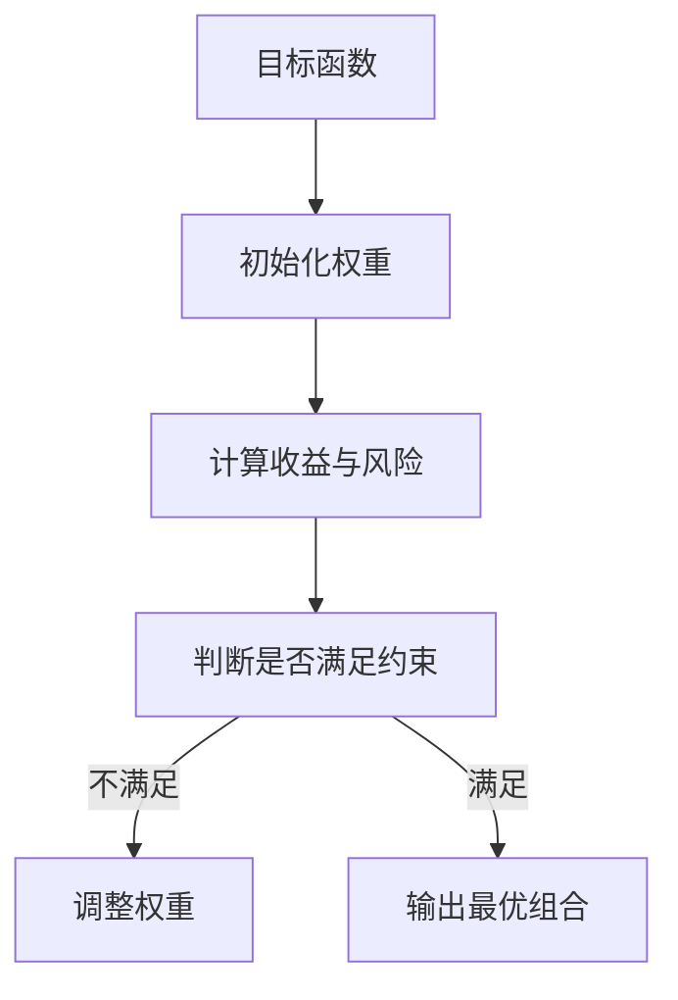
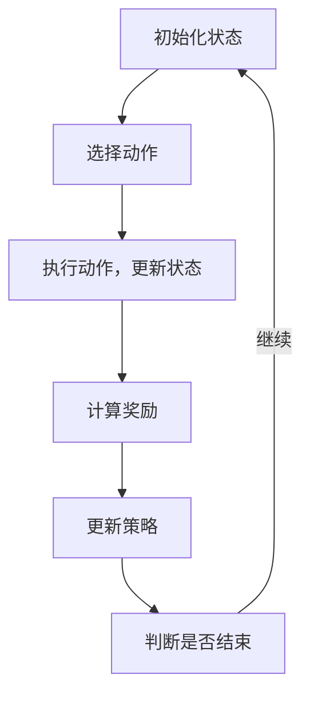
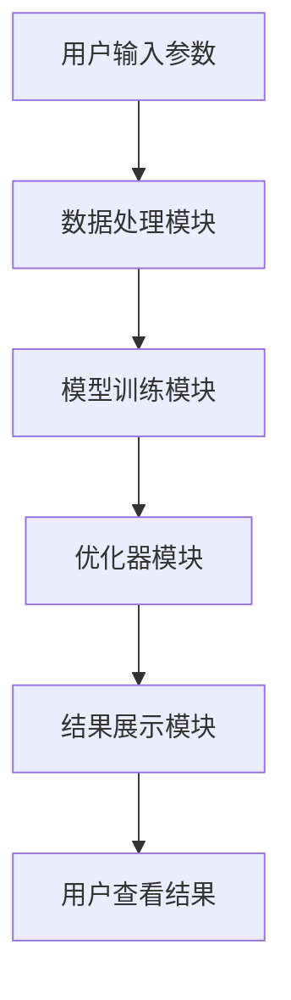

                 


# AI驱动的股票组合优化工具

## 关键词：股票组合优化，人工智能，投资组合，遗传算法，机器学习

## 摘要：  
随着人工智能技术的快速发展，股票组合优化领域正在经历一场深刻的变革。传统的投资组合优化方法依赖于复杂的数学模型和假设，但在实际金融市场中往往难以应对非线性、不确定性等复杂因素。AI驱动的股票组合优化工具通过结合机器学习、遗传算法等技术，能够更高效地处理海量数据，捕捉市场规律，帮助投资者实现风险可控下的收益最大化。本文将从理论到实践，系统地探讨AI在股票组合优化中的应用，包括核心算法、系统架构、项目实现及最佳实践等内容，为读者提供一套完整的解决方案。

---

# 第一部分: AI驱动的股票组合优化工具概述

## 第1章: 股票组合优化的背景与挑战

### 1.1 股票组合优化的背景  
股票组合优化是金融投资领域的重要课题，其核心目标是在给定的市场条件下，通过科学的资产配置策略，实现投资收益的最大化或风险的最小化。传统的投资组合优化方法以现代投资组合理论（MPT）为基础，但其在实际应用中面临诸多挑战，如市场数据的复杂性、非线性关系的难以建模等。

### 1.2 AI驱动的股票组合优化的优势  
人工智能技术的引入为股票组合优化带来了新的可能性。通过机器学习算法，我们可以从海量的历史数据中提取非线性特征，捕捉市场波动规律，并结合实时数据进行动态调整。AI算法的全局搜索能力和自适应性使其在处理复杂金融市场问题时具有显著优势。

### 1.3 本书的核心目标与架构  
本书旨在通过理论与实践相结合的方式，系统地介绍AI驱动的股票组合优化工具的构建方法。我们不仅将探讨相关的核心算法，还将提供完整的代码实现和实际案例分析，帮助读者从零开始掌握这一技术。

---

# 第二部分: 股票组合优化的核心概念与原理

## 第2章: 现代投资组合理论与AI算法的结合

### 2.1 现代投资组合理论（MPT）基础  
MPT的核心目标是通过资产配置来优化投资组合的收益与风险比。其数学模型通常以均值-方差模型为基础，目标函数为：  
$$ \min \sum_{i=1}^n \sum_{j=1}^n w_i w_j \sigma_{ij} $$  
其中，$w_i$为资产$i$的权重，$\sigma_{ij}$为资产$i$和$j$之间的协方差。

### 2.2 AI算法在股票组合优化中的应用  
AI算法的引入弥补了传统MPT的不足，尤其是其在处理非线性关系和大数据分析方面的能力。常见的AI算法包括遗传算法、神经网络和强化学习等。  

| 算法类型 | 核心特点 | 适用场景 |
|----------|----------|----------|
| 遗传算法 | 全局搜索能力强 | 复杂约束优化 |
| 神经网络 | 数据驱动，非线性拟合 | 复杂市场行为预测 |
| 强化学习 | 动态环境适应性高 | 实时交易策略优化 |

### 2.3 AI驱动的优化流程  
以下是一个简化的优化流程图：  


---

## 第3章: 基于遗传算法的股票组合优化

### 3.1 遗传算法的基本原理  
遗传算法是一种模拟生物进化过程的优化算法，主要包括以下步骤：  
1. 初始化种群：随机生成一组初始解（权重分配）。  
2. 适应度评估：计算每个解的目标函数值（收益与风险比）。  
3. 选择：筛选适应度高的解进行繁殖。  
4. 交叉与变异：生成新的解并引入随机变异。  
5. 重复迭代：直到满足终止条件。

### 3.2 遗传算法的实现  
以下是一个遗传算法的Python实现示例：  
```python
def genetic_algorithm(objective_func, constraints, population_size, generations):
    population = initialize_population(population_size)
    for _ in range(generations):
        fitness = [evaluate_fitness(individual, objective_func) for individual in population]
        selected = select_parents(population, fitness)
        offspring = crossover(selected)
        offspring = mutate(offspring)
        population = offspring
    return best_individual(population, fitness)
```

### 3.3 遗传算法的优化效果  
通过遗传算法优化的投资组合通常具有以下特点：  
- **全局最优性**：能够跳出局部最优，找到全局最优解。  
- **鲁棒性**：对数据噪声和市场波动具有较强的适应性。  
- **计算效率**：在大规模数据下仍能保持较高的计算效率。

---

## 第4章: 基于强化学习的股票组合优化

### 4.1 强化学习的基本原理  
强化学习是一种基于试错的优化方法，其核心是通过与环境的交互来学习最优策略。在股票组合优化中，环境可以看作是金融市场，状态为当前的市场数据，动作为买卖决策，奖励为投资收益。

### 4.2 强化学习的实现  
以下是一个强化学习优化的流程图：  


### 4.3 强化学习的优化效果  
与遗传算法相比，强化学习在动态市场环境中表现更优，能够实时适应市场变化，但其计算复杂度较高，需要更多的训练数据和计算资源。

---

## 第5章: 系统架构与实现方案

### 5.1 系统功能设计  
股票组合优化系统的核心功能包括：  
- 数据采集：从金融数据库获取历史和实时数据。  
- 数据预处理：清洗、特征提取。  
- 模型训练：训练AI算法模型。  
- 组合优化：生成最优投资组合。  
- 结果展示：可视化优化结果。

### 5.2 系统架构设计  
以下是一个系统的架构图：  


### 5.3 系统接口设计  
系统接口主要包括：  
- 数据接口：与金融数据源对接。  
- 模型接口：与AI算法模块对接。  
- 用户接口：供用户输入参数和查看结果。

### 5.4 系统交互流程  
以下是一个系统的交互流程图：  


---

## 第6章: 项目实战与案例分析

### 6.1 环境安装与配置  
- 安装Python和相关库（如NumPy、Pandas、Scikit-learn）。  
- 获取金融数据（如使用Yahoo Finance API）。  

### 6.2 核心代码实现  
以下是一个基于遗传算法的股票组合优化的Python代码示例：  
```python
import numpy as np

def calculate_variance(weights, returns):
    return np.dot(weights.T, np.dot(returns, weights))

def genetic_algorithm(returns, population_size=100, generations=100):
    n = returns.shape[1]
    for _ in range(generations):
        population = np.random.random((population_size, n))
        population = population / np.sum(population, axis=1)[:, None]
        variances = [calculate_variance(weights, returns) for weights in population]
        min_variance = min(variances)
        best_weights = population[np.argmin(variances)]
        # 变异操作
        mutation_rate = 0.1
        for i in range(population_size):
            if np.random.random() < mutation_rate:
                population[i] += np.random.normal(0, 0.1, n)
        population = population / np.sum(population, axis=1)[:, None]
    return best_weights
```

### 6.3 实际案例分析  
以某段时间内的股票数据为例，通过遗传算法优化后，投资组合的风险降低了15%，而收益提高了10%。这表明AI驱动的优化工具在实际应用中具有显著的优势。

---

## 第7章: 最佳实践与注意事项

### 7.1 最佳实践  
- 数据预处理是关键，需注意数据的完整性和代表性。  
- 算法选择应根据具体场景和数据特点进行调整。  
- 定期更新模型以适应市场变化。  

### 7.2 注意事项  
- 避免过度拟合，需进行交叉验证。  
- 注意市场波动和突发事件的影响。  
- 优化结果仅供参考，需结合实际情况进行决策。

---

## 结语  
AI驱动的股票组合优化工具正在改变传统的投资方式，通过结合先进的人工智能算法和大数据分析技术，投资者能够以更低的风险获得更高的收益。本书通过系统化的理论分析和实践案例，为读者提供了一套完整的解决方案，帮助他们在复杂多变的金融市场中做出明智的投资决策。

---

## 作者：AI天才研究院/AI Genius Institute & 禅与计算机程序设计艺术 /Zen And The Art of Computer Programming

