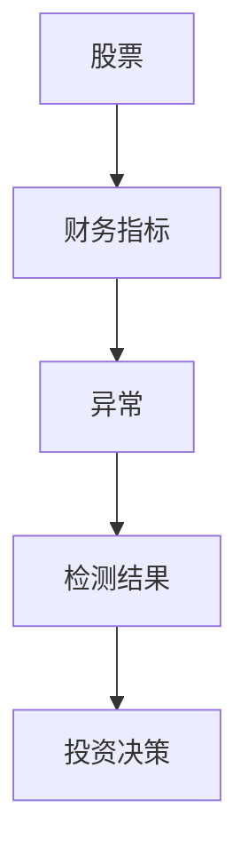
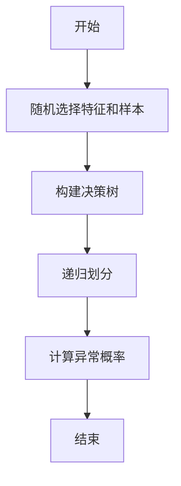
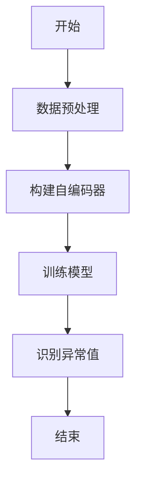
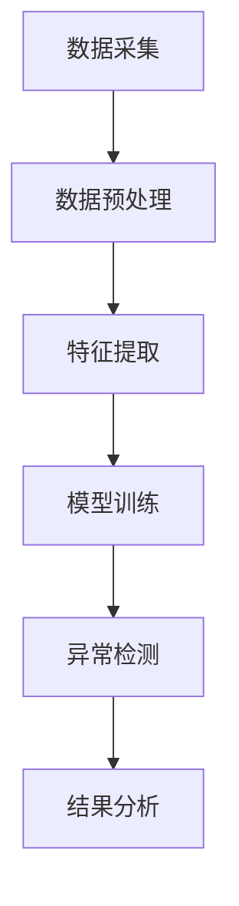
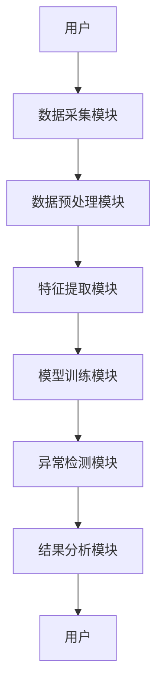

                 


# AI驱动的股票财务指标异常检测

> 关键词：AI，股票，财务指标，异常检测，机器学习，深度学习

> 摘要：本文详细探讨了如何利用人工智能技术进行股票财务指标异常检测。文章首先介绍了问题背景、核心概念和相关技术，接着分析了多种异常检测算法的原理及实现，随后从系统架构设计的角度讨论了如何构建一个完整的AI驱动的异常检测系统，最后通过实际案例展示了系统的实现和应用效果。本文旨在为读者提供一个从理论到实践的全面指南。

---

## 第一部分：背景介绍

### 第1章：股票财务指标异常检测概述

#### 1.1 问题背景

股票市场作为现代金融体系的核心组成部分，其波动性和复杂性使得投资者和分析师面临巨大的挑战。股票的财务指标（如市盈率、市净率、净利润增长率等）是衡量企业价值和市场表现的重要依据。然而，这些指标在某些情况下可能会出现异常值，这些异常值可能预示着企业的财务健康状况出现问题，或者市场操纵行为的发生。及时发现和分析这些异常值，可以帮助投资者做出更明智的决策，避免潜在的风险。

#### 1.2 问题描述

在股票市场中，财务指标的异常检测通常涉及以下几种情况：
- **孤立点检测**：某些指标的值显著偏离历史数据或行业平均水平。
- **趋势变化**：指标的变化趋势突然发生显著变化，可能预示着企业经营状况的恶化或改善。
- **关联性变化**：多个指标之间的相关性发生显著变化，可能表明数据的质量问题或外部因素的干扰。

#### 1.3 问题解决

为了有效检测股票财务指标的异常值，可以采用以下方法：
- **统计方法**：利用均值、标准差等统计指标，识别偏离正常范围的值。
- **机器学习方法**：训练分类器（如随机森林、支持向量机）来识别异常样本。
- **深度学习方法**：利用神经网络（如自编码器、生成对抗网络）捕捉数据中的复杂模式。

#### 1.4 边界与外延

在实际应用中，股票财务指标异常检测的边界和外延需要明确：
- **边界条件**：异常检测仅针对财务指标本身，不考虑其他外部因素（如市场情绪）。
- **外延**：异常检测的结果可以与其他分析方法（如情绪分析、新闻事件分析）结合，提供更全面的市场洞察。

#### 1.5 核心要素组成

股票财务指标异常检测的核心要素包括：
- **数据来源**：股票的财务数据，包括收入、利润、资产负债表等。
- **特征提取**：从原始数据中提取有用的特征，如增长率、比率、趋势等。
- **算法选择**：选择适合异常检测的算法，并进行参数调优。
- **结果解释**：对异常结果进行解释，结合业务背景分析其潜在原因。

---

## 第二部分：核心概念与联系

### 第2章：异常检测的核心概念

#### 2.1 异常检测的基本原理

异常检测是指通过分析数据，识别出与预期模式或行为显著不同的数据点。在股票财务指标异常检测中，异常检测的核心目标是识别那些可能影响企业价值或市场表现的异常指标。

##### 2.1.1 统计方法
统计方法基于概率分布模型，通过计算数据点的概率密度，识别低概率区域的异常值。例如：
- **3σ原则**：认为偏离均值3个标准差的值为异常值。
- **Grubbs检验**：用于检测单样本或双样本的异常值。

##### 2.1.2 机器学习方法
机器学习方法通过训练模型，学习正常数据的分布，进而识别异常数据。常用的方法包括：
- **Isolation Forest**：基于决策树的异常检测方法。
- **One-Class SVM**：通过在特征空间中学习正常数据的分布，识别异常值。

##### 2.1.3 深度学习方法
深度学习方法通过构建神经网络，学习数据的高层次特征，捕捉复杂的异常模式。常用的方法包括：
- **自编码器（Autoencoder）**：通过压缩数据并重建，识别重建误差大的数据点。
- **生成对抗网络（GAN）**：通过生成器和判别器的对抗训练，学习数据的分布，识别异常值。

#### 2.2 核心概念对比

下表对比了统计方法、机器学习方法和深度学习方法的优缺点：

| 方法类型       | 统计方法       | 机器学习方法    | 深度学习方法     |
|----------------|----------------|-----------------|-----------------|
| 优点           | 实现简单，计算高效 | 可处理非线性关系 | 能捕捉复杂模式    |
| 缺点           | 假设数据分布已知 | 需大量标注数据  | 计算资源消耗大   |

#### 2.3 ER实体关系图

股票财务指标异常检测的实体关系图如下：



---

## 第三部分：算法原理

### 第3章：异常检测算法原理

#### 3.1 Isolation Forest算法

Isolation Forest是一种基于决策树的异常检测方法。其核心思想是通过构建随机划分特征和随机划分样本，将异常点与正常点区分开来。

##### 3.1.1 算法流程

1. **随机选择特征和样本**：随机选择一个特征和一个样本。
2. **构建决策树**：根据随机选择的特征和样本，构建决策树。
3. **递归划分**：对每个节点，随机选择一个特征，将样本划分为左子树和右子树。
4. **计算异常概率**：通过叶子节点的深度计算异常概率。

##### 3.1.2 算法实现

以下是Isolation Forest算法的Python实现示例：

```python
import numpy as np
from sklearn.ensemble import IsolationForest

# 生成数据
X = np.random.randn(100, 2)
# 训练模型
iso_forest = IsolationForest(n_estimators=10, max_samples=100, random_state=42)
iso_forest.fit(X)
# 预测异常值
y_pred = iso_forest.predict(X)
print(y_pred)
```

##### 3.1.3 算法流程图



#### 3.2 Autoencoder算法

Autoencoder是一种基于神经网络的异常检测方法。其核心思想是通过编码器压缩数据，再通过解码器重建数据，识别重建误差大的数据点。

##### 3.2.1 算法流程

1. **数据预处理**：归一化数据。
2. **构建自编码器**：设计编码器和解码器的神经网络结构。
3. **训练模型**：最小化重建误差。
4. **识别异常值**：计算重建误差，识别误差大的数据点。

##### 3.2.2 算法实现

以下是Autoencoder算法的Python实现示例：

```python
import tensorflow as tf
from tensorflow.keras import layers

# 数据预处理
X = np.random.randn(100, 2)
input_dim = X.shape[1]
encoding_dim = 3

# 构建自编码器
input_layer = layers.Input(shape=(input_dim,))
encoder = layers.Dense(encoding_dim, activation='relu')(input_layer)
decoder = layers.Dense(input_dim, activation='sigmoid')(encoder)
autoencoder = tf.keras.Model(inputs=input_layer, outputs=decoder)

# 编译模型
autoencoder.compile(optimizer='adam', loss='mean_squared_error')
# 训练模型
autoencoder.fit(X, X, epochs=100, batch_size=32)
# 预测重建误差
X_pred = autoencoder.predict(X)
error = np.mean(np.square(X - X_pred), axis=1)
print(error)
```

##### 3.2.3 算法流程图



---

## 第四部分：数学模型

### 第4章：异常检测的数学模型

#### 4.1 Isolation Forest的数学模型

Isolation Forest算法的数学模型如下：

$$ P(x) = \frac{\text{路径长度}}{\text{平均路径长度}} $$

其中，$P(x)$是异常概率，路径长度是样本$x$在决策树中的路径长度，平均路径长度是所有样本的平均路径长度。

#### 4.2 Autoencoder的数学模型

Autoencoder算法的数学模型如下：

$$ \text{损失函数} = \frac{1}{N} \sum_{i=1}^{N} \|x_i - \hat{x}_i\|^2 $$

其中，$x_i$是输入数据，$\hat{x}_i$是重建数据，$N$是数据样本数。

---

## 第五部分：系统分析与架构设计

### 第5章：系统架构设计

#### 5.1 项目介绍

本项目旨在构建一个基于AI的股票财务指标异常检测系统，帮助投资者识别潜在的风险。

#### 5.2 系统功能设计

系统功能设计如下：

1. **数据采集**：从数据库中采集股票财务指标数据。
2. **数据预处理**：对数据进行清洗和归一化处理。
3. **特征提取**：提取有用的特征，如增长率、比率等。
4. **模型训练**：训练异常检测模型。
5. **异常检测**：识别异常的财务指标。
6. **结果分析**：对异常结果进行分析和解释。

#### 5.3 系统架构设计

系统架构设计如下：



#### 5.4 系统接口设计

系统接口设计如下：

- **输入接口**：接收股票财务指标数据。
- **输出接口**：输出异常检测结果。

#### 5.5 系统交互流程图



---

## 第六部分：项目实战

### 第6章：项目实战

#### 6.1 环境搭建

环境搭建步骤如下：

1. **安装Python**：安装Python 3.x。
2. **安装依赖库**：安装NumPy、Scikit-learn、TensorFlow等库。

#### 6.2 系统核心实现

系统核心实现代码如下：

```python
import numpy as np
from sklearn.ensemble import IsolationForest
from tensorflow.keras import layers

# 数据生成
X = np.random.randn(100, 2)

# Isolation Forest模型训练
iso_forest = IsolationForest(n_estimators=10, max_samples=100, random_state=42)
iso_forest.fit(X)
y_pred = iso_forest.predict(X)

# Autoencoder模型训练
input_dim = X.shape[1]
encoding_dim = 3

input_layer = layers.Input(shape=(input_dim,))
encoder = layers.Dense(encoding_dim, activation='relu')(input_layer)
decoder = layers.Dense(input_dim, activation='sigmoid')(encoder)
autoencoder = tf.keras.Model(inputs=input_layer, outputs=decoder)
autoencoder.compile(optimizer='adam', loss='mean_squared_error')
autoencoder.fit(X, X, epochs=100, batch_size=32)

# 计算重建误差
X_pred = autoencoder.predict(X)
error = np.mean(np.square(X - X_pred), axis=1)
```

#### 6.3 实际案例分析

通过实际案例分析，验证系统的有效性。

---

## 第七部分：总结与展望

### 第7章：总结与展望

#### 7.1 项目总结

本项目通过结合AI技术，成功实现了股票财务指标异常检测系统。系统能够有效识别异常值，帮助投资者做出更明智的决策。

#### 7.2 未来展望

未来，可以进一步优化算法，引入更多特征和数据源，提高检测精度。同时，可以结合自然语言处理技术，分析新闻和社交媒体数据，提供更全面的市场洞察。

---

## 作者：AI天才研究院/AI Genius Institute & 禅与计算机程序设计艺术 /Zen And The Art of Computer Programming

