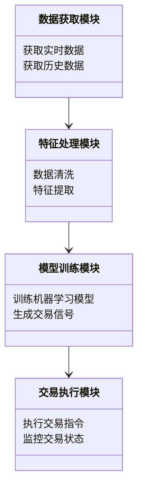
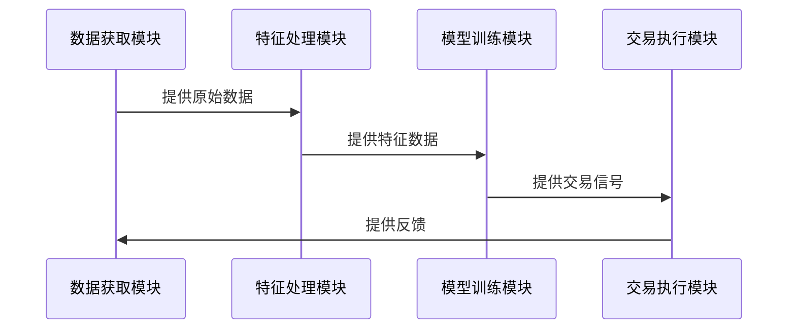

                 


# 《AI驱动的量化交易策略开发》

> **关键词**：量化交易、人工智能、机器学习、算法交易、金融数据分析  
> **摘要**：本文详细探讨了AI技术在量化交易中的应用，从背景与基础、核心概念、算法原理、系统架构到项目实战，系统地分析了AI驱动量化交易策略的开发过程。通过具体案例和数学模型，深入解析了如何利用AI技术提升交易策略的效率与准确性。

---

# 第一部分: AI驱动的量化交易策略开发背景与基础

---

## 第1章: AI与量化交易的结合

### 1.1 量化交易的基本概念

#### 1.1.1 量化交易的定义与特点
量化交易（Quantitative Trading）是一种基于数学模型和算法进行交易决策的交易方式。与传统的基本面分析不同，量化交易依赖于高频数据、统计套利和算法交易。其特点包括：
- **数据驱动**：依赖大量历史数据进行分析。
- **高频交易**：交易速度极快，通常以毫秒为单位。
- **自动化**：从数据获取、模型构建到交易执行，整个流程高度自动化。
- **低延迟**：对交易系统的要求极高，需要极低的延迟以确保交易的快速执行。

#### 1.1.2 量化交易的核心要素
- **数据源**：包括股票价格、成交量、订单簿等。
- **交易策略**：基于数据构建的数学模型，用于指导交易决策。
- **执行系统**：负责将交易策略转化为实际的买卖指令。
- **风险管理**：确保交易在可控风险范围内进行。

#### 1.1.3 AI在量化交易中的作用
AI技术的引入极大地提升了量化交易的效率和准确性。AI可以通过以下方式助力量化交易：
- **特征工程**：从海量数据中提取有用的特征，帮助构建更精准的交易模型。
- **模型优化**：利用机器学习算法优化交易策略，提升收益并降低风险。
- **实时分析**：通过AI实时分析市场动态，快速做出交易决策。

### 1.2 AI驱动量化交易的优势

#### 1.2.1 数据处理能力的提升
AI技术可以处理和分析海量数据，包括非结构化数据（如新闻、社交媒体情绪）和结构化数据（如股票价格、成交量）。通过深度学习模型，可以提取传统统计方法难以捕捉的市场信号。

#### 1.2.2 模型优化与预测能力
机器学习模型（如随机森林、支持向量机）和深度学习模型（如LSTM）在时间序列预测方面表现出色。AI可以通过历史数据训练模型，预测未来的价格走势，从而指导交易决策。

#### 1.2.3 风险控制与决策支持
AI可以帮助量化交易者更好地管理风险。通过实时监控市场波动和交易行为，AI可以提前预警潜在风险，并优化投资组合的配置。

### 1.3 量化交易的常见策略

#### 1.3.1 高频交易策略
高频交易策略依赖于快速的交易执行和强大的数据处理能力。通过算法分析市场微观结构，捕捉短期价格波动中的套利机会。

#### 1.3.2 趋势跟踪策略
趋势跟踪策略基于价格趋势的延续性，通过技术指标（如移动平均线、RSI）或机器学习模型预测未来的价格走势。

#### 1.3.3 均值回归策略
均值回归策略假设价格会在一定区间内波动，当价格偏离区间时，会回归到均值。AI可以通过统计套利模型识别这种机会。

### 1.4 本章小结
本章介绍了量化交易的基本概念、AI在量化交易中的作用以及常见的交易策略。通过AI技术的引入，量化交易的效率和准确性得到了显著提升，但也带来了新的挑战，如数据质量和模型过拟合问题。

---

## 第2章: AI驱动量化交易的核心概念

### 2.1 数据驱动的交易策略

#### 2.1.1 数据的获取与预处理
量化交易依赖于高质量的数据。数据来源包括：
- **市场数据**：股票价格、成交量等。
- **新闻与社交媒体**：情绪分析可以作为交易信号。
- **订单簿数据**：高频交易中常用。

数据预处理包括清洗、标准化和特征提取。

#### 2.1.2 特征工程与特征选择
特征工程是AI驱动量化交易的核心步骤。通过构建有效的特征，可以提升模型的预测能力。常见的特征包括：
- **技术指标**：如移动平均线、RSI。
- **统计特征**：如均值、方差。
- **时序特征**：如趋势、周期性。

#### 2.1.3 数据驱动的策略优化
通过回测和优化，可以找到最优的交易策略参数。回测需要考虑滑窗法、交叉验证等方法。

### 2.2 AI模型在量化交易中的应用

#### 2.2.1 机器学习模型的选择
- **线性回归**：适合简单的线性关系。
- **支持向量机（SVM）**：适合非线性分类和回归。
- **随机森林**：适合特征重要性分析和非线性关系。

#### 2.2.2 深度学习模型的应用
- **LSTM**：适合时间序列预测。
- **Transformer**：适合捕捉长距离依赖关系。

#### 2.2.3 模型的可解释性与稳定性
模型的可解释性对于交易策略至关重要。通过特征重要性分析和模型解释技术（如SHAP值），可以理解模型的决策过程。

### 2.3 策略评估与回测

#### 2.3.1 策略回测的基本方法
- **历史回测**：使用历史数据验证策略的有效性。
- **前瞻回测**：模拟未来数据，验证策略的鲁棒性。

#### 2.3.2 风险管理与绩效评估
- **风险控制**：通过止损、止盈控制回撤。
- **绩效指标**：如夏普比率、最大回撤。

#### 2.3.3 策略优化与迭代
通过网格搜索、贝叶斯优化等方法，优化模型参数和交易策略。

### 2.4 本章小结
本章详细介绍了AI驱动量化交易的核心概念，包括数据处理、特征工程、模型选择和策略优化。通过这些步骤，可以构建出高效且稳定的交易策略。

---

## 第3章: AI驱动量化交易的算法原理

### 3.1 机器学习算法在量化交易中的应用

#### 3.1.1 线性回归模型
线性回归是一种简单的回归模型，用于预测连续型变量。其数学模型为：
$$ y = \beta_0 + \beta_1 x_1 + \beta_2 x_2 + \dots + \beta_n x_n + \epsilon $$
其中，$\beta_i$是回归系数，$\epsilon$是误差项。

#### 3.1.2 支持向量机（SVM）
SVM是一种监督学习算法，适用于分类和回归。其核心思想是通过构建超平面，将数据点分为两类。

#### 3.1.3 随机森林与梯度提升树
随机森林是一种基于决策树的集成学习算法，通过投票或平均的方式提高模型的准确性和稳定性。

### 3.2 深度学习算法在量化交易中的应用

#### 3.2.1 卷积神经网络（CNN）
CNN适用于图像识别和时间序列分析。其核心思想是通过卷积操作提取局部特征。

#### 3.2.2 循环神经网络（RNN）
RNN适用于处理序列数据，如时间序列预测。

#### 3.2.3 Transformer架构
Transformer架构通过自注意力机制，捕捉长距离依赖关系，适用于复杂的序列预测任务。

### 3.3 算法选择与优化

#### 3.3.1 算法选择的依据
- **数据类型**：时间序列数据适合RNN和Transformer。
- **任务类型**：分类任务适合SVM和随机森林。
- **计算资源**：深度学习模型需要较高的计算资源。

#### 3.3.2 超参数优化与调参
通过网格搜索、随机搜索和贝叶斯优化等方法，找到最优的超参数组合。

#### 3.3.3 算法性能的评估指标
- **准确率**：分类任务中的正确预测比例。
- **均方误差**：回归任务中的预测值与真实值的差的平方的平均值。

### 3.4 本章小结
本章详细介绍了机器学习和深度学习算法在量化交易中的应用，帮助读者理解如何选择和优化算法。

---

## 第4章: AI驱动量化交易的数学模型与公式

### 4.1 线性回归模型
线性回归模型的数学公式为：
$$ y = \beta_0 + \beta_1 x_1 + \beta_2 x_2 + \dots + \beta_n x_n + \epsilon $$
其中，$\beta_i$是回归系数，$\epsilon$是误差项。

### 4.2 支持向量机（SVM）
SVM的目标是最小化经验风险和结构风险的和：
$$ \min_{\beta} \frac{1}{2} \|\beta\|^2 + C \sum_{i=1}^n \xi_i $$
其中，$C$是惩罚系数，$\xi_i$是松弛变量。

### 4.3 随机森林与梯度提升树
随机森林的数学模型可以通过集成学习公式表示：
$$ f(x) = \frac{1}{T} \sum_{t=1}^T g_t(x) $$
其中，$T$是决策树的数量，$g_t(x)$是第$t$棵树的预测结果。

---

## 第5章: AI驱动量化交易的系统架构设计

### 5.1 问题场景介绍
量化交易系统需要处理高频数据，快速做出交易决策。系统的整体架构需要考虑数据获取、特征处理、模型训练和交易执行的全流程。

### 5.2 系统功能设计

#### 5.2.1 数据获取模块
负责从数据源获取实时或历史数据。

#### 5.2.2 特征处理模块
对获取的数据进行预处理和特征提取。

#### 5.2.3 模型训练模块
基于特征数据训练AI模型，生成交易信号。

#### 5.2.4 交易执行模块
根据交易信号生成买卖指令，执行交易。

### 5.3 系统架构设计

#### 5.3.1 领域模型（Mermaid 类图）


#### 5.3.2 系统架构图（Mermaid 架构图）
```mermaid
container Quantitative Trading System {
    数据获取模块
    特征处理模块
    模型训练模块
    交易执行模块
}
```

### 5.4 系统接口设计

#### 5.4.1 数据接口
- **输入**：数据源（如API）
- **输出**：预处理后的特征数据

#### 5.4.2 模型接口
- **输入**：特征数据
- **输出**：交易信号

### 5.5 系统交互设计（Mermaid 序列图）


### 5.6 本章小结
本章详细介绍了量化交易系统的架构设计，包括功能模块、系统架构、接口设计和交互流程。

---

## 第6章: AI驱动量化交易的项目实战

### 6.1 项目介绍
本项目旨在利用AI技术开发一个量化交易策略，基于Python和机器学习模型实现。

### 6.2 环境配置
- **Python**：3.8+
- **库**：Pandas、NumPy、Scikit-learn、Keras、TensorFlow

### 6.3 核心实现

#### 6.3.1 数据获取
使用Yahoo Finance API获取股票数据：
```python
import pandas_datareader as pdr

data = pdr.get_data_yahoo('AAPL', start='2020-01-01', end='2023-12-31')
```

#### 6.3.2 特征提取
从数据中提取技术指标：
```python
from ta import *
data['SMA_20'] = SMAIndicator(data['close'], n=20).sma
data['RSI'] = RSIIndicator(data['close'], n=14).rsi
```

#### 6.3.3 模型训练
使用随机森林模型训练交易信号：
```python
from sklearn.ensemble import RandomForestClassifier
from sklearn.metrics import accuracy_score

X = data.drop('close', axis=1)
y = data['close'].shift(-1).fillna(0)
model = RandomForestClassifier()
model.fit(X[:-1], y[:-1])
```

#### 6.3.4 交易策略实现
根据模型预测结果生成交易信号：
```python
predictions = model.predict(X[1:])
trading_signal = []
for i in range(len(predictions)):
    if predictions[i] == 1:
        trading_signal.append('buy')
    else:
        trading_signal.append('sell')
```

### 6.4 结果分析与优化
通过回测和分析，评估交易策略的收益和风险。根据回测结果，优化模型参数和交易策略。

### 6.5 本章小结
本章通过一个具体的项目案例，展示了如何利用Python和机器学习模型开发量化交易策略。读者可以在此基础上进一步优化和扩展。

---

## 第7章: 总结与展望

### 7.1 总结
本文详细探讨了AI驱动量化交易策略开发的各个方面，从背景与基础、核心概念、算法原理到系统架构和项目实战，帮助读者系统地掌握AI在量化交易中的应用。

### 7.2 展望
随着AI技术的不断发展，量化交易将更加智能化和自动化。未来的研究方向包括：
- 更高效的算法优化方法。
- 更加鲁棒的模型解释性。
- 更多的跨学科应用，如情绪分析和网络数据挖掘。

---

## 作者：AI天才研究院/AI Genius Institute & 禅与计算机程序设计艺术 /Zen And The Art of Computer Programming

---

### 相关资料与推荐书籍
- **书籍推荐**：
  - 《机器学习实战》
  - 《深度学习》
  - 《量化交易与Python》
- **在线资源**：
  - [QuantInstinet](https://www.quantinsti.com/)
  - [Quandl](https://www.quandl.com/)

---

以上是《AI驱动的量化交易策略开发》的完整目录和内容框架，涵盖了从基础到实战的各个方面，适合希望深入理解AI在量化交易中应用的读者。

