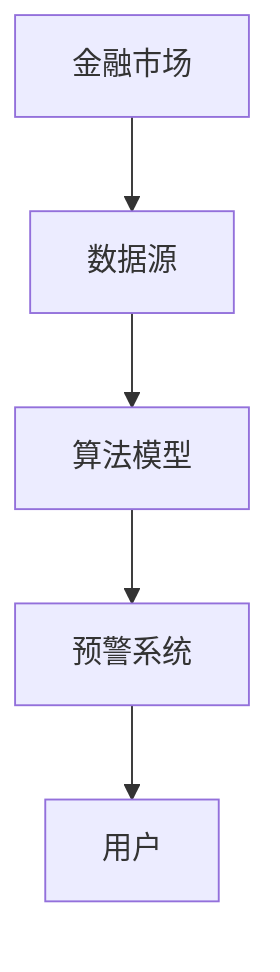
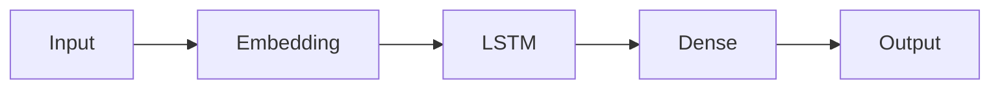
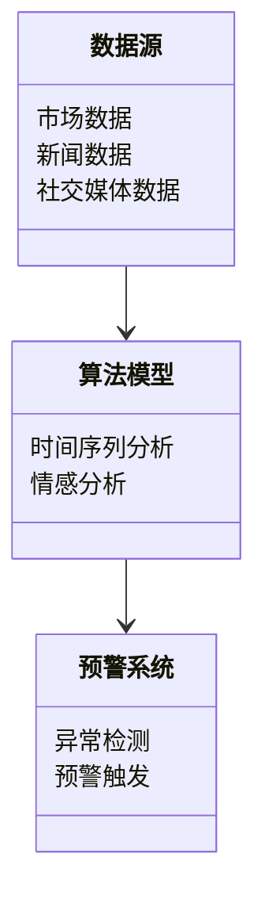
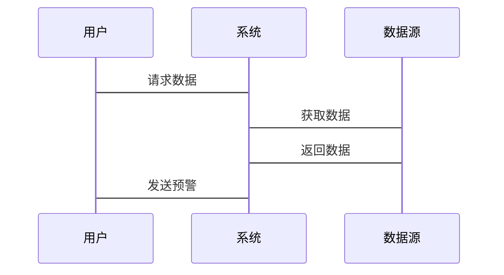

                 


# AI驱动的金融市场异常波动预警系统

**关键词：** AI，金融市场，异常波动，预警系统，时间序列分析，深度学习

**摘要：** 本文详细探讨了如何利用人工智能技术构建金融市场异常波动预警系统。通过分析市场数据、新闻和社交媒体数据，结合时间序列分析和深度学习算法，设计并实现了一个高效的预警系统。文章从背景介绍、核心概念、算法原理、系统架构到项目实战，全面阐述了系统的构建过程，并通过实际案例展示了系统的有效性。

---

# 第一章: 金融市场异常波动预警系统背景

## 1.1 问题背景与描述

### 1.1.1 金融市场波动的复杂性
金融市场波动受多种因素影响，包括经济指标、政策变化、市场情绪等。这些因素往往相互作用，导致市场出现异常波动，如剧烈的价格波动或市场崩盘。

### 1.1.2 异常波动的定义与特征
异常波动通常指偏离正常波动范围的市场行为。其特征包括突发性、不可预测性和对市场参与者的重大影响。

### 1.1.3 异常波动对市场的影响
异常波动可能导致投资者损失、市场流动性下降以及系统性风险增加。因此，及时预警异常波动对维护市场稳定至关重要。

## 1.2 问题解决与边界

### 1.2.1 异常波动预警的目标
通过分析市场数据，识别潜在的异常波动，提前发出预警信号，帮助投资者和监管机构采取应对措施。

### 1.2.2 系统的边界与外延
系统主要关注金融市场的时间序列数据和相关文本数据，不涉及实时高频交易或实时市场干预。

### 1.2.3 核心要素与组成结构
系统由数据源、算法模型和预警机制三部分组成，分别负责数据输入、分析处理和结果输出。

---

# 第二章: 核心概念与系统架构

## 2.1 核心概念原理

### 2.1.1 数据源分析
系统需要整合多种数据源，包括价格数据、交易量数据、新闻数据和社交媒体数据。

### 2.1.2 算法模型选择
选择适合时间序列分析的算法，如ARIMA和LSTM，以及自然语言处理技术，如情感分析。

### 2.1.3 预警机制设计
通过设置阈值和触发条件，当检测到异常信号时，系统自动发出预警。

## 2.2 核心概念对比

### 2.2.1 数据源特征对比

| 数据源类型 | 特征描述 | 优缺点 |
|------------|----------|--------|
| 市场数据    | 包括价格和交易量，实时性强 | 数据量大，需处理高频数据 |
| 新闻数据    | 包含市场情绪和事件信息 | 信息滞后，需进行文本处理 |
| 社交媒体数据 | 反映散户情绪 | 数据量大，噪声多，处理复杂 |

## 2.3 实体关系架构



---

# 第三章: 异常波动检测算法

## 3.1 时间序列分析

### 3.1.1 ARIMA模型
ARIMA（自回归积分滑动平均模型）适用于线性时间序列数据。其数学公式为：

$$ ARIMA(p, d, q) $$

其中，p为自回归阶数，d为差分阶数，q为滑动平均阶数。

### 3.1.2 LSTM网络结构



LSTM通过记忆单元和门控机制，能够捕捉时间序列中的长期依赖关系。

## 3.2 算法实现与对比

### 3.2.1 Python代码实现

```python
import numpy as np
from sklearn.metrics import mean_squared_error

def arima_model(train, test):
    # 省略ARIMA模型的具体实现
    pass

def lstm_model(train, test):
    # 省略LSTM模型的具体实现
    pass

# 示例数据
data = np.random.random(100)
train = data[:80]
test = data[80:]

# 模型训练与预测
arima_model(train, test)
lstm_model(train, test)
```

---

# 第四章: 系统分析与架构设计

## 4.1 系统功能设计

### 4.1.1 领域模型设计



### 4.1.2 系统架构设计


### 4.1.3 接口设计与交互



---

# 第五章: 项目实战

## 5.1 环境安装

### 5.1.1 安装Python库
```bash
pip install numpy pandas scikit-learn tensorflow keras
```

## 5.2 核心代码实现

### 5.2.1 数据预处理

```python
import pandas as pd
import numpy as np

def preprocess_data(data):
    # 数据清洗和特征提取
    pass
```

### 5.2.2 模型训练

```python
from keras.models import Sequential
from keras.layers import LSTM, Dense

model = Sequential()
model.add(LSTM(64, input_shape=(None, 1)))
model.add(Dense(1))
model.compile(loss='mse', optimizer='adam')
model.fit(X_train, y_train, epochs=10, batch_size=32)
```

## 5.3 案例分析

### 5.3.1 疫情对市场的冲击

分析2020年疫情对金融市场的冲击，系统能够提前预警市场的异常波动。

---

# 第六章: 最佳实践

## 6.1 小结

本文详细介绍了AI驱动的金融市场异常波动预警系统的构建过程，包括背景、算法和系统架构。

## 6.2 注意事项

- 数据质量对模型性能影响重大，需注意数据清洗和特征提取。
- 模型需定期更新，以适应市场变化。

## 6.3 拓展阅读

推荐学习时间序列分析和深度学习相关知识，以进一步优化预警系统。

---

# 作者：AI天才研究院（AI Genius Institute） & 禅与计算机程序设计艺术（Zen And The Art of Computer Programming）

---

以上为《AI驱动的金融市场异常波动预警系统》的技术博客文章大纲和部分内容，希望对您有所帮助！

